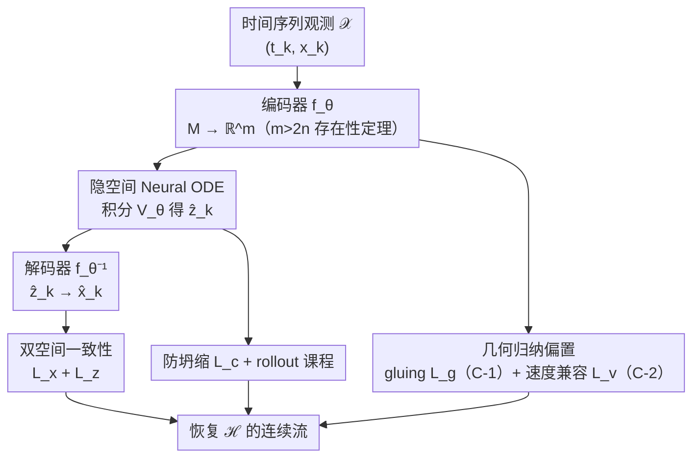

# Embedding Hybrid Systems into Continuous Latent Vector Fields

**会议**: ICML2026  
**arXiv**: [2606.10596](https://arxiv.org/abs/2606.10596)  
**代码**: https://github.com/SangliTeng/Continuous-Hybrid-System-Learning  
**领域**: 时间序列 / 动力系统学习  
**关键词**: 混合系统, Neural ODE, 隐空间嵌入, Whitney 嵌入定理, 横截性

## 一句话总结
本文先证明一条存在性定理——只要隐空间维数 $m>2n$，一个本质上**不连续**的 $n$ 维混合系统就能被嵌入到 $m$ 维欧氏空间、并在其像上配出一个**连续**向量场——再据此设计隐空间 Neural ODE 框架 CHyLL++，仅凭时间序列就能高精度恢复各种几何拓扑的混合系统流。

## 研究背景与动机
**领域现状**：混合系统（hybrid automata）用"连续时间向量场 + 离散状态重置"刻画大量物理与信息物理过程（足式运动、碰撞、任务规划等）。它表达力强，但在状态重置处（guard 面 $S$ 上）状态会**瞬时跳变**，整条流是不连续的，对依赖梯度的可微优化极不友好。

**现有痛点**：从数据学混合系统的三条主流路线各有硬伤。① 分段法（poli2021neural、liu2025discrete）把轨迹切成若干 mode 分别建模，但 mode 选择是**组合爆炸**的、模数还可能未知；② 事件函数法（Neural Event ODE，chen2020learning）试图对重置/事件函数求导，但随机初始化的事件函数**病态**、仿真难以推进；③ 把混合动力学表示成连续流——hybrifold 理论（simic2005towards）指出重置映射诱导一个等价关系，能把分片状态空间"粘"成连续流形，作者前作 CHyLL（teng2025chyll）借 Whitney 嵌入定理从时间序列重建出这个无奇点的隐流形。

**核心矛盾**：但 simic2005towards 和 CHyLL 只保证了隐**流形连续**，并**不**保证流形上的**向量场连续**——而可微优化真正需要的是后者。于是核心问题变成："混合系统是否存在可证连续的隐嵌入，使诱导出的向量场也连续？"

**本文目标**：(1) 理论上回答上述问题——给出连续外在表示的存在性条件；(2) 算法上把这条定理落成一个能从时间序列学习的隐空间 Neural ODE。

**切入角度**：作者诉诸**横截性（transversality）**这一证明动力系统"一般性质（generic property）"的强工具。直觉是：坏情况（嵌入退化、向量场不连续）对应一个低维"要避开的集合"$Z$，只要构造让 $\dim f^{-1}(Z)<0$，坏事就"几乎从不发生"，于是好嵌入在函数空间里是稠密的。

**核心 idea**：用"额外自由度"换连续性——把 $n$ 维系统嵌入到更高的 $m>2n$ 维空间，多出来的维度恰好让我们在重置面两侧对齐位置（C-1）和速度（C-2），从而抹掉内在的不连续，得到一个外在连续表示。

## 方法详解

### 整体框架
方法分两层。**理论层**：证明 Theorem 6——对满足紧致性等假设的混合系统 $\mathcal{H}=(M,S,V,r)$，只要 $m>2n$，就一般地存在编码器 $f\in C^k(M,\mathbb{R}^m)$ 同时满足三条件：(C-1) $f(x)=f(r(x))$（重置前后位置在隐空间重合）、(C-2) $Df(x)V(x)=Df(r(x))V(r(x))$（重置前后速度在隐空间重合）、(C-3) $f$ 把 hybrifold $M_\mathcal{H}$ 嵌入 $\mathbb{R}^m$。由此推论 1：隐轨迹 $z(t)=f(x(t))$ 的向量场是 $C^0$、轨迹是 $C^1$ 的——可微优化变得良定义。

**算法层**：把 $f_\theta$（编码器）、$V_\theta$（隐向量场）、$f_\theta^{-1}$（解码器）都用 MLP 表示，组成隐空间 Neural ODE 框架 **CHyLL++**。给定时间序列 $\mathcal{X}=\{(t_k,x_k)\}$，编码到隐空间初值 $z_0=f_\theta(x_0)$，用 Neural ODE 积分 $V_\theta$ 得到隐轨迹 $\hat{z}_k$，再解码回状态空间 $\hat{x}_k$；训练靠状态空间与隐空间的**双重一致性损失**，外加三项几何/稳定性归纳偏置，并配 rollout 课程从短到长逐步学习。

### 关键设计

**1. 连续外在表示存在性定理（$m>2n$）：用额外维度把"内在不连续"换成"外在连续"**

这是全文的理论基石。混合系统的内在向量场不保证连续——在重置面上可能 $Dr(x)V(x)\ne V(r(x))$，即重置前的速度和重置后的速度方向不一致（Figure 2 左）。Theorem 6 证明：只要隐维 $m>2n$，就一般地存在编码器 $f$ 把 hybrifold 嵌入 $\mathbb{R}^m$，并让 (C-1)(C-2) 在 $S\cup r(S)$ 上成立，从而隐向量场 $\dot z=Df(x)V(x)$ 全局 $C^0$。证明在 collar 坐标下构造 $f$：先用 Whitney 嵌入定理（Theorem 5）取 $g:S\to\mathbb{R}^m$ 把 guard 面两侧分别嵌为 $f_S=g$、$f_R=g\circ r^{-1}$ 以满足 (C-1)；再对一阶 Taylor 外推 $\bar f_S(x,t)=f_S(x)+t\,g_S(x)$，通过选 $g_S$、并按 (C-2) 唯一确定 $g_R$；最后用**参数化横截性定理**（Theorem 4）证明 $m>2n$ 时一般选取的 $g,g_S$ 让外推既单射又无秩亏，再把局部性质延拓到整个 $M$。$2n$ 这个门槛正是 Whitney 嵌入定理的维数条件——多出来的自由度就是消除不连续的本钱。

**2. CHyLL++ 隐空间 Neural ODE + 双空间一致性损失：把存在性定理落成可学的 MLP**

存在性定理只说"$f$ 存在"，要从数据找到它就把 $f_\theta,V_\theta,f_\theta^{-1}$ 都参数化为 MLP。隐流由 Neural ODE 给出 $\hat z_k=\int_{t_0}^{t_k}V_\theta(z(t))\,dt+f_\theta(x_0)$。训练的主信号是两个 MSE 一致性损失：状态空间的 $\mathcal{L}_x=\mathrm{MSE}(f_\theta^{-1}(\hat z_k),x_k)$ 逼解码回的状态对齐真实状态，隐空间的 $\mathcal{L}_z=\mathrm{MSE}(\hat z_k,f_\theta(x_k))$ 逼积分出的隐态对齐编码后的隐态。把 $V_\theta$ 写成有限 Lipschitz 常数的 MLP 天然保证隐流唯一且连续——这正好兑现定理对"连续向量场"的诉求。消融显示**双空间**一致性（而非只在某一空间）是准确恢复变拓扑混合系统流的关键。

**3. gluing 与速度兼容损失：把 (C-1)、(C-2) 显式写进训练目标**

光靠 MLP 的连续性还不足以保证重置面两侧严格对齐，于是把定理的两个条件做成显式归纳偏置。**gluing 损失** $\mathcal{L}_g=\mathrm{MSE}(f_\theta(x_k),f_\theta(x_{k+1})),\ k\in\mathcal{I}$ 直接逼 (C-1)——让重置前后两点在隐空间重合；其中索引集 $\mathcal{I}$ 通过对数据点经验 Lipschitz 常数 $\|\frac{x_{k+1}-x_k}{t_{k+1}-t_k}\|$ 阈值化来自动标出所有重置前/后状态对（这是无需 mode 选择的关键，绕开了组合爆炸）。**速度兼容损失** $\mathcal{L}_v=\mathrm{MSE}(\dot z_k^-,\dot z_k^+)$ 逼 (C-2)——前向/后向有限差分近似的重置前后隐速度要相等。前作 CHyLL 只有 gluing（C-1）而无速度兼容（C-2），本文加入 $\mathcal{L}_v$ 正是为了显式补上"向量场连续"这一前作缺失的条件。

**4. 防坍缩协方差损失 + rollout 课程：让隐空间不退化、长程外推不发散**

高维隐空间有坍缩风险（所有点挤到低维子空间，失去嵌入性）。协方差损失 $\mathcal{L}_c=\sum_{i=1}^m\mathrm{ReLU}(\Lambda-\mathrm{Cov}(f_\theta(x_k)_i))$ 强制每一维隐坐标的方差不低于阈值 $\Lambda$，把隐表示撑开。总损失 $\mathcal{L}(\theta)=w_x\mathcal{L}_x+w_z\mathcal{L}_z+w_g\mathcal{L}_g+w_v\mathcal{L}_v+w_c\mathcal{L}_c$ 加权汇总。训练还用 **rollout 课程**（curriculum $\{T_1<\dots<T_\ell\}$）：先学短段轨迹再逐步拉长积分窗口，缓解长程 Neural ODE 积分的误差累积与发散——这对碰撞这类含方波速度的强不连续系统尤其重要。

### 一个完整示例
论文给了一个 1 维解析例把机制讲透：1 维不连续向量场 $V(x)=1\ (x\in[0,1)),\ 2\ (x\in[2,3))$，重置映射把 $1\sim2$、$3\sim0$ 粘成一个圆。它内在不连续——在 $x^-=1$ 处 $(Dr\,V(x^-),V(r(x^-)))=(1,2)$，两侧速度不等。作者用正弦函数构造 $f(x)=A_i\,[\cos,\sin]^\top$，按 (C-1) 令 $f(1)=f(2),f(3)=f(0)$、按 (C-2) 令重置两侧隐速度相等，解出 $A_1=\begin{bmatrix}0&1\\1&0\end{bmatrix},A_2=\begin{bmatrix}0&-0.5\\1&0\end{bmatrix}$。最终得到一条嵌在 2D 里的 1D 连续流形，其上配着全局 $C^0$ 的外在向量场 $\dot f$，解码器用 $\mathrm{atan2}$ 还原——一个本质不连续的系统就这样获得了处处连续的外在表示。

## 实验关键数据

### 主实验
五个不同几何/拓扑的混合系统，每例跑 5 次取 MSE（mean，越低越好），与多种基线对比。

| 系统（拓扑/物理） | CHyLL++（本文） | CHyLL（前作） | 其它基线表现 |
|------------------|----------------|---------------|--------------|
| Bouncing Ball | **0.158** | 0.237 | Neural ODE/latent ODE 大穿透；Koopman 发散；Event ODE 病态 |
| Torus | **0.00367** | 0.0164 | 多数基线"模式错误"/发散/病态 |
| Klein Bottle | **0.00587** | 0.0220 | 同上 |
| Three-Link Walker（6D） | **0.0952** | 0.234 | Neural ODE 0.275、latent ODE 0.253、Koopman 发散 |
| 3D Bouncing Ball（6D） | **0.162** | 坍缩到 $z$ 方向 | latent ODE 0.524、其余发散/病态 |

本文在全部五例上都显著优于前作 CHyLL，且唯一能稳定处理最难的 3D Bouncing Ball——后者水平速度是方波，对可微优化极具挑战，所有不带几何归纳偏置的基线都失败。

### 消融实验
最后一层激活函数（$\sin$ vs ReLU）与损失项组合的消融（Table 2）。

| 配置 | 说明 |
|------|------|
| $\sin,\ \mathcal{L}_{x,z}$ | 仅双空间一致性 + 正弦激活 |
| $\sin,\ \mathcal{L}_{x,z,c}$ | 再加防坍缩协方差损失 |
| $\mathrm{ReLU},\ \mathcal{L}_{x,z}$ | ReLU 激活（主表为公平统一用 ReLU） |
| $\mathrm{ReLU},\ \mathcal{L}_{x,z,c}$ | ReLU + 协方差损失 |

### 关键发现
- **双空间一致性是命门**：仅在单一空间做一致性不足以恢复变拓扑系统的流，状态 + 隐空间同时约束才行。
- **几何归纳偏置（gluing + 速度兼容）拉开与基线的差距**：不带这类偏置的 Neural ODE/latent ODE/Koopman 在带重置的系统上普遍发散、模式错误或穿透。
- **$\sin$ 激活优于 ReLU**：消融发现正弦激活带来更好结果，但主表为公平起见统一用 ReLU——说明本文的优势来自框架而非激活技巧。
- **协方差损失防止隐空间坍缩**：3D Bouncing Ball 上前作直接坍缩到 $z$ 方向，本文靠 $\mathcal{L}_c$ 撑开隐空间才学成。

## 亮点与洞察
- **"提高维度换连续性"是干净而深刻的思想**：把内在不连续甩给外在的额外自由度，$m>2n$ 的门槛直接复用 Whitney 嵌入定理，理论与算法对齐得很漂亮。
- **横截性证一般性存在**：用 $\dim f^{-1}(Z)<0$ 让坏情况"几乎不发生"，是动力系统里证 generic property 的标准而优雅的套路，值得迁移到其它"构造良态表示"的问题。
- **用 Lipschitz 阈值自动标重置点**，绕开 mode 选择的组合爆炸，是把理论落地时一个实用且可复用的小技巧。
- **理论条件逐条对应损失项**（C-1↔gluing、C-2↔速度兼容），让人清楚每个损失"为什么在那里"，而非堆砌正则项。

## 局限与展望
- 存在性是**一般性（generic）**结论，保证"几乎所有"选取可行，但没给出针对具体系统的构造性/最优维数下界——实际 $m$ 仍要试。
- 实验系统维数较低（最高 6D），更高维或更复杂接触序列（如多接触足式机器人）的可扩展性未充分检验。
- 速度兼容损失用有限差分近似隐速度，对采样稀疏或噪声大的时间序列可能不稳。
- 索引集 $\mathcal{I}$ 依赖经验 Lipschitz 常数阈值化，阈值选取对带噪/快变数据可能敏感，论文未深入讨论其鲁棒性。

## 相关工作与启发
- **vs CHyLL（teng2025chyll，前作）**: 前作只保证隐**流形**连续（gluing/C-1），本文进一步证明并强制隐**向量场**连续（新增速度兼容 C-2），全部五例 MSE 显著更低。
- **vs Neural Event ODE（chen2020learning）**: 它对事件/重置函数直接求导，但随机初始化病态、难收敛；本文用连续外在表示彻底回避了对不连续函数求导。
- **vs 分段/mode-selector 法（poli2021neural、liu2025discrete）**: 它们需要组合复杂的 mode 选择且模数可能未知；本文用 Lipschitz 阈值自动标重置点，无需 mode 选择。
- **vs 经典 Neural ODE / latent ODE / deep Koopman**: 这些缺乏几何归纳偏置，在带重置的混合系统上发散或模式错误，反衬出本文 (C-1)(C-2) 偏置的必要性。

## 评分
- 新颖性: ⭐⭐⭐⭐⭐ 首次证明混合系统存在连续外在向量场表示（$m>2n$）并落成可学框架。
- 实验充分度: ⭐⭐⭐⭐ 覆盖 Torus/Klein Bottle 等多种拓扑 + 6D 物理系统，但维数偏低、基线对比可更广。
- 写作质量: ⭐⭐⭐⭐⭐ 理论条件与损失项一一对应，1D 解析例把机制讲得很透。
- 价值: ⭐⭐⭐⭐⭐ 为混合系统的可微学习奠定理论基础，对机器人/控制中的接触动力学建模有实际意义。

<!-- RELATED:START -->

## 相关论文

- [\[ICML 2026\] QuITE: Query-based Irregular Time Series Embedding](quite_query-based_irregular_time_series_embedding.md)
- [\[ICLR 2026\] Detection of Unknown Unknowns in Autonomous Systems](../../ICLR2026/time_series/detection_of_unknown_unknowns_in_autonomous_systems.md)
- [\[ICML 2026\] From Observations to States: Latent Time Series Forecasting](from_observations_to_states_latent_time_series_forecasting.md)
- [\[ICML 2026\] Latent Laplace Diffusion for Irregular Multivariate Time Series](latent_laplace_diffusion_for_irregular_multivariate_time_series.md)
- [\[ICML 2026\] HELIX: Hybrid Encoding with Learnable Identity and Cross-dimensional Synthesis for Time Series Imputation](helix_hybrid_encoding_with_learnable_identity_and_cross-dimensional_synthesis_fo.md)

<!-- RELATED:END -->
