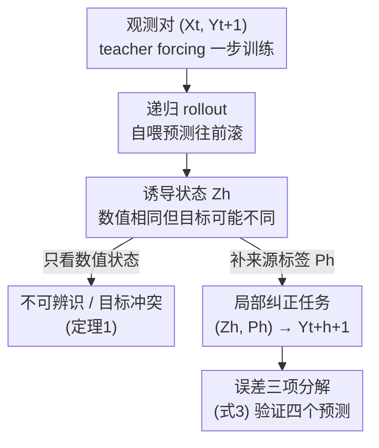

# Exposure Bias as Epistemic Underidentification in Recursive Forecasting

**会议**: ICML2026 (EIML@ICML 2026 Workshop)  
**arXiv**: [2606.12990](https://arxiv.org/abs/2606.12990)  
**代码**: 待确认  
**领域**: 时间序列 / 递归预测理论  
**关键词**: 暴露偏差, 递归预测, 认识不可辨识, 诱导状态, 来源信息

## 一句话总结
本文从理论上重新解释递归多步预测里的"暴露偏差"：它不只是训练（teacher forcing）与部署（自喂预测）之间的**分布偏移**，在部分可观测或状态截断下，它还是一个**认识论上的不可辨识（epistemic underidentification）**问题——一步监督只能在观测上下文上确定模型行为，无法确定 rollout 在自生成"诱导状态"上该输出什么，作者用"诱导状态 $Z$ + 来源变量 $P$"把这件事形式化，并给出误差分解和实验验证。

## 研究背景与动机
**领域现状**：自回归序列预测（从语言生成到动力系统预测）普遍用 teacher forcing 训练——每一步都喂真实历史；但部署时是**递归 rollout**：模型一步步喂自己的预测往前滚。早期误差会扰动后续输入并沿预测时域累积，这就是经典的"暴露偏差"。

**现有痛点**：暴露偏差长期被框定为**训练–测试的协变量偏移**：训练在观测前缀上、部署在自生成状态上，所以早期错误会复合。这套框架催生了 scheduled sampling、DAgger 式聚合、Professor Forcing、混合训练等一系列"在学习者诱导状态上训练"的纠正方法。但它把一个更根本的问题留空了：**一旦 rollout 开始，模型实际在解的到底是什么预测问题？**

**核心矛盾**：作者指出，在**部分可观测、有噪声、或状态被截断**时，被表示的状态 $X_t$ **即使潜在动力学是确定性的，也不足以决定下一步目标**。这意味着：一步监督只在观测上下文上约束了模型，而 rollout 会去查询那些"数值状态相同、但正确局部目标不同"的诱导状态——一步 Bayes 最优**根本没有确定**这些状态上的行为。于是递归失败不只来自"输入陌生"（分布偏移），更来自"喂给预测器的状态里缺了信息"。这把暴露偏差和**来自表示不足的认识不确定性**（而非不可约噪声）联系了起来。

**本文目标**：不是提一个新纠正方法，而是**讲清递归预测失败的机制**——回答三个"何时"：rollout 何时进入一个区别于观测分布的诱导状态区；固定诱导状态上的预测何时是一个不同于原一步任务的局部纠正任务；纠正何时通过改变 rollout 访问的状态来起作用。

**切入角度**：用一个最小的延迟系统反例就能戳破旧框架——同一个数值状态 $(0,1)$ 既作为观测状态（目标 $-1$）出现，又作为 Bayes 最优一步预测器自生成的 rollout 状态（局部正确目标 $+1$）出现。只看数值状态的预测器必然把两者混为一谈。

**核心 idea**：给状态补一个**来源（provenance）标签** $P$（如二元的"观测/生成"或 rollout 深度），把"这个状态是怎么来的"也喂进去，就能把观测区和诱导区分开、化解目标冲突——暴露偏差因此被重述为"在自生成的认识不确定性下做推理"。

## 方法详解

### 整体框架
本文是理论+诊断性实验，不是新算法。整体逻辑链是：先用一个反例和定理证明"一步 Bayes 最优不能辨识递归 rollout"（机制层面），再引入"诱导状态 $Z_h$ + 来源 $P_h$"两个变量把递归部署形式化成一个**局部纠正问题** $(Z_h,P_h)\mapsto Y_{t+h+1}$，并把误差分解成三块；最后用四个实验预测去验证理论在真实时序数据上成立。下图给出这条概念流：

### 关键设计

**1. 一步 Bayes 最优"不辨识"递归 rollout：暴露偏差不只是分布偏移**

针对的痛点是"旧框架只把暴露偏差当协变量偏移"。作者先给出闭环更新与两步递归预测：对状态 $x=(x_1,\dots,x_{\hat p})$，定义 $T_g(x):=(g(x),x_1,\dots,x_{\hat p-1})$（把预测塞回去、其余左移），两步递归预测 $\Phi_g(x):=g(T_g(x))$。**定理 1** 说：设 $g^\star$ 是平方损失下的一步 Bayes 最优预测器，若存在观测支撑 $M$ 中的 $x$ 使 $T_{g^\star}(x)\notin M$（rollout 一步就滚出观测支撑），那么一步目标只在 $M$ 上辨识预测器；于是存在两个预测器 $g_1,g_2$ 几乎处处满足 $g_1(X_t)=g_2(X_t)=g^\star(X_t)$（一步 Bayes 风险完全相同），却有 $\Phi_{g_1}(x)\neq\Phi_{g_2}(x)$——两个一步无法区分的预测器会给出不同的递归多步预测。

作者特意强调，这**不是** Taieb & Atiya 那个"一步最优≠多步最优"的老观察。更尖锐的点是：在**一步 Bayes 风险相同的递归预测器之间**，rollout 本身没被辨识。一阶展开把这点摊开：令 $\delta(x):=g_1(x)-g_2(x)$，则

$$\Phi_{g_1}(x)-\Phi_{g_2}(x)=(g_1-g_2)(T_{g_2}(x))+\partial_1 g_1(T_{g_2}(x))\,\delta(x)+o(|\delta(x)|).$$

第一项是"在 rollout 查询的诱导状态上的分歧"——这正是不可辨识机制；第二项是递归复合映射的 Jacobian 放大。所以递归失败既来自动力学复合，也来自**自生成状态上局部行为的不可辨识**。

**2. 诱导状态 $Z$ 与来源 $P$：把递归部署形式化为局部纠正任务**

定理 1 暴露了问题，但要可操作就得给"状态怎么来的"一个变量。固定 rollout 深度 $h$，定义诱导数值状态 $Z_h=\psi_h(X_t)$ 和来源信息 $P_h=\pi_h(X_t)$（都是 $X_t$ 的确定性函数，$P_h$ 描述这个状态是怎么形成的，如 rollout 深度、哪些坐标是观测的、哪些是模型生成的）。递归部署于是不是直接的 $X_t\mapsto Y_{t+h}$ 任务，而是**局部下一步纠正问题** $(Z_h,P_h)\mapsto Y_{t+h+1}$。**定理 2** 给出来源的价值（平方损失下）：

$$R_h^\star(Z_h)-R_h^{\mathrm{prov},\star}(Z_h,P_h)=\mathbb{E}\big[\operatorname{Var}(\mathbb{E}[Y_{t+h+1}\mid Z_h,P_h]\mid Z_h)\big]\ge 0.$$

即"条件化来源永远不会增加 Bayes 风险"，且严格下降当且仅当 $\mathbb{E}[Y_{t+h+1}\mid Z_h,P_h]\neq\mathbb{E}[Y_{t+h+1}\mid Z_h]$ 在正概率集上成立。直觉很关键：**来源不会凭空创造信息**，它只能找回从 $X_t\mapsto Z_h$ 这个映射里丢失的信息。回到那个 $(0,1)$ 反例——一个二元"观测/生成"标签就把观测区（目标 $-1$）和诱导区（目标 $+1$）分开，化解了标准 rollout-mixing 方法（如 scheduled sampling）无法区分的目标冲突。

**3. 诱导状态误差的三项分解：把"为什么纠正有时不灵"拆开**

光说"局部任务不同"还不够具体，作者把 teacher-forced 预测器 $g_{\mathrm{TF}}$ 在诱导状态上的风险与来源最优风险之差，分解成三块非负项（式 3）：

$$R_h^{Z}(g_{\mathrm{TF}})-R_h^{\mathrm{prov},\star}=\underbrace{R_h^{Z}(g_{\mathrm{TF}})-\inf_{q\in\mathcal{Q}}R_h^{Z}(q)}_{\text{teacher-forcing/rollout 失配}}+\underbrace{\inf_{q\in\mathcal{Q}}R_h^{Z}(q)-R_h^\star(Z_h)}_{\text{表示–函数类近似 gap}}+\underbrace{R_h^\star(Z_h)-R_h^{\mathrm{prov},\star}}_{\text{来源信息 gap}}.$$

第一项衡量 teacher-forced 预测器迁移到诱导状态任务上有多差；第二项是诱导表示上的函数类近似 gap；第三项是省掉来源所丢失的可恢复信息。这个分解的价值在于：它解释了为什么"在诱导状态上重训"在不同数据集上收益参差——因为三项的相对大小依赖诱导表示、目标、估计器类和数据集。三者各对应一类纠正手段是否有用，把"暴露偏差"从一个笼统现象拆成可分别诊断的成分。

> 三处一致：框架图里"不可辨识/目标冲突"对应设计 1，"诱导状态 $Z_h$ + 来源 $P_h$ → 局部纠正任务"对应设计 2，"误差三项分解（式 3）"对应设计 3。

### 一个例子：延迟系统里的目标冲突
在一个最小延迟玩具系统里，数值状态 $(0,1)$ 同时以两种身份出现：作为**观测状态**时正确目标是 $-1$；作为 Bayes 最优一步预测器自生成的 **rollout 诱导状态**时局部正确目标是 $+1$。只用数值状态的预测器必须把这两者压成一个值、必然两头都错；而加一个二元"观测/生成"来源标签就把它们分到两个区，各自给对目标。这个例子把抽象的"不可辨识 + 来源化解"具象成了一个能手算的反例。

## 实验关键数据

### 四个实验预测与验证
理论给出四个可验证预测，作者在 **MG、ETTh1、Weather** 三个时序数据集上（主文用 MLP，附录 GRU 同质）逐一检验：

| 预测 | 实验设计 | 结果 |
|------|---------|------|
| ① rollout 进入区别于观测的状态区 | 线性探针区分观测 $X_t$ vs 诱导 $Z_h$ | 准确率随深度上升：ETTh1 最强、MG 中等、Weather 弱（图2） |
| ② 固定诱导状态是不同的局部任务 | 冻结 $Z_h$，比较 TF / 仅 $Z$ / $Z+P$ 探针 | 强烈依赖数据集：MG、Weather 上重训能追平甚至超过 TF，ETTh1 上明显更差（图3） |
| ③ 来源有时改善纠正 | $Z+P$ vs 仅 $Z$ | 二元来源编码下 $Z+P$ 接近 $Z$，收益有限、条件性 |
| ④ 闭环纠正部分靠改变访问状态 | 部署 rollout MSE（SS、SSP 比 TF） | 冻结态收益与部署收益分离，证明部分收益来自改变状态区 |

### 闭环纠正（Table 1，相对 TF 归一化，<1 即更好）

| 时域桶 | 数据集 | SS/TF | SSP/TF |
|------|------|------|------|
| Early | ETTh1 | 1.040 | **0.861** |
| Mid | ETTh1 | 1.071 | **0.905** |
| Late | ETTh1 | 1.059 | **0.957** |
| Mid | MG | **0.925** | **0.979** |
| Late | MG | **0.887** | **0.870** |
| Early | Weather | 1.002 | 1.580 |

SSP（来源感知的 scheduled sampling）在 ETTh1 上各时域桶都优于 TF 而 SS 不行；MG 上 SS/SSP 在中后段都改善；Weather 更混杂且 SSP 方差大。

### 关键发现
- **rollout 确实离开观测区**：探针准确率随深度上升，坐实了定理 1 的实践前提，但程度高度依赖数据集（ETTh1 ≫ Weather）。
- **诱导状态是真·不同的任务**：若暴露偏差只是"在自生成输入上拟合更好的局部回归器"，冻结态重训应该普遍有大改善；但 ETTh1 上重训反而更差，说明诱导状态定义了一个难度由表示/目标/估计器/数据集共同决定的不同问题。
- **来源收益是条件性的、不均匀的**：在当前二元来源编码 + 受限探针类下，定理 2 的理论来源 gap 只有一小部分被实际恢复——理论是 Bayes 级陈述，实证恢复多少取决于编码是否暴露了目标相关结构。
- **闭环收益部分来自改变状态区**：SSP 诱导的状态在深层 rollout 上让 TF、SS 自己的下一步误差也变低，说明纠正不仅改了"用在诱导状态上的预测器"，还改了"诱导状态区本身"。

## 亮点与洞察
- **概念重述很有冲击力**：把暴露偏差从"分布偏移"升级为"认识不可辨识"，并用一个 $(0,1)$ 反例就讲清"同一数值状态、两个正确目标"，这个视角能解释为什么 scheduled sampling 类方法有时会遇到目标冲突。
- **来源变量 $P$ 是可迁移的设计**：定理 2 说"条件化来源不增风险、能找回映射丢失的信息"，这个思想可迁移到任何自回归系统（含语言模型）——给状态补"它是怎么生成的"元信息，把观测区与自生成区分开。
- **三项误差分解给了诊断工具**：把递归失败拆成 teacher-forcing/rollout 失配、表示–函数类 gap、来源 gap 三块，让"为什么纠正在某数据集不灵"变成可分别测量的问题，而不是笼统归因。
- **冻结态 vs 闭环的分离实验设计巧妙**：用"冻结诱导状态收益是否追踪部署收益"来判定纠正到底是靠局部重拟合还是靠改变访问状态，是一个干净的因果切分。

## 局限与展望
- **工作坊短文 + 玩具/小规模实证**：只在三个数值时序数据集、MLP/GRU 上验证，结论"高度数据集依赖"本身也说明普适性有限。
- **来源编码太简单**：只用二元"观测/生成"标签，实证恢复的来源 gap 很小、收益条件性强；更丰富的来源编码（rollout 深度、坐标级观测/生成掩码）可能恢复更多信息。
- **只解释机制、不提方法**：作者明确不提新纠正算法，SSP 只是验证理论的探针；如何把"来源感知"做成实用、稳定增益的训练方法仍开放。
- **理论与实证有 gap**：定理 2 是 Bayes 级陈述，受限探针类下只恢复一部分；理论收益与实际收益之间的桥梁需要更强估计器来检验。

## 相关工作与启发
- **vs Taieb & Atiya（一步最优≠多步最优）**: 都讨论递归预测的次优性，但本文更尖锐——不是一步与多步目标失配，而是**一步 Bayes 风险相同的递归预测器之间 rollout 不被辨识**，问题在表示不足导致的不可辨识。
- **vs scheduled sampling / DAgger / Professor Forcing**: 这些都在"学习者诱导状态上训练"来缓解暴露偏差，但**不区分同一数值状态的观测来源与生成来源**，会遇到目标冲突；本文用来源标签把两区分开。
- **vs 预测状态/信息状态视角（Littman & Sutton；Subramanian et al.）**: 本文与之对齐——有效状态摘要必须保留未来预测所需信息；递归预测被当作部分可观测系统的具体测试床。
- **vs Green et al. 2025a（epistemic 偏差–方差分解）**: 那条线做预测器不确定性的 Jacobian 放大分解，本文问的是不同问题——rollout 本身创造了什么预测问题，关注诱导状态而非方差偏差分解。

## 评分
- 新颖性: ⭐⭐⭐⭐⭐ 把暴露偏差从分布偏移重述为认识不可辨识，配定理 1/2 与来源变量，视角新颖。
- 实验充分度: ⭐⭐⭐ 工作坊短文，三数据集 + MLP/GRU 诊断性验证到位，但规模小、结论数据集依赖强。
- 写作质量: ⭐⭐⭐⭐ 反例–定理–分解–预测的链条清晰，形式化干净。
- 价值: ⭐⭐⭐⭐ 为递归/自回归预测的暴露偏差提供了新的理论框架和诊断工具，对时序与序列生成都有启发。

<!-- RELATED:START -->

## 相关论文

- [\[ICLR 2026\] Learning Recursive Multi-Scale Representations for Irregular Multivariate Time Series Forecasting](../../ICLR2026/time_series/learning_recursive_multi-scale_representations_for_irregular_multivariate_time_s.md)
- [\[ICML 2026\] Ellipsoidal Time Series Forecasting](ellipsoidal_time_series_forecasting.md)
- [\[ICML 2026\] Nested Spatio-Temporal Time Series Forecasting](nested_spatio-temporal_time_series_forecasting.md)
- [\[ICML 2026\] From Observations to States: Latent Time Series Forecasting](from_observations_to_states_latent_time_series_forecasting.md)
- [\[ICML 2026\] Time-series Forecasting Through the Lens of Dynamics](time-series_forecasting_through_the_lens_of_dynamics.md)

<!-- RELATED:END -->
