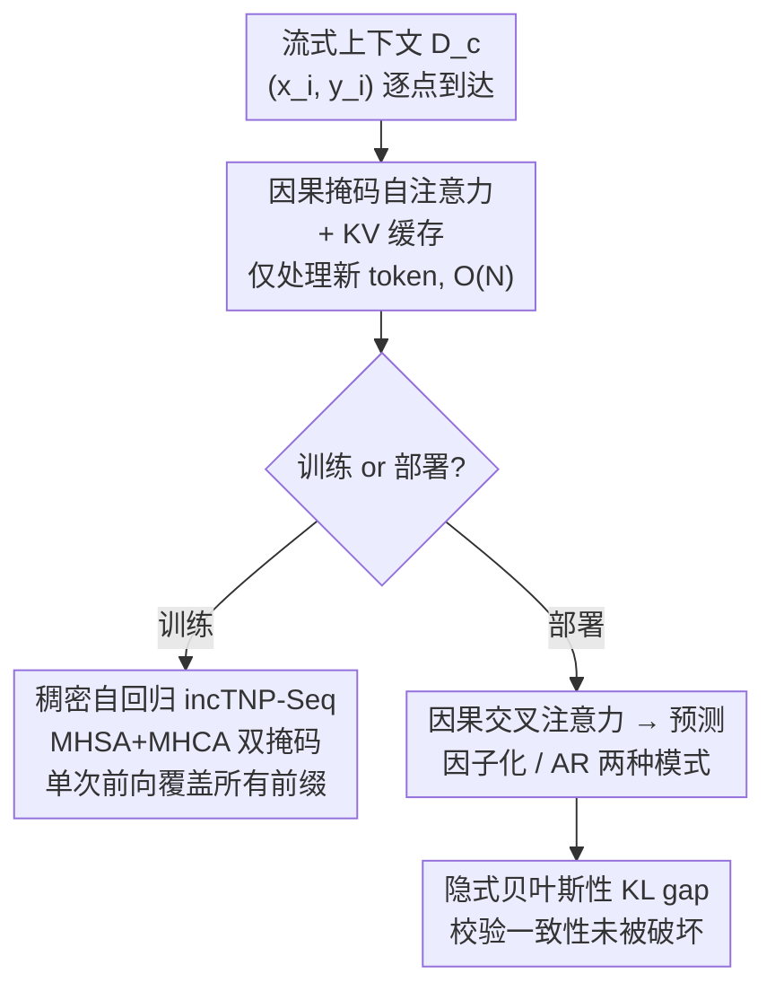

# Incremental Transformer Neural Processes

**会议**: ICML 2026  
**arXiv**: [2602.18955](https://arxiv.org/abs/2602.18955)  
**代码**: https://github.com/philipmortimer/incTNP-code  
**领域**: 时间序列 / 神经过程  
**关键词**: 神经过程, 因果掩码, KV缓存, 流式推理, 隐式贝叶斯性

## 一句话总结
把大模型里的因果掩码 + KV 缓存搬进 Transformer 神经过程（TNP），让流式场景下每来一个新观测的更新代价从 $\mathcal{O}(N^2)$ 降到 $\mathcal{O}(N)$，配上一种「单次前向覆盖所有上下文长度」的稠密自回归训练，incTNP 不仅没掉点、反而常常超过标准 TNP，且预测规则的「隐式贝叶斯性」与排列不变的 TNP 相当。

## 研究背景与动机
**领域现状**：神经过程（NP）尤其是 Transformer 神经过程（TNP）在时空预测、表格建模等任务上表现强劲；它们和先验拟合网络（PFN）共享元学习框架，根据一个上下文集 $\mathcal{D}^c$ 给目标点输出预测分布。

**现有痛点**：很多真实应用本质是**流式的**——传感器实时读数、数据库持续更新——理想模型应当在每来一个新观测时做**便宜的增量更新**，而不是从头重算内部表示。但标准 TNP 的自注意力对上下文点数是二次复杂度，且**只要上下文变了就得整体重算**：每个新观测都触发 $\mathcal{O}(N^2)$ 的开销，高频更新代价高得离谱。自回归（AR）部署下更糟，每生成一个目标点都要重新编码整个历史，流式场景里这套昂贵的推理循环每步都重复。

**核心矛盾**：标准 TNP 的双向注意力让每个新 token 都会改变之前 token 的表示，从而**让缓存失效**——这正是它无法增量更新的根因。而 NP 家族珍视的「上下文排列不变性」恰恰要求这种全连接双向注意力，于是「可缓存的增量更新」与「排列不变性」之间存在张力。

**本文目标**：给 TNP 装上线性时间的增量更新能力，同时回答两个问题——这样做会不会掉预测精度？会不会破坏 NP 赖以「理性更新信念」的概率一致性？

**切入角度**：作者注意到 LLM 早就用**因果掩码 + KV 缓存**实现了 $\mathcal{O}(N)$ 的增量处理：因果注意力下过去 token 的表示是静态的，所以缓存有效。把这套机制移植到 NP 框架即可。

**核心 idea**：在 TNP 编码器里加因果掩码并缓存 KV，得到增量可更新的 incTNP；再用一种稠密自回归训练在单次前向里对「每一个前缀上下文」同时算损失，既补回因果结构损失的数据效率，又用一个「隐式贝叶斯性」指标证明因果掩码没有牺牲一致性。

## 方法详解

### 整体框架
incTNP 在标准 TNP 的「上下文做自注意力、目标对上下文做交叉注意力」结构上，把上下文自注意力换成**因果掩码**版本，从而能用 KV 缓存把历史表示冻住，新观测来时只处理新 token。输入是随时间增长的上下文流 $\mathcal{D}^c$ 与待预测的目标 $\mathbf{X}^t$，输出是目标点的预测分布；关键变化是「更新一次上下文」的边际代价从 $\mathcal{O}(N_c^2)$ 降到 $\mathcal{O}(N_c)$。在此之上，作者用稠密自回归训练（incTNP-Seq）提升数据效率，并用 KL gap 指标度量因果结构对概率一致性的影响。

### 关键设计

**1. 因果掩码自注意力 + KV 缓存：把更新从二次降到线性**

标准 TNP 用双向自注意力处理上下文 $\mathbf{Z}_l^t=\text{MHCA}(\mathbf{Z}_{l-1}^t,\text{MHSA}(\mathbf{Z}_{l-1}^c))$，问题是新 token 会改写所有旧 token 的表示，使 KV 缓存失效、每步必须 $\mathcal{O}(N_c^2)$ 重算。incTNP 引入下三角因果掩码 $M^{\text{causal}}$（token $i$ 只看 $j\le i$），把上下文自注意力换成掩码版：

$$\mathbf{Z}_l^t=\text{MHCA}\!\left(\mathbf{Z}_{l-1}^t,\ \text{M-MHSA}(\mathbf{Z}_{l-1}^c,M^{\text{causal}})\right)$$

因果结构让过去 token 表示静态化，于是可以缓存历史的 K、V 矩阵，新观测来时只跑它自己那一步，边际更新代价从 $\mathcal{O}(N_c^2)$ 降到 $\mathcal{O}(N_c)$。这正是 LLM 高频解码的同款机制，第一次被搬进 NP 框架做流式更新。

**2. incTNP-Seq 稠密自回归训练：单次前向覆盖所有上下文长度**

标准 CNP 的元学习目标对每个任务只在一个固定上下文大小 $N_c$ 上算梯度，方差高、样本利用率低。受 LLM 训练启发，作者把数据当作单一序列 $\mathcal{D}^{\text{seq}}=[(\mathbf{x}_1,\mathbf{y}_1),\dots,(\mathbf{x}_N,\mathbf{y}_N)]$，构造「上下文流」和「目标流」两路（用二元 flag 区分），并把因果掩码**不仅用在自注意力、也用在交叉注意力**上：

$$\mathbf{Z}_l^t=\text{M-MHCA}\!\left(\mathbf{Z}_{l-1}^t,\ \text{M-MHSA}(\mathbf{Z}_{l-1}^c,M^{\text{causal}}),\ M^{\text{causal}}\right)$$

掩码 MHCA 强制第 $n$ 个目标只依赖前 $n$ 个历史 $(\mathbf{x}_{1:n},\mathbf{y}_{1:n})$，于是**一次前向就把每一个前缀上下文的损失全算了**，相当于把训练成本摊到所有上下文大小上，数据效率和泛化都提升。这种训练范式只有 incTNP 的因果结构才支持——标准 TNP-D 这么训会「作弊」：目标 token 可以直接去注意流里它后一步的对应上下文 token。

**3. 隐式贝叶斯性（KL gap）：证明因果掩码没有牺牲一致性**

因果掩码的代价是丢掉了 NP 珍视的上下文排列不变性——incTNP 的预测对上下文顺序敏感。作者把这件事**量化**而非回避：基于 Mlodozeniec 等人的隐式贝叶斯性思想，把一个非排列不变的预测规则 $q$ 在所有排列上平均得到「可交换化」版本 $\hat q$，则真分布 $p$ 与 $q$ 的 KL 可分解为

$$D_{\text{KL}}(q_{1:n}\Vert p)=D_{\text{KL}}(\hat q_{1:n}\Vert p)+\underbrace{D_{\text{KL}}(q_{1:n}\Vert \hat q_{1:n})}_{\text{KL gap}}$$

后一项 KL gap 度量「因为不可交换而损失的性能」，等于 0 当且仅当 $q$ 完全可交换（即隐式贝叶斯）。作者在「一次来一个点」的流式协议下、teacher-forcing 地把真值依次加入上下文，用蒙特卡洛估这个 KL gap，并同时报告它和平均负对数似然（因为一个废的预测规则也能轻松得到 0 gap，必须配性能一起看）。结论是 incTNP 的 KL gap 与排列不变的 TNP-D 相当——拿到了因果掩码的算力红利，却没丢概率一致性。

### 损失函数 / 训练策略
训练目标仍是 CNP 的元学习对数似然，但因子化在「每个前缀」上密集监督（见设计 2）。复杂度上：因子化部署每次更新 incTNP $\mathcal{O}(N_s)$ vs TNP $\mathcal{O}(N_s^2)$；AR 部署 incTNP $\mathcal{O}(N_t\cdot N_s)$ vs 标准 $\mathcal{O}(N_t\cdot N_s^2)$；整条长度 $N$ 的流累计代价 TNP 是 $\mathcal{O}(N^3)$、incTNP 降到 $\mathcal{O}(N^2)$。KV 缓存的持久显存为 $\mathcal{O}(L D_z N_s)$（$L$ 层数、$D_z$ 嵌入维度）。

## 实验关键数据

### 主实验
在合成与真实任务上比较测试对数似然（越高越好）。表中 TNP-D 给绝对值，其余给相对 TNP-D 的差值 $\Delta$；橙色为迁移场景（Sim-to-Real 表格、温度预测）。

| 数据集 | TNP-D (参考) | incTNP $\Delta$ | incTNP-Seq $\Delta$ | CNP $\Delta$ | LBANP $\Delta$ |
|--------|------|------|------|------|------|
| 1D GP | 0.431 | −0.013 | −0.002 | −0.230 | **+0.004** |
| Tabular (合成) | 0.154 | −0.020 | **+0.007** | −0.330 | −0.058 |
| Skillcraft | −0.954 | +0.002 | **+0.008** | −0.134 | −0.031 |
| Protein | −1.152 | −0.028 | **+0.036** | −0.188 | −0.024 |
| Temperature (插值) | −1.703 | −0.011 | **+0.018** | −0.533 | −0.090 |
| Temperature (预测) | −2.571 | +0.030 | **+0.690** | +0.181 | +0.268 |

incTNP-Seq 在留出任务上与 TNP-D 持平或更好，在迁移场景（尤其温度预测 +0.690）上大幅领先。

### 复杂度 / AR 推理代价

| 模式 | 单步更新代价 | 整条流累计代价 |
|------|------|------|
| 标准 TNP（因子化） | $\mathcal{O}(N_s^2)$ | $\mathcal{O}(N^3)$ |
| incTNP（因子化） | $\mathcal{O}(N_s)$ | $\mathcal{O}(N^2)$ |
| 标准 TNP（AR） | $\mathcal{O}(N_t\cdot N_s^2)$ | 流式下不可行 |
| incTNP（AR） | $\mathcal{O}(N_t\cdot N_s)$ | 流式下可行 |

AR 部署里 incTNP 相对其他模型有数量级的推理提速，让高保真自回归推理在长历史的实时流式场景中第一次变得可行。

### 关键发现
- **因果掩码几乎不损精度**：incTNP / incTNP-Seq 与全双向注意力的 TNP-D 打平甚至更好，说明 NP 里双向注意力的「全连接」并非精度必需。
- **稠密自回归训练是增益主力**：incTNP-Seq（带密集前缀监督）普遍优于只加因果掩码的 incTNP，迁移场景增益最明显。
- **隐式贝叶斯性守住了**：incTNP 的 KL gap 与排列不变 TNP-D 相当，因果结构没有牺牲流式所需的概率一致性。

## 亮点与洞察
- **把 LLM 的 KV 缓存 + 因果掩码迁移到 NP** 是干净利落的跨界，直击 NP 在流式场景的真实算力瓶颈，思路可直接迁移到 PFN、时间序列基础模型等同样吃二次注意力的 in-context 模型。
- **稠密自回归训练「单次前向覆盖所有前缀」** 很巧：它把因果结构从「精度负担」翻转成「数据效率红利」，而且明确指出标准 TNP 这么训会作弊——这个对比说清了为什么非因果模型享受不到。
- **不回避而是量化排列不变性的损失**：用 KL gap 把「因果掩码会不会破坏一致性」做成可测指标，并强调要和性能一起看（否则废规则也能得 0 gap），方法论上很扎实。

## 局限与展望
- 作者承认 incTNP **牺牲了上下文排列不变性**，预测对顺序敏感；虽然 KL gap 显示影响小，但在某些强调严格可交换性的场景未必能接受。
- KV 缓存在极端规模下可能成为显存瓶颈（持久占用 $\mathcal{O}(L D_z N_s)$），论文实验未触及该极限。
- 隐式贝叶斯性只在「一次来一个点」的 teacher-forcing 流式协议下评估，批量流式、长度泛化、误差累积等其他协议尚未展开。
- 任务集中在表格回归与温度预测等中低维场景，更高维、更复杂时空依赖下的表现有待验证。

## 相关工作与启发
- **vs 标准 TNP-D（Nguyen & Grover, 2022）**：TNP-D 用双向自注意力、排列不变但每步 $\mathcal{O}(N^2)$ 重算；incTNP 换因果掩码 + KV 缓存换来 $\mathcal{O}(N)$ 更新，代价是排列不变性（经 KL gap 证明损失很小）。
- **vs Hassan et al.（2025）的因果 AR buffer**：他们也用因果结构但动机是相关目标预测，架构把固定初始上下文和动态 buffer 分开，流式下需周期性合并重编码、重新引入瓶颈；incTNP 对整条流统一施加因果掩码，无 buffer、可无限 $\mathcal{O}(N)$ 更新。
- **vs LBANP（Feng et al., 2023）**：用伪 token 把上下文压成定长以求亚二次，但仍需为每次更新重编码全上下文或只适配静态上下文，不适合持续增长的流。
- **vs 稀疏高斯过程（Bui et al., 2017; Stanton et al., 2021）**：GP 是贝叶斯更新金标准但 $\mathcal{O}(N^3)$，稀疏在线变体常因近似牺牲一致性、且缺少 NP 的元学习能力与高维表现。

## 评分
- 新颖性: ⭐⭐⭐⭐ 机制迁移 + 稠密 AR 训练 + KL gap 量化，组合扎实但单点偏工程
- 实验充分度: ⭐⭐⭐⭐ 合成 + 真实任务、因子化/AR 双模式、复杂度与一致性都覆盖
- 写作质量: ⭐⭐⭐⭐⭐ 动机—机制—代价分析层层递进，复杂度与一致性论证清晰
- 价值: ⭐⭐⭐⭐⭐ 解锁 TNP 在实时流式场景的可用性，对时序/表格基础模型有直接借鉴

<!-- RELATED:START -->

## 相关论文

- [\[NeurIPS 2025\] Decomposition of Small Transformer Models](../../NeurIPS2025/time_series/decomposition_of_small_transformer_models.md)
- [\[NeurIPS 2025\] Transformer Embeddings for Fast Microlensing Inference](../../NeurIPS2025/time_series/transformer_embeddings_for_fast_microlensing_inference.md)
- [\[ICLR 2026\] Relational Transformer: Toward Zero-Shot Foundation Models for Relational Data](../../ICLR2026/time_series/relational_transformer_toward_zero-shot_foundation_models_for_relational_data.md)
- [\[ICCV 2025\] VA-MoE: Variables-Adaptive Mixture of Experts for Incremental Weather Forecasting](../../ICCV2025/time_series/va-moe_variables-adaptive_mixture_of_experts_for_incremental_weather_forecasting.md)
- [\[ICLR 2026\] EVEREST: A Transformer for Probabilistic Rare-Event Anomaly Detection with Evidential and Tail-Aware Uncertainty](../../ICLR2026/time_series/everest_a_transformer_for_probabilistic_rare-event_anomaly_detection_with_eviden.md)

<!-- RELATED:END -->
