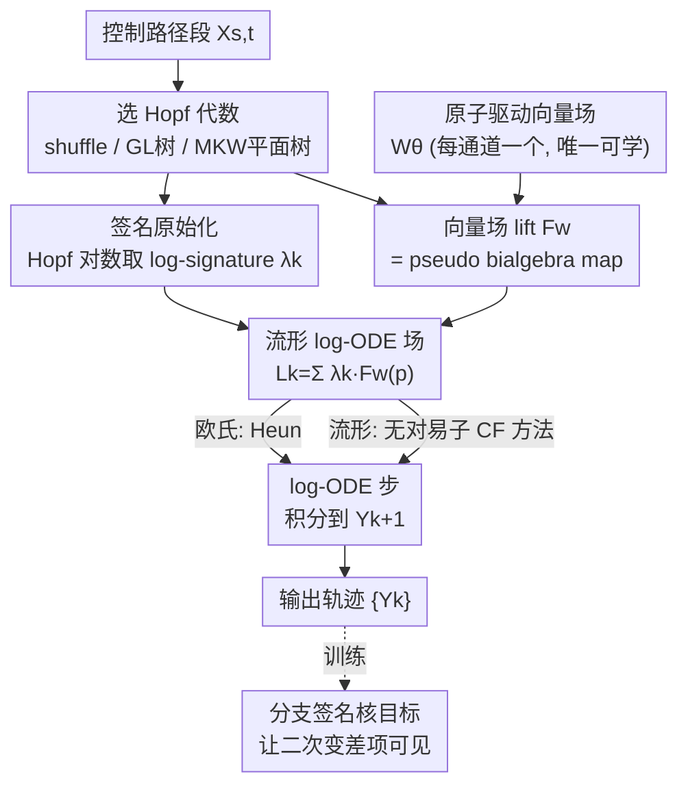

# Learning Manifold and Itô Dynamics with Branched Neural Rough Differential Equations

**会议**: ICML2026  
**arXiv**: [2606.05272](https://arxiv.org/abs/2606.05272)  
**代码**: Roughrax（JAX 包，作者随文发布）  
**领域**: 时间序列 / 连续时间动力学建模  
**关键词**: 神经粗糙微分方程, 分支粗糙路径, Itô 微积分, 流形动力学, 签名核

## 一句话总结
神经粗糙微分方程（NRDE）只能处理 Stratonovich 动力学（因为它依赖 shuffle 代数），本文把 NRDE 的 log-ODE 步骤换成 **Hopf 代数上的几何数值积分**——用 Grossman–Larson 有根树代数处理欧氏 Itô、用 Munthe–Kaas–Wright 平面有根树代数处理流形上的有序协变导数、shuffle 代数留给经典 Stratonovich，从而把签名方法首次推广到 Itô 与流形值动力学，并配一个分支签名核目标让二次变差项在训练中可见。

## 研究背景与动机

**领域现状**：从时间序列学连续时间动力学是机器学习的基础问题（机器人、分子动力学、量化金融都要用）。神经受控微分方程（NCDE）用神经网络参数化受控微分方程的向量场，把隐状态 $h_t$ 沿控制路径 $X$ 演化：$h_t=h_{t_0}+\int_{t_0}^t g_\theta(h_s)\,\mathrm{d}X_s$。但 NCDE 对长序列开销大。**神经粗糙微分方程（NRDE）** 的提速办法是 log-ODE 方法：在每个粗窗口 $I_j=[t_j,t_{j+1}]$ 上，把精细采样的路径 $X$ 用它的 **log-signature**（迭代积分的对数）$\lambda_j$ 概括，再让隐状态在粗区间上按一个由 $\lambda_j$ 决定系数的自治 ODE 推进，于是能用大得多的步长、积分步数远少于标准神经微分方程。

**现有痛点**：NRDE 的高效本质上依赖 **shuffle 代数**——它是 Stratonovich 微积分的代数对应物。Stratonovich 积分保持普通链式法则，所以迭代积分的乘积满足 shuffle 恒等式 $e_i \shuffle e_j = e_i\otimes e_j + e_j\otimes e_i$。可是这个依赖意味着 NRDE **暴露不出 Itô 动力学需要的二次变差项**，也表达不了连接装备流形上 Itô 流所需的有序协变导数。

**核心矛盾**：现实中两类重要场景恰恰不是 Stratonovich。① **欧氏 Itô**：Itô 乘积法则比 Stratonovich 多一个二次变差修正 $X_{s,t}^{(i)}X_{s,t}^{(j)}=\int X^{(i)}\mathrm{d}X^{(j)}+\int X^{(j)}\mathrm{d}X^{(i)}+\langle X^{(i)},X^{(j)}\rangle_{s,t}$，这个 $\langle\cdot,\cdot\rangle$ 项在原始 $d$ 维 word 坐标里根本不是一个独立的二阶驱动坐标，只能靠 lead-lag 增广路径间接表示（代价是通道维度翻倍）。金融里必须用非预期的 Itô 建模才能避免前视偏差。② **流形 Itô**：流形上 Itô 积分要相对一个连接 $\nabla$ 定义，其展开涉及高阶协变导数，而这些算子一般不对易（$\nabla_U\nabla_V\neq\nabla_V\nabla_U$），shuffle 代数会把它们的有序、分支组合通过 shuffle 关系错误地"对称掉"。

**本文目标**：造一个统一框架，能用 log-ODE 方法在 **Itô 积分** 下、并在 **流形** 上学习动力学，且严格遵守各自领域的几何与因果约束。

**切入角度**：换掉驱动代数——把控制路径不再 lift 到 shuffle 张量代数，而是 lift 到 **有根树的 Hopf 代数**：欧氏 Itô 用 Grossman–Larson 代数 $\mathcal{H}_{\text{GL}}$，流形用 Munthe–Kaas–Wright 代数 $\mathcal{H}_{\text{MKW}}$。有根树天生能给出 word 坐标给不出的二阶/有序坐标。

**核心 idea**："让驱动代数匹配支配的微积分"——把 NRDE 的 log-ODE 步骤重新诠释为 **状态空间流形上的几何数值积分**：树基代表 Itô 型迭代积分，平面树固定子节点左右序来索引有序协变导数，再用 pseudo bialgebra map 把代数元素转成流形上的学习向量场和微分算子。

## 方法详解

### 整体框架

B-NRDE 把 log-NCDE 推广到非欧几何，核心是在每个时间窗口上做一次"几何 log-ODE 步"。给定选定的 Hopf 代数 $\mathcal{H}\in\{\mathcal{H},\mathcal{H}_{\text{GL}},\mathcal{H}_{\text{MKW}}\}$、截断深度 $N$、路径分段，离线对每段算 $\mathcal{H}$-签名再取 Hopf 对数得到原始基坐标下的 log-signature $\lambda_k$；模型只学一组"原子驱动向量场" $\mathcal{W}_\theta$（每个驱动通道一个），原始基索引的 log-ODE 场则由这些原子场通过向量场 lift 确定性生成；最后把每段 log-ODE $\dot Z_\tau=L_k(Z_\tau)$ 在 $\tau\in[0,1]$ 上积分得到从 $Y_k$ 到 $Y_{k+1}$ 的局部更新。流形情形下用齐性空间实现：网络输出 frame/李代数坐标，数值流通过群作用施加，在每个求解子步都精确满足流形约束，避免外在投影/回缩误差。

### 关键设计

**1. 用有根树 Hopf 代数替换 shuffle 代数：让坐标空间里"装得下"二次变差与有序协变导数**

这是全文的代数地基。三类积分制度各配一个 Hopf 代数：经典 Stratonovich 用张量代数 $\mathcal{H}$（对偶坐标乘积是 shuffle）；欧氏 Itô 用 Grossman–Larson 代数 $\mathcal{H}_{\text{GL}}$，其有根树基提供一个对应二次变差的（对称）二阶坐标，于是 $\langle X^{(i)},X^{(j)}\rangle$ 这个 shuffle 表示里藏不住的项，在树坐标里成了一个显式独立坐标；流形 Itô 用 Munthe–Kaas–Wright 代数 $\mathcal{H}_{\text{MKW}}$，它定义在 **平面有根树** 上——每个节点固定子节点的左右序，正好索引有序的迭代协变导数；而非平面树会对称化子节点序、坍掉这些对顺序敏感的流项。一句话：不同微积分需要不同的迭代积分组合律，Hopf 代数的乘积 $\star$ 正是这套组合律的载体。

**2. 签名原始化：用统一的 Hopf 对数把签名压到原始坐标，跨三种制度一套实现**

log-ODE 方法要求把签名表达成原始（primitive）元素。对路径段的 $\mathcal{H}$-签名 $\mathbb{X}^{\mathcal{H}}_{s,t}$（一个群样元素），取 Hopf 对数得到原始元素：

$$\log_{\mathcal{H}}(g)\coloneqq\sum_{n\geq1}\frac{(-1)^{n-1}}{n}(g-1)^{\star n}$$

关键在于乘积 $\star$ 因代数而异：$\mathcal{H}$ 里 $\star$ 是张量拼接（对偶坐标乘积是 shuffle），$\mathcal{H}_{\text{GL}}$ 与 $\mathcal{H}_{\text{MKW}}$ 里 $\star$ 是 **树的嫁接（grafting）乘积**。换句话说，同一个 Hopf 对数公式，只要换掉 $\star$ 的定义，就能给三种制度统一产出 log-signature $\{\lambda_j\}$，无需为每种制度写不同的签名管线。

**3. 原子向量场 + pseudo bialgebra map 向量场 lift：网络只学 d 个场，其余递归生成**

B-NRDE 的可学部分极小——只有 $d$ 个原子驱动向量场 $W_\theta^{(i)}(z)\in T_z\mathcal{M}$（每个驱动通道一个），**不直接学**庞大的原始索引 log-ODE 场。原始索引场由原子场经向量场 lift $F_W:\mathcal{B}_{\mathcal{H}}^{\text{prim}}\to\Gamma(TM)$ 确定性生成，这个 lift 就是 pseudo bialgebra map 的实现，把每个基元素送成流形上的微分算子。具体递归：shuffle 原始元（Lyndon 词）用李括号递归 $F_W([u,v])=[F_W(u),F_W(v)]$；树原始元用多元节点协变导数递归，对一棵着色根树，叶子取 $V_v=W^{(c(v))}$，有 $k$ 个有序子节点的内部节点取 $V_v=\nabla^k_{V_{u_1},\dots,V_{u_k}}W^{c(v)}$，根节点的值即 $F_W(p)$。这正是 elementary differential（式 5）的计算形式——对基向量场施 $k$ 阶协变导数、沿子树指定的方向看它移动多少；$\mathcal{H}_{\text{MKW}}$ 里协变导数 $\nabla^k$ 的参数顺序由子树的平面序决定。数值上这些内蕴运算用前向自动微分（JVP）求值，并在不同原始场间复用导数评估。

**4. 流形 log-ODE 方法（齐性空间实现）：在每个求解子步精确守约束**

把窗口场写成原始坐标的线性组合 $L_k(Y)=\sum_{p}\lambda_k^p F_W(p)(Y)$（式 8）。欧氏情形直接用 Heun 二阶法解归一化 ODE $\dot Z_\tau=L_k(Z_\tau)$，且当 $\mathcal{H}=\mathcal{H}$ 时退化回 log-NCDE。流形情形选齐性空间实现：设李群 $G$ 作用于 $\mathcal{M}$，$\xi\in\mathfrak{g}$ 的基本向量场为 $\xi^\#(Y)=\frac{\mathrm{d}}{\mathrm{d}\epsilon}\big|_{\epsilon=0}\exp(\epsilon\xi)\cdot Y$，lift 后的原始评估器返回 frame 坐标 $\widehat F_W(p)(Y)\in\mathfrak{g}$，窗口 ODE 变成 $\dot Z_\tau=\widehat L_k(Z_\tau)^\#(Z_\tau)$，用 **无对易子（commutator-free）方法** $\mathrm{CF\text{-}EES}(2,5)$ 求解（最小指数设计、每步 memory/compute 最省）。这样把约束施加到群作用上、每个子步都精确停在流形里，避免外在积分的投影/回缩误差；平坦情形群作用退化成加法、整套实现自动覆盖欧氏 $\mathcal{H}_{\text{GL}}$。复杂度由所选代数的原始基大小主导：$\mathcal{H}$ 用 Witt 公式、$\mathcal{H}_{\text{GL}}$ 是 $d$-着色非平面根树数、$\mathcal{H}_{\text{MKW}}$ 是 $d$-着色平面根树数 $C_{n-1}d^n$（Catalan 增长）。

**5. 分支签名核目标：让二次变差在训练损失里显式可见，实现 Itô 一致的法匹配**

几何签名核 $k_{\text{geo}}(x,y)=\langle\text{Sig}^N(x),\text{Sig}^N(y)\rangle$ 是随机过程的相似度度量，可用 kernel scoring 目标训练神经 SDE。但现有签名核实现都算几何（Stratonovich）签名：网格上观测的半鞅做分段线性插值后是有限变差，其标准 lift 的二次括号为零，**根本不把二次协变差当成驱动坐标**——所以 Itô/分支签名模型用这种表示必须另行供给括号信息。本文定义 **分支签名核**：对增广了二次变差的驱动 $\mathbf{X},\mathbf{Y}$，$k_{\text{br}}^N(\mathbf{X},\mathbf{Y})=\langle\text{Sig}_{\mathcal{H}}^N(\mathbf{X}),\text{Sig}_{\mathcal{H}}^N(\mathbf{Y})\rangle_{\mathcal{H}_{\leq N}}$，对应的 score 目标 $\mathcal{L}_{\text{br}}(\theta)=\mathbb{E}_{\mathbf{X},\mathbf{X}'\sim P_\theta}[k_{\text{br}}^N]-2\mathbb{E}_{\mathbf{X}\sim P_\theta,\mathbf{Y}\sim P_{\text{data}}}[k_{\text{br}}^N]$。当模拟器能直接给出括号增量时就直接用，而不是从实现的二次变差去重构——后者会受阶为 $\sqrt{\Delta_n}$ 的实现协方差误差污染，供给解析/模拟器真值括号能消掉这个有限网格误差源。

### 损失函数 / 训练策略

各任务统一用签名核 score 目标做法匹配：geometric kernel 目标 $\mathcal{L}_{\text{geo}}$ 用于 log-NCDE/NRDE，B-NRDE 额外（或替换）用分支核目标 $\mathcal{L}_{\text{br}}$。rBergomi 实验里 B-NRDE 在 $\mathcal{L}_{\text{geo}}$ 训练后再加 3 个 epoch 的分支签名核微调，注入二次变差/协变差项。SO(3) 确定性预测任务则用对全窗口的 Frobenius 差 $\min_\theta\sum_j\|\hat R_\theta(t_j)-R(t_j)\|_F^2$ 预训练。作者还发布了 JAX 包 **Roughrax**（分支粗糙路径 + 流形 RDE 的可自动微分数值解）。

## 实验关键数据

三个域各映射到匹配其几何/因果的 Hopf 代数。baseline 含 M-NODE、NCDE 系（linear/Hermite/SG 插值）、NRDE、log-NCDE，以及离散时间 GRU、xLSTM、stacked xLSTM。

### 主实验

| 任务 | 代数 | 指标 | B-NRDE | 关键对比 |
|------|------|------|--------|----------|
| rBergomi 粗糙波动率生成（欧氏 Itô） | $\mathcal{H}_{\text{GL}}$ | KS ($\times10^{-2}$, 4 个时间边际) | 4 个里 3 个最优（如 128: 6.89, 256: 6.91） | 胜过 NRDE / log-NCDE |
| SO(3) sim-to-real 旋转预测（流形 Stratonovich） | $\mathcal{H}$ | RGE (度) | 静止 3.23 / 平移 3.70 / 无约束 3.33 | SG-NCDE 略低(2.93)，但 B-NRDE 仅用 2 步 vs 20 步 |
| SPD 协方差 Itô 动力学（流形 Itô） | $\mathcal{H}_{\text{MKW}}$ | $W_1$ ($\times10^{-2}$) | 256: 5.81 / 384: 6.28 / 512: 8.35 | 比欧氏 log-NCDE 平均改进 56.2% |

rBergomi 的妙处在于：标准签名法要捕捉金融相关的 Itô 积分必须做 lead-lag(Hoff) 增广、通道维度 $d\to2d$、签名规模暴涨；而 B-NRDE 的 $\mathcal{H}_{\text{GL}}$ 公式天然容纳分支粗糙路径，无需增广就能处理驱动信号。SO(3) 任务此前因缺少流形兼容公式而被签名法挡在门外。

### 消融实验

| 配置 / 设置 | 关键指标 | 说明 |
|------|---------|------|
| B-NRDE (GK) vs (BK) on rBergomi | 512 horizon: GK 9.58 / BK 8.11 | 分支核(BK)在长 horizon 更优且训练时间仅 47s vs 233s |
| B-NRDE vs SG-NCDE on SO(3) | RGE 3.23 vs 2.93，步数 2 vs 20 | 用 1/10 的求解步数换来可比精度，且支持粗糙驱动（去掉 $C^1$ 插值要求） |
| GK vs BK on SPD | $W_1$ 几乎无差 | 该设置下分支核与几何核无显著差异 |
| log-NCDE (欧氏) vs B-NRDE (流形) on SPD | 平均改进 56.2% | 保持流形约束带来的法匹配增益 |

### 关键发现
- **代数匹配带来实打实增益**：欧氏 Itô 用 $\mathcal{H}_{\text{GL}}$ 在 rBergomi 上压过 Stratonovich 的 NRDE/log-NCDE；流形 Itô 用 $\mathcal{H}_{\text{MKW}}$ 比把问题硬塞进欧氏 log-NCDE 平均好 56.2%。
- **粗步长省得狠**：SO(3) 上 B-NRDE 用 2 个求解步逼近 SG-NCDE 的 20 步精度，且因允许粗糙驱动而能用 MLP 这类非光滑外推器，摆脱 $C^1$ 插值约束。
- **分支核未必处处更优**：rBergomi 长 horizon 上分支核明显更好且更快，但 SPD 上分支核与几何核无显著差异——增益依赖任务是否真有需要暴露的二次变差结构。
- **签名法通病仍在**：SPD 上初始条件附近拟合一般，因为签名法对起点不变（无增广），是已知缺陷。

## 亮点与洞察
- **"换代数"而非"改网络"**：把一个看似纯工程的提速技巧（log-ODE）追溯到它的代数根源（shuffle=Stratonovich），再通过替换 Hopf 代数把整套机器平移到 Itô 与流形，理论统一性极强——同一套 $\log_{\mathcal{H}}$ 公式只换乘积 $\star$ 就覆盖三种制度。
- **只学 d 个原子场、其余递归生成**：把可学参数压到最小、组合结构交给代数确定性展开，既省参数又保证几何/因果一致性，是"把归纳偏置写进数学结构"的范例。
- **齐性空间 + 无对易子求解器**：在每个子步用群作用精确停在流形里，避免外在投影误差，比"先在环境空间积分再投回流形"干净得多。
- **分支签名核把二次变差搬上台面**：点出几何签名核在有限网格上"看不见"二次协变差的根本原因，并用模拟器真值括号消掉 $\sqrt{\Delta_n}$ 的实现协方差误差，这一诊断本身很有洞察。

## 局限与展望
- **必须显式截断**：不像几何核有未截断的 PDE 求解器，分支签名核只能显式截断、丢弃高阶迭代积分信息，内存/计算开销随状态维 $d$ 增长而恶化（二次变差特征按 $d^2$ scale），高维场景受限。
- **缺分支 log-signature 的紧凑投影**：几何 log-signature 能商掉 shuffle 恒等式投到更小的 Lyndon 基，但分支 Hopf 代数目前没有已知的类似显式投影，导致分支 log-signature 偏大、内存效率不及几何情形。
- **初始条件拟合弱**：SPD 上靠近起点的保真度一般，是签名法对起点不变的通病，需路径增广缓解。
- **展望**：PDE-based 求解器或自适应 log-ODE 方案有望避免显式截断；多指标粗糙路径（Linares–Otto-Tempelmayr Hopf 代数）对标量 RDE 能给更紧凑表示；进一步可把"平面分支"思路推到正则结构与 SPDE，做 $\mathbb{R}^d\to\mathcal{M}$ 的神经平面正则结构模型。

## 相关工作与启发
- **vs NRDE / log-NCDE (Morrill 2021 / Walker 2024)**：它们用几何（Stratonovich）签名、依赖 shuffle 代数，只能处理 Stratonovich 欧氏动力学；B-NRDE 用有根树 Hopf 代数把同一套 log-ODE 机器推广到 Itô 与流形，且 $\mathcal{H}=\mathcal{H}$ 时严格退化回 log-NCDE，是真包含关系。
- **vs lead-lag(Hoff) 增广**：传统上要让几何签名捕捉 Itô 积分得做 lead-lag lift、通道 $d\to2d$、签名规模暴涨；$\mathcal{H}_{\text{GL}}$ 直接在树坐标里暴露二次变差，无需增广。
- **vs 流形神经 ODE（M-NODE 等）**：M-NODE 在 SO(3) 上误差远大（RGE>100），B-NRDE 借签名的粗步长优势在流形上又快又准。
- **vs 几何签名核 / 神经 SDE 训练（Issa 2023 等）**：它们的核基于 Stratonovich 签名、网格上看不见二次协变差；本文的分支签名核把括号坐标纳入增广法，实现 Itô 一致的法匹配。

## 评分
- 新颖性: ⭐⭐⭐⭐⭐ 首次用 Grossman–Larson / Munthe–Kaas–Wright Hopf 代数把神经粗糙微分方程推广到 Itô 与流形，统一三种积分制度
- 实验充分度: ⭐⭐⭐⭐ 三个互补域（金融波动率/SO(3)/SPD）各自对症验证，但每个域规模偏小、SPD 初值拟合弱
- 写作质量: ⭐⭐⭐⭐ 代数动机与微积分对应讲得透彻，但 Hopf 代数门槛高、对非专业读者不友好
- 价值: ⭐⭐⭐⭐⭐ 给签名/粗糙路径神经方法补上 Itô 与流形两块缺口，并开源 Roughrax，奠定后续方向

<!-- RELATED:START -->

## 相关论文

- [\[ICLR 2026\] Random Controlled Differential Equations](../../ICLR2026/time_series/random_controlled_differential_equations.md)
- [\[AAAI 2026\] AirDDE: Multifactor Neural Delay Differential Equations for Air Quality Forecasting](../../AAAI2026/time_series/airdde_multifactor_neural_delay_differential_equations_for_air_quality_forecasti.md)
- [\[NeurIPS 2025\] In-Context Learning of Stochastic Differential Equations with Foundation Inference Models](../../NeurIPS2025/time_series/in-context_learning_of_stochastic_differential_equations_with_foundation_inferen.md)
- [\[ICML 2026\] It's TIME: Towards the Next Generation of Time Series Forecasting Benchmarks](its_time_towards_the_next_generation_of_time_series_forecasting_benchmarks.md)
- [\[ICML 2026\] Time-series Forecasting Through the Lens of Dynamics](time-series_forecasting_through_the_lens_of_dynamics.md)

<!-- RELATED:END -->
