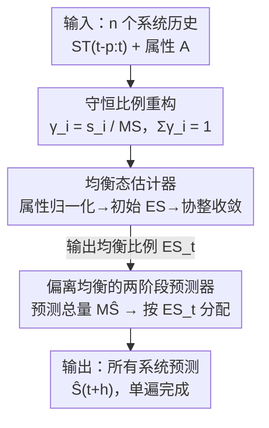

# Once-for-All: Scalable Simultaneous Forecasting via Equilibrium State Estimation

**会议**: ICML2026  
**arXiv**: [2606.13285](https://arxiv.org/abs/2606.13285)  
**代码**: 待确认  
**领域**: 时间序列预测  
**关键词**: 多系统预测, 均衡态估计, 协整收敛, 线性复杂度, 即插即用

## 一句话总结
针对「多个相互影响的系统要同时预测」这类场景（如 16 国汇率、几百个区县的疫情新增），本文提出 Equilibrium State Estimation（ESE）：先一次性估出所有系统的「均衡态比例」，再用当前状态偏离均衡的方向做单遍预测，从而把原本一个一个系统反复预测的 $O(n)$ 训练换成线性时间的一次推理，精度持平 SOTA、速度快 10–70×，还能即插即用地包住任意现成预测器。

## 研究背景与动机
**领域现状**：在经济、流行病等场景里，经常要同时预测**多个互相影响**的系统——每个国家的汇率、每个地区的新增病例。主流做法是把每个系统当一条独立时间序列，用 ARIMA / LSTM / Informer / PatchTST 等模型**一个一个**地预测。

**现有痛点**：逐系统预测有三个问题。一是**重复且昂贵**：$n$ 个系统就要训练 / 推理 $n$ 次，系统数一多成本线性甚至更糟地膨胀；二是**忽略系统间耦合**：各系统单独建模时，彼此的相互牵制（一国汇率涨往往对应他国跌）被丢掉；三是**不灵活**：换输入长度、预测步长、系统粒度都要重训。

**核心矛盾**：问题本质在于——多系统并不是 $n$ 条互不相干的序列，而是一个「此消彼长」的整体；但传统时间序列方法的建模单位是「单系统单输出」，结构上就没法表达「系统之间的比例守恒」。多变量（multivariate）时间序列虽有多个变量，但它们属于**同一个**底层系统，和这里跨**多个同质系统**是两码事。

**本文目标**：能不能用一个统一模型，在**单遍**里把所有系统同时预测出来，既省算力又利用上系统间的相互作用？

**切入角度**：作者从物理 / 经济里的「均衡」概念出发——当所有竞争性影响相对平衡时，系统处于均衡态；一旦被扰动就会失衡并向新均衡演化。把多个系统看成一个「超系统」，估计它们的集体均衡态，就能读出各系统的变化趋势方向，从而联合预测全部成员。

**核心 idea**：用「均衡态」充当多系统的共享锚点——先估出系统间在均衡时的**比例分配** $\mathcal{ES}$，再用「当前状态偏离均衡的程度」推未来，把多系统预测拆成「先预测总量、再按均衡比例分配」的两阶段单遍流程。

## 方法详解

### 整体框架
ESE 的输入是 $n$ 个同质系统在历史窗口 $[t-p, t]$ 上的目标值序列 $\mathcal{ST}_{t-p:t}$，外加每个系统的属性集合 $\mathcal{A}$（如人口、宏观经济指标）；输出是所有系统在未来 $h$ 步的预测 $\widehat{\mathcal{S}}_{t+h}=(\widehat{s}_{1,t+h},\dots,\widehat{s}_{n,t+h})$，**一遍算完**。

整条流水线分三步：先把多系统重构成「比例守恒」的集合表示（每个系统占总量的比例 $\gamma_i$，所有比例和恒为 1）；然后用**均衡态估计器**估出这些系统在均衡时的比例分配 $\mathcal{ES}_t$；最后用**预测器**预测整体总量、再按 $\mathcal{ES}_t$ 的比例把总量分摊回各个系统。关键在于：个体系统的**比例**比个体绝对值稳定得多，所以「预测总量 + 固定比例分配」既准又快，且总量预测可以交给任意现成模型来做。

### 关键设计

**1. 守恒比例重构：把多系统改写成「此消彼长」的整体**

逐系统预测之所以丢掉耦合，是因为它把每条序列的绝对数值当独立目标。ESE 先把 $n$ 个系统打包成一个集合 $\mathcal{MS}=\sum_{i=1}^{n}s_i$，再用每个系统占总量的**比例** $\gamma_i = s_i / \mathcal{MS}$ 作为建模单位。这样做有两个直接好处：一是天然的守恒约束——所有比例之和恒为 1（$\sum_{i=1}^{n}\gamma_i=1$），且任意一步的比例变化之和为零（$\sum_{i=1}^{n}\Delta\gamma_i=0$，即 $\Delta\gamma_i = -\sum_{j\neq i}\Delta\gamma_j$），把「一个系统涨必对应其他系统跌」的相互牵制显式编码进去；二是**尺度无关**——比例消掉了各系统目标值量纲与范围的差异（汇率里印尼盾和英镑差了两万倍），使模型不受具体数值类型影响。这一步要求集合成员固定不增删（建模一个城市的疫情就要包含它全部区县），是后续均衡估计能成立的前提。

**2. 均衡态估计器：用协整检验把比例收敛到统计均衡**

光有当前比例还不够，要预测就得知道系统「想往哪个比例去」——也就是均衡比例 $\mathcal{ES}_t=(\gamma^{*}_{1,t},\dots,\gamma^{*}_{n,t})$。作者借 Nash 均衡里「通过分析内部竞争来估计系统状态」的思路，靠系统间属性的相互作用来估均衡。具体分三步：先把每个系统第 $k$ 个属性按理论上下界归一化，$\alpha'_{i,k,t}=\frac{\alpha_{i,k,t}-\overline{\alpha_{k,t}}}{U(\alpha_{k,t})-L(\alpha_{k,t})}$（$U,L$ 是理论极值而非数据观测范围）；再得到初始均衡 $\mathcal{ES}_t^{[0]}=\frac{1}{n}+\frac{1}{m}\sum_{k=1}^{m}\psi_{k,t}\,\bar{\alpha}'_{k,t}$，其中属性影响系数 $\psi_k$ 由极大似然估计（MLE）拟合 $\mathcal{ST}_t\approx\mathcal{A}'_t\Psi_t$ 得到；最后引入一个 $n$ 维修正向量 $\mathcal{L}$，在 Algorithm 1 里以阻尼系数 $\lambda=0.5$ 逐 epoch 更新 $\mathcal{ES}_t$。

收敛判据是这套方法最巧的一点：它不靠固定迭代步数，而用**协整检验（cointegration test）**——一种检验两序列是否存在长期均衡关系的经典统计方法——判断估出的 $\mathcal{ES}_t$ 与近期历史 $\mathcal{ST}_{t-p:t}$ 是否已建立稳定的长期关系。当协整检验的 p 值降到 0.05 以下（即置信度超过 0.95），就认为均衡已估出并停止。要强调的是：ESE **并不**真的去把系统推向均衡，它只是估「假如系统处于均衡会是什么样」，再用当前态对这个估计均衡的偏离来做预测；这里的「均衡」是统计意义上的均衡态，不是博弈论均衡。另外，若把所有属性影响 $\psi_t$ 置零，过程不会收敛——属性是 ESE 估均衡的根基。

**3. 偏离均衡的两阶段预测器：先预测总量再按比例分配，并即插即用**

有了均衡比例 $\mathcal{ES}_t$，预测器用当前状态偏离均衡的方向推未来。完整形式见 $\widehat{\mathcal{S}}_{t+h}=\theta_{t+h}\,\mathcal{MS}_t\,\mathcal{ES}_t+\boldsymbol{\varepsilon}_{t+h}$，其中 $\theta_{t+h}$ 由对总量 $\mathcal{MS}$ 的线性自回归模型极大似然估出，刻画整体趋势：$\theta=1$ 表示总量不变，$>1$ 上升，$<1$ 下降。这里有个值得注意的解耦——即便 $\theta_{t+h}=1$（总量没变），各系统仍可能因彼此涨跌抵消而处于失衡、需要重新分配；反之总量在变时各系统也可能同步涨跌、保持内部均衡。

这就引出 ESE 最实用的特性：**两阶段 + 即插即用**。第一阶段预测整体总量 $\widehat{\mathcal{MS}}_{t+h}$，第二阶段用 $\mathcal{ES}_t$ 的固定比例把总量分摊到各系统，简化形式为 $\widehat{\mathcal{S}}_{t+h}=\widehat{\mathcal{MS}}_{t+h}\,\mathcal{ES}_t$。由于第一阶段只是预测**一条**总量序列，可以直接换成任意现成模型（LSTM、SCINet、PatchTST、TimeLLM……）——外部模型负责整体趋势，ESE 负责把趋势分配到各系统。这既让那些原本只能单系统预测的模型获得了多系统能力，又因为只需跑一条总量序列而非 $n$ 条，把成本砍掉一大截（VAR 这类无法做单变量预测的方法需间接集成）。

### 损失函数 / 训练策略
均衡估计器无显式神经网络损失，靠 MLE 拟合属性影响 $\psi_k$（对数似然 $\ell(\Psi_t,\sigma_t^2)$）+ 协整检验作为迭代停止准则；预测器的趋势参数 $\theta_{t+h}$ 同样用线性自回归的对数似然估出。整体复杂度对系统数 $n$ 线性，数据按 90:10 划分训练 / 测试。

## 实验关键数据

### 主实验
在合成数据、16 国 G20 汇率（相对 USD，2019.11–2024.10 日度）、维多利亚州 COVID-19（2022 年，按 20/79/320 三种粒度聚合）三套数据上，对比最多 13 个 SOTA 预测器，每个 baseline 都跑「不加 ESE」与「加 ESE」两版。

| 数据集 (配置) | 指标 | ESE 单独 | 最强 baseline (无 ESE) | baseline+ESE |
|--------------|------|---------|----------------------|--------------|
| 合成 10 系统 (20→1) | RMSE / Cost(min) | 0.248 / 0.23 | Informer 0.244 / 1.69 | Informer+ESE 0.241 / 0.40 |
| 汇率 16 币 (100→1) | RMSE / Cost(min) | 6.010 / 0.22 | DLinear 5.878 / 6.33 | DLinear+ESE **5.461** / 0.62 |
| COVID 320 区 (100→1) | RMSE / Cost(min) | 4.83 / 2.23 | PatchTST 5.11 / 109.9 | FiLM+ESE **4.36** / 2.84 |

关键观察：(1) ESE 单独就很有竞争力，从不垫底，系统数越大（如 320 区）越常领先；(2) 任何 baseline 套上 ESE 后精度都持平或提升；(3) 每列最低误差总是由 ESE 单独或某 baseline+ESE 取得；(4) ESE 把 baseline 的运行成本大幅压低，在 320 区上对 FiLM / SCINet 实现 **70× 以上**加速。

### 消融与分析

| 分析维度 | 现象 | 说明 |
|---------|------|------|
| 集成 ESE 的成本 | SCINet 320 区 62.27 → 2.82 min | 把 $n$ 条序列预测换成单条总量预测，加速逾一个数量级 |
| 属性影响 $\psi$ 置零 | 估计过程不收敛 | 属性是均衡估计的根基，无属性无法收敛 |
| 长输入鲁棒性 | 输入 >50 步时最低 RMSE 多由 ESE / +ESE 取得 | ESE 能有效利用长历史窗口 |
| 粒度扩展 | 20→79→320 区，ESE 仍准且成本近乎不变 | 线性复杂度带来强可扩展性，多数 baseline 反而退化 |

### 关键发现
- **比例比绝对值稳定**是全方法的命门：正因各系统占总量的比例随时间稳定，「预测总量 + 固定比例分配」才既准又能即插即用。
- **加速来源清晰**：ESE 把多系统预测压成单条总量序列，系统数越多省得越多（320 区上 70×+），与「逐系统预测成本随 $n$ 膨胀」形成对照。
- **属性不可或缺**：ESE 与传统 ARIMA/VAR 的本质差异在于它必须有属性数据来估均衡，去掉属性直接不收敛。

## 亮点与洞察
- **用「均衡」当多系统的共享锚点**：把物理 / 经济里的均衡概念搬到数值预测，估「假如均衡会怎样」再用偏离量预测，避开了逐系统建模的重复与耦合丢失——这是少见的、把均衡真正用于 forecasting（而非仅用于高效训练的 deep equilibrium model）的思路。
- **协整检验当收敛判据**很优雅：不用拍脑袋定迭代步数，而用统计上「长期均衡是否成立」自适应停机（p<0.05 即停），把统计计量学工具接进了估计循环。
- **即插即用的两阶段分解可迁移**：「预测聚合量 + 按稳定比例分配到子单元」这一招，可推广到任何「整体 - 部分」结构的预测任务（如总销量 → 各门店、总流量 → 各页面），让单序列模型零成本获得多目标分配能力。

## 局限与展望
- 方法强依赖「各系统**同质**且共享同一属性集」「集合成员固定不增删」「比例随时间稳定」三条假设，对系统会动态增删、或比例剧烈漂移的场景（如突发性结构断点）适配性存疑。
- 均衡估计需要属性数据，$\psi$ 置零即不收敛——这意味着没有可用属性的纯时间序列场景（传统 ARIMA/VAR 适用的设定）ESE 反而用不了。
- 论文主表多为 1 步 horizon 的快照，更长预测步长、跨数据集的系统性比较散落在附录；正文对均衡估计在极端非平稳下能否稳定收敛着墨不多。
- 文中部分公式（如初始均衡 $\mathcal{ES}_t^{[0]}$ 与 MLE 对数似然）记号较密，⚠️ 细节以原文 Appendix B–F 为准。

## 相关工作与启发
- **vs 传统单系统时间序列（ARIMA / LSTM / PatchTST / Informer）**：它们逐系统预测、不用属性、成本随 $n$ 膨胀；ESE 单遍预测全部系统、显式用属性估均衡、线性复杂度，且能把这些模型**包进来**当总量预测器，让它们既提速又涨点。
- **vs 多变量时间序列方法（VAR 等）**：多变量法的多个变量属于**同一**底层系统；ESE 跨**多个同质系统**，且 VAR 因不能做单变量预测无法直接被 ESE 集成（只能间接结合）。
- **vs Deep Equilibrium Model（Bai et al., 2019）**：DEQ 把均衡用于「不限网络深度的内存高效训练」；ESE 则把均衡直接用作**预测的锚点**——估均衡比例并据偏离量预测，是均衡概念在 forecasting 上的新用法。

## 评分
- 新颖性: ⭐⭐⭐⭐⭐ 把均衡态估计真正落到多系统 forecasting，并用协整检验做自适应收敛，问题设定与方法都新
- 实验充分度: ⭐⭐⭐⭐ 合成 + 汇率 + 三粒度疫情、13 个 SOTA、精度与成本双指标，但正文以 1 步快照为主、长 horizon 散在附录
- 写作质量: ⭐⭐⭐⭐ 概念铺陈清晰、定义严谨，但公式记号偏密、部分关键细节推到附录
- 价值: ⭐⭐⭐⭐⭐ 即插即用 + 10–70× 加速 + 线性扩展，对大规模多系统预测（经济 / 流行病 / 运营）有直接落地价值

<!-- RELATED:START -->

## 相关论文

- [\[AAAI 2026\] Detecting the Future: All-at-Once Event Sequence Forecasting with Horizon Matching](../../AAAI2026/time_series/detecting_the_future_all-at-once_event_sequence_forecasting_with_horizon_matchin.md)
- [\[ICLR 2026\] Are Global Dependencies Necessary? Scalable Time Series Forecasting via Local Cross-Variate Modeling](../../ICLR2026/time_series/are_global_dependencies_necessary_scalable_time_series_forecasting_via_local_cro.md)
- [\[ICML 2026\] HiPPO Zoo: Explicit Memory Mechanisms for Interpretable State Space Models](hippo_zoo_explicit_memory_mechanisms_for_interpretable_state_space_models.md)
- [\[ICML 2026\] FRACTAL: State Space Model with Fractional Recurrent Architecture for Computational Temporal Analysis of Long Sequences](fractal_ssm_with_fractional_recurrent_architecture_for_computational_temporal_an.md)
- [\[ICML 2025\] Winner-takes-all for Multivariate Probabilistic Time Series Forecasting](../../ICML2025/time_series/winner-takes-all_for_multivariate_probabilistic_time_series_forecasting.md)

<!-- RELATED:END -->
