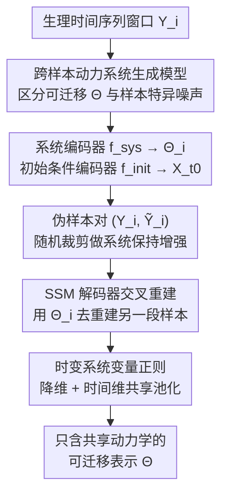

# Self-Supervised Dynamical System Representations for Physiological Time-Series

**会议**: ICML2026  
**arXiv**: [2512.00239](https://arxiv.org/abs/2512.00239)  
**代码**: [github.com/yenhochen/PULSE](https://github.com/yenhochen/PULSE)  
**领域**: 时间序列 / 自监督表示学习 / 生理信号  
**关键词**: 生理时间序列、自监督学习、动力系统、交叉重建、可迁移表示

## 一句话总结
PULSE 把生理时间序列看成由「可迁移的系统参数 + 不可迁移的样本特异噪声」共同生成，提出用一个交叉重建目标——让从一段窗口推断出的系统表示去重建同系统的另一段独立样本——逼着编码器只保留共享的动力学、丢掉初始条件和噪声，从而学到对临床语义更可迁移的表示。

## 研究背景与动机
**领域现状**：对 ECG、PPG、EEG 这类生理时间序列做自监督学习（SSL），核心目标是抓住底层生理过程的「身份」、滤掉无关噪声。现有方法分两类：弱约束 pretext（对比学习 CL、掩码自编码 MAE），主打下游可迁移性；以及强结构约束的序列变分自编码器（SVAE），显式建模潜在动力系统。

**现有痛点**：两类方法各有硬伤。CL 靠正样本对定义不变性，但生理信号上常用的 jitter/scaling 等增强可能**改变信号的临床身份**，把本属不同诊断的样本错误地坍缩到一起；MAE 的掩码策略允许用未来上下文重建过去段，可能学到非因果的捷径关系，违背生理过程的因果动力学。反过来，SVAE 用自编码 ELBO 显式保住了因果时序依赖，却**没有选择性滤噪的机制**——自编码目标惩罚任何对原始输入的偏离，于是模型会把记录偏移、瞬态波动这些样本特异噪声也一并编码进去，掩盖临床相关模式、损害可迁移性。

**核心矛盾**：弱约束方法能滤噪却可能滤错、破坏动力结构；强结构方法保住了动力结构却不会滤噪。两者的优点没法兼得——一个有滤噪机制但没结构约束，一个有结构约束但没滤噪机制。

**本文目标**：设计一个 SSL 目标，**同时**用潜在动力系统模型保住时序依赖、又选择性地剔除样本特异噪声。

**切入角度**：作者跳出「在单条时间序列内部建模动力学」的 SVAE 框架，转去建模**多条相似时间序列之间**的生成结构。关键洞察是：与生成参数有关的系统信息在「同一过程产生的多条独立序列」之间是共享、可迁移的，应当保留；而初始条件、过程噪声这类每条样本独有的信息不可迁移，应当丢弃。

**核心 idea**：用一个交叉重建任务定向抓取系统信息——把从 $\mathbf{Y}_i$ 推断的系统表示拿去重建同系统的另一条独立样本 $\mathbf{Y}_j$，由于两条样本只共享系统参数，编码器被迫只保留共享动力学、扔掉样本特异噪声。方法叫 PULSE（Physiological self-sUpervised Learning using System Encoders）。

## 方法详解

### 整体框架
PULSE 分三步：先用一个跨样本的动力系统生成模型**界定哪些信息可迁移**；再设计一个实用的交叉重建预训练策略去**抽取可迁移信息、丢弃噪声**；最后给出理论说明在什么条件下系统信息可被证明地恢复。

生成模型（图 2）假设：数据集里的每条窗口 $\mathbf{Y}_i$ 由一个带参数 $\boldsymbol{\Theta}_i$ 的潜在系统、配上一个初始条件 $\mathbf{X}_{i,t_0}$ 生成。由于生理活动高度刻板（步态有 heel-strike/mid-stance/toe-off 重复相位，正常窦性心律有 PQRST 复合波重复出现），很多样本其实由**同一个系统**产生——把由系统 $s$ 产生的样本下标集记作 $\mathcal{I}_s$，则 $\boldsymbol{\Theta}_i=\boldsymbol{\Theta}^{(s)}$ 对所有 $i\in\mathcal{I}_s$ 成立。联合分布按状态空间模型（SSM）展开：

$$p(\mathbf{Y},\mathbf{X},\boldsymbol{\Theta})=\prod_{s}\prod_{i\in\mathcal{I}_s} p(\mathbf{X}_{i,t_0},\boldsymbol{\Theta}^{(s)})\Big[\prod_k p(\mathbf{Y}_{i,t_k}|\mathbf{X}_{i,t_k})\Big]\Big[\prod_k p(\mathbf{X}_{i,t_k}|\mathbf{X}_{i,t_{k-1}},\boldsymbol{\Theta}^{(s)})\Big]$$

这个分解揭示了信息的层级：$\boldsymbol{\Theta}^{(s)}$ 在同系统样本间共享、可迁移；而 $\mathbf{X}_{i,t_0}$、观测噪声 $\epsilon$、动力噪声 $\nu$ 是样本特异、不可迁移。理想表示应只保留前者。

### 关键设计

**1. 交叉重建：用一条样本的系统表示去重建同系统的另一条样本**

针对的痛点是：自编码（重建自己）会把样本特异噪声也学进去。PULSE 改成「重建别人」——给定同系统的两条独立样本 $\mathbf{Y}_i,\mathbf{Y}_j$（$i,j\in\mathcal{I}_s$），用从 $\mathbf{Y}_i$ 推断的系统信息去重建 $\mathbf{Y}_j$：

$$\mathcal{L}_{\rm Cross}(\mathbf{Y}_i,\mathbf{Y}_j)=\mathbb{E}_{\mathcal{P}}\Big[\sum_{k=1}^{w}\lVert \mathbf{Y}_{j,t_k}-g_y(g_x(\mathbf{X}_{j,t_{k-1}},\boldsymbol{\Theta}_{i,t_k}))\rVert^2\Big]$$

为什么有效：根据生成模型，$\mathbf{Y}_i$ 和 $\mathbf{Y}_j$ 之间唯一共享的变量就是 $\boldsymbol{\Theta}^{(s)}$。若系统编码器 $f_{\rm sys}$ 偷偷编码了 $\mathbf{Y}_i$ 的样本特异因子，这些因子在 $\mathbf{Y}_j$ 里并不存在，反而会推高 $\mathcal{L}_{\rm Cross}$。因此损失天然逼着 $f_{\rm sys}$ 只留共享的系统信息。注意初始条件由另一个编码器 $f_{\rm init}$ 从 $\mathbf{Y}_j$ 自己估计（$\mathbf{X}_{j,t_0}=[f_{\rm init}(\mathbf{Y}_j)]_{t_0}$），把「系统估计」和「重建谁」解耦开。

**2. 双编码器分工 + 仅编码动力学：把可迁移与不可迁移信息物理隔离**

PULSE 用两个编码器把两类信息分到不同通道：系统编码器 $f_{\rm sys}$ 用空洞卷积覆盖整个窗口提取共享系统参数 $\boldsymbol{\Theta}_i=f_{\rm sys}(\mathbf{Y}_i)$；初始条件编码器 $f_{\rm init}$ 用感受野以 $t_0$ 为中心的 2 层 CNN 估计样本特异的初始条件。生成端用 SSM 解码器，$g_x$ 是 GRU、$g_y$ 是线性投影；$\boldsymbol{\Theta}_i$ 作为 GRU 的输入（GRU 隐状态按输入相关门控演化，正好对应「输入决定动力学」）。一个关键设计判断是：$\boldsymbol{\Theta}_{i,t_k}$ **只包含 $g_x$（动力学）的参数，不含 $g_y$（观测函数）的参数**——因为按 SSM 形式，「怎么测量一个过程」与「过程本身的动力学」是分开的，把观测参数排除在可迁移表示之外更符合动力系统的语义。此外沿用 DSVAE 的做法，把 $\boldsymbol{\Theta}_i$ 再拆成时不变分量 $\boldsymbol{\theta}_i$（对时间做 max pooling）与时变分量 $\tilde{\boldsymbol{\theta}}_{i,t_k}$（两层 CNN），以建模非平稳生理行为。

**3. PULSE 伪样本对：无标签时用系统保持增强近似「独立同系统样本」**

$\mathcal{L}_{\rm Cross}$ 需要系统标签 $\mathcal{I}_s$ 才能采到同系统对，但无标签数据集里拿不到。PULSE 改用**系统保持增强**构造近似独立的伪样本对 $(\mathbf{Y}_i,\widetilde{\mathbf{Y}}_i)$，$\widetilde{\mathbf{Y}}_i\sim\mathcal{T}(\mathbf{Y}_i)$：

$$\mathcal{L}_{\rm PULSE}(\mathbf{Y}_i)=\mathbb{E}_{\widetilde{\mathbf{Y}}_i\sim\mathcal{T}}\Big[\sum_{k=1}^{w}\lVert \widetilde{\mathbf{Y}}_{i,t_k}-g_y(g_x(\mathbf{X}_{i,t_{k-1}},\boldsymbol{\Theta}_{i,t_k}))\rVert^2\Big]$$

这里 $\mathcal{T}$ 取**随机裁剪**——它保住了时间序列的动力学（同一系统），却在初始条件 $\mathbf{X}_{i,t_0}$ 上引入变化（每个裁剪窗口起点不同，$t_0\sim\text{Uniform}(1,T-w)$）。这正契合生成模型的假设：底层生理状态往往与「录制从哪一刻开始」无关。之所以不用 jitter/scaling，是因为那些增强会改临床身份；裁剪只动初始条件、不动系统身份，因此安全。实验中用最多 4 个 $\widetilde{\mathbf{Y}}_i$ 估计期望以提升性能。

**4. 时变系统变量正则：防止退化成「抄局部信号」的捷径**

由于两个编码器看的是同一条 $\mathbf{Y}_i$，且系统表示含有从同一输入导出的时变分量 $\boldsymbol{\theta}_{i,t_k}$，模型有可能走捷径——直接把局部信号值抄进 $\boldsymbol{\theta}_{i,t_k}$ 当作「动力学」。作者用两招限制其表达力：一是把 $\boldsymbol{\theta}_{i,t_k}$ 降到**单维**，让它没有足够容量去表示数据里全部初始条件的多样性；二是通过在时间维相邻步之间**共享 max-pooled 值**来限制它随时间变化的速度。这样 $\boldsymbol{\theta}_{i,t_k}$ 只能承载缓变的系统性信息，而非逐点照抄。

### 损失函数 / 训练策略
预训练目标即 $\mathcal{L}_{\rm PULSE}$（交叉重建的伪样本对近似），配合上述时变变量正则。理论上（Theorem 3.3）作者把交叉重建视为一种特殊掩码下的 MAE 任务：把样本对 $(\mathbf{Y}_i,\mathbf{Y}_j)$ 看成单一联合输入，**当且仅当**完全掩掉其中一条样本（$\mathbf{m}_i=0,\mathbf{m}_j=1$）时，masked 与 unmasked 区域之间共享的最小潜变量集 $\mathcal{C}$ 才恰好等于系统参数 $\{\boldsymbol{\Theta}^{(s)}\}$；若一条序列里同时含 masked 与 unmasked 区域，$\mathcal{C}$ 会混进状态变量 $\mathbf{X}$，导致系统信息与样本特异信息被混淆。这给「为何 $\mathcal{L}_{\rm PULSE}$ 能恢复系统信息」提供了理论解释。

## 实验关键数据

### 合成动力系统实验
用 Lorenz / Thomas / Hindmarsh-Rose 三个随机微分方程在分岔区生成数据，做 5 类分类，随噪声 $\sigma$ 增大考察鲁棒性。PULSE 在所有实用算法（无标签预训练）中分类精度最高；带标签的 positive oracle 始终更优、negative oracle 始终更差，验证了 Theorem 3.3。

| 噪声 σ | SimCLR | TS2Vec | REBAR | TimeMAE | DSVAE | **PULSE** | Pos.Oracle | Neg.Oracle |
|--------|--------|--------|-------|---------|-------|-----------|-----------|-----------|
| 0 | 93.08 | 98.68 | 98.90 | 99.06 | 99.58 | **99.29** | 98.86 | 77.59 |
| 1 | 83.10 | 93.07 | 93.36 | 93.02 | 96.09 | **97.26** | 96.66 | 50.36 |
| 3 | 70.05 | 79.78 | 79.36 | 79.03 | 83.42 | **89.00** | 84.62 | 39.88 |
| 5 | 62.29 | 73.67 | 72.37 | 71.33 | 77.34 | **82.65** | 76.90 | 37.82 |

噪声越大 PULSE 优势越明显（σ=5 时领先次优 DSVAE 约 5 个点），说明它确实抓住了对噪声鲁棒的系统参数。

### 真实生理数据：线性探针 + 标签效率
四个真实数据集（HAR 加速度计 / PPG 压力 / ECG 心律 / EEG 睡眠分期）。PULSE 在 PPG/ECG/EEG 的线性探针上拿到最佳，ECG 提升尤其大；半监督低标签场景全面领先。

| 数据集 | 指标 | REBAR | TimeMAE | DSVAE | **PULSE** |
|--------|------|-------|---------|-------|-----------|
| PPG | Acc↑ | 41.38 | 61.35 | 58.65 | **64.27** |
| ECG | Acc↑ | 81.54 | 69.80 | 70.42 | **87.41** |
| ECG | AUROC↑ | 91.46 | 76.61 | 82.88 | **94.93** |
| EEG | Acc↑ | 83.71 | 83.83 | 84.25 | **85.56** |
| HAR | Acc↑ | 95.35 | 92.25 | 93.55 | 93.27 |

半监督（仅 1% 标签）下 ECG 精度 84.77 远超次优 DSVAE 的 67.60，PPG/EEG 也均领先，说明系统表示在低标签时的可迁移性优势更突出。

### 关键发现
- ECG 是 PULSE 最亮眼的场景（线性探针 +6 个点、1% 标签 +17 个点）——这类信号有极强的重复动力结构（PQRST 复合波），正好对得上「同系统产生多条样本」的假设。
- HAR 线性探针上 PULSE 略低于 SOTA，但在半监督和迁移学习设置下反超，说明系统表示牺牲了部分数据集内可分性、换来了更强的可迁移性。
- 合成实验里 negative oracle（带 masked+unmasked 混合区域）在高噪声下甚至跌破无标签 PULSE，直接印证理论：只有「整条样本被掩掉」时才能干净地恢复系统参数。

## 亮点与洞察
- 把 SSL 的「正样本对」重新诠释为「同一动力系统产生的独立样本」，给增强选择提供了一个有原则的判据：只有保系统身份的增强（裁剪）才合法，改身份的增强（jitter/scaling）会坏事。
- 用 MAE 理论（最小共享潜变量集 $\mathcal{C}$）反推出交叉重建的可识别性条件，把一个经验目标接上了可证明恢复的理论，是方法论上的漂亮一手。
- 双编码器把可迁移/不可迁移信息物理隔离、并刻意把观测参数 $g_y$ 排除出系统表示，体现了对动力系统语义的精细把控。
- 「重建别人而非重建自己」这一思路可迁移到任何「同源多实例」数据（多次实验的同一物理过程、同一用户的多段行为），凡是想抽共享生成因子、丢实例噪声的场景都适用。

## 局限与展望
- 核心假设是「很多样本由同一系统生成、唯一共享变量是 $\boldsymbol{\Theta}^{(s)}$」，对系统数远大于样本数、或动力学高度个体化的生理信号（如某些病理 EEG）可能不成立。
- 系统保持增强只用了随机裁剪；裁剪假设「生理状态与录制起点无关」，对存在强非平稳/事件锚定的信号未必都满足。
- 理论保证（Theorem 3.3）依赖 DAG + 各函数可逆的假设，作者自己也指出合成实验里因系统混沌而不完全可逆——真实数据上的可识别性更多是经验验证。
- HAR 上线性探针不及 SOTA，说明该表示在某些「身份即由表层特征决定」的任务上未必占优，方法的甜区是动力学主导身份的信号。

## 相关工作与启发
- **vs 对比学习（SimCLR/TS2Vec/REBAR）**: CL 靠增强定义不变性，但 jitter/scaling 可能改临床身份、错误坍缩不同诊断；PULSE 用系统保持的裁剪 + 动力学结构约束，避免了「滤错噪」的风险。
- **vs MAE（TimeMAE/PatchTST）**: 标准掩码允许用未来重建过去、学到非因果捷径；PULSE 通过「整条样本掩掉」的交叉重建强制只恢复因果系统参数，且有理论刻画。
- **vs SVAE（LFADS/DSVAE）**: SVAE 在单条序列内部建模动力学、用自编码 ELBO，没有滤噪机制会把样本噪声也编码进去；PULSE 在**样本之间**建模生成结构，交叉重建天然剔除不可迁移信息，可迁移性更强。

## 评分
- 新颖性: ⭐⭐⭐⭐⭐ 「跨样本动力系统 + 交叉重建」的视角新颖，且用 MAE 理论给出可识别性条件，理论与方法结合扎实。
- 实验充分度: ⭐⭐⭐⭐ 合成可控实验 + 4 个真实数据集 + 线性探针/标签效率/迁移，覆盖全面；个别任务（HAR）不占优已坦诚。
- 写作质量: ⭐⭐⭐⭐ 动机的两难铺垫清晰，生成模型→目标→理论一气呵成。
- 价值: ⭐⭐⭐⭐ 对生理信号 SSL 的可迁移性是实打实的改进，低标签场景收益尤大。

<!-- RELATED:START -->

## 相关论文

- [\[ICML 2026\] HEPA: A Self-Supervised Horizon-Conditioned Event Predictive Architecture for Time Series](hepa_a_self-supervised_horizon-conditioned_event_predictive_architecture_for_tim.md)
- [\[NeurIPS 2025\] Towards Self-Supervised Foundation Models for Critical Care Time Series](../../NeurIPS2025/time_series/towards_self-supervised_foundation_models_for_critical_care_time_series.md)
- [\[ICML 2025\] TimePoint: Accelerated Time Series Alignment via Self-Supervised Keypoint and Descriptor Learning](../../ICML2025/time_series/timepoint_accelerated_time_series_alignment_via_self-supervised_keypoint_and_des.md)
- [\[ECCV 2024\] OmniSat: Self-Supervised Modality Fusion for Earth Observation](../../ECCV2024/time_series/omnisat_self-supervised_modality_fusion_for_earth_observation.md)
- [\[NeurIPS 2025\] Universal Spectral Tokenization via Self-Supervised Panchromatic Representation Learning](../../NeurIPS2025/time_series/universal_spectral_tokenization_via_self-supervised_panchromatic_representation_.md)

<!-- RELATED:END -->
