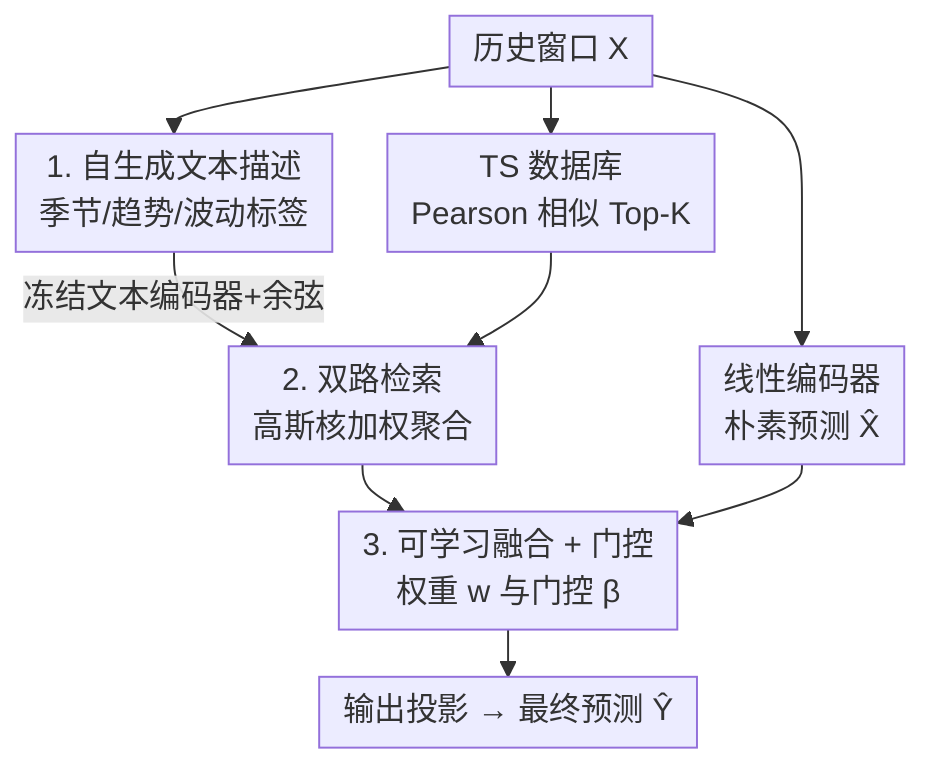

# Semantics-Enhanced Retrieval-Augmented Time Series Forecasting

**会议**: ICML 2026  
**arXiv**: [2606.14941](https://arxiv.org/abs/2606.14941)  
**代码**: 待确认  
**领域**: 时序预测 / 检索增强  
**关键词**: 时间序列预测, 检索增强生成, 多模态检索, 语义检索, 非平稳

## 一句话总结
SERAF 给检索增强的时序预测加了一条"语义检索"通路：把每段历史时间序列自动翻译成一句结构化文字描述（季节/趋势/波动），既按数值相似度、又按文本语义相似度去历史库里捞两套"相似过去 + 对应未来"，再自适应融合，从而在非平稳序列上检索到那些"数值上不像、但本质同型"的历史模式，在七个真实数据集上整体优于纯数值检索的 SOTA。

## 研究背景与动机

**领域现状**：多变量时序预测从 ARIMA 一路发展到 DLinear、PatchTST 这类深度预测器，近来又出现 Time-LLM、GPT4TS 等用文本上下文给预测注入背景知识的 LLM 方法。受 RAG 启发，一批工作（RAFT、TimeRAG、TS-RAG、TimeRAF）开始构建"历史数据库"，检索与当前输入相似的历史片段及其后续走势，用整段历史显式指导未来预测。

**现有痛点**：这些检索式方法绝大多数只用**时间序列相似度**来召回。问题是，在非平稳序列里，两段在原始数值、局部形状上差别很大的片段，可能共享更高层的属性——同一个季节、同样的上升趋势、相近的波动水平。纯数值相似度（比如逐点距离、相关系数）会把这些"本质同型但数值不像"的历史片段漏掉。少数走多模态路线的方法（如 TRACE）又依赖庞大的外部文本语料或 LLM 现场生成描述，既低效又难扩展。

**核心矛盾**：检索的召回质量受限于"相似性"的定义。只看数值，召回面太窄；引入语义又得背上外部文本和大模型的包袱。能不能不依赖任何外部标注，就让时间序列自己"说出"它的语义？

**本文目标**：在不引入外部文本、不调用 LLM 的前提下，给检索增强预测补一条语义检索通路，并把数值检索与语义检索的结果自适应融合。

**切入角度**：作者观察到，时间序列的高层属性（时间段、季节、主趋势、主波动）完全可以**从序列本身和时间戳里抽出来**，写成一句模板化的自然语言描述，再用一个冻结的文本编码器把它嵌入成可检索的向量。这样语义索引天然来自数据，零外部依赖。

**核心 idea**：把"数值相似检索"扩展为"数值 + 语义双路检索"——语义这一路靠序列自生成的文本描述来召回那些数值上不是最近邻、但语义上对得上的历史未来，二者互补后再门控融合进预测。

## 方法详解

### 整体框架

SERAF 的输入是一段长度 $L$、通道数 $C$ 的历史窗口 $\mathbf{X}_{t-L+1:t}\in\mathbb{R}^{L\times C}$，目标是预测未来 $H$ 步 $\mathbf{Y}_{t+1:t+H}$。整套流程同时从**时序**与**语义**两个视角检索历史，再把两路检索到的"未来"与一个朴素预测融合。

具体而言：输入序列一方面过一个可训练的线性编码器得到朴素预测 $\hat{\mathbf{X}}^j$；另一方面在时间序列数据库 $D_T$ 里按 Pearson 相关召回 Top-$K$ 个相似历史片段及其未来。与此并行，输入序列被翻译成一句文本描述，经冻结文本模型嵌入后，在对齐的描述数据库 $D_S$ 里按余弦相似度召回 Top-$K$ 个语义相似项（同样取回它们对应的历史未来）。两路检索到的未来各自经高斯核加权聚合，先用一个可学习权重 $w$ 融合，再通过门控机制和朴素预测自适应结合，最后投影成最终预测。整条管线轻量，不需要任何外部标注或领域文本。

### 关键设计

**1. 自生成文本描述：让时间序列自己说出可检索的语义**

纯数值检索漏掉"数值不像、本质同型"的历史，而引外部文本又昂贵。SERAF 的解法是用一个**预定义模板**，把序列本身的属性抽成一句结构化描述。每条描述包含四项：时间段（time period）、季节（season）、主趋势（main trend）、主波动（main volatility）。其中时间段和季节直接来自时间戳；趋势和波动则取"最频繁的通道级模式"——趋势被离散成 upward / downward / stable 三类，波动被离散成 high / medium / low 三档。

建库时，作者先用步长为 1 的滑窗在训练集上密集切出历史片段，每个片段 $\mathbf{P}_T^i$ 配上它后续长度 $H$ 的未来 $\mathbf{F}_T^i$，构成时间序列库 $D_T=\{(\mathbf{P}_T^i,\mathbf{F}_T^i)\}_{i=1}^{N}$；再给 $D_T$ 里每一对生成上述描述，构成对齐的描述库 $D_S=\{\mathbf{Q}_S^i\}_{i=1}^{N}$，其中 $\mathbf{Q}_S^i$ 与 $\mathbf{P}_T^i$ 一一对应。这一步的关键在于：语义索引**完全派生自数据**，不调用 LLM、不依赖任何外部语料，因此既高效又可扩展。

**2. 双路 Top-K 检索 + 高斯核加权聚合：数值与语义互补召回**

有了两个库，SERAF 在两个空间里各做一次 Top-$K$ 检索。数值这一路，对输入 $\mathbf{X}^j$ 与每个历史片段 $\mathbf{P}_T^i$ 算相似度 $\rho_{ij}=sim(\mathbf{X}^j,\mathbf{P}_T^i)$，作者选 **Pearson 相关**作为 $sim$，因为它能抵消尺度变化和数值平移、突出单调趋势的一致性。训练时为防泄漏，会把与当前输入在时间上重叠的片段（索引落在 $[\max(1,j-(L+H-1)),\min(N,j+(L+H-1))]$ 内）从候选集 $\mathcal{I}_{\text{valid}}$ 里剔除。语义这一路，给输入生成同模板描述 $\mathbf{Q}^j$，用冻结文本编码器嵌成 $\mathbf{E}^j$，与库中每条描述嵌入 $\mathbf{E}_S^i$ 算**余弦相似度** $s_{ij}$，同样取 Top-$K$。

两路召回的 $K$ 个片段都用**高斯核**加权——相似度越高权重越大：

$$\alpha_T^{kj}=\frac{\exp\!\left(-\frac{(1-\rho_{kj})^2}{2\tau^2}\right)}{\sum_{i\in\mathcal{K}^j}\exp\!\left(-\frac{(1-\rho_{ij})^2}{2\tau^2}\right)}$$

其中 $\tau$ 是高斯带宽。聚合后得到两路各自的"检索未来"：数值路 $\hat{\mathbf{F}}_T^j=\sum_{k\in\mathcal{K}_T^j}\alpha_T^{kj}\mathbf{F}_T^k$，语义路 $\hat{\mathbf{F}}_S^j=\sum_{k\in\mathcal{K}_S^j}\alpha_S^{kj}\mathbf{F}_T^k$。注意两路**取回的都是 $D_T$ 里的真实历史未来 $\mathbf{F}_T^k$**——语义检索只是换了一种"找相似过去"的方式，召回的仍是同一批历史未来，因此能补充数值最近邻之外的、语义对得上的候选。

**3. 可学习融合 + 门控：把两路检索与朴素预测自适应合成**

两路检索的贡献不该写死成固定比例，于是 SERAF 先用一个**可学习标量权重** $w\in(0,1)$ 融合二者：$\hat{\mathbf{F}}^j=w\,\hat{\mathbf{F}}_S^j+(1-w)\,\hat{\mathbf{F}}_T^j$。这一步让模型自己决定在当前数据集上语义检索和数值检索谁更可信。

但检索来的"历史未来"未必总比直接从输入外推的预测靠谱，所以作者又加了一道**门控**，把朴素预测 $\hat{\mathbf{X}}^j$ 和融合检索结果 $\hat{\mathbf{F}}^j$ 动态结合：

$$\mathbf{G}^j=\beta\,\hat{\mathbf{X}}^j+(1-\beta)\hat{\mathbf{F}}^j,\quad \beta=\sigma\!\left(W[\hat{\mathbf{X}}^j;\hat{\mathbf{F}}^j]\right)$$

其中 $[\cdot;\cdot]$ 是拼接，$W$ 是可学习投影，$\sigma$ 是 sigmoid。和固定权重 $w$ 不同，门控系数 $\beta$ 是**输入相关**的——它根据当前的朴素预测和检索结果现场算出该信谁多一点。最后 $\mathbf{G}^j$ 过一个输出投影得到最终预测 $\hat{\mathbf{Y}}^j$，整模型用 MSE 损失训练。

### 损失函数 / 训练策略
模型以最小化预测与真值之间的均方误差（MSE）训练。可训练参数包括线性编码器、融合权重 $w$、门控投影 $W$ 与输出投影；文本编码器全程**冻结**，高斯带宽 $\tau$ 为超参。所有对比实验统一用输入长度 720、并在 96/192/336/720 四个预测horizon上取平均。

## 实验关键数据

### 主实验
在 ETTh1、ETTh2、ETTm1、ETTm2、Exchange、Weather、Electricity 七个常用多变量数据集上，输入长度统一为 720，MSE/MAE 为四个horizon的平均（数值越低越好）。下表给出 SERAF 与代表性检索式方法 RAFT、以及若干强力深度预测器的 MSE 对比：

| 数据集 | SERAF | RAFT | CycleNet | PatchTST | DLinear | TimeMixer |
|--------|-------|------|----------|----------|---------|-----------|
| ETTh1 | **0.417** | 0.418 | 0.437 | 0.696 | 0.521 | 0.447 |
| ETTh2 | **0.348** | 0.358 | 0.368 | 0.472 | 0.445 | 0.365 |
| ETTm1 | **0.346** | 0.347 | 0.365 | 0.551 | 0.400 | 0.381 |
| ETTm2 | **0.252** | 0.257 | 0.285 | 0.354 | 0.290 | 0.275 |
| Weather | 0.235 | 0.241 | **0.224** | 0.232 | 0.238 | 0.240 |
| Exchange | 0.419 | 0.449 | **0.403** | 0.436 | 0.465 | 0.504 |
| Electricity | 0.156 | 0.160 | 0.157 | 0.216 | 0.225 | 0.169 |

SERAF 在七个数据集里的五个（ETTh1/ETTh2/ETTm1/ETTm2/Electricity）取得最低 MSE，且相对最强的检索式 baseline RAFT 普遍有稳定提升（如 ETTh2 从 0.358→0.348）；在 Weather、Exchange 上 CycleNet 略胜，说明语义检索在强周期/特殊金融序列上未必占优。整体看，在以 ETT 系列为代表的非平稳序列上，"数值 + 语义"双路检索带来的增益最明显。

### 设计组件对比
缓存正文未给出带数字的消融表，下表从机制上梳理三个核心组件各自补的短板（定性归纳，具体消融以原文为准 ⚠️）：

| 组件 | 解决的问题 | 去掉后的预期影响 |
|------|-----------|-----------------|
| 自生成文本描述 | 数值检索漏掉"数值不像本质同型"的历史 | 退化为纯数值检索，召回面变窄 |
| 双路高斯加权检索 | 单一相似度召回不全 | 失去语义/数值互补，非平稳段更差 |
| 可学习融合 + 门控 | 检索未来未必总优于朴素外推 | 无法按输入自适应取舍，鲁棒性下降 |

### 关键发现
- **语义检索的价值在非平稳段最突出**：ETT 系列（带时间漂移）上 SERAF 对 RAFT 的提升最稳定，印证"按季节/趋势/波动语义召回"能补数值最近邻的盲区。
- **Pearson 相似优于逐点距离**：选 Pearson 相关而非欧氏距离，是为了抵消尺度与平移、聚焦趋势一致性——这在多尺度真实序列上很关键。
- **门控比固定融合更重要**：固定权重 $w$ 只能给两路检索分配比例，而输入相关的门控 $\beta$ 决定整体信不信检索结果，是抵御"检索误导"的安全阀。

## 亮点与洞察
- **零外部依赖的语义索引**：把时间序列翻译成模板化文本，语义完全派生自数据本身（时间戳 + 通道级趋势/波动统计），既不调 LLM 也不要外部语料——这是相比 TRACE 等多模态方法最实用的差异点，可扩展性强。
- **"换一种相似度、召回同一批未来"的巧思**：语义路并不引入新的预测来源，只是用文本语义当作另一把"尺子"去找相似过去，最终取回的仍是真实历史未来，因此和数值检索天然互补、风险可控。
- **可迁移的双视角检索范式**：这套"内容相似 + 属性语义相似"双路召回再门控融合的思路，可以迁移到任意检索增强场景（如检索增强的异常检测、负荷预测），只要目标对象能被自动描述成结构化属性。

## 局限与展望
- **语义描述的粒度受模板限制**：只有时间段/季节/趋势/波动四项离散标签，趋势和波动还被粗暴离散成三类/三档，表达能力有限；细粒度形态（如双峰、突变点）无法编码，可能在复杂序列上召回不准。
- **依赖时间戳质量**：季节、时间段直接取自时间戳，对缺失或不规则采样的序列不友好。
- **检索成本随历史增长**：步长 1 的密集滑窗使库规模 $N$ 很大，双路 Top-$K$ 检索的开销和内存随训练集线性增长，超长历史下需要近似最近邻加速（原文未深入讨论）。
- **缺公开消融数字**：缓存正文未给出逐组件消融表，各组件的真实贡献度还需查原文确认。

## 相关工作与启发
- **vs RAFT**：RAFT 引入多周期性做检索式预测，但仍只用时间序列相似度；SERAF 在其基础上加语义检索通路，在多数 ETT 数据集上稳定超过 RAFT，说明"语义召回"是对纯数值检索的有效补充。
- **vs TRACE（多模态检索）**：TRACE 靠对齐外部文本与时间序列做多模态检索，依赖大规模外部语料、低效难扩展；SERAF 的文本描述自序列生成，零外部依赖，是同样多模态思路下更轻量的方案。
- **vs Time-LLM / GPT4TS**：这两者用 LLM 把文本背景知识注入单条序列的预测；SERAF 不调 LLM，而是把文本当作**检索索引**去召回历史未来，定位不同——一个是"用文本理解"，一个是"用文本检索"。

## 评分
- 新颖性: ⭐⭐⭐⭐ 自生成文本描述做语义检索、零外部依赖，是检索式时序预测里一个干净的新角度
- 实验充分度: ⭐⭐⭐ 七数据集主结果扎实，但缓存正文缺带数字的消融与效率分析
- 写作质量: ⭐⭐⭐⭐ 方法链条清晰，公式与模块对应明确
- 价值: ⭐⭐⭐⭐ 轻量、可扩展、易迁移，对非平稳序列的检索增强有实用意义

<!-- RELATED:START -->

## 相关论文

- [\[ICLR 2026\] GTM: A General Time-series Model for Enhanced Representation Learning](../../ICLR2026/time_series/gtm_a_general_time-series_model_for_enhanced_representation_learning_of_time-series.md)
- [\[ICML 2026\] Simulation-Augmented Multi-Step Split Conformal Prediction for Aggregated Forecasts](simulation-augmented_multi-step_split_conformal_prediction_for_aggregated_foreca.md)
- [\[AAAI 2026\] Task-Aware Retrieval Augmentation for Dynamic Recommendation](../../AAAI2026/time_series/task-aware_retrieval_augmentation_for_dynamic_recommendation.md)
- [\[NeurIPS 2025\] NSW-EPNews: A News-Augmented Benchmark for Electricity Price Forecasting with LLMs](../../NeurIPS2025/time_series/nsw-epnews_a_news-augmented_benchmark_for_electricity_price_forecasting_with_llm.md)
- [\[ACL 2026\] Temporal Leakage in Search-Engine Date-Filtered Web Retrieval: A Retrospective Forecasting Case Study](../../ACL2026/time_series/temporal_leakage_in_search-engine_date-filtered_web_retrieval_a_retrospective_fo.md)

<!-- RELATED:END -->
