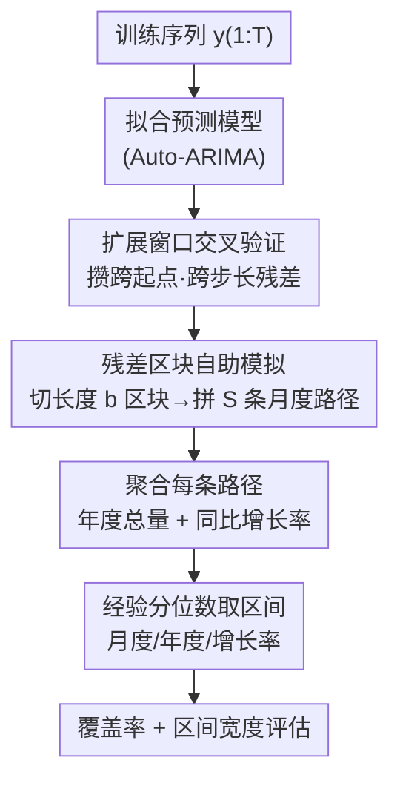

# Simulation-Augmented Multi-Step Split Conformal Prediction for Aggregated Forecasts

**会议**: ICML2026  
**arXiv**: [2606.16356](https://arxiv.org/abs/2606.16356)  
**代码**: 待确认  
**领域**: 时间序列 / 保形预测 / 不确定性量化  
**关键词**: 保形预测, 聚合预测, 区块自助法, 多步预测区间, 同比增长率

## 一句话总结
针对"年度总量""同比增长率"这类聚合预测目标，本文提出 SA-MSCP——用扩展窗口交叉验证收集残差、再用区块自助法（block bootstrap）模拟大量未来路径，最后从聚合轨迹的经验分位数构造预测区间，在 M4 和一份私有数据上把聚合目标的经验覆盖率显著拉高（但区间也明显变宽）。

## 研究背景与动机
**领域现状**：时间序列预测里给点预测配上"预测区间"是零售、金融场景的刚需。保形预测（Conformal Prediction, CP）在可交换性假设下提供与分布无关的覆盖保证，已有大量工作把它扩展到时序依赖、在线自适应、加权分位数、分布漂移等设定。

**现有痛点**：很多业务真正关心的不是"逐月预测"，而是**聚合量**——一整年的销售总额、或者今年比去年的**同比增长率**。这类目标有两个麻烦：一是聚合（求和、求比值）会把各时刻的误差耦合在一起，**直接把逐点区间相加并不能得到合法的聚合区间**；二是增长率是个非线性变换（两个年总量相除），CP 的覆盖保证不会自动传递到多步、强依赖的设定里。

**核心矛盾**：如果换个思路，直接在"年度聚合"层面跑标准 split conformal——把月度先求和成年度、再在年度层面校准——又会撞上数据稀缺：每条序列聚合到年只剩寥寥几个校准点，统计上极不稳定、效率极低。于是"逐点 CP 不能直接合成聚合区间"和"年度层面 CP 没有足够校准样本"形成两难。

**本文目标**：在**单变量序列内部做时间维聚合**的前提下，给月度、年度总量、同比增长率同时构造经验上可靠的预测区间。

**切入角度**：既然解析地传播不确定性很难，那就**用模拟代替解析**——在月度层面把残差的依赖结构刻画好，蒙特卡洛地生成大量未来月度路径，让聚合与非线性变换"在样本上自然发生"，最后只需对模拟出来的聚合量取经验分位数。

**核心 idea**：把多步 split conformal 与"残差区块自助模拟"结合（simulation-augmented），在月度残差上用区块自助保留时序依赖、生成 S 条未来路径，再聚合到年度/增长率后取经验分位数得区间——作者坦诚这套做法**没有有限样本保证**，只追求经验覆盖的提升。

## 方法详解

### 整体框架
SA-MSCP（Simulation-Augmented Multi-Step Split Conformal Prediction）整体是一条"拟合 → 交叉验证攒残差 → 区块自助模拟路径 → 聚合 → 分位数取区间"的流水线。输入是一条训练序列 $y_{1:T}$，输出是月度预测 $y_{T+1:T+H}$、年度总量、同比增长率三类目标在多个置信水平下的预测区间。

它的关键转折在于：**不在年度层面校准，而在月度层面把"残差分布 + 时序依赖"刻画好，再让聚合在每条模拟路径上自然发生**。具体地，先对训练序列拟合一个预测模型（实现里用 Auto-ARIMA），用扩展窗口交叉验证收集跨预测起点、跨预测步长的残差矩阵；对残差做按步去中心后切成长度 $b$ 的连续区块；自助地拼接出 $S$ 条未来月度残差序列、叠加到点预测上得到 $S$ 条月度路径；每条路径求和成年度总量 $\widehat{Y}_s=\sum_{m=1}^{12}\widehat{y}_{s,m}$、再算同比增长率 $\widehat{G}_s=(\widehat{Y}_{s,\text{year}}-\widehat{Y}_{s,\text{year}-1})/\widehat{Y}_{s,\text{year}-1}$；最后对每类目标、每个分位数水平，跨 $S$ 个样本取经验上下分位数。

### 关键设计

**1. 扩展窗口交叉验证攒多步残差：让校准样本覆盖"跨起点、跨步长"的误差**

标准 split conformal 假设残差可交换，但时序里依赖结构破坏了这一点，单一校准集也不足以刻画多步预测误差。SA-MSCP 用**扩展窗口交叉验证**横扫多个预测起点 $k$ 与多个步长 $h$，收集残差 $\hat{\varepsilon}_{k,h}=y_{k+h}-\hat{y}_{k+h}$。实现里初始校准窗口取 10 个观测，每步窗口增长 1 个观测、用接下来的 $h$ 个点做验证。这样得到的是一个"按步长分列"的残差矩阵，而不是一堆同质的标量残差——它保留了"误差随预测步长放大"的结构，为后面按步模拟提供了素材。

**2. 残差区块自助模拟未来路径：用 block bootstrap 保住局部时序依赖**

如果对每个步长独立重采样残差，会把月与月之间的相关性彻底打散，模拟出来的路径不真实，聚合区间也就不可信。SA-MSCP 先对每个步长的残差列**去中心**，再抽取所有合法的、长度为 $b$ 的**连续残差区块**；模拟时有放回地抽这些区块、沿预测步长拼接直到长度 $H$（截断到 $H$），叠加到点预测上得到一条未来路径 $\widehat{y}_{s,T+1:T+H}$。连续区块整段搬运，因此**局部依赖被原样保留**。区块长度是个关键权衡：M4 取 $b=12$ 匹配其 36 个月预测期、保住年内依赖；私有数据预测期只有 12 个月，$b=12$ 会让可拼接的自助组合太少，于是改用 $b=3$ 保住季度内依赖、同时留出足够的重采样多样性。

**3. 先聚合后取分位数的模拟校准：让非线性变换在样本上自然发生**

逐点区间不能相加得聚合区间、增长率又是非线性变换，解析地传播不确定性几乎不可行。SA-MSCP 的巧妙处在于把顺序倒过来：**先在每条模拟路径上完成聚合与变换，再取经验分位数**。每条路径 $s$ 先求和成年度总量、再算同比增长率（上一年总量从训练末段的真实年销初始化），于是 $S$ 条路径就给出了年度总量与增长率的经验分布；对每个目标、每个分位数水平 $q$ 跨 $s=1,\dots,S$ 取经验分位数即得上下界。这样求和的依赖耦合、相除的非线性都"在样本里自动算掉了"，无需任何解析近似。实现里取 $S=10{,}000$ 条路径，并用 Wilcoxon 符号秩检验评估相对 baseline 的覆盖差异是否显著。

### 损失函数 / 训练策略
本文不是学习类方法，没有可训练损失。整体由 Algorithm 1 描述：预处理 → 拟合模型 → 扩展窗口 CV 攒残差 → 去中心 + 切区块 → 循环 $S$ 次（自助拼路径、聚合年总量、算增长率）→ 对每类目标每个分位数取经验分位数 → 返回区间与覆盖/宽度统计。预测器用 `fable` 包的 Auto-ARIMA，未来路径用改造过的 `generate()` 注入区块自助残差。

## 实验关键数据

### 主实验
在 M4 月度销售数据上评估，主目标是**年度总量（Aggregated Sales）**与**同比增长率（Y-o-Y Sales Growth）**，并报告原始月度预测（Raw Sales）作参考；对比对象是一个"模拟路径 baseline"（条件模拟、但不做交叉验证残差校准）。下表列出经验覆盖率（表头 10%/5%/1% 对应名义覆盖 90%/95%/99% 的目标）。

| 目标 (M4) | 水平 | SA-MSCP 覆盖 | Baseline 覆盖 | 覆盖提升 |
|-----------|------|-------------|--------------|---------|
| Raw Sales | 90% | 88.8% | 75.2% | +13.6% |
| Aggregated Sales | 90% | 83.1% | 65.6% | +17.5% |
| Aggregated Sales | 95% | 85.8% | 70.9% | +15.0% |
| Aggregated Sales | 99% | 88.9% | 78.4% | +10.4% |
| Y-o-Y Sales Growth | 90% | 89.9% | 75.2% | +14.7% |
| Y-o-Y Sales Growth | 95% | 92.0% | 80.5% | +11.5% |

在私有的 2,000 条序列数据上结论一致且覆盖更高：聚合销售在 90% 水平上 SA-MSCP 达 89.3%、baseline 仅 75.3%。所有提升均经 Wilcoxon 符号秩检验确认显著。

### 区间宽度 / 覆盖代价
覆盖率提升不是免费的：SA-MSCP 的区间明显比 baseline 更宽，作者用"Coverage Cost"刻画为换取每单位覆盖提升所付出的宽度增加。

| 目标 (M4) | 水平 | SA-MSCP 宽度 | Baseline 宽度 | 覆盖代价 |
|-----------|------|-------------|--------------|---------|
| Aggregated Sales | 90% | $5.5\times10^{4}$ | $1.9\times10^{4}$ | 10.8 |
| Aggregated Sales | 99% | $7.5\times10^{4}$ | $2.9\times10^{4}$ | 14.7 |
| Y-o-Y Sales Growth | 90% | $1.6$ | $4.5\times10^{-1}$ | 17.2 |
| Y-o-Y Sales Growth | 99% | $6.6$ | $7.3\times10^{-1}$ | 113.1 |

### 关键发现
- **聚合目标受益最大**：年度总量在 90% 水平上覆盖提升 +17.5%，高于原始月度的 +13.6%，说明区块自助模拟正好补的是"聚合诱导依赖"这块短板。
- **区间变宽是代价**：增长率在 99% 水平的覆盖代价高达 113.1，说明为了把高置信、非线性的增长率区间覆盖住，宽度膨胀极快——实用时需要在"覆盖"和"区间可用性"之间权衡。
- **仍然欠覆盖名义水平**：即便有提升，M4 聚合销售 90% 名义水平下实测仅 83.1%，并未真正达到名义覆盖；本文只声称"相对 baseline 的经验覆盖改善"，没有有限样本保证。
- **区块长度需按预测期调**：M4 的 $b=12$ 与私有数据的 $b=3$ 体现了"区块要够长以保依赖、又不能长到自助组合太少"的取舍。

## 亮点与洞察
- **"先聚合后分位"这个顺序倒置很巧**：把求和的依赖耦合、求比值的非线性，全部丢给蒙特卡洛样本去消化，避免了解析传播不确定性的难题，对任意聚合/变换都通用。
- **区块自助直接接到残差矩阵上**：复用了多步保形里"按步长攒残差"的结构，再叠一层 block bootstrap 保依赖，工程上几乎是在 ARIMA 模拟管线里换个残差注入方式，落地成本低。
- **诚实地不要保证**：作者明确这是"无有限样本保证、只追经验覆盖"的实用方法，并用 Wilcoxon 检验给出显著性，这种克制反而让结论更可信。
- **可迁移**：把"月度→年度"换成"日→周/季→年"、把求和换成其他聚合算子（最大值、加权和），同一套模拟-分位框架可直接复用。

## 局限与展望
- **无理论覆盖保证**：方法绕开了可交换性，只有经验覆盖，且实测常欠名义水平；对需要严格保证的高风险场景不够。
- **区间偏宽**：高置信、非线性目标（增长率 99%）的区间宽度膨胀剧烈，覆盖代价极高，实用价值打折。
- **强依赖基模型与残差质量**：整套依赖 Auto-ARIMA 的点预测与残差，若基模型设定误差大、残差非平稳，区块自助也救不回来。
- **评测面偏窄**：主要在 M4 月度销售 + 一份私有零售数据上验证，缺少金融、能源等更强非平稳/结构突变场景的压力测试；区块长度 $b$ 的选择目前靠人工按预测期定，缺自动选择准则。

## 相关工作与启发
- **vs 直接在聚合层面跑 split conformal**：后者把月度先求和到年度再校准，但每条序列年度校准点太少、统计不稳定；SA-MSCP 坚持在月度层面模拟、让聚合发生在样本上，规避了稀缺校准问题。
- **vs 朴素"模拟路径 baseline"**：baseline 做条件模拟但不用交叉验证残差校准、也不用区块自助保依赖；SA-MSCP 多了 CV 残差 + block bootstrap 两步，覆盖率全面更高（代价是更宽区间）。
- **vs copula 联合校准 / 区间算术求和 / 层级 reconciliation**：这些工作面向多变量联合覆盖、群组可交换下求和、或跨层级对账；本文聚焦的是**单变量序列内部的时间维聚合**，问题定位不同。

## 评分
- 新颖性: ⭐⭐⭐ 组合多步 CP 与区块自助模拟做聚合区间，思路清晰但模块都是已有积木的拼装。
- 实验充分度: ⭐⭐⭐ M4 + 私有 2000 序列 + Wilcoxon 检验扎实，但场景偏零售、无更强非平稳压力测试。
- 写作质量: ⭐⭐⭐⭐ 动机—方法—代价讲得诚实清楚，明确标注无理论保证。
- 价值: ⭐⭐⭐ 给"年度总量/同比增长"这类业务聚合目标提供了落地可用的区间，实用但区间偏宽、无保证限制了上限。

<!-- RELATED:START -->

## 相关论文

- [\[ICLR 2026\] ResCP: Reservoir Conformal Prediction for Time Series Forecasting](../../ICLR2026/time_series/rescp_reservoir_conformal_prediction_for_time_series_forecasting.md)
- [\[ICLR 2026\] Quadratic Direct Forecast for Training Multi-Step Time-Series Forecast Models](../../ICLR2026/time_series/quadratic_direct_forecast_for_training_multi-step_time-series_forecast_models.md)
- [\[ICML 2026\] DistMatch: Adaptive Binning via Distribution Matching for Robust Sequential Conformal](distmatch_adaptive_binning_via_distribution_matching_for_robust_sequential_confo.md)
- [\[ICML 2026\] Semantics-Enhanced Retrieval-Augmented Time Series Forecasting](semantics-enhanced_retrieval-augmented_time_series_forecasting.md)
- [\[ICCV 2025\] V2XPnP: Vehicle-to-Everything Spatio-Temporal Fusion for Multi-Agent Perception and Prediction](../../ICCV2025/time_series/v2xpnp_vehicle-to-everything_spatio-temporal_fusion_for_multi-agent_perception_a.md)

<!-- RELATED:END -->
