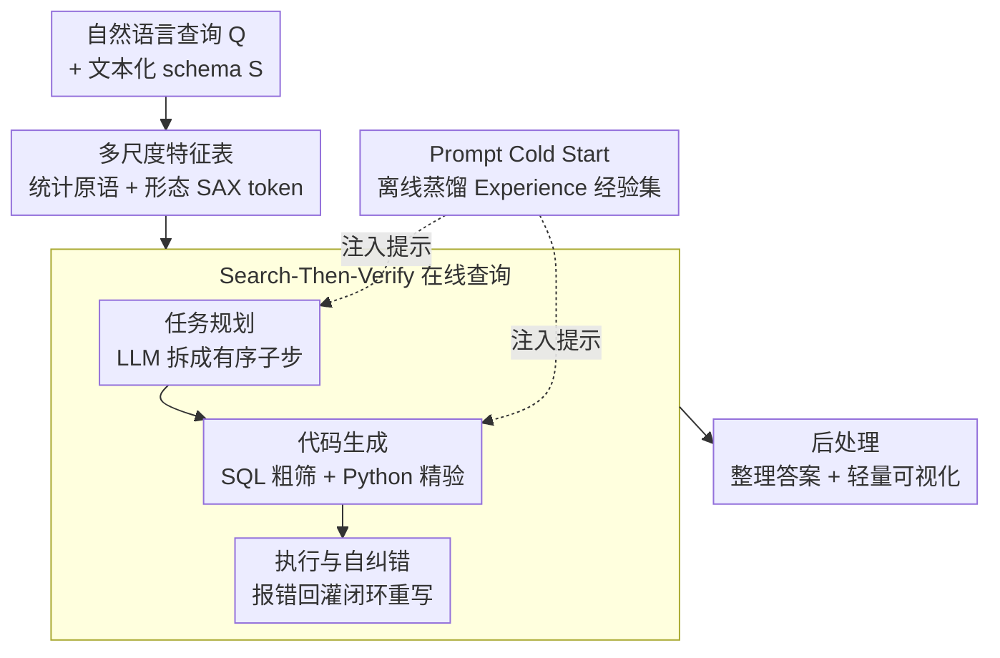

# Sonar-TS: Search-Then-Verify Natural Language Querying for Time Series Databases

**会议**: ICML 2026  
**arXiv**: [2602.17001](https://arxiv.org/abs/2602.17001)  
**代码**: https://github.com/Atlamtiz/Sonar-TS  
**领域**: 时间序列 / 自然语言查询 / 神经符号系统  
**关键词**: 时序数据库, 自然语言查询, 神经符号, Text-to-SQL, 形态检索

## 一句话总结
面向"在海量时序数据库（TSDB）上用自然语言查询形态化意图"这一新问题，提出 **Sonar-TS** 神经符号框架：像主动声纳一样先用 SQL 在多尺度特征索引上"发射声波（ping）"粗筛候选窗口、再用 LLM 生成的 Python 程序"锁定（lock-on）"原始信号做精确验证（Search-Then-Verify），配套首个面向库级长历史的基准 **NLQTSBench**，在传统 Text-to-SQL 与时序大模型都失效的复杂时序查询上取得大幅领先（平均 0.61 vs 最强基线 0.16）。

## 研究背景与动机

**领域现状**：IoT、金融、AIOps 让时序数据爆炸式增长，时序数据库（TSDB）成了存储标准。但非专家用户想从这些海量记录里捞出有意义的洞察很难——他们关心的往往不是"五月最大值"这种数值查找，而是"哪一天数据先快速上升、再缓慢回落"这类**形态特征**。

**现有痛点**：两条现有路线各缺一块。① **Text-to-SQL**（DIN-SQL、MAC-SQL、CHASE-SQL 等）把自然语言译成 SQL，schema linking 很成熟，但标准 SQL 建立在严格布尔逻辑和固定阈值上，**没有原生原语描述连续形态**——把"快速上升"写成 `WHERE slope > 60` 既脆弱又依赖上下文。② **时序问答（TSQA）**（Time-LLM、ChatTS 等）能直接对齐文本和原始信号、读懂形态，但**被 Transformer 上下文窗口锁死**——真实 TSDB 一年高频监控动辄数百万点，远超几千 token 的上下文。

**核心矛盾**：解 NLQ4TSDB 需要三种能力同时具备——形态原语（Morphological Primitives，处理连续形状）、海量可扩展性（Massive Scalability，吞下库级长历史）、自然语言落地（NL Grounding，理解模糊意图）。而 Text-to-SQL 缺 MP、TSQA 缺 MS、时序相似搜索（KV-Match、SAX）缺 NLG（它走"按例查询"而非"按语言查询"），**没有任何单一范式三者兼备**。

**本文目标**：把问题正式定义为 NLQ4TSDB——系统要把高层语义意图落地成可在海量、未分段时序记录上执行的操作；并解决三大具体挑战：C1 表示鸿沟（形状意图 vs 逐点存储）、C2 上下文规模上限（百万点 vs 有限窗口）、C3 语义落地冲突（模糊词 vs 精确阈值）。

**切入角度**：与其在原始历史上全量扫描（算不动）或只靠 SQL（缺形态表达力），不如学**主动声纳**——先用便宜的符号索引"ping"出少量候选窗口，再对这一小撮候选"lock-on"做昂贵但精确的原始信号验证。

**核心 idea**：用"粗粒度符号搜索 + 细粒度算法验证"的 Search-Then-Verify 流水线，把形态表达力交给 Python 算子、把可扩展性交给 SQL 索引、把语言落地交给 LLM 规划器，三种能力各归其位。

## 方法详解

### 整体框架

Sonar-TS 把 TSDB 查询拆成三段式工作流，核心是让符号层（SQL/索引）负责"大海捞针的范围收缩"、让神经层（LLM）负责"意图理解与代码合成"、让算法层（Python 算子）负责"逐点严格验证"：

- **离线数据处理**：把原始时序预处理成多尺度**特征表（Feature Tables）**，充当可查询的语义索引，让连续形状变得 SQL 可搜。
- **在线查询**：给定查询和库 schema，LLM 先做任务规划、再生成混合 SQL+Python 程序——SQL 在特征表上粗筛候选窗口，Python 拉原始切片做精确验证；并由离线 **Prompt Cold Start** 注入领域启发式。
- **后处理**：把执行产物（时间戳、区间、标量）整理成用户可读答案，并可选生成轻量可视化供人工核验。

整体流向如下：

### 关键设计

**1. 多尺度特征表：把连续形状压成 SQL 可查的符号索引**

针对 C1/C2，为避免查询时全量扫描，Sonar-TS 离线为每个数值通道按层级窗口（年/月/日多粒度）物化特征行，每行存一个时间窗口的元数据加两类描述符：① **统计原语**（slope、std_val 等轻量统计），当作便宜的剪枝信号，让系统用简单 SQL（如 `ORDER BY std_val DESC LIMIT 1`）就能优先候选窗口、而不必查询时聚合原始点；② **形态 token**，把连续形状离散成字符串——采用 SAX（Symbolic Aggregate approXimation）当作"符号搜索把手"，于是"单调上升"就能近似成标准 SQL 正则 `WHERE regexp_like(sax, '[ab]+.*[de]+')`。原始 TSDB 仍是唯一真值源、只在局部精确计算时才访问。作者强调 SAX 只是一个可替换实例而非硬依赖，框架对分词方法不可知。

**2. Search-Then-Verify 工作流：符号粗筛 + 算法精验，各补对方短板**

这是框架主干，串起规划、生成、执行三步。**Step 1 任务规划**：LLM 当 Task Planner，把复杂时序查询拆成有序子步、定出逻辑执行顺序和每步算子类型（复杂意图一次成形太难）。**Step 2 代码生成**走两条机制：*SQL-based Search* 用 SAX token 当符号把手写 SQL 在特征表上粗筛——如复合趋势"先快升再下落"写成模糊正则 `WHERE regexp_like(sax, '[ab]+.*[de]+.*[ab]+')` 拿到候选元数据；*Operator-based Verification* 因为 SAX 压缩必然丢信息，再合成 Python 程序拉候选对应的原始切片做精确数学检查——比如用 `calc_trend_slope`、`detect_changepoints`，通过判断候选斜率是否落在历史斜率分布的高百分位来验证"快速"上升。为此作者把一批经典时序算法封装成可执行算子库（见下表），让模糊语言概念被严格落到成熟的、上下文感知的数学上。**Step 3 执行与自纠错**：SQL/Python 顺序执行，遇到运行时失败（SQL 空结果、Python 语法错）就把 traceback/结果摘要回灌给 Code Generator 重写，闭环调试直到成功或触达重试上限。

| 验证算子 | 数学基础 |
|----------|----------|
| `detect_period` | 自相关函数（ACF）检测周期 |
| `find_best_match` | 动态时间规整（DTW）做子序列匹配 |
| `detect_changepoints` | PELT 算法做结构分段 |
| `calc_trend_slope` | Theil-Sen 估计 + 局部斜率分布 |
| `calc_correlation` | Pearson 相关找因果联系 |

**3. Prompt Cold Start：离线蒸馏的领域经验集，不微调也能注入专家知识**

针对 C3——NLQ4TSDB 是知识密集型的，需要领域启发式（正确算子用法、有效 SAX 匹配、避开不规则采样间隙等）。Sonar-TS 维护一个 **Experiences** 集合：从过往执行里蒸馏出的紧凑高层洞察，推理时直接作为一份精炼"专家手册"注入 Planner 和 Generator 的提示。关键在于这些经验**完全离线**在剖析数据集上构建、查询时绝不更新，既省微调成本又避免在线记忆更新的不可预测性。构建走"Reward-Summarize-Update"闭环：先给每次执行打分，Experience Summarizer 从执行轨迹（plan/code/reward）蒸馏 1–3 条技能，Experience Updater 通过增/并/删维护全局集合并强制设上限（如 20 条）以控制上下文开销。

### 损失函数 / 训练策略
Sonar-TS 是**训练无关**框架，默认骨干 DeepSeek-V3，不微调任何模型。其在线执行复杂度为 $O(R\cdot T_{\text{LLM}}+M+K\cdot f(w))$，其中 $R$ 是重试上限、$T_{\text{LLM}}$ 是 LLM 调用成本、$M$ 是扫描的特征表行数、$K$ 是候选窗口数、$f(w)$ 是单窗口算子复杂度。**关键性质是与序列长度 $N$ 解耦**：LLM 提示只依赖 schema 和有界的经验集，Python 验证只依赖 $K$，$M$ 只随特征表（而非原始数据）增长，从而避开端到端时序模型在长历史上的 $O(N)$/$O(N^2)$ 扫描。

## 实验关键数据

### 主实验

NLQTSBench 共 1153 条查询、四级复杂度（L1 基础操作 / L2 形态识别 / L3 语义推理 / L4 洞察综合），平均搜索空间约 12,000 点。采用双轨：完整库级长历史给查询型方法，NLQTSBench-Lite（500 条、512 点窗口）兼容上下文受限的时序大模型。评测按输出格式选指标（区间用 IoU、标量/时间戳用 accuracy、日期集用 F1、自由报告用复合分）。

| 设置 | 方法 | 形态识别 SI | 复合趋势 CT | 因果异常 CsA | 平均 |
|------|------|------------|------------|-------------|------|
| Lite 短上下文 | ChatTS-14B | 0.1768 | 0.2431 | 0.1229 | 0.1818 |
| Lite 短上下文 | ITFormer-7B | 0.0736 | 0.1500 | 0.1953 | 0.1529 |
| Lite 短上下文 | **Sonar-TS** | **0.2491** | **0.2680** | **0.3615** | **0.3016** |
| 长历史 | MAC-SQL | 0.0419 | 0.0020 | 0.0152 | 0.1611 |
| 长历史 | Xiyan-SQL-32B | 0.0588 | 0.0021 | 0.0020 | 0.0582 |
| 长历史 | **Sonar-TS** | **0.3336** | **0.2988** | **0.3841** | **0.6144** |

读法：在长历史完整基准上 Sonar-TS 平均 0.6144，把最强基线 MAC-SQL（0.1611）甩开近 4 倍；形态依赖任务上 SQL 基线几乎归零（CT 仅 0.002）。有趣的是训练无关的 MAC-SQL 反超微调过的 Xiyan/Omni-SQL，作者归因于关系查询（离散记录过滤）与时序分析（连续模式推理）的范式鸿沟。

### 消融实验

去掉四个组件，按影响从小到大排：

| 配置 | 平均 | 受冲击最重的任务 | 结论 |
|------|------|------------------|------|
| 完整 Sonar-TS | 0.6144 | — | — |
| w/o 自纠错 | 0.5930 | SW 0.78→0.73 | 鲁棒性精修，非核心能力 |
| w/o 特征表 | 0.5430 | SI 0.33→0.16，CT 0.30→0.04 | 退化为通用 SQL+Python agent，形态任务崩 |
| w/o 经验集 | 0.4686 | CxA 0.48→0.25，IS 0.74→0.34 | 推理重任务普遍退化 |
| w/o 验证 | 0.2721 | PD 0.86→0.02，SM 0.94→0.04 | 系统近乎全面崩溃 |

### 关键发现
- **验证（Python 精验）是命脉**：去掉它平均从 0.61 暴跌到 0.27，周期检测、子序列匹配几乎清零——这些严格算法过程根本无法用纯 SQL 表达，神经符号里"符号验证"那一环不可省。
- **特征表是"形态可搜"的开关**：没有这个符号索引，形态任务（SI/CT）直接崩，证明纯 agent 范式（裸 SQL+Python）解不了 NLQ4TSDB，必须有符号索引兜底。
- **经验集让 LLM 像专家一样推理**：去掉后语义推理（CxA）、洞察综合（IS）腰斩，说明离线蒸馏的领域启发式真正弥合了"通用 LLM 逻辑"与"领域分析工作流"之间的鸿沟。
- **时序大模型在该任务上整体偏弱**：即便在它们擅长的 SI 上，常因抓不住"最长"这类语义约束而败（能认出平台期、却忽略"longest"），暴露了缺乏全局推理的短板。

## 亮点与洞察
- **"主动声纳"这个类比把神经符号分工讲得极清楚**：ping（SQL 粗筛，便宜、可扩展）+ lock-on（Python 精验，精确、有数学基础），刚好把 Text-to-SQL 缺的形态表达力和 TSQA 缺的可扩展性各补一块。
- **用 SAX 当"符号搜索把手"是巧招**：把连续形状压成离散字符串后，"V 形""单调上升"就能用标准 SQL 正则去近似匹配，让现成数据库引擎直接参与海量时序的形态检索，且 SAX 可替换、不锁死。
- **复杂度与序列长度 $N$ 解耦**是真正的可扩展性来源：把重计算下放给数据库引擎和 Python 算子，LLM 只看 schema 和有界经验集，从而绕开端到端模型的 $O(N)$/$O(N^2)$ 死穴——这套"索引 + 验证"思路可迁移到任何长历史结构化数据的语言查询。
- **离线经验集 + 严格上限**：既注入领域知识又不引入在线记忆的不可预测性，是一种比 RAG 在线检索更可控的"冷启动专家手册"方案。

## 局限与展望
- 形态依赖任务（SI、CT）即便是 Sonar-TS 自己也只有 0.30 左右的绝对分，且短上下文（Lite）下因 SAX 在短窗口上的信息损失反而比长历史更差，说明 SAX 压缩对形态保真仍是瓶颈。
- 真值标注靠"受控注入"（把数学合成模式叠到 CausalRivers/ETTm1/SMD 真实背景上）使标签可审计，但合成模式与真实世界自然出现的形态分布可能存在差距，泛化到完全真实标注场景待验证。
- 端到端依赖强骨干 LLM（DeepSeek-V3）做规划与代码生成，弱骨干下的鲁棒性、以及多轮自纠错的额外 LLM 调用成本未充分剖析。
- 作者也提示工业敏感数据的隐私/访问控制风险，部署时需配套验证协议。

## 相关工作与启发
- **vs Text-to-SQL（MAC-SQL / CHASE-SQL / CHESS）**：它们擅长 schema linking 与关系查询，但 SQL 缺形态原语，无法表达"V 形/波动"；Sonar-TS 用 SAX token + Python 验证补上形态表达力，长历史上平均反超近 4 倍。
- **vs TSQA（Time-LLM / ChatTS / Time-R1）**：它们能直接读形态但被上下文窗口锁死、扫不动百万点历史；Sonar-TS 用 SQL 索引做长程证据定位，把"被动读上下文"换成"主动定位证据"。
- **vs 时序相似搜索（KV-Match / MS-Index / SAX）**：它们走"按例查询"、要精确数值序列当输入；本任务是"按语言查询"，从具体数值范例转向抽象文本描述，根本改变了检索问题，使现有相似搜索索引不再直接适用。

## 评分
- 新颖性: ⭐⭐⭐⭐⭐ 正式定义 NLQ4TSDB 新问题，并给出首个框架 + 首个库级长历史基准
- 实验充分度: ⭐⭐⭐⭐⭐ 1153 条查询四级分类、双轨对比、四组件消融，失败模式刻画清晰
- 写作质量: ⭐⭐⭐⭐ "声纳"类比贯穿、三挑战对应三设计，结构干净；部分形态任务绝对分偏低
- 价值: ⭐⭐⭐⭐⭐ 为"自然语言查询时序数据库"这一实用方向立了问题、框架与评测标准

<!-- RELATED:START -->

## 相关论文

- [\[ICLR 2026\] TimeOmni-1: Incentivizing Complex Reasoning with Time Series in Large Language Models](../../ICLR2026/time_series/timeomni-1_incentivizing_complex_reasoning_with_time_series_in_large_language_mo.md)
- [\[ICLR 2026\] Language in the Flow of Time: Time-Series-Paired Texts Weaved into a Unified Temporal Narrative](../../ICLR2026/time_series/language_in_the_flow_of_time_time-series-paired_texts_weaved_into_a_unified_temp.md)
- [\[ICML 2026\] Building Social World Models with Large Language Models](building_social_world_models_with_large_language_models.md)
- [\[ACL 2026\] Temporal Leakage in Search-Engine Date-Filtered Web Retrieval: A Retrospective Forecasting Case Study](../../ACL2026/time_series/temporal_leakage_in_search-engine_date-filtered_web_retrieval_a_retrospective_fo.md)
- [\[ICCV 2025\] VLRMBench: A Comprehensive and Challenging Benchmark for Vision-Language Reward Models](../../ICCV2025/time_series/vlrmbench_a_comprehensive_and_challenging_benchmark_for_vision-language_reward_m.md)

<!-- RELATED:END -->
