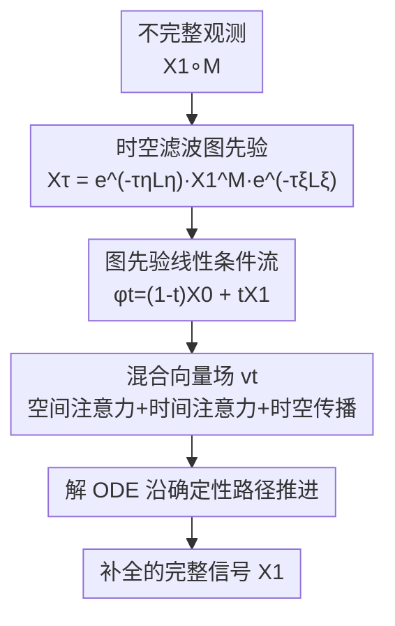

# Spatiotemporal Imputation with Graph-Informed Flow Matching

**会议**: ICML2026  
**arXiv**: [2606.06682](https://arxiv.org/abs/2606.06682)  
**代码**: [github.com/zepengzhang/GiFlow](https://github.com/zepengzhang/GiFlow)  
**领域**: 时间序列 / 时空数据 / 缺失值补全 / 生成模型  
**关键词**: 时空插补, 流匹配, 图先验, 时空滤波, 图神经网络

## 一句话总结
针对时空数据缺失补全中"RNN/GNN 迭代传播误差累积、扩散模型靠问题无关高斯先验且采样慢"的问题，本文提出 GiFlow——用可观测信号的时空滤波构造一个"图先验"替代高斯先验，使流匹配的起点更贴近目标分布、传输路径更短，再配一个融合空间注意力/时间注意力/时空传播的混合向量场，在合成与真实数据集（空气质量、交通）上一致超过 SOTA。

## 研究背景与动机
**领域现状**：时空数据（空气质量、交通流）因传感器故障、传输错误经常残缺，缺失补全是下游分析的前置刚需。主流做法分两类：RNN 沿时间传播隐状态、GNN 沿图拓扑传播空间信息。

**现有痛点**：RNN/GNN 这类方法本质上是"迭代传播"——一步步把估计值往前/往邻居推，缺失越多、跨度越大，误差越容易在时间和空间上累积，还会有信息瓶颈。生成式方法（尤其扩散模型）改成"一次性条件生成全分布"，避开了逐步传播的误差累积，但又带来两个新毛病：① 用的是**问题无关的各向同性高斯先验**，完全忽略时空结构；② 采样要很多步去噪、且常要多次采样取平均，效率和鲁棒性都受限。

**核心矛盾**：迭代传播会累积误差，而能避开它的扩散生成又被"先验太朴素 + 采样太慢"拖累。问题根子在于先验离目标分布太远，导致生成轨迹很长。

**本文目标**：找一种既不迭代传播、又有短生成路径、还能利用时空结构的生成范式。

**切入角度**：流匹配（Flow Matching, FM）是扩散的推广，走确定性传输路径、不靠随机噪声注入、不强制高斯先验，而且**起点分布越接近目标、路径越短、生成越好**。既然观测信号本身就携带强结构信息，何不用它直接造一个贴近目标的起点？

**核心 idea**：用可观测信号经"自适应时空滤波"得到的**图先验**当 FM 的源分布，替代高斯先验，从而缩短传输代价（有理论保证），再用混合向量场建模时空依赖。

## 方法详解

### 整体框架
GiFlow 把缺失补全建模成一个条件流匹配问题：源分布不再是高斯，而是由不完整观测 $\mathbf{X}_1^M=\mathbf{X}_1\circ\mathbf{M}$ 经时空滤波得到的"图先验"$\mathbf{X}_\tau$；目标是完整信号 $\mathbf{X}_1$。两者之间用线性条件路径连接，训练一个混合向量场 $v_t$ 去拟合从源到目标的速度场，推理时解 ODE 把图先验推到补全结果。整条管线没有逐步传播、起点已经很接近目标，所以路径短、且确定性输入下无需多次采样平均。

### 关键设计

**1. 时空滤波图先验：用观测信号造一个贴近目标的起点，替代高斯先验**

这是全文的核心。把向量化的观测信号 $\mathbf{x}_1^M=\text{vec}(\mathbf{X}_1^M)$ 看成"空间图 × 时间图"笛卡尔积上的时空图信号，定义时空滤波算子为空间 Laplacian $\mathbf{L}_\eta$ 与时间 Laplacian $\mathbf{L}_\xi$ 的 Kronecker 和：$\mathbf{L}_{\eta\xi}=\tau_\xi\mathbf{L}_\xi\oplus\tau_\eta\mathbf{L}_\eta$，于是滤波 $\mathbf{x}_\tau=e^{-\mathbf{L}_{\eta\xi}}\mathbf{x}_1^M$ 写成矩阵形式就是

$$\mathbf{X}_\tau=e^{-\tau_\eta\mathbf{L}_\eta}\,\mathbf{X}_1^M\,e^{-\tau_\xi\mathbf{L}_\xi}.$$

直观上，这一步把稀疏的观测沿空间邻居和时间邻居"扩散填充"，得到一个平滑、结构化、已经像真实信号的初始场。作者还证明（Theorem 3.2）：用这个图先验做 FM 的传输代价不大于用标准高斯先验——因为高斯先验忽略时空结构、模型得绕远路，而图先验已经把空间平滑性和时间一致性注入起点，路径自然更短。另外，由于输入是确定性的，GiFlow 不像扩散那样需要多次采样取平均；若要不确定性估计，可再往图先验里注入高斯噪声做随机采样。

**2. 自适应时空感受野：优化滤波因子 τ 平衡对齐与平滑，Taylor 截断控制跳数**

滤波因子 $\bm\tau=(\tau_\eta,\tau_\xi)$ 不是手调，而是按"最小化传输代价"求解一个优化问题（Eq. 5）：第一项 $\|\mathbf{X}_1-e^{-\tau_\eta\mathbf{L}_\eta}\mathbf{X}_1^M e^{-\tau_\xi\mathbf{L}_\xi}\|^2$ 强制滤波结果对齐真实信号，第二项是 Laplacian 平滑正则，两者权衡产出一个既贴近目标又光滑的先验。把矩阵指数按 Taylor 展开并截断到 $K_\eta$ 个空间跳、$K_\xi$ 个时间跳即可高效计算；Proposition 3.1 给出截断误差上界，并说明 $\bm\tau$ 直接控制感受野——$\tau$ 越小感受野越局部（更小的截断阶就够），$\tau$ 越大越能捕获长程依赖。训练时用真值信号优化 $\bm\tau$，选定后推理阶段固定。

**3. 图先验条件流 + 混合向量场：线性最优路径上联合建模时空依赖**

有了源（图先验）和目标，需要指定条件路径和向量场。作者用线性条件路径（对应最优传输位移图、最小化动能上界）：$\phi_t(\mathbf{X}\mid\mathbf{Z})=(1-t)\,e^{-\tau_\eta\mathbf{L}_\eta}\mathbf{X}_1^M e^{-\tau_\xi\mathbf{L}_\xi}+t\,\mathbf{X}_1$，诱导出向量场 $u_t=\mathbf{X}_1-e^{-\tau_\eta\mathbf{L}_\eta}\mathbf{X}_1^M e^{-\tau_\xi\mathbf{L}_\xi}$，训练目标是带缺失掩码 $\mathbf{M}\circ$ 的 MSE 回归 $\mathcal{L}_{\mathsf{GiFM}}$。拟合 $u_t$ 的可学习向量场 $v_t$ 是一个**三件套混合模型**：① 空间注意力——节点静态嵌入先过一层 GNN 得到传播后嵌入 $\mathbf{X}_n$ 当 query/key，$\mathbf{X}_t^\eta=\text{MLP}(\mathbf{X}_t)$ 当 value，做节点间自注意力聚合空间消息；② 时间注意力——给每个节点的时间序列加位置编码与（可选）时间戳编码后做跨时刻自注意力，聚合时间消息；③ 时空传播——把空间/时间消息、原始特征、流步 $t$ 的嵌入拼接投影成 $\mathbf{H}$，再做 $L_{MP}$ 层消息传递（空间图上逐时刻、时间图上逐节点），最后 MLP 投回信号维度输出速度场。注意力负责捕获全局长程关联、消息传递负责局部精修，二者互补。

### 损失函数 / 训练策略
训练用带掩码的流匹配回归损失 $\mathcal{L}_{\mathsf{GiFM}}(\bm\theta)=\mathbb{E}\big[\|\mathbf{M}\circ(v_t(\mathbf{X}_t;\bm\theta,\mathbf{M},\mathbf{L})-\mathbf{X}_1+e^{-\tau_\eta\mathbf{L}_\eta}\mathbf{X}_1^M e^{-\tau_\xi\mathbf{L}_\xi})\|^2\big]$，只在观测位置监督向量场。滤波因子 $\bm\tau$ 用训练集真值经 SGD 预先优化、推理固定；评测用 MAE/RMSE/MAPE，5 个随机种子取均值。

## 实验关键数据

### 主实验
真实数据集（空气质量 Air-36、AQI；交通 PeMS08），point missing $\rho=20\%$。GiFlow 在三项指标上整体最优（下表取 Air-36 与 AQI，下划线为最强基线）：

| 数据集 | 指标 | 最强基线 | GiFlow |
|--------|------|----------|--------|
| Air-36 | MAE | GRIN 9.94 | **9.54** |
| Air-36 | RMSE | GRIN 19.09 | **18.10** |
| Air-36 | MAPE | OPCR 21.61 | **21.27** |
| AQI | MAE | GRIN 7.97 | **7.83** |
| AQI | RMSE | GRIN 18.46 | **17.80** |
| AQI | MAPE | PriSTI 16.37 | **16.24** |

GiFlow 全面压过 RNN 类（BRITS/SAITS）、时空 GNN 类（SPIN/GRIN/OPCR）和扩散类（PriSTI/CoSTI）基线。

### 合成数据
在两种噪声水平下与代表性基线对比：

| 模型 | σ=0.1 MAE | σ=0.1 RMSE | σ=0.3 MAE | σ=0.3 RMSE |
|------|-----------|------------|-----------|------------|
| GRIN | 0.24 | 0.31 | 0.35 | 0.46 |
| PriSTI（扩散） | 0.32 | 0.36 | 0.37 | 0.47 |
| **GiFlow** | **0.23** | **0.30** | **0.34** | **0.44** |

### 关键发现
- 先验是胜负手：把高斯先验换成时空滤波图先验（论文中的 FM-Gauss 对照），起点更贴近目标、传输路径更短，是性能与效率提升的主因（Theorem 3.2 给出传输代价不增的理论保证）。
- 确定性采样的效率优势：GiFlow 用确定性输入，不需扩散那样多次采样平均，单次即可补全，比 PriSTI 这类扩散方法更省、更稳。
- 自适应感受野有效：$\bm\tau$ 由优化得到而非手调，能按数据自适应空间/时间的局部 vs 长程权衡。
- 混合向量场互补：注意力抓全局长程关联、消息传递做局部精修，联合建模时空依赖优于单纯 RNN/GNN 传播。

## 亮点与洞察
- "用观测造先验"这一步很巧：把缺失补全里天然存在的强结构信号（部分观测）直接转成 FM 的起点，而不是丢给模型从高斯里凭空生成，既缩短路径又注入领域知识。
- 时空滤波用 Kronecker 和 Laplacian 的矩阵指数 $e^{-\tau_\eta\mathbf{L}_\eta}\mathbf{X}e^{-\tau_\xi\mathbf{L}_\xi}$ 优雅地解耦空间/时间扩散，且 $\tau$ 可优化、可 Taylor 截断，既有理论又能高效算。
- 把"先验质量决定生成路径长度"这一 FM 直觉落到一个有理论保证（传输代价不增）的具体构造上，思路可迁移到其它带结构观测的条件生成任务（如图像修复、传感网重建）。

## 局限与展望
- 图先验依赖给定的空间/时间图结构（Laplacian），图构造不准时先验质量会打折。
- 滤波因子 $\bm\tau$ 在训练集上用真值优化、推理固定，对分布漂移或缺失模式变化的鲁棒性有待考察。
- 默认确定性采样牺牲了不确定性量化，需额外注入噪声才能做随机采样，二者如何权衡论文着墨不多。
- 主要在空气质量/交通这类图结构清晰的场景验证，对图结构弱或不规则的时空数据迁移性待验证。

## 相关工作与启发
- **vs RNN/GNN 迭代传播（BRITS/GRIN）**：它们逐步传播估计值、误差累积；GiFlow 一次性条件生成全分布，避开累积。
- **vs 扩散类（PriSTI/CoSTI）**：扩散用高斯先验 + 多步随机去噪 + 多次采样平均；GiFlow 用图先验 + 确定性流、单次采样，路径更短更省。
- **vs 普通流匹配（FM-Gauss）**：同为确定性流，但 GiFlow 把源分布从高斯换成贴近目标的图先验，理论上传输代价不增、实测更优——核心差异就在"先验从哪来"。

## 评分
- 新颖性: ⭐⭐⭐⭐⭐ 首个把图先验引入流匹配做时空插补，"用观测滤波造先验"角度新颖且有理论支撑。
- 实验充分度: ⭐⭐⭐⭐ 合成 + 三个真实数据集、多缺失模式/率、多类基线（非参/RNN/GNN/扩散），5 种子。
- 写作质量: ⭐⭐⭐⭐ 动机链清晰，从高斯先验缺陷一路推到图先验，理论命题与方法衔接顺。
- 价值: ⭐⭐⭐⭐ 缺失补全是刚需，确定性单次采样 + 短路径对大规模时空数据落地友好。

<!-- RELATED:START -->

## 相关论文

- [\[ICML 2026\] DistMatch: Adaptive Binning via Distribution Matching for Robust Sequential Conformal](distmatch_adaptive_binning_via_distribution_matching_for_robust_sequential_confo.md)
- [\[CVPR 2026\] Probabilistic Precipitation Nowcasting with Rectified Flow Transformers](../../CVPR2026/time_series/probabilistic_precipitation_nowcasting_with_rectified_flow_transformers.md)
- [\[ICML 2026\] HELIX: Hybrid Encoding with Learnable Identity and Cross-dimensional Synthesis for Time Series Imputation](helix_hybrid_encoding_with_learnable_identity_and_cross-dimensional_synthesis_fo.md)
- [\[ICLR 2026\] SRT: Super-Resolution for Time Series via Disentangled Rectified Flow](../../ICLR2026/time_series/srt_super-resolution_for_time_series_via_disentangled_rectified_flow.md)
- [\[ACL 2026\] STK-Adapter: Incorporating Evolving Graph and Event Chain for Temporal Knowledge Graph Extrapolation](../../ACL2026/time_series/stk-adapter_incorporating_evolving_graph_and_event_chain_for_temporal_knowledge_.md)

<!-- RELATED:END -->
