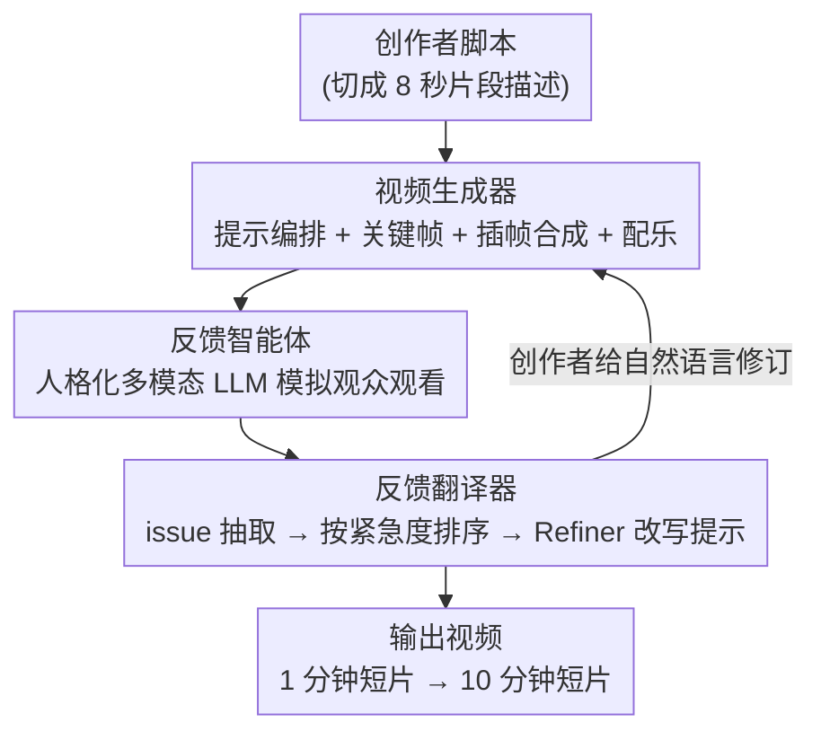

# Bridging Creative Intent and Visual Quality: Creator-Driven Recurrent Video Generation with Agentic Feedback Loops

**会议**: ICML 2026（Workshop on Human-AI Co-Creativity）  
**arXiv**: [2606.18591](https://arxiv.org/abs/2606.18591)  
**代码**: 待确认  
**领域**: 视频生成  
**关键词**: 人机协作, 视频生成, 多智能体反馈, 人格化模拟, 迭代精修  

## 一句话总结
CHIEF 把创作者放在视频生成迭代循环的中心，用"人格化的多模态 LLM 观众智能体"自动给生成视频写主观影评、再由翻译器把杂乱反馈结构化成可执行的提示词改动，让没有任何拍片经验的中学生也能从 1 分钟短片做到一部 10 分钟有完整剧情的短片。

## 研究背景与动机
**领域现状**：生成式 AI 让人人都能用自然语言生成文本、图像、视频，AI 生成视频已占新 YouTube 用户所见视频的 21%。

**现有痛点**：这些视频画质往往很高，却**缺乏叙事连贯性和创作方向**，时长一长问题急剧恶化。把"闭环自我精修"从代码生成搬到视频生成的框架，靠人类对齐的奖励模型或多个 LLM 评委来替代缺失的自动信号——但这种反馈很窄，只能给出聚合偏好或泛泛批评，**捕捉不到真实观众的情绪**。

**核心矛盾**：现有框架从代码生成**继承了"自主闭环"假设**——代码有单元测试这种客观自动信号，可以无人参与地自我迭代；但视频是**主观创作任务**，对剧情、场景、叙事的好坏判断本质主观，且应当让创作者表达自己的创作意图，而不是被一个自主系统替代。

**本文目标**：(1) 把"自主自我精修"换成"人在环路精修"，让创作者主导；(2) 提供能捕捉真实观众情绪的多样化自动反馈；(3) 在从 1 分钟到 10 分钟的不同时长上都能用。

**切入角度**：作者用近期的 LLM 人类模拟能力，让 LLM 扮演不同背景的真实观众来"看"视频并写主观批评——这正好补上自评（self-evaluation）拿不到的东西。

**核心 idea**：一个**创作者驱动的混合迭代评估框架 CHIEF**：系统生成视频 → 人格化智能体模拟观众反馈 → 创作者据此给修订，循环往复；反馈不是冷冰冰的打分，而是带"观众口吻"的主观影评。

## 方法详解

### 整体框架
CHIEF 是一个模块化的智能体视频生成框架，由三个模块迭代协作：**视频生成器 (Video Generator)**、**反馈智能体 (Feedback Agents)**、**反馈翻译器 (Feedback Translator)**。一轮循环是：创作者写脚本 → 视频生成器把脚本切成 8 秒一段的小片、逐片生关键帧再插帧成片、拼成整片 → 人格化反馈智能体"观看"视频、从不同观众视角写主观批评 → 反馈翻译器把海量原始反馈抽成结构化 issue、排序后呈给创作者 → 创作者用自然语言给修订意见 → 翻译器把意见转成下一轮的提示词改动。整个过程把创作者放在方向盘上，反馈智能体只提供观众视角的"外部批评"。

### 关键设计

**1. 视频生成器：分治式"关键帧 + 插帧"流水线，靠提示编排锚定一致性**

针对长视频跨片不一致的痛点，视频生成器用**分治**策略：把脚本切成 8 秒一段的片段描述，逐段生成再拼接。核心是 **Prompt Orchestrator**，它把"同一套环境和角色描述"锚定到所有片段提示里，保证跨片一致；对每段构造关键帧提示（给文生图）、片段提示（给视频插帧）、可选配乐提示。生成流程是两阶段：先用文生图模型生成关键帧，再用视频模型在**相邻关键帧对之间插帧**得到片段。插帧天然促进跨片连贯——每个边界关键帧既是上一片的终点又是下一片的起点。由于片段独立生成，**任意一段可单独重生**而不动其余部分。配乐由文生音模型对每段生成多个风格选项、创作者挑选并对齐（仅在短片案例中启用）。

**2. 反馈智能体：人格化多模态 LLM 模拟真实观众，分"普通观众 / 影评人"两类**

针对"奖励模型/LLM 评委反馈太窄、抓不到真实观众情绪"的痛点，反馈智能体让多模态 LLM**扮演带人格的观众来看视频**。人格不是直接复制评论，而是把某用户的评论历史（每个人格用 30 条评论）喂给 LLM 生成一个 persona，再用另一个 LLM 批评并迭代改进这个 persona（借鉴 Self-Refine 思想），从而捕捉用户的"语气和评论风格"而非照抄具体句子。智能体分两个类别提供互补反馈：**观众人格智能体**（评论数据来自 YouTube API）关注局部问题和观众情绪；**影评人智能体**（数据来自 Rotten Tomatoes、卫报等完整影评）关注叙事结构和电影感。反馈在**关键帧级和片段级**两个粒度生成，且因为各智能体独立运行，反馈生成可在众多人格间并行。论文给的实际例子很生动——影评人吐槽地铁场景"过于戏剧化、缺乏真实的拥挤挣扎感"，普通观众则吐槽"谁会在灯火通明的地铁站用手机手电筒看地图？"，两类视角既有重叠又各有侧重。

**3. 反馈翻译器：把杂乱反馈抽成 issue 元组、排序，再用自然语言 Refiner 改提示**

海量主观反馈如果直接喂回去会淹没系统，所以反馈翻译器先做 **Issue Extraction**：用 LLM 把原始反馈拆成结构化 issue 元组，每个元组含"描述 + 高层类别（叙事/节奏/角色/视觉/技术）+ 紧急度（低/中/高）"。直接摘要会得到一个钝化的总结、漏掉关键问题，而结构化元组保留细节并支持排序过滤。**Aggregation & ranking** 按类别独立汇总、各类用最高频 issue 代表，每个摘要给一句综述 + 三条代表性抱怨 + 支持数，关键帧级和片段级分别汇总以提供局部与全局反馈；支持数不够的归为次要问题单独列。最后 **Refiner** 是一个自然语言提示改写接口：拿当前提示 + 反馈，产出融入反馈的新提示——全程自然语言，创作者无需懂提示工程。

**4. 两种运行模式：自主精修（带 Planner）vs 创作者把关的影片生成**

CHIEF 按创作者介入深度提供两种配置。**自主精修 + 创作者监督**：适合约 1 分钟的短片，系统闭环自动处理局部问题（物理瑕疵、提示遵从失败），以原始脚本为语义锚防止漂移；其中 **Planner**（仅此模式启用）像创作者一样接收摘要反馈、指挥 Refiner，并输出**两阶段计划**——先修结构问题（角色相对位置等）、再修风格问题（光照色调一致性），保证"结构正确先于风格精修"；还有一个独立智能体做跨帧一致性安全检查，不过关就让 Refiner 重写。**创作者驱动的影片生成**：适合更长更复杂的视频（如 10 分钟短片），采用**创作者把关式精修**——每次精修和重生都要创作者批准，且一致性锚点从"脚本"换成"创作者选定的前一关键帧"（同时作为视觉参考喂给关键帧生成器），让长弧线里"第 2 场出现的角色到第 11 场长得一样"；因为重生一个关键帧可能级联影响后续场景的视觉连贯，所以由创作者门控这一步以防意外连锁改动。

## 实验关键数据

### 评估设置
作者**刻意不用** VBench、VBench 2.0、VideoReward 等标准基准——这些基准沿预设维度评单条短片、奖励视觉保真和聚合人类偏好，但**无法衡量一段视频是否兑现了它的叙事意图**。CHIEF 的成功标准更主观，因此以两种配置的定性观察为主。

| 配置 | 场景 | 评估方式 | 关键结果 |
|------|------|----------|----------|
| 自主精修 + 监督 | 1 分钟短片（Interview / Sausage Heist） | 20 影评人 + 30 观众人格智能体，5 轮迭代 | 局部视觉瑕疵逐轮被修复并累积 |
| 创作者驱动影片 | 10 分钟剧情短片（中学生制作） | 真人现场观众评分 | CHIEF 版 **4.1/5** vs 基线 **2.4/5** |

### 定性发现（关键帧逐轮演进）

| 案例 | 基线问题 | 精修后 |
|------|----------|--------|
| Interview·关键帧1 | 站台半空、单个主体 | 密集通勤人群 + 运动模糊，营造高峰氛围 |
| Interview·关键帧2 | 误加的手机手电筒效果 | 去掉手电、人群密度增长 |
| Interview·关键帧3 | 漂浮的包（artifact） | 后续迭代中移除 |
| Film·Core | 通用实验室、被动旁观者 | 紧张潜入、主动干预 + 危险线索 |

### 关键发现
- **两类智能体反馈互补**：影评人提脚本级/结构可预测性问题，观众人格提更接地气的视觉连贯问题；两者在大问题上重叠、在侧重点上不同。
- **结构先于风格**：Planner 的两阶段计划让系统先把"角色位置、物体关系"等结构问题修对，再去调光照色调，避免在错误骨架上做无用的风格打磨。
- **人在环路对长内容更关键**：自主反馈适合短尺度的小改进，而 10 分钟影片的叙事弧和情感推进必须靠创作者把关——这也解释了为何长片用创作者门控、短片用自主精修。

## 亮点与洞察
- **诊断到点子上**：指出视频生成框架"从代码生成误继承了自主闭环假设"，而视频是主观创作任务——这个框架性洞察比具体模块更有价值。
- **人格化观众智能体**：用评论历史 + Self-Refine 造出有"口吻"的虚拟观众，拿到的是带情绪的真实观众视角而非冷冰冰打分，这种"用 LLM 模拟受众"的思路可迁移到广告、UX、内容审核等任何需要"受众反应"的场景。
- **结构化 issue 元组 + 紧急度排序**：把海量主观反馈变成可排序可过滤的可执行项，是把"一堆吐槽"接进自动化管线的实用工程范式。
- **一致性锚点随模式切换**（短片锚脚本、长片锚前一关键帧）：对"长视频角色漂移"这个老大难给了一个轻量但有效的答案。

## 局限与展望
- **几乎全是定性评估**：仅一次真人现场打分（4.1 vs 2.4，样本小、单场），缺可复现的量化指标，难横向对比——作者也承认主观成功难用固定 rubric 衡量。
- 这是 **workshop 论文**，更像系统/案例展示而非严格基准研究；规模有限（少数视频、少数创作者）。
- 强依赖闭源 API（Imagen 4.0、Veo 3.1、ElevenLabs、Gemini 2.5 Flash），可复现性与成本受第三方约束。
- 人格由 30 条评论生成，**是否真能代表"真实观众"** 缺乏验证，可能引入评论平台的人群偏差。
- 创作者把关虽提升质量，但也**增加人力负担**，与"让人人都能创作"的初衷存在张力；可探索按需触发反馈的自动化策略。

## 相关工作与启发
- **vs 代码式闭环自我精修（Self-Refine 等）**：它们靠单元测试这种客观自动信号无人迭代；CHIEF 指出视频缺这种信号，故用人格化主观反馈 + 人在环路替代。
- **vs 人类对齐奖励模型 / 多 LLM 评委（如 VideoReward 类）**：那类反馈是窄的聚合偏好或泛泛批评；CHIEF 用模拟真实观众情绪的多视角批评，并把反馈结构化成可执行改动。
- **vs 标准视频基准（VBench / VBench 2.0）**：基准评单条短片的视觉保真；CHIEF 面向创作者主导的长视频协作，主张这些基准抓不到"叙事意图是否兑现"。

## 评分
- 新颖性: ⭐⭐⭐⭐☆ "人格化观众智能体 + 创作者驱动闭环"组合新颖，单个模块多为已有技术拼装
- 实验充分度: ⭐⭐☆☆☆ 主要定性案例，仅一次小样本真人打分，缺量化与可复现基准
- 写作质量: ⭐⭐⭐⭐☆ 动机论证清晰、模块描述具体、反馈例子生动
- 价值: ⭐⭐⭐⭐☆ 对人机共创视频是有启发的框架，落地与评估仍待完善

<!-- RELATED:START -->

## 相关论文

- [\[ICML 2025\] Data-Juicer Sandbox: A Feedback-Driven Suite for Multimodal Data-Model Co-development](../../ICML2025/video_generation/data-juicer_sandbox_a_feedback-driven_suite_for_multimodal_data-model_co-develop.md)
- [\[ICML 2026\] MotiMotion: Motion-Controlled Video Generation with Visual Reasoning](motimotion_motion-controlled_video_generation_with_visual_reasoning.md)
- [\[CVPR 2026\] ReHyAt: Recurrent Hybrid Attention for Video Diffusion Transformers](../../CVPR2026/video_generation/rehyat_recurrent_hybrid_attention_for_video_diffusion_transformers.md)
- [\[ICLR 2026\] Anchor Frame Bridging for Coherent First-Last Frame Video Generation](../../ICLR2026/video_generation/anchor_frame_bridging_for_coherent_first-last_frame_video_generation.md)
- [\[CVPR 2026\] SynMotion: Semantic-Visual Adaptation for Motion Customized Video Generation](../../CVPR2026/video_generation/synmotion_semantic-visual_adaptation_for_motion_customized_video_generation.md)

<!-- RELATED:END -->
