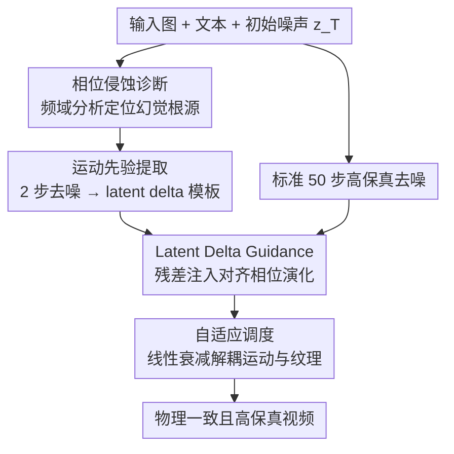

# Physics in 2-Steps: Locking Motion Priors Before Visual Refinement Erases Them

**会议**: ICML2026  
**arXiv**: [2606.06361](https://arxiv.org/abs/2606.06361)  
**代码**: https://dnwjddl.github.io/phaselock/ （项目主页）  
**领域**: 视频生成 / 扩散模型  
**关键词**: 图生视频, 物理一致性, 相位侵蚀, 频域分析, 免训练引导  

## 一句话总结
这篇论文发现图生视频扩散模型「2 步推理比 50 步推理物理更靠谱」，把根因定位到去噪过程中相位谱被侵蚀，于是提出免训练的 PhaseLock——从 2 步推理里抽出运动先验，再用 Latent Delta Guidance 注入到高保真去噪轨迹中，平均把物理一致性提升 6.2 分，几乎不增加开销（1.06× 时间、1.02× 显存）。

## 研究背景与动机
**领域现状**：图生视频（I2V）扩散模型在「画面长什么样」上已经做得非常好——物体、场景、纹理都渲染得很逼真。I2V 又是研究物理失真的好场景，因为输入图把初始画面钉死了，剩下唯一的自由度就是运动。

**现有痛点**：这些模型频繁生成违反物理规律的运动（物体凭空消失、球往反方向弹），即所谓「物理幻觉」。主流补救手段要么外挂物理引擎/外部模块，要么靠堆数据堆模型规模，前者需要大量算力或人工标注，后者即便规模上去了仍会产生不合理的动力学。

**核心矛盾**：作者抛出一个关键问题——模型到底是「不懂物理」，还是「本来懂、却在生成过程中把懂的东西忘了」？他们给出一个反直觉的观察：同一个模型、同一个种子、同样的条件下，只跑 2 步去噪的视频物理一致性往往比跑满 50 步还好。50 步画质更高（LPIPS 从 0.23 降到 0.19），但物理一致性反而掉了（Physics-IQ 从 34.02 降到 30.32）。也就是说，模型在「视觉精修」阶段，把早期已经抓到的合理运动结构给覆盖掉了。

**切入角度**：作者把视频 latent 做傅里叶分解，拆成幅度谱（appearance 能量、纹理对比度）和相位谱（结构布局、运动轨迹）。沿去噪轨迹观察发现：幅度谱基本稳定（只掉约 2–3%），而相位谱从第 2 步到第 50 步显著退化（掉约 18%）。这说明去噪主要破坏的是「结构动力学」而非「外观能量」。

**核心 idea**：既然合理的运动先验在 2 步就已经成型、问题出在后续精修把相位侵蚀掉了，那就「锁住」少步推理里的相位运动先验，让它贯穿整条高保真去噪轨迹——用空间域的帧间差分（latent delta）作为相位的代理来约束，免训练、即插即用。

## 方法详解

### 整体框架
PhaseLock 是一个完全免训练、模型无关的两阶段框架，套在任意预训练 I2V 扩散骨干外面。第一阶段 **运动先验提取**：用同一份初始噪声只跑 2 步去噪，得到一段粗糙但物理正确的 latent 序列，对它做帧间差分抽出「运动模板」。第二阶段 **Latent Delta Guidance**：复用同一份初始噪声跑标准 50 步高保真生成，每一步都计算当前帧间差分与运动模板的残差，把这个残差按时间衰减的强度注入后续帧的 latent，让高保真轨迹的相位演化对齐到早期的运动先验，同时保留首帧作为图像条件锚点不动。作者刻意避免直接替换相位谱或注入低频带，因为这类显式频域操作容易引入高频伪影和空间不连贯，于是改用「约束 latent 帧间差分」这个空间域代理。

### 关键设计

**1. 相位侵蚀诊断：用频域分析把物理幻觉的根因钉到相位谱上**

这是全文的立论基石。作者先在时空切片（$x\text{-}t$ slice）上确认 2 步结果的运动轨迹最贴近真值，50 步却出现「球往反方向走」的时间不一致。再把 latent 做傅里叶分解 $\mathcal{F}(z)=A\cdot e^{i\phi}$，在低频区（归一化距离 $<0.4$）定义两个指标：**Phase Coherence**（生成与真值相位角的平均余弦相似度）和 **Magnitude Correlation**（log 幅度的 Pearson 相关）。在 CogVideoX 和 Wan 2.1 上都观察到：幅度相关沿去噪只掉 2–3%，相位一致性却骤降约 18%。为排除「2 步只是因为糊所以相位看起来一致」的质疑，作者对所有输出加不同程度高斯模糊（$\sigma\in\{0,8,16\}$），即便强模糊下 2 步输出与真值的帧间相位差相关仍高达 0.358，是 50 步（0.100）的 $3.6\times$，说明相位对齐是真结构对齐而非模糊伪影。最后做因果实验：对真值视频选择性注入 50% 噪声，相位污染造成的光流 End-Point Error 高达 9.74（约 10 像素位移误差），而等量幅度污染只有 1.14（约 1 像素），$8.5\times$ 的悬殊差距提供了「运动动力学强依赖相位」的因果证据。三条经验观察加上「粗运动主要在低频结构、扩散由粗到细早成型」，共同解释了为什么少步推理能保住物理。

**2. 运动先验提取：用 latent 帧间差分当相位的空间域代理**

定位到相位是关键后，问题变成「怎么把 2 步里的相位先验稳稳取出来」。作者定义 **Latent Delta Operator** $\mathcal{T}(\mathbf{z})=\mathbf{z}_{2:F}-\mathbf{z}_{1:F-1}$，即相邻帧 latent 的差分——它捕获局部时间动力学，同时压掉静止背景这类时间无关特征。第一阶段用冻结骨干、同一份噪声 $\mathbf{z}_T$ 跑 $K_{\text{few}}=2$ 步得到粗 latent $\mathbf{z}^{\text{few}}$，再对它施加差分算子得到运动模板 $\mathbf{M}^{\text{prior}}=\mathcal{T}(\mathbf{z}^{\text{few}})=\mathbf{z}^{\text{few}}_{2:F}-\mathbf{z}^{\text{few}}_{1:F-1}$。之所以用帧间差分而不直接操作相位谱，论文给了理论支撑：在自然视频里相邻帧幅度谱近似相等（$A_f\approx A_{f-1}\triangleq A$），此时 $|\mathcal{F}(\boldsymbol{\Delta})|=2A|\sin(\frac{\phi_f-\phi_{f-1}}{2})|\approx A\cdot|\phi_f-\phi_{f-1}|$，即 latent 差分的幅度近似正比于帧间相位差。于是约束差分≈约束相位演化，却不用碰频域、不会引入伪影。

**3. Latent Delta Guidance：用残差信号把高保真轨迹拉回运动先验**

第二阶段标准 $K_{\text{full}}=50$ 步生成时，每一步 $k$ 计算当前帧间动力学 $\mathbf{M}^{(k)}=\mathcal{T}(\mathbf{z}^{(k)})$，引导信号定义为目标模板与当前动力学的残差 $\mathcal{G}^{(k)}=\mathbf{M}^{\text{prior}}-\mathcal{T}(\mathbf{z}^{(k)})$，它刻画了当前轨迹偏离物理先验的程度。把这个残差只注入后续帧、首帧保持不动（首帧是图像条件锚点）：$\mathbf{z}^{(k)}_{2:F}\leftarrow\mathbf{z}^{(k)}_{2:F}+\lambda(k)\cdot\mathcal{G}^{(k)}$。从理论侧看，最小化 $\|\mathbf{M}^{\text{prior}}-\mathbf{M}^{(k)}\|$ 等价于隐式约束相位演化——而相位正是上面因果实验证明的「运动最敏感量」（$8.5\times$ 于幅度）；且在归一化 latent 空间里幅度波动不易主导损失，所以即便 $A_f\approx A_{f-1}$ 不完美，对齐依然偏向相位。

**4. 自适应调度：线性衰减把运动生成和纹理精修解耦开**

如果引导一直加到去噪后期，会干扰高频纹理的精修。由于粗结构主要在扩散早期形成，作者用线性衰减调度把引导强度限制在 $[k_{\text{start}}, k_{\text{end}})$ 区间：

$$\lambda(k)=\begin{cases}\lambda_0\cdot\left(1-\dfrac{k-k_{\text{start}}}{k_{\text{end}}-k_{\text{start}}}\right) & k_{\text{start}}\le k<k_{\text{end}}\\ 0 & \text{otherwise}\end{cases}$$

实践中取 $\lambda_0=0.05$、$k_{\text{start}}=0$、$k_{\text{end}}=K_{\text{full}}/2$——即只在去噪前半程施加温和引导并逐渐放松。这样在全局布局成型时强力贴合运动先验，到后半程则松绑约束、把舞台让给高保真渲染，从而「先锁物理、后补画质」。

## 实验关键数据

### 主实验
在 Physics-IQ 基准（客观度量生成轨迹与真值的运动学偏差）上，PhaseLock 即插即用接到多种骨干，平均提升 6.2 分，甚至超过参数量大得多的闭源模型：

| 模型 | 参数 | Physics-IQ Score | 增益 |
|------|------|------------------|------|
| Sora（闭源） | - | 10.0 | - |
| Runway Gen-3 Alpha（闭源） | - | 22.8 | - |
| MAGI-1（开源） | 24B | 30.2 | - |
| CogVideoX | 5B | 30.8 | - |
| + PhaseLock | 5B | **36.0** | +5.2 |
| LTX-Video | 2B | 26.4 | - |
| + PhaseLock | 2B | **32.0** | +5.6 |
| Wan 2.1 | 14B | 20.9 | - |
| + PhaseLock | 14B | **28.7** | +7.8 |
| Wan 2.1 蒸馏（4 步） | 14B | 27.7 | - |
| + PhaseLock | 14B | **29.4** | +1.7 |

在 PhyGenBench（LVLM 评估的整体物理合理性）上同样全面提升：

| 模型 | 力学↑ | 光学↑ | 热学↑ | 材料↑ | 平均↑ |
|------|------|------|------|------|------|
| CogVideoX | 0.45 | 0.55 | 0.42 | 0.43 | 0.46 |
| + PhaseLock | 0.51 | 0.78 | 0.47 | 0.49 | **0.57** (+23.9%) |
| Wan 2.1 | 0.43 | 0.55 | 0.38 | 0.30 | 0.42 |
| + PhaseLock | 0.48 | 0.64 | 0.49 | 0.41 | **0.51** (+21.4%) |

### 效率与保真度对比

| 维度 | 说明 |
|------|------|
| 时间开销 | 1.06×（WMReward 需 ~5×） |
| 显存开销 | 1.02× |
| 视觉保真 | VBench 主体/背景一致性、运动平滑度等基本持平，物理提升不以画质为代价 |
| 蒸馏模型增益 | 仅 +1.7（4 步模型本就少步、相位侵蚀少，与理论自洽） |

### 关键发现
- **相位 vs 幅度的因果非对称是核心**：相位污染造成的运动失真是等量幅度污染的 $8.5\times$，且去噪只侵蚀相位（−18%）不侵蚀幅度（−2~3%），这解释了「少步反而物理更好」。
- **延长步数不解决问题**：从 50 步加到 100 步物理一致性只涨约 1 分，却大幅增加推理时间——说明问题不在「去噪不够」，而在「精修把相位磨掉了」。
- **空间域代理优于显式频域操作**：直接替换相位谱或注入低频带会引入高频伪影和空间不连贯，用 latent delta 约束既等价对齐相位又避免伪影。

## 亮点与洞察
- **「模型不是不懂物理，是去噪时把懂的忘了」这个 framing 非常漂亮**：把物理幻觉从「知识缺失」重新诊断为「知识擦除」，直接换了一条解题路线——不需要外挂物理引擎或重训，只要保住早期已有的先验。
- **用帧间 latent 差分当相位代理是可迁移的 trick**：它把「约束相位演化」这个频域目标翻译成空间域的简单减法，既有理论支撑（$|\mathcal{F}(\Delta)|\approx A|\phi_f-\phi_{f-1}|$）又避开频域操作的伪影，可借鉴到其他需要保结构/保运动的视频任务。
- **免训练 + 模型无关 + 近零开销**：1.06× 时间、1.02× 显存就能换 6.2 分物理提升，相比 WMReward 的 ~5× 开销性价比极高，部署成本几乎可忽略。

## 局限与展望
- 方法的有效性建立在「相邻帧幅度谱近似相等」和「帧间相位差很小」这两个平滑运动假设上；对于剧烈、突变或大位移的运动，近似 $|\mathcal{F}(\Delta)|\approx A|\phi_f-\phi_{f-1}|$ 可能失效。
- 引导强度 $\lambda_0$、注入区间 $[k_{\text{start}}, k_{\text{end}})$ 是手调超参，论文用固定一套（0.05、前半程衰减）跑所有骨干，不同模型/场景下的最优值是否一致缺少系统扫描。
- 物理评估仍部分依赖 LVLM（PhyGenBench 用 GPT-4o）打分，主观性较强；Physics-IQ 虽客观但覆盖场景有限，更复杂的多物体交互、长时序物理仍是开放问题。
- 对已蒸馏的少步模型增益明显变小（+1.7），意味着随着少步采样成为主流，PhaseLock 的提升空间会被压缩。

## 相关工作与启发
- **vs WMReward**：WMReward 用 latent 世界模型当物理奖励做测试时轨迹搜索与引导，效果相当但开销 ~5× 时间；PhaseLock 不搜索、不外挂奖励模型，只用模型自身 2 步先验，1.06× 时间就达到可比增益。
- **vs PhysGen / VideoREPA**：它们引入外部物理仿真器或基础模型对齐来注入物理知识；PhaseLock 不引入任何外部知识，主张「模型已有先验、只需别擦除」。
- **vs FreeInit / FreqPrior / FreeU**：这些频域方法多在「初始化/注意力/特征传播」层面改善视觉、语义或时间一致性，PhaseLock 第一个把「相位侵蚀」识别为物理幻觉的机制，并显式保护相位动力学来提升物理合理性。

## 评分
- 新颖性: ⭐⭐⭐⭐⭐ 「少步比满步物理更好」的反直觉发现 + 相位侵蚀机制诊断，立论扎实且角度新颖
- 实验充分度: ⭐⭐⭐⭐ 三种骨干 + 两个物理基准 + VBench 保真验证 + 因果/模糊控制实验，较完整；但超参敏感性扫描偏少
- 写作质量: ⭐⭐⭐⭐⭐ 从观察到机制到方法到理论环环相扣，frequency-domain 分析讲得清楚
- 价值: ⭐⭐⭐⭐⭐ 免训练、模型无关、近零开销，可直接套到现有 I2V 模型上提升物理一致性

<!-- RELATED:START -->

## 相关论文

- [\[ICML 2026\] MotiMotion: Motion-Controlled Video Generation with Visual Reasoning](motimotion_motion-controlled_video_generation_with_visual_reasoning.md)
- [\[CVPR 2025\] PhyT2V: LLM-Guided Iterative Self-Refinement for Physics-Grounded Text-to-Video Generation](../../CVPR2025/video_generation/phyt2v_llm-guided_iterative_self-refinement_for_physics-grounded_text-to-video_g.md)
- [\[CVPR 2026\] Phantom: Physics-Infused Video Generation via Joint Modeling of Visual and Latent Physical Dynamics](../../CVPR2026/video_generation/phantom_physics-infused_video_generation_via_joint_modeling_of_visual_and_latent.md)
- [\[CVPR 2026\] SynMotion: Semantic-Visual Adaptation for Motion Customized Video Generation](../../CVPR2026/video_generation/synmotion_semantic-visual_adaptation_for_motion_customized_video_generation.md)
- [\[ICML 2026\] VideoGPA: Distilling Geometry Priors for 3D-Consistent Video Generation](videogpa_distilling_geometry_priors_for_3d-consistent_video_generation.md)

<!-- RELATED:END -->
