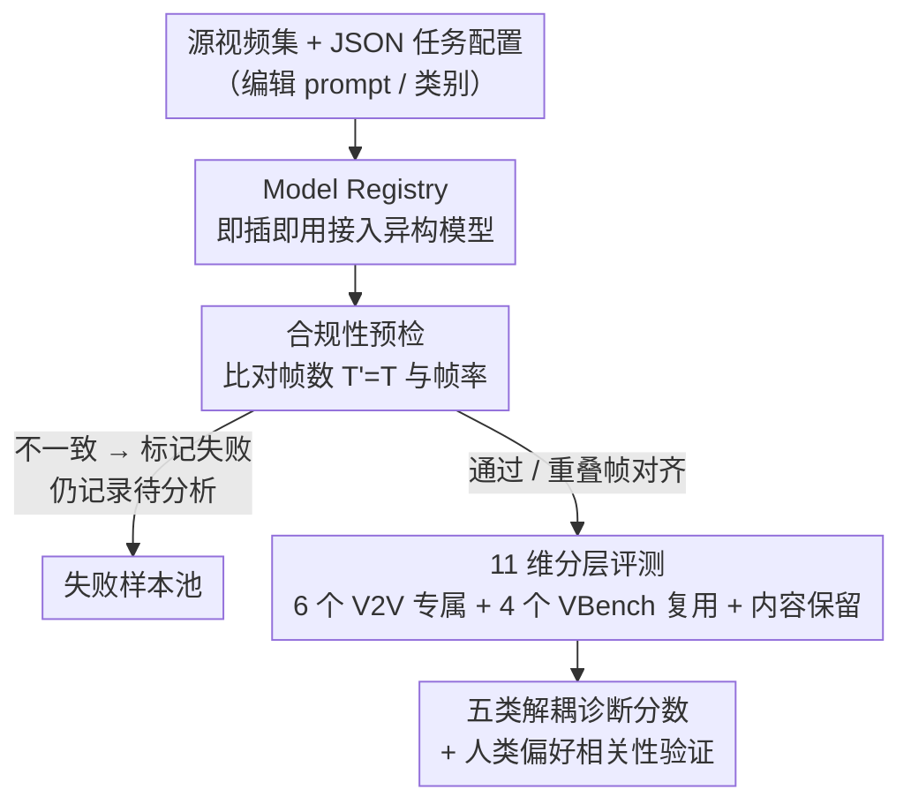

# V2V-Bench: A Comprehensive Benchmark for Video-to-Video Generation Evaluation

**会议**: ICML 2026  
**arXiv**: [2606.05665](https://arxiv.org/abs/2606.05665)  
**代码**: 待确认  
**领域**: 视频生成 / 评测基准  
**关键词**: 视频到视频生成、评测基准、帧级对应、时序一致性、编辑保真度  

## 一句话总结
针对视频到视频（V2V）编辑「既要听指令改、又要逐帧对齐源视频」这一现有 T2V/I2V 指标测不出的核心难题，本文提出 V2V-Bench——一个分 5 大类、11 个解耦维度（其中 6 个为 V2V 专属）的评测基准，配合「先查合规、再细评」的四阶段流水线，在 6 个 V2V 核心维度上与人类判断的 Spearman 相关性达到 0.905。

## 研究背景与动机
**领域现状**：视频到视频生成已成为可控视频编辑的重要范式——给定一段源视频和一条编辑指令，模型要在保留源视频时序结构、场景动态和空间关系的前提下完成变换。扩散与自回归视频模型在生成真实运动和高保真画面上进步很快，商用模型 Grok、Runway、Kling、Sora 等也纷纷上线 V2V 能力。

**现有痛点**：评测却严重滞后。VBench、VBench-I2V、EvalCrafter 这些主流基准都假设「单输入」范式（只有文本 prompt 或一张图），度量的是感知质量、语义相关性、整体真实感。但 V2V 的根本要求是——**输出要和源视频保持细粒度逐帧对应，同时忠实施加指定编辑**，这一点上述指标根本捕捉不到。

**核心矛盾**：编辑保真度（edit faithfulness）、时序一致性（temporal consistency）和源视频保留（source preservation）三者之间存在 trade-off，不同方法在三者间做了不同取舍，但缺乏一个统一协议把它们拆开、分别量化、横向比较。把所有东西揉成一个总分，既看不出模型在哪类变换上成功/失败，也无法诊断失败原因。

**本文目标**：构建一个能把 V2V 质量**分层解耦**的诊断式基准——不仅报总分，还要逐维度揭示模型为什么成功、为什么失败；并用人类标注验证这些维度确实贴合人类偏好。

**切入角度**：作者观察到 V2V 真正区别于 T2V/I2V 的是「源-输出在时间轴上的对应约束」（$o_t \leftrightarrow s_t$），于是把这个约束拆成可测的子维度，并先用一道「合规性预检」把连帧数/帧率都对不齐的输出挡在评测之外。

**核心 idea**：用「先合规过滤、再 11 维分层评测」代替「单一总分打分」，并专门设计 6 个 V2V 专属维度来度量源对应与编辑保真。

## 方法详解

### 整体框架
V2V-Bench 是一条**四阶段顺序流水线**：输入是一组源视频 $\{v_1, v_2, \ldots\}$ 加一份 JSON 任务配置（视频 ID、编辑 prompt、任务类别），输出是每个模型在 11 个维度上的可解释诊断分数。四个阶段分别是——**阶段 1 输入准备**：一个 Task Dispatcher 解析输入、调度编辑任务；**阶段 2 视频生成**：任务经一个 Model Registry 路由，支持即插即用接入异构编辑模型（Veo-3.1、Grok、Open-Sora2 及自定义模型）；**阶段 3 质量控制**：对生成视频与源视频做合规性预检（比对帧数和帧率），不一致直接标为失败；**阶段 4 多维评测**：对通过的视频对，在 11 个维度上打分。其中阶段 1、2 是通用脚手架，阶段 3 的合规预检与阶段 4 的 V2V 专属维度才是本文真正的贡献。

### 关键设计

**1. 合规性预检：把「帧级对应」当成 V2V 评测的硬门槛而非格式细节**

V2V 与 T2V/I2V 的根本区别在于源-输出必须随时间保持结构对应，因此本文先定义三条约束：(i) 时长保留 $T'=T$；(ii) 帧率一致 $\mathrm{FPS}(\mathcal{V}_o)=r$；(iii) 帧级对应，要求对所有 $t$ 存在映射 $o_t \leftrightarrow s_t$。前两条在评测前由合规预检强制检查，第三条则交给下游的时序/结构维度评估。这道门槛的价值在实验里被放大——商用 Veo-3.1 在全部 41 个样本上合规率 100%，而 Grok 与 Open-Sora-2 因无法稳定生成足够时长（如 192 帧只生成 185 / 129 帧）全部不合规。作者强调合规不是「格式约束」，而是忠实 V2V 评测的前提，它本身就成了模型长时视频生成能力的一个信号。对不合规模型，本文仍把它们纳入评测，但只在重叠生成帧上做对齐比较，保证横向可比。

**2. 六个 V2V 专属维度：为「源对应 + 编辑保真」量身定制的指标**

这是本文最核心的贡献。针对 T2V/I2V 指标测不出源对应的痛点，作者设计了 6 个专属维度，每个都有明确公式：

- **帧对应（Frame Correspondence）**：对每帧对 $(s_t, o_t)$ 融合 DINO ViT-B/16 语义特征与 SSIM，$S_{\mathrm{fc}}=\frac{1}{T}\sum_{t=1}^{T}[\alpha \cdot \cos(f_s^t, f_o^t) + (1-\alpha)\cdot \mathrm{SSIM}(s_t, o_t)]$，取 $\alpha=0.7$ 让语义对应（DINO，70%）优先于像素相似（SSIM，30%），因为风格迁移/外观编辑应保留高层内容而非精确重建。
- **时序一致（Temporal Consistency）**：用源/生成视频光流场的相对端点误差衡量运动模式是否保留，$S_{\mathrm{temp}}=\exp(-\frac{1}{T-1}\sum_{t} \mathbb{E}[\frac{\|F_t^s - F_t^o\|_2}{\|F_t^s\|_2 + 1}])$。
- **结构保留（Structural Preservation）**：提取 Canny 边缘图并计算带空间容差的边缘级 F1 分数，看物体边界与空间结构是否在编辑后保留。
- **布局贴合（Layout Adherence）**：直接用源/生成帧的 SSIM 衡量全局空间排布是否保持。
- **编辑保真（Edit Faithfulness）**：用 CLIP 图文相似度衡量生成帧是否跟从文本指令，$S_{\mathrm{edit}}=\frac{1}{T}\sum_t \frac{\cos(f_{\mathrm{CLIP}}(I_t^o), f_{\mathrm{CLIP}}(p))+1}{2}$。
- **风格迁移质量（Style Transfer Quality）**：同时测变化的「幅度」与「方向」，$S_{\mathrm{style}}=\lambda \cdot M_{\mathrm{Gram}} \cdot G_{\mathrm{dir}} + (1-\lambda)\cdot D_{\mathrm{CLIP}}$，其中 $M_{\mathrm{Gram}}$ 是 VGG-19 Gram 矩阵距离（幅度），$D_{\mathrm{CLIP}}$ 是方向性 CLIP 相似度，$\lambda=0.6$ 偏重幅度（风格迁移首先要有可感知变化），$G_{\mathrm{dir}}$ 对偏离目标方向的编辑惩罚（同向得 1.0，反向得 0.5）。

这些指标各自针对一个 V2V 失败模式，合起来才能把「改没改对 + 像不像源」拆开来看。

**3. 五类分层解耦框架 + 多场景任务套件**

11 个维度被组织进 5 大类——时序对齐、结构保真、变换质量、视频质量、语义对齐。除上面 6 个 V2V 专属维度外，视频质量类复用 VBench 已验证的 4 个维度（运动平滑度、美学质量、成像质量、时序闪烁，均与源无关），语义对齐类还有一个内容保留（Content Preservation），用 RGB 直方图相关度作为轻量代理 $S_{\mathrm{content}}=\frac{1}{T}\sum_t \mathrm{HistSim}(I_t^s, I_t^o)$，共 11 维。任务套件含 81 个有效任务实例，覆盖五类编辑目标：物体编辑、外观编辑、风格迁移、运动编辑、身份保留；源视频平均约 8 秒，用 Gemini-2.5-Flash 生成结构化、且都锚定在源视频可视内容上的 prompt。分层解耦的好处是：报告不再是一个含糊总分，而是能定位「哪类变换做得好、哪类崩」的诊断图谱。

## 实验关键数据

### 主实验
评测两个商用模型（Veo-3.1、Grok-Imagine-Video）和一个开源模型（Open-Sora2），共 81 条编辑 prompt，全部在单张 NVIDIA H100 上完成生成与评测。

合规性预检结果（41 个评测样本）：

| 模型 | 通过 | 通过率 | 主要失败模式 |
|------|------|--------|--------------|
| Grok | 0 / 41 | 0.0% | 帧数 192→185 |
| Veo-3.1 | 41 / 41 | 100.0% | 无 |
| Open-Sora-2 | 0 / 41 | 0.0% | 帧数 192→129 |

11 维三模型对比（41 个公共任务平均）：

| 维度 | Grok | Veo | Open-Sora |
|------|------|-----|-----------|
| 成像质量 | 0.4979 | **0.6522** | 0.3031 |
| 时序闪烁 | 0.9836 | **0.9856** | 0.9814 |
| 结构保留 | **0.5726** | 0.2926 | 0.2225 |
| 时序一致 | **0.5289** | 0.1752 | 0.3464 |
| 帧对应 | **0.7895** | 0.7118 | 0.6697 |
| 编辑保真 | **0.6187** | 0.6161 | 0.6105 |
| 美学质量 | **0.4981** | 0.4976 | 0.4931 |
| 运动平滑 | 0.9657 | **0.9865** | 0.9645 |
| 布局贴合 | **0.7822** | 0.6564 | 0.6692 |
| 风格迁移 | **0.8660** | 0.6903 | 0.6141 |
| 内容保留 | 0.6086 | **0.7489** | 0.4633 |
| **平均** | **0.7011** | 0.6376 | 0.5762 |
| **赢得维度** | **7 / 11** | 4 / 11 | 0 / 11 |

结论是模型各有所长：Grok 在编辑保真与源保留上更强（总分最高、赢 7 维），Veo-3.1 在纯视觉质量（成像、内容保留、运动平滑）上更好。

### 消融 / 鉴别力分析
对比「6 个 V2V 专属维度」与「全部 11 维」的鉴别力：

| 配置 | Grok 平均 | Veo 平均 | Open-Sora 平均 | Grok 赢得维度 |
|------|-----------|----------|----------------|----------------|
| 仅 6 个 V2V 专属维度 | 0.6937 | 0.5237 | 0.5221 | 6 / 6 |
| 全部 11 维 | 0.7011 | 0.6376 | 0.5762 | 7 / 11 |

在 6 个 V2V 专属维度上，模型间差距明显拉大（Grok 0.6937 vs Veo 0.5237），Grok 横扫全部 6 维；而在闪烁、美学、运动平滑等通用维度上三模型接近。这说明 **V2V 专属维度比通用视频质量维度更具鉴别力**。

人类/VLM 偏好对齐（Spearman 相关，4 视频 × 10 任务，3 名标注者）：

| 配对 | 全 11 维 | V2V-core 6 维 |
|------|----------|---------------|
| Human ↔ Bench | 0.688 | **0.905** |
| Human ↔ Gemini 2.5 Pro | 0.713 | 0.899 |
| Human ↔ GPT-4o | 0.737 | 0.816 |

### 关键发现
- **合规预检是 V2V 评测的第一道分水岭**：Grok / Open-Sora 因生不出足够帧数全军覆没，这本身就暴露了它们长时视频合成的短板，而不只是格式问题。
- **V2V-core 6 维与人类判断高度一致（0.905）**，远高于全 11 维的 0.688，且在该子集上比两个 VLM judge（GPT-4o、Gemini 2.5 Pro）与人类的一致性更高——说明专为源对应/编辑保真设计的维度更贴合人类对 V2V 的偏好。
- **总分会掩盖能力差异**：通用维度上各模型趋同，只有拆到 V2V 专属维度才看得出谁真正保住了源结构。

## 亮点与洞察
- **「先合规、再评测」的两段式设计很务实**：它把「连帧数都对不齐」与「编辑质量好坏」两类问题分开，避免用一堆精致指标去评一段长度都不对的视频，是 V2V 评测特有且容易被忽略的前提。
- **6 个 V2V 专属指标都是「拼装现成模块」**（DINO、SSIM、光流、Canny F1、CLIP、Gram 矩阵），实现门槛低、无需训练，却针对性地覆盖了源对应的各个面向——这种「轻量代理 + 解耦维度」的思路可迁移到其他需要源对应的生成任务（如图像编辑、3D 编辑）评测。
- **方向性风格分（$G_{\mathrm{dir}}$）很巧妙**：用 CLIP 空间里视觉变化方向 $\Delta I$ 与文本目标方向 $\Delta T$ 的夹角判断「改对了方向没有」，把「有没有变」和「变得对不对」分开打分。

## 局限与展望
- **规模偏小**：81 个任务、3 个模型、人类对齐实验只用 4 视频 × 10 任务 × 3 标注者，统计稳健性有限；商用模型只测了 Grok 和 Veo，覆盖面不够。
- **依赖代理指标**：内容保留用 RGB 直方图、编辑保真用 CLIP 相似度，都是轻量代理，可能对复杂语义编辑不敏感；DINO+SSIM 的 $\alpha=0.7$ 虽称在 $[0.65, 0.8]$ 稳定，但跨任务最优权重未必固定。
- **不合规模型的「重叠帧对齐」比较隐含不公**：在更短的生成帧上算分，可能掩盖了模型「漏帧」本身造成的内容缺失，需谨慎解读其分数。
- **可改进方向**：把任务套件扩到更长视频、更多源类型（目前集中在人体运动视频），并引入更细的语义级编辑保真度量（如分割/检测一致性），减少对粗代理的依赖。

## 相关工作与启发
- **vs VBench / VBench-I2V**: 它们为 T2V/I2V 设计多维评测（16/18 维），但假设单输入范式，没有源-输出时序对应约束；本文复用了其 4 个与源无关的视频质量维度，并补上 6 个 V2V 专属维度。
- **vs EvalCrafter**: 同样是 T2V 多指标评测，仍缺 V2V 的逐帧对应度量；本文的合规预检 + 帧对应维度正是补这块空缺。
- **vs VLM-as-judge（GPT-4o / Gemini 2.5 Pro 直接打分）**: 两个 VLM judge 彼此高度相关（0.943），但在 V2V-core 维度上与人类的一致性反而低于 V2V-Bench，说明针对性设计的解耦指标比通用 VLM 打分更可靠。

## 评分
- 新颖性: ⭐⭐⭐⭐ 首个专为 V2V 设计、带合规预检与 6 个源对应专属维度的解耦基准，切口清晰。
- 实验充分度: ⭐⭐⭐ 维度设计与人类对齐验证到位，但模型数、任务数、标注规模偏小。
- 写作质量: ⭐⭐⭐⭐ 流水线与每个维度公式都讲得清楚，诊断式呈现直观。
- 价值: ⭐⭐⭐⭐ 填补 V2V 评测空白，指标轻量易复现，对推动可控视频编辑评测有实用价值。

<!-- RELATED:START -->

## 相关论文

- [\[CVPR 2026\] VGA-Bench: A Unified Benchmark and Multi-Model Framework for Video Aesthetics and Generation Quality Evaluation](../../CVPR2026/video_generation/vga-bench_a_unified_benchmark_and_multi-model_framework_for_video_aesthetics_and.md)
- [\[CVPR 2026\] VABench: A Comprehensive Benchmark for Audio-Video Generation](../../CVPR2026/video_generation/vabench_a_comprehensive_benchmark_for_audio-video_generation.md)
- [\[CVPR 2025\] VEU-Bench: Towards Comprehensive Understanding of Video Editing](../../CVPR2025/video_generation/veu-bench_towards_comprehensive_understanding_of_video_editing.md)
- [\[CVPR 2025\] Video-Bench: Human-Aligned Video Generation Benchmark](../../CVPR2025/video_generation/video-bench_human-aligned_video_generation_benchmark.md)
- [\[CVPR 2026\] ActivityForensics: A Comprehensive Benchmark for Localizing Manipulated Activity in Videos](../../CVPR2026/video_generation/activityforensics_a_comprehensive_benchmark_for_localizing_manipulated_activity_.md)

<!-- RELATED:END -->
