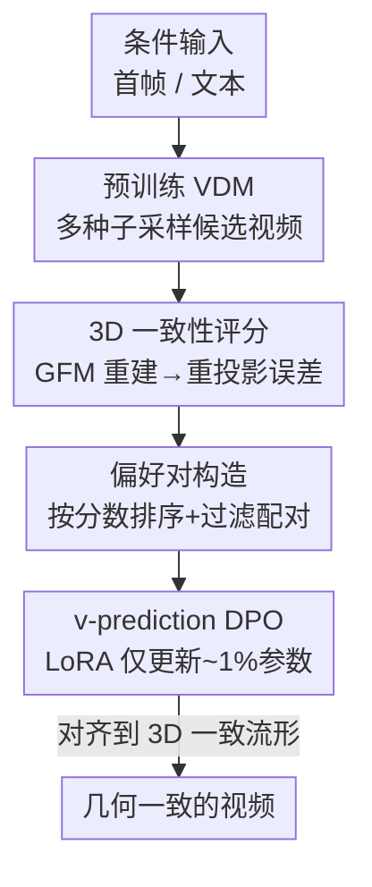

# VideoGPA: Distilling Geometry Priors for 3D-Consistent Video Generation

**会议**: ICML 2026  
**arXiv**: [2601.23286](https://arxiv.org/abs/2601.23286)  
**代码**: https://hongyang-du.github.io/VideoGPA-Website （项目页）  
**领域**: 视频生成 / 扩散模型对齐  
**关键词**: 视频扩散模型, 3D一致性, 几何基础模型, DPO偏好对齐, 自监督奖励

## 一句话总结
VideoGPA 用一个几何基础模型（GFM）把生成视频重建成 3D 点云、再投影回原帧，用「重投影误差」作为自监督的几何一致性奖励，自动构造偏好对，并通过 DPO（LoRA 微调 ~1% 参数、仅 ~2500 对偏好样本）把预训练视频扩散模型对齐到 3D 一致的流形上，在不损失画质的前提下显著缓解物体形变与空间漂移。

## 研究背景与动机
**领域现状**：以 CogVideoX、Wan、HunyuanVideo 为代表的视频扩散模型（VDM）靠扩大 DiT 架构与十亿级数据预训练，已经能生成视觉上极其逼真的视频，社区进一步把它们当成具身智能、新视角合成、物理仿真的「数据引擎」——而这些下游任务都依赖视频对 3D 世界的忠实理解。

**现有痛点**：即便见过海量 3D 一致的真实视频，预训练 VDM 在相机大幅运动下仍频繁出现物体形变、空间漂移、几何坍塌等结构性错误。换句话说，模型「看过」一致的数据，却学不到一致的行为。

**核心矛盾**：作者把这个悖论归因于去噪目标本身——标准训练只奖励像素级的统计匹配，没有任何显式的几何正则项。于是模型学会了「幻觉出看似合理的纹理」，却没把 3D 一致性注入到隐空间里。

**本文目标**：在不从头重训、不依赖人工标注的前提下，给已经训练好的 VDM 补上 3D 一致性这一课，且要数据高效、不破坏原模型的画质和运动真实感。

**切入角度**：几何基础模型（GFM，如 DUSt3R/MASt3R/VGGT 这一脉）能从 2D 观测前馈地回归稠密深度、相机位姿与点云，天然携带强几何先验。作者的关键观察是——一个几何上成立的视频，其 GFM 重建出的 3D 结构应该能准确地重投影回原始帧；反之重建误差就会飙升。这给了一个无需人工、稠密、可微的「一致性探针」。

**核心 idea**：把「GFM 重投影误差」当作 3D 一致性奖励，自动给同一条件下采样出的多个视频排序、构造偏好对，再用 DPO 把生成分布推向 3D 一致流形——即用「重建一致性」代替「人工偏好」来对齐几何。

## 方法详解

### 整体框架
VideoGPA 是一个「评审—纠正」（review-and-correct）的后训练对齐框架，核心是把几何监督从「重训损失」改造成「偏好信号」。整条流程是：给定一个条件输入（首帧或文本），用预训练 VDM 以不同随机种子采样出多条语义相同但几何质量参差的候选视频；对每条候选，用 GFM 探测出每帧的深度与相机位姿、拼成全局点云，再把点云重投影回各帧得到 $\hat{I}_t$，用重投影重建误差算出一个 3D 一致性分数；按分数给候选排序、配对成「赢家 $x^w$ / 输家 $x^l$」偏好对；最后用适配到 $v$-prediction 的 Diffusion-DPO 目标、以 LoRA 仅更新约 1% 参数，把模型推向高一致性的样本。整个过程不碰原模型主干，也不需要任何人工标注。

### 关键设计

**1. 重投影一致性分数：把「几何对不对」变成可自监督的稠密奖励**

这一步直接针对「去噪目标缺几何正则」的痛点。对每条生成视频均匀采 $T$ 帧（默认 $T{=}10$），用 GFM $\Phi$ 预测每帧深度 $D_t$ 与相机位姿 $(R_t, t_t)$，把每个像素 $\tilde{\mathbf{u}}=[u,v,1]^\top$ 反投影到世界坐标 $\mathbf{X}_t(u,v) = R_t D_t(u,v) K^{-1}\tilde{\mathbf{u}} + t_t$，拼成带色点云 $\mathcal{P}$。然后把点云用逆位姿 $E_{t,\mathrm{w2c}}=[R_t^\top \mid -R_t^\top t_t]$ 重投影回每帧、用画家算法栅格化得到重投影图 $\hat{I}_t$，最后用一个标准重建损失度量它和原帧的差距：

$$E_{\mathrm{Recon}}=\frac{1}{T}\sum_{t=1}^{T}\Big(\mathrm{MSE}(\hat{I}_t, I_t)+\lambda\,\mathrm{LPIPS}(\hat{I}_t, I_t)\Big)$$

它的妙处在于「自洽性」：如果视频几何成立，所有帧必须共同接受同一个 3D 解释，重投影误差就低；只要存在漂移、坍塌或透视错乱，单一 3D 结构就无法同时解释所有视角，误差立刻升高。这是个无需人工、稠密且可微的信号，比稀疏的逐对约束更鲁棒（见「亮点与洞察」中关于 scene-level vs local 的讨论）。

**2. v-prediction 视频扩散的 DPO：把偏好信号灌进去噪流形**

主流视频 DiT 普遍用 $v$-prediction 参数化（目标速度 $v_t \equiv \dot{x}_t = \alpha_t \epsilon - \sigma_t x_0$），作者把 Diffusion-DPO 适配到这个参数化上。对样本 $x$ 定义速度误差能量项 $\mathcal{E}(\theta,x,t)=\|v_t - v_\theta(x_t,t,c)\|^2$，则策略相对参考策略的对数似然比正比于 $\mathbb{E}_{t,\epsilon}[\mathcal{E}(\mathrm{ref},x,t)-\mathcal{E}(\theta,x,t)]$，代入 Bradley-Terry/DPO 后得到最终目标：

$$\mathcal{L}_{\mathrm{DPO}}=-\mathbb{E}\Big[\log\sigma\big(\beta([\mathcal{E}(\mathrm{ref},x^w,t)-\mathcal{E}(\theta,x^w,t)] - [\mathcal{E}(\mathrm{ref},x^l,t)-\mathcal{E}(\theta,x^l,t)])\big)\Big]$$

训练时对每个偏好对 $(x^w,x^l)$ 共享同一组噪声 $\epsilon$ 和时间步 $t$，保证两者优化基线一致，让梯度只反映几何质量差而非采样噪声差。这样做相比「直接加几何 loss 重训」的优势是：它是离线、稳定、无需迭代采样的偏好目标，且只需 LoRA 更新 ~1% 参数就能起效。

**3. 几何隔离的偏好对构造：让几何成为唯一区分因素**

DPO 的质量取决于偏好对是否「干净」。作者刻意让候选视频语义相同、只在几何上有差异，从而把几何分离成唯一的偏好信号。I2V 设定下用 DL3DV-10K 的首帧当视觉提示，并用 2–3 个随机采样的相机运动原语（如「拉远」「侧滚」「绕场景环绕」）拼成结构化运动提示，刻意制造容易暴露几何不一致的大幅相机轨迹，同时固定场景内容；T2V 设定下用 CogVLM2-Video 生成的字幕当文本提示，引入更高语义多样性以检验泛化。对每个提示按 3D 一致性分数排序、只在几何差距足够大时配对，并剪掉静止、整体画质差或分差可忽略的样本，确保训练信号稳定且有区分度。值得注意的是评估时改用自然描述性叙述提示（而非训练用的脚本化运动提示），实测没有过拟合到脚本格式。

### 损失函数 / 训练策略
基座为 CogVideoX-5B（I2V/T2V）与 CogVideoX1.5-5B（对比 GeoVideo），用 LoRA（秩 $r{=}64$、$\alpha{=}128$，约 1% 参数）微调。8×A100、AdamW、峰值学习率 $5\times10^{-6}$、cosine 衰减、500 步 warm-up、batch size 16；常规配置训练 10,000 步，对比 GeoVideo 时仅训 1,500 步。训练用 DL3DV-10K 的 8K/9K/10K/11K 子集，评估用 1K 子集。全部重投影类指标统一用 Depth Anything V3 作为骨干，避免「用 GFM 训又用 GFM 评」的循环评估偏差。

## 实验关键数据

### 主实验
在 I2V 与 T2V 两套设定下，VideoGPA 在 3D 一致性指标上全面领先，同时 VideoReward 人类对齐胜率大幅高于基线（下表为 CogVideoX-I2V-5B / CogVideoX-5B 基座，箭头表示越大/越小越好）。

| 设定 / 方法 | PSNR ↑ | SSIM ↑ | LPIPS ↓ | MVCS ↑ | 3DCS ↓ | Epipolar ↓ | VideoReward-OVL 胜率 |
|------------|--------|--------|---------|--------|--------|-----------|------|
| I2V Baseline | 22.85 | 0.786 | 0.476 | 0.945 | 0.485 | 0.585 | — |
| I2V SFT | 21.58 | 0.749 | 0.513 | 0.947 | 0.524 | 0.640 | 35.0% |
| I2V Epipolar-DPO | 21.38 | 0.773 | 0.475 | 0.944 | 0.487 | 0.545 | 66.0% |
| **I2V VideoGPA** | 21.24 | 0.779 | **0.473** | **0.950** | **0.483** | **0.539** | **76.0%** |
| T2V Baseline | 21.47 | 0.784 | 0.435 | 0.944 | 0.445 | 0.584 | — |
| T2V Epipolar-DPO | 21.58 | 0.791 | 0.434 | 0.953 | 0.443 | 0.579 | 48.67% |
| **T2V VideoGPA** | 21.24 | **0.803** | **0.411** | **0.953** | **0.422** | **0.548** | **60.33%** |

I2V 上 MVCS 0.945→0.950、Epipolar 0.585→0.539，OVL 胜率 76% 大幅碾压 Epipolar-DPO（66%）与 SFT（35%）；T2V 上 SSIM/LPIPS/3DCS/Epipolar 同样最优，且画质未退化。

### 消融 / 对比实验
与显式几何监督的 GeoVideo（基座 CogVideoX1.5-5B）相比，VideoGPA 只用 1,500 步轻量后训练就在几何一致性与人类对齐上全面更优；同时人类盲测偏好研究进一步佐证增益可被感知。

| 对比项 | Epipolar ↓ | MVCS ↑ | VideoReward-OVL | 备注 |
|--------|-----------|--------|-----------------|------|
| GeoVideo（~10K 视频+深度监督） | 0.875 | 0.819 | 18.06% | 重建↑但画质大幅退化 |
| **VideoGPA（1,500 步）** | **0.567** | **0.982** | **57.64%** | 画质不掉、几何更优 |
| 人类盲测（25 人 ×20 组，I2V） | — | — | **53.5% 首选** | Epipolar-DPO 仅 22.4% |

### 关键发现
- 偏好对里「几何隔离」是关键：固定语义、只让几何变化，DPO 才能把信号定向到一致性上；剪掉静止/低质/小分差样本对稳定性很重要。
- 仅 ~2,500 对偏好 + ~1% 参数 LoRA 就能显著改善，说明几何一致性更像是「需要被对齐唤醒」而非「需要重新学习」的能力。
- 虽然只针对（多为静态场景的）几何一致性优化，却连带提升了动态运动连贯性（MQ 胜率更高）——作者解释为几何作为正则，把生成投影回物理可行子空间后，模型的运动先验得以专注于物体动态而非「幻觉式空间纠正」。

## 亮点与洞察
- **重投影一致性当奖励**：把「3D 对不对」转化成「重建误差大不大」这一自监督探针，绕开了人工标注与稀疏几何约束，信号稠密且可微——是把 GFM 当「几何裁判」用的一个干净范式。
- **scene-level 全局约束 > local 逐对约束**：Epipolar-DPO 这类逐帧极线约束对轻微误差有效，但纹理坍塌、冻结区域等退化样本仍可能满足稀疏极线约束而产生「假阳性」；VideoGPA 要求所有帧共同接受单一 3D 解释，全局重投影误差能正确拒绝这些局部一致但全局无效的样本。
- **几何即运动正则**：固定好「舞台」（背景与相机轨迹的射影几何）后，模型能更好地把相机运动与物体运动解耦，从而把容量释放给真实的物体动态——「修好场景几何反而让演员演得更好」。这个迁移视角对其他生成任务（如 4D/世界模型）很有启发。

## 局限与展望
- 几何探针依赖 GFM 的重建质量，若 GFM 在某些场景（强动态、透明/反光、极弱纹理）本身重建不准，一致性分数会失真；论文也刻意在静态为主的场景上做几何对齐。
- 训练用 DL3DV-10K（室内外静态扫描为主）构造偏好，对剧烈动态、多物体交互场景的几何一致性是否同样有效，正文主要靠附录 OOD/Wan2.2 实验佐证，可进一步加强。
- 仅缓解几何一致性，不显式建模物理（碰撞、刚体动力学）；把重投影奖励扩展到带显式物理约束的偏好信号是自然的下一步。
- DPO 偏好对的「足够分差」阈值、运动原语词表等过滤策略较多依赖经验设置（细节在附录），其敏感性未在正文充分展开。

## 相关工作与启发
- **vs Epipolar-DPO（Kupyn et al., 2025）**: 同样用 DPO，但它用稀疏的逐对极线误差当偏好信号，本文改用全局重投影的 scene-level 一致性分数，避免局部一致但全局坍塌的假阳性，I2V/T2V 上一致性与胜率全面更优。
- **vs GeoVideo（Bai et al., 2025）**: 它在 SFT 阶段加显式几何一致性损失，需 ~10K 视频+深度监督且画质退化明显；本文是偏好对齐、仅 1,500 步轻量后训练，几何更优且不掉画质，体现「偏好对齐 > 显式监督」的平衡性。
- **vs Diffusion-DPO（Wallace et al., 2024）**: 本文把它从图像/ε-prediction 适配到视频的 $v$-prediction，并把偏好来源从人类反馈换成自监督几何重建信号。

## 评分
- 新颖性: ⭐⭐⭐⭐⭐ 把 GFM 重投影误差变成自监督几何偏好信号、用 DPO 对齐 VDM，思路干净且少见。
- 实验充分度: ⭐⭐⭐⭐ I2V/T2V 多基座、多指标 + 人类盲测 + 与 SFT/Epipolar-DPO/GeoVideo 对比充分，OOD/Wan2.2 多在附录。
- 写作质量: ⭐⭐⭐⭐⭐ 动机—方法—讨论一气呵成，scene-level vs local、几何即运动正则两段分析尤其清晰。
- 价值: ⭐⭐⭐⭐⭐ 数据高效、即插即用的几何对齐范式，对视频生成做世界模型/数据引擎很有现实意义。

<!-- RELATED:START -->

## 相关论文

- [\[CVPR 2026\] Geometry-as-context: Modulating Explicit 3D in Scene-consistent Video Generation to Geometry Context](../../CVPR2026/video_generation/geometry-as-context_modulating_explicit_3d_in_scene-consistent_video_generation_.md)
- [\[ICML 2026\] CamGeo: Sparse Camera-Conditioned Image-to-Video Generation with 3D Geometry Prior](camgeo_sparse_camera-conditioned_image-to-video_generation_with_3d_geometry_prio.md)
- [\[CVPR 2026\] WorldReel: 4D Video Generation with Consistent Geometry and Motion Modeling](../../CVPR2026/video_generation/worldreel_4d_video_generation_with_consistent_geometry_and_motion_modeling.md)
- [\[CVPR 2025\] Learning Temporally Consistent Video Depth from Video Diffusion Priors](../../CVPR2025/video_generation/learning_temporally_consistent_video_depth_from_video_diffusion_priors.md)
- [\[ICCV 2025\] NormalCrafter: Learning Temporally Consistent Normals from Video Diffusion Priors](../../ICCV2025/video_generation/normalcrafter_learning_temporally_consistent_normals_from_video_diffusion_priors.md)

<!-- RELATED:END -->
