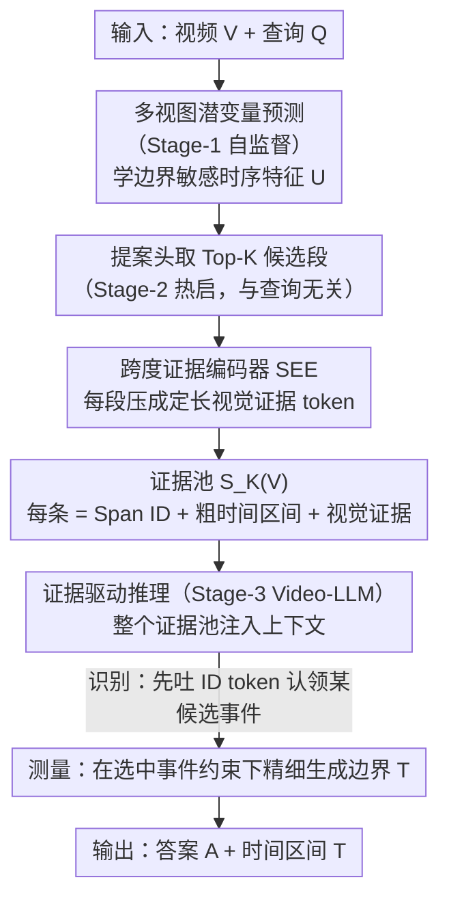

# Foresee-to-Ground: From Predictive Temporal Perception to Evidence-Driven Reasoning

**会议**: ICML 2026  
**arXiv**: [2605.21973](https://arxiv.org/abs/2605.21973)  
**代码**: 待确认  
**领域**: 视频理解 / 多模态 VLM / 视频时序定位  
**关键词**: 视频时序定位, Video-LLM, 证据池, Identify-then-Measure, 边界检测

## 一句话总结
Foresee-to-Ground (F2G) 把视频时序定位（VTG）从直接时间戳回归重构为「识别-测量」两阶段问题——先用预测性时序感知 + 跨度证据编码器构建候选事件证据池，再用 LLM 在选中事件的约束下精确生成边界，使 Charades-STA R@0.7 提升 4.1 个点、ActivityNet 提升 6.7 个点。

## 研究背景与动机

**领域现状**：Video-LLM 应用于 VTG 时主流方法是直接从展平的视觉 token 序列回归出时间戳，相当于在离散 token 空间和连续时间域之间做黑盒映射。

**现有痛点**：直接时间戳回归有两个核心问题：
- **数值脆弱性**：LLM 的离散 token 表示与连续时间坐标天然不对齐，导致时间戳预测不稳定、边界噪声大。
- **缺可验证性**：模型无法为预测提供显式证据支撑，用户难理解模型为何选择某个时间段。

**核心矛盾**：现有方法试图通过时间戳离散化或注入时序线索缓解问题，但本质仍在黑盒回归框架内运作，忽视了人类时序定位的认知过程——先做出显式事件承诺（识别），再精细化边界（测量）。

**本文目标**：把 VTG 重新表述为可验证的结构化预测问题，使模型能（1）首先显式地从证据池中选择候选事件（识别）；（2）在该事件假设的约束下精确定位边界（测量）。

**切入角度**：把人类的"先识别再测量"认知流程引入模型——构建视频范围内的显式证据池，把每个候选段表示为可被 LLM 引用的离散单位，绑定模型的时间戳生成到特定的事件假设上。

**核心 idea**：通过「预测性时序感知 + 证据驱动推理」的两部分设计，把 VTG 从无约束的数字回归转化为有证据支撑的引用-条件推理。

## 方法详解

### 整体框架
F2G 把 VTG 建模为三阶段结构化预测：
$$p(A, T, z \mid V, Q, \mathcal{S}_K(V)) = p(z \mid V, Q, \mathcal{S}_K(V)) \cdot p(A, T \mid z, V, Q, \mathcal{S}_K(V))$$
其中 $V$ 是视频、$Q$ 是查询、$T = (t^{st}, t^{ed})$ 是预测时间区间、$A$ 是答案、$z \in \{1, \ldots, K\}$ 是从证据池 $\mathcal{S}_K(V)$ 选中的候选段索引。第一项实现识别（Identify），第二项实现测量（Measure）。

三阶段课程：
- Stage-1（**预测性时序感知**）：无监督预训练时序模块，学边界敏感特征。
- Stage-2（**提案热启**）：有监督训练轻量提案头，提取 Top-K 候选并编码局部证据。
- Stage-3（**证据驱动推理**）：微调 Video-LLM 做有监督的识别-测量两阶段生成。

### 关键设计

**1. 多视图潜变量预测（Predictive Temporal Perception）：用"部分能否预测整体"的差异自动学到边界敏感特征**

直接边界回归数值不稳，根源之一是网络对"事件在哪里转折"没有显式表征。这一步在无标签视频上做自监督预训练：给定时序特征序列 $X \in \mathbb{R}^{N \times D}$，构造一个全局视图（完整时序）和多个局部视图（部分时序），最小化局部到全局的潜在预测损失

$$\mathcal{L}_{\text{pred}} = \mathbb{E}\left[\sum_{v \in \mathcal{V}} \|\text{sg}(U_g) - \hat{U}_g^{(v)}\|_2^2\right]$$

迫使共享时序主干去编码"能让全局动态从部分证据被预测出来"的特征。关键在于：相干事件内部长程动态相对可预测，可一旦到了事件边界，同样的局部证据会对应多种后续走向、预测损失陡增——网络因此自动学到边界敏感特征，无需任何边界标注。再叠一个切片各向同性高斯正则（SIGReg）稳住潜在空间的几何、避免表示坍缩。

**2. 跨度证据编码器（Span Evidence Encoder, SEE）：把不等长的候选事件压成等长视觉证据 token 供 LLM 引用**

候选事件长短不一，但 LLM 需要把每个候选当成一个可被引用的离散单位来处理，因此得先有统一长度的表示。对每个候选段 $T_k$，SEE 先裁出段内特征 $U_k = \text{Crop}(U, T_k) \in \mathbb{R}^{N_k \times D}$，再用 $M$ 个可学习 query token 经堆叠多头交叉注意（Q-Former 风格）聚合成定长证据 $P_k = \text{MHCAStack}(B, U_k) \in \mathbb{R}^{M \times D}$。之所以用交叉注意的软聚合而非简单 pooling，是因为它能让 query token 自适应地挑出段内最有判别力的帧，表达力更强。

**3. 证据驱动的识别-测量（Identify-then-Measure）：让 LLM 先承诺引用哪个事件，再在该事件约束下生成边界**

直接在整段视频 token 流上黑盒回归时间戳，既不稳定又无法溯源。F2G 把整个证据池 $\mathcal{S}_K(V) = \{(\langle\text{Span}_k\rangle, T_k, P_k)\}_{k=1}^K$ 作为上下文注入 LLM（每条证据含离散 ID、粗粒度时间区间、视觉 token），让模型先吐一个 ID token 显式"认领"某个候选事件（识别），再在该 ID 对应证据的条件下精细生成最终时间戳（测量）。三项损失 $\mathcal{L}_{S3} = \mathcal{L}_{LM} + \alpha \mathcal{L}_{id} + \beta \mathcal{L}_{\text{time}}$ 分别监督序列生成、证据 ID 预测和时间戳预测。如此一来，边界预测从"全视频上的无约束回归"被收窄成"特定事件假设下的局部精细化"，数值稳定性大幅提升；而显式的 ID 引用又让用户能看到模型到底选了哪个候选，预测因此可溯源。

### 训练策略
- Stage-1：无标签视频上预训练，多视图潜变量预测 + SIGReg。
- Stage-2：在 70K VTG 标注集上训提案头（回归 + 评分损失对齐提案质量）。
- Stage-3：在 220K 指令微调数据上 LoRA 微调 Video-LLM，同时小学习率保持时序模块和提案头可训练；添加轻量提案损失维持证据池质量。

## 实验关键数据

### 主实验

| 数据集 | 指标 | Qwen3-VL(baseline) | +FT | **+F2G-FT** | 提升 |
|--------|------|------------------|-----|-----------|------|
| Charades-STA | R@0.7 | 15.9% | 21.6% | **25.7%** | +4.1 |
| Charades-STA | mIoU | 40.4 | 42.9 | **47.2** | +4.3 |
| ActivityNet-Captions | R@0.7 | 17.3% | 21.7% | **28.4%** | +6.7 |
| ActivityNet-Captions | mIoU | 32.2 | 40.8 | **45.7** | +4.9 |
| QVHighlights | mAP | 21.3 | 24.6 | **29.7** | +5.1 |
| QVHighlights | HIT@1 | 32.6% | 36.8% | **45.6%** | +8.8 |

### 消融实验

| 配置 | Charades-STA R@0.7 | ActivityNet mIoU | 说明 |
|------|-------------------|------------------|------|
| F2G 完整 | 25.7% | 45.7 | 完整模型 |
| w/o SIGReg | 24.1% | 44.2 | 移除几何正则化，-1.6 |
| w/o Stage-1 | 20.9% | 41.8 | 无预训练，-4.8 |
| w/o 证据引用（ID） | 21.5% | 41.1 | 移除 ID 约束，-4.2 |
| w/o 证据视觉 token | 22.1% | 41.5 | 仅时间区间不用视觉证据，-3.6 |

### 关键发现
- Stage-1 预训练和 SIGReg 是性能关键，完全移除导致 4-5 个点掉分，特别在高 IoU 阈值上。
- 证据引用（ID 约束）带来最大收益（约 3-4%），显式事件承诺对稳定性提升最显著。
- 跨模型迁移稳定：相同 F2G-FT 方案应用到 LLaVA、Qwen2.5 等不同骨干都带来稳定 +3-9% mIoU 提升。
- 稳定性分析（独立解码两次）：F2G 的 $|\Delta\text{IoU}|$ 分布更集中在 0 附近，重复推理方差远小于基线——证据约束有效降低推理不稳定性。

## 亮点与洞察
- **范式转变的简洁性**：Identify-then-Measure 符合人类认知，自然解决数值稳定性问题；可迁移到其他需要精确定位的感知任务（空间检测、密集字幕）。
- **多视图潜变量预测的巧妙性**：用全局视图 vs 局部视图的可预测性差异自动学边界特征，无需显式边界标注——优雅的自监督信号。
- **模块化和可迁移**：三阶段流程彼此解耦，可轻松适配不同 Video-LLM 骨干（验证了 LLaVA、Qwen2.5 / 3）。
- **计算成本低**：仅添加 0.5B 参数（相对 8B 模型约 6%），推理延迟 < 5%，证据序列化只增加 100-200 token。

## 局限与展望
- 证据池质量上界制约 Identify-then-Measure 精度——Top-K 候选都没真实事件时 LLM 必败。
- K 值敏感性：当前固定 Top-8，对极长视频（数小时）可能需自适应。
- 跨域泛化未明确：训练数据混合 DiDeMo / ActivityNet / VTimeLLM，对新闻 / 体育等完全不同领域未知。
- 改进方向：（1）动态 / 递归证据池支持多轮精化；（2）不确定性估计支持模型拒绝生成；（3）结合 RL 用 IoU 奖励微调 Stage-3。

## 相关工作与启发
- **vs TimeChat / VTimeLLM**：这些方法在直接时间戳回归框架内改进（注入时序线索、离散化时间），但本质仍是无约束回归；F2G 通过证据约束使推理可控。
- **vs 自监督视频表示**（masked reconstruction、predictive learning）：先前主要做迁移学习；F2G 创新地把预测性预训练直接用于 VTG 中的事件发现。
- **vs 稠密视频字幕**：两者都涉及事件定位，F2G 的证据池思想可借鉴到字幕系统实现可溯源的事件描述。

## 评分
- 新颖性: ⭐⭐⭐⭐  Identify-then-Measure 是合理的新视角，多视图预测用于边界学习也有新意；单个组件不算特别激进。
- 实验充分度: ⭐⭐⭐⭐⭐  3 个 VTG 基准 + 跨骨干验证 + 消融齐全 + 稳定性实证，扎实。
- 写作质量: ⭐⭐⭐⭐  逻辑清晰，方法易理解，实验分析深入；一些细节讨论可更深。
- 价值: ⭐⭐⭐⭐⭐  VTG 实际应用价值高，F2G 通用性强；预计被后续工作采纳和扩展。

<!-- RELATED:START -->

## 相关论文

- [\[CVPR 2025\] ViTED: Video Temporal Evidence Distillation](../../CVPR2025/video_understanding/vited_video_temporal_evidence_distillation.md)
- [\[ICML 2026\] VideoSEAL: Mitigating Evidence Misalignment in Agentic Long Video Understanding by Decoupling Answer Authority](videoseal_mitigating_evidence_misalignment_in_agentic_long_video_understanding_b.md)
- [\[ICML 2026\] SkelHCC: A Hyperbolic CLIP-Driven Cache Adaptation Framework for Skeleton-based One-Shot Action Recognition](skelhcc_a_hyperbolic_clip-driven_cache_adaptation_framework_for_skeleton-based_o.md)
- [\[ICML 2026\] Video-MTR: Reinforced Multi-Turn Reasoning for Long Video Understanding](video-mtr_reinforced_multi-turn_reasoning_for_long_video_understanding.md)
- [\[AAAI 2026\] R-AVST: Empowering Video-LLMs with Fine-Grained Spatio-Temporal Reasoning in Complex Audio-Visual Scenarios](../../AAAI2026/video_understanding/r-avst_empowering_video-llms_with_fine-grained_spatio-temporal_reasoning_in_comp.md)

<!-- RELATED:END -->
