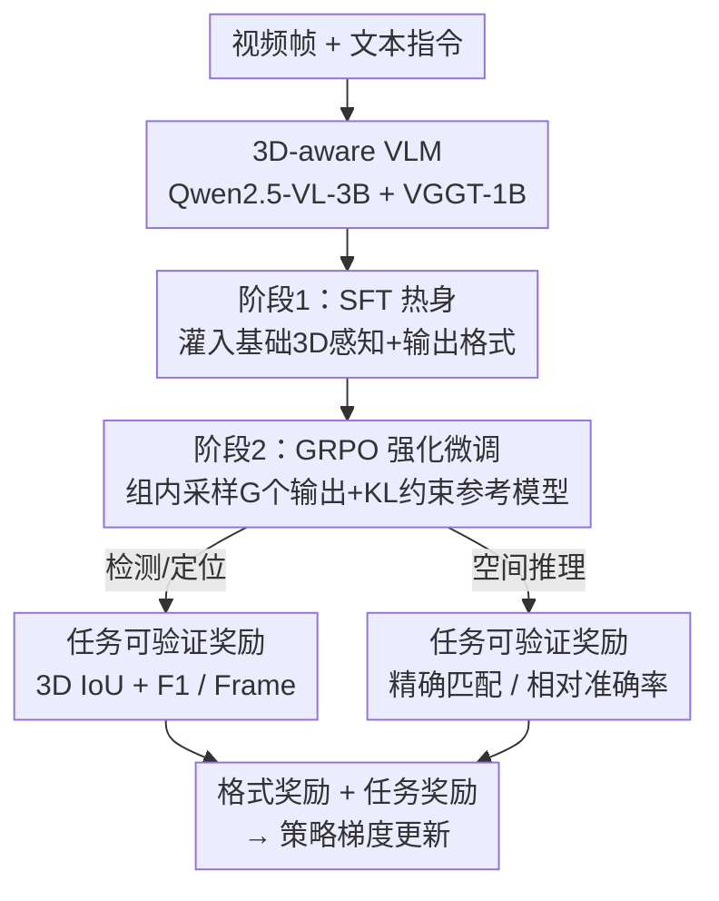

# 3D-RFT: Reinforcement Fine-Tuning for Video-based 3D Scene Understanding

**会议**: ICML 2026  
**arXiv**: [2603.04976](https://arxiv.org/abs/2603.04976)  
**代码**: 见项目主页（论文称 Code is available on project page）  
**领域**: 多模态VLM / 3D视觉 / 强化学习  
**关键词**: RLVR, GRPO, 可验证奖励, 视频3D感知, 空间推理

## 一句话总结
把面向 LLM 的「可验证奖励强化学习（RLVR）」搬到视频驱动的 3D 场景理解上：用 GRPO 直接以 3D IoU、F1、准确率等评测指标当奖励来微调一个 4B 的 3D-aware VLM，让训练目标和评测口径对齐，最终在 3D 视频检测、3D 视觉定位、空间推理三类任务上以 4B 参数反超 8B 基线。

## 研究背景与动机

**领域现状**：把 3D 场景当成 RGB 视频流喂给多模态大模型（MLLM）正在成为主流——不需要点云/深度等专用传感器，靠普通摄像头加 MLLM 的时序能力就能做检测、定位、空间问答。代表工作 VG LLM 已经验证了「纯视频输入也能做跨帧检测和 3D 视觉定位」。

**现有痛点**：这些方法几乎都用监督微调（SFT）来训练。在 3D 感知任务里，模型把 3D 包围盒输出成「一串文本浮点数」，SFT 用逐 token 的交叉熵（CE）损失去拟合这串数字。问题是：**优化发生在离散 token 空间，评测却在连续的 3D 坐标系里**。输出 token 必须先解码、解析成几何结构，再去算 3D IoU 这类指标——CE 损失只是评测的「间接代理」，根本没法刻画预测的真实几何质量。token 级别拟合得再像，3D IoU 也可能很差。

**核心矛盾**：那为什么不直接把 3D IoU 当 loss？因为评测管线**不可微**：文本转 3D 框要做离散字符串解析，IoU 又含 $\text{IoU} > 0.25$ 这种阶跃判定，直接接进反向传播会产生零梯度或未定义梯度，训练直接卡死。于是「指标驱动的监督信号」和「可微 SFT」之间存在一道天然的墙。

**本文目标**：在不需要可微评测管线的前提下，让模型**直接朝评测指标优化**，覆盖 3D 感知（检测、定位）和 3D 空间推理两大类任务。

**切入角度**：RLVR 不要求 loss 可微——它只需要一个**确定性的验证器**给输出打一个标量奖励。GPT-o1、DeepSeek-R1 已经证明 RLVR 在数学/代码推理上能突破 SFT 的天花板。作者的假设是：3D 评测指标（IoU、F1、准确率）本身就是天然的可验证奖励，正好补上这道墙。

**核心 idea**：用「指标即奖励」替代「拟合 token」——把 3D IoU / F1 / 准确率包装成严格遵循评测协议的可验证奖励，用 GRPO 做强化微调，把学习范式从「序列模仿」切换到「指标驱动的策略优化」。

## 方法详解

### 整体框架
3D-RFT 要解决的是「训练目标 ↔ 评测指标错位」，整体走一条**两阶段流水线**：先用 SFT 把基础 3D 感知能力和输出格式「热身」灌进一个 3D-aware VLM，得到一个稳定的初始策略；再用 GRPO + 可验证奖励做强化微调，把模型直接推向评测指标。

模型主体 3D-RFT-4B 建在 VG LLM-4B 上：MLLM 主干是 Qwen2.5-VL-3B-Instruct，几何主干是 VGGT-1B，VGGT 抽出的几何特征对齐到 Qwen 视觉特征结构后逐元素相加，形成混合视觉表征再喂进 LLM。所有任务统一输出格式：先在 `<think>...</think>` 里写推理链，再在 `<answer>...</answer>` 里给最终预测（感知任务里 3D 框是 9-DoF 元组 $b=(x,y,z,w,h,d,\psi,\theta,\phi)$，统一到第一帧坐标系）。

### 关键设计

**1. 两阶段训练：SFT 热身打底，再上 GRPO 强化**

现成 MLLM 缺乏原生 3D 感知能力，直接上 RL 会因为初始策略太差而采样不到有效奖励信号。所以第一阶段先用 SFT 最大化真值序列的对数似然 $\mathcal{L}_{\text{SFT}}(\theta) = -\sum_{t=1}^{T}\log\pi_\theta(y^*_t \mid x, I, y^*_{<t})$，把基础 3D 场景理解能力和 `<think>/<answer>` 输出格式灌进去，得到稳定的初始策略。第二阶段才用 GRPO 做强化微调，让模型在这个起点上被指标驱动着继续打磨。消融显示这步「热身」不可省：若把第二阶段也换成继续 SFT（SFT→SFT），ScanRefer Acc@0.25 只从 31.9 升到 34.2；换成 SFT→RL 则升到 38.2，说明真正的增益来自 RL 而非多训一轮。

**2. GRPO + KL 约束：去掉 critic 的组内相对优化**

3D 输出序列长、视频上下文显存开销大，传统 PPO 还要再养一个 critic 网络估值，代价更高。GRPO 是 PPO 的省显存变体：对每个输入 $(I, x)$ 从旧策略采一组 $G$ 个输出 $\{y_1,\dots,y_G\}$，直接用**组内统计**当 baseline 来算优势，$A_i = \frac{R_i - \text{mean}(\{R_1,\dots,R_G\})}{\text{std}(\{R_1,\dots,R_G\})}$，省掉了价值网络。优化目标在最大化期望优势的同时，用 KL 散度把策略拉住参考模型 $\pi_{\text{ref}}$ 不让它跑偏：

$$\mathcal{L}_{\text{GRPO}}(\theta) = -\frac{1}{\sum_i T_i}\sum_{i=1}^{G}\sum_{t=1}^{T_i}\min\!\big(r_{i,t}A_i,\ \text{clip}(r_{i,t},1-\epsilon,1+\epsilon)A_i\big) + \beta\,\mathbb{D}_{\text{KL}}[\pi_\theta \| \pi_{\text{ref}}]$$

其中 $r_{i,t}$ 是新旧策略的 token 概率比。针对长视频上下文，作者还用了 loss chunking 技术进一步压显存。

**3. 任务专属可验证奖励：让奖励严格等于评测指标**

这是全文的灵魂——奖励不是手设的代理分，而是**逐字照搬评测协议**算出来的。奖励 = 格式奖励（JSON 语法、框元组是否合法，$R_{\text{Format}}\in\{0,1\}$）+ 任务奖励，三类任务各设一套：

- **3D 视频检测**：用平均 IoU 奖励 $R_{\text{IoU}}^{(\text{Det})}=\frac{1}{N}\sum_{i=1}^{N}\mathcal{I}_i$ 提供密集信号；再加 F1 奖励 $R_{\text{F1}}=\frac{2\cdot\text{TP}}{2\cdot\text{TP}+\text{FP}+\text{FN}}$（预测框与未匹配真值框 IoU 超过 $\tau_{F1}=0.25$ 记 TP），直接对齐最终评测指标。合并为 $R_{\text{Det}}=R_{\text{IoU}}^{(\text{Det})}+R_{\text{F1}}$。
- **3D 视觉定位**：要时空双精度。时间上用平滑线性衰减 $R_{\text{frame}}=\max\!\big(0, 1-\frac{|f_{\text{pred}}-f_{\text{gt}}|}{\tau_{\text{frame}}}\big)$（$\tau_{\text{frame}}=5$）给帧索引一个密集信号；空间上把预测框用外参矩阵和轴对齐矩阵投到全局坐标 $b'_{\text{pred}}=M_{\text{align}}M^{(f_{\text{pred}})}_{c\to g}b_{\text{pred}}$ 再算全局 3D IoU $R_{\text{IoU}}^{(\text{Grd})}$，合并为 $R_{\text{Grd}}=R_{\text{frame}}+R_{\text{IoU}}^{(\text{Grd})}$。
- **3D 空间推理**：按题型分派验证器——多选用精确匹配 $R_{\text{MC}}=\mathbb{1}(y=y^*)$；数值题（如计数）用平均相对准确率 $R_{\text{num}}=\frac{1}{10}\sum_{\tau\in\mathcal{C}}\mathbb{1}\!\big(\frac{|y-y^*|}{|y^*|}<1-\tau\big)$，$\mathcal{C}=\{0.50,0.55,\dots,0.95\}$。

这套设计的关键不在某个公式多新，而在于「奖励 = 评测指标」这条对齐——它绕开了不可微的墙，又把 SFT 那种「token 拟合很准但 IoU 很差」的错位彻底消掉。

### 损失函数 / 训练策略
两阶段：阶段一最小化 SFT 对数似然 $\mathcal{L}_{\text{SFT}}$；阶段二最小化 GRPO 目标 $\mathcal{L}_{\text{GRPO}}$（含 KL 惩罚，系数 $\beta$）。感知任务 SFT 用 ScanRefer / Scan2Cap / ScanNetDetection；RFT 用 ScanNetDetection（检测）和 ScanRefer（定位）。空间推理 SFT 默认用 VSI-298K（DA）+ CoT-10K（TA）混合，RFT 用 VSI-298K 在「先思考再回答（TA）」设定下进行。

## 实验关键数据

### 主实验
3D-RFT-4B 在三类任务上全面提升，并以 4B 参数反超 8B 的 VG LLM。下表汇总最有代表性的对比（ScanNetDetection 为 4-frame 设定，ScanRefer 括号为带 proposal refinement）：

| 任务 / 数据集 | 指标 | SFT 基线 (VG LLM-4B) | 3D-RFT-4B | VG LLM-8B | 提升(vs SFT) |
|--------------|------|----------------------|-----------|-----------|--------------|
| 3D 检测 / ScanNetDetection | F1@0.25 | 38.2 | 43.7 | 41.2 | +5.5 |
| 3D 检测 / ScanNetDetection | Precision@0.25 | 41.7 | 54.2 | 43.4 | +12.5 |
| 3D 检测 / ScanNetDetection | Recall@0.25 | 35.7 | 38.2 | 39.6 | +2.5 |
| 3D 定位 / ScanRefer | Acc@0.25 | 36.4 | 42.9 | 41.6 | +6.5 |
| 3D 定位 / ScanRefer | Acc@0.5 | 11.8 | 15.9 | 14.9 | +4.1 |
| 空间推理 / VSI-Bench | Avg | 47.3 | 62.8 | — | +15.5 |

在 VSI-Bench 上 3D-RFT-4B 平均 62.8，超过 7B 的 VLM-3R（60.9）和 3B 的 VST-RL（57.7）拿到 SOTA，尤其在数值推理类别（如物体计数 71.2、绝对距离 53.5）领先明显。检测任务里大物体涨幅最大（「浴缸」+16.5、「桌子」+6.9），小物体如「垃圾桶」涨幅有限，作者推测和视觉分辨率有关。

### 消融实验

| 训练策略 | 3D 先验 | ScanRefer Acc@0.25 | ScanRefer Acc@0.5 |
|----------|---------|--------------------|--------------------|
| SFT | None | 31.9 | 9.3 |
| SFT → SFT | None | 34.2 | 10.4 |
| SFT → RL | None | 38.2 | 12.1 |
| SFT | VGGT | 36.4 | 11.8 |
| SFT → RL | VGGT | 42.9 | 15.9 |

### 关键发现
- **增益来自 RL 而非多训**：同样多一个阶段，SFT→SFT 只到 34.2，SFT→RL 到 38.2，证明是「指标驱动优化」在起作用，而不是数据多过一遍。
- **对视觉输入鲁棒**：不管有没有 VGGT 几何先验，RFT 都稳定涨点（无先验 31.9→38.2，有先验 36.4→42.9），说明这套范式不依赖特定的 3D 表征增强。
- **RFT 的地基靠 DA+TA 数据**：SFT 阶段同时用「直接答案（DA）」和「思考再答（TA/CoT）」数据时，RFT 的准确率和奖励都最高；换成低质量 CoT 或只用其一都会掉，说明高质量 CoT 数据对 RFT 起点很关键。
- **RFT 能跨设定迁移**：在 TA 任务上做 RFT 还能顺带提升 DA 任务表现，而继续 SFT 反而会让性能小幅下滑。

## 亮点与洞察
- **「奖励 = 评测指标」是最干净的对齐思路**：它一句话点破了 SFT 在结构化几何输出上的根本病——token 空间和坐标空间错位。把不可微评测搬成可验证奖励，等于把整条评测管线直接当成监督信号，思路朴素却切中要害。
- **4B 反超 8B 很有说服力**：同一主干下，仅换学习范式（SFT→RFT）就让半数参数的模型超过两倍参数的 SFT 基线，强有力地说明「优化目标本身」比「堆参数」更值钱。
- **可验证奖励的设计模板可迁移**：把任意「评测协议」拆成「格式奖励 + 密集任务奖励（连续指标）+ 阈值化指标奖励（F1/准确率）」的配方，可以直接套到其他结构化输出任务（如布局生成、轨迹预测）上。
- **密集 vs 稀疏奖励的搭配**：检测里同时用平均 IoU（密集、连续）和 F1（稀疏、阈值化）两路奖励——前者保证几何精度有梯度可循，后者直接顶住最终指标，是个值得借鉴的「双奖励」组合。

## 局限与展望
- **小物体仍是短板**：检测里小物体涨幅有限，作者自己也归因于视觉分辨率不足，说明这套范式没解决感知分辨率的根本瓶颈。
- **依赖 SFT 热身和高质量 CoT 数据**：RFT 的天花板被 SFT 起点和 CoT 数据质量明显限制，低质量 CoT 直接拖垮训练，意味着数据构造成本不低。
- **奖励工程偏任务特定**：每类任务都要手工对齐一套验证器和阈值（$\tau_{F1}=0.25$、$\tau_{\text{frame}}=5$ 等），换新任务需要重新设计奖励，泛化到开放式 3D 任务时这部分人力不可忽略。
- **未触及奖励黑客问题**：用指标当奖励时，模型可能学会钻指标空子（如压低召回换精度），论文对这类 reward hacking 的讨论较少。

## 相关工作与启发
- **vs VG LLM（SFT 基线）**：同一套 Qwen2.5-VL-3B + VGGT 主干，VG LLM 用 SFT 拟合 token，本文换成 GRPO + 指标奖励；区别在于把优化目标从「序列似然」换成「评测指标」，因此 4B 能反超它的 8B 版本。
- **vs 数学/代码 RLVR（GPT-o1、DeepSeek-R1）**：它们在纯文本可验证任务上跑通 RLVR，本文把它系统性地扩展到「视频 3D 感知 + 空间推理」这种带几何解码的多模态任务，难点在于把不可微的 3D 评测包装成可验证奖励。
- **vs VST（并行工作）**：VST 也用 RLVR 训练通用视频空间模型，但本文跨「3D 感知 / 时空定位 / 空间推理」做了更系统的研究，并给出了学习目标、模型组件、数据配置、训练动态等多维度分析。

## 评分
- 新颖性: ⭐⭐⭐⭐ 不是发明新算法，但「把 RLVR 系统性搬到视频 3D 理解、奖励严格对齐评测指标」这一步切口准、落地实。
- 实验充分度: ⭐⭐⭐⭐⭐ 覆盖检测/定位/推理三类任务，主结果+消融+训练动态齐全，4B 反超 8B 的对照很有力。
- 写作质量: ⭐⭐⭐⭐ 动机推导（token 空间 vs 坐标空间错位）讲得清楚，奖励设计公式完整。
- 价值: ⭐⭐⭐⭐ 给 3D 场景理解提供了一个可复用的 RFT 范式，奖励配方对其他结构化输出任务有迁移价值。

<!-- RELATED:START -->

## 相关论文

- [\[ACL 2026\] CAPruner: Conceptual-Adjacent Scene Graph Pruner for Enhancing 3D Spatial Reasoning of Large Language Models](../../ACL2026/vlm_reasoning/capruner_conceptual-adjacent_scene_graph_pruner_for_enhancing_3d_spatial_reasoni.md)
- [\[ICML 2026\] R$^3$L: Reasoning 3D Layouts from Relative Spatial Relations](r3l_reasoning_3d_layouts_from_relative_spatial_relations.md)
- [\[NeurIPS 2025\] To Think or Not To Think: A Study of Explicit Thinking in Rule-Based Visual Reinforcement Fine-Tuning](../../NeurIPS2025/vlm_reasoning/think_or_not_think_a_study_of_explicit_thinking_in_rule-based_visual_reinforceme.md)
- [\[NeurIPS 2025\] AffordBot: 3D Fine-grained Embodied Reasoning via Multimodal Large Language Models](../../NeurIPS2025/vlm_reasoning/affordbot_3d_fine-grained_embodied_reasoning_via_multimodal_large_language_model.md)
- [\[CVPR 2026\] Beyond 3D VQAs: Injecting 3D Spatial Priors into Vision-Language Models for Enhanced Geometric Reasoning](../../CVPR2026/vlm_reasoning/beyond_3d_vqas_injecting_3d_spatial_priors_into_vision-language_models_for_enhan.md)

<!-- RELATED:END -->
