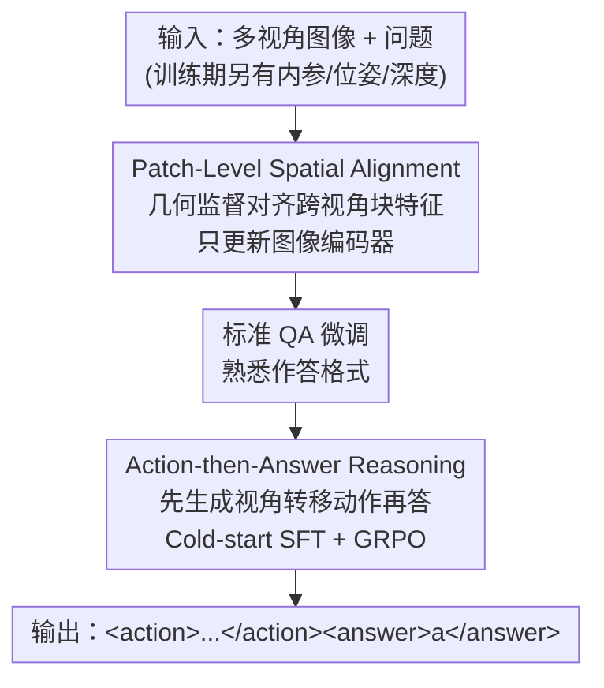

# From Correspondence to Actions: Human-Like Multi-Image Spatial Reasoning in Multi-modal Large Language Models

**会议**: ICML2026  
**arXiv**: [2602.08735](https://arxiv.org/abs/2602.08735)  
**代码**: https://stjohn2007.github.io/HATCH_project/ (项目页)  
**领域**: 多模态VLM / 空间推理 / 强化学习  
**关键词**: 多图空间推理, 跨视角对应, 视角变换, GRPO, 几何监督

## 一句话总结
HATCH 受人类空间认知启发，给多模态大模型设计两个互补训练目标——用几何监督让跨视角对应的图像块特征对齐（PaStA），再用强化学习逼模型先生成显式的"换视角动作"再回答（ActoR）——只用 3B 底座就把多图空间推理刷到能和 GPT-5.2 掰手腕的水平。

## 研究背景与动机

**领域现状**：多模态大模型（MLLM）在单图空间推理上已经做得不错，但很多真实场景（多个监控摄像头、多机器人协同）需要从**同一物理场景的多个视角**整合信息来回答问题。这类多图空间推理要求模型不仅独立理解每张图，还要把不同视角下的局部观测对齐、拼接成统一的空间理解。

**现有痛点**：现有模型在跨视角聚合信息上很不可靠。主流做法要么靠大规模 QA 微调硬学，根本没显式建模多图机制；要么借 3D 专用模型/几何编码器隐式注入对应关系；要么把视角变换塞进基于地图的推理或任务特定的推理流水线。这些做法都只**部分地、隐式地**碰到了关键机制，缺乏对核心能力的显式监督。

**核心矛盾**：认知科学指出，人类解多图空间题靠两套机制——(1) **跨视角对应**（cross-view correspondence）：认出不同视角里指向同一物理位置的区域，哪怕有外观变化、遮挡、部分重叠；(2) **逐步视角变换**（stepwise viewpoint transformation）：把相对视角变化（如旋转、平移）一步步组合起来推理。但已有工作从没把这两套机制**联合且显式**地塞进同一个学习目标。

**本文目标**：设计一个训练框架，对这两套人类认知机制都给出**显式监督**，且不在推理时依赖任何额外几何输入（相机内参、位姿、深度只在训练时用来构造监督信号）。

**核心 idea**：把"怎么看"和"怎么动"拆成两个串行训练阶段——PaStA 先教模型"怎么看"（用几何对齐跨视角的块特征），ActoR 再教模型"怎么动"（用强化学习生成显式视角转移动作再作答）。

## 方法详解

### 整体框架

HATCH（Human-Aware Training for Cross-view correspondence and viewpoint cHange）的输入是同一场景下来自不同视角的一组图像 $\mathcal{I}=\{I_1,\dots,I_N\}$ 加一个自然语言问题 $Q$，输出是答案。训练时额外假设能拿到每张图的相机内参、相机位姿、深度图——但这些几何信号**只用于构造监督**，绝不作为模型输入，推理时模型只看到图像和问题。

整个方法把开头提到的两套认知机制对应成两个互补目标，**串行**施加：先用 PaStA 只更新图像编码器（语言模型冻结），教模型跨视角对齐特征、学会"怎么看"；再用 ActoR 训练完整模型生成显式视角转移动作、学会"怎么动"。完整训练配方还在两者之间插了一步标准 QA 微调来熟悉作答格式。

### 关键设计

**1. Patch-Level Spatial Alignment（PaStA）：用几何监督把跨视角对应的图像块在特征空间拉齐**

多图场景的一个核心失败模式是：不同视角里指向同一物理位置的区域，在表征空间里却映射到不一致的特征，逼着模型在推理时隐式地现场推断对齐关系。PaStA 直接用训练期的几何信息构造**块级对应目标**来显式监督图像编码器。具体地，把每张图切成 $n\times n$ 的块，用相机内参、位姿、深度算出跨视角的块到块重叠矩阵：对图 $X$ 的块 $i$，把块内像素用深度反投影成 3D 点再投到图 $Y$，若投影深度与 $Y$ 的深度在阈值 $t$ 内一致就算几何一致，由此得到有向重叠矩阵 $M_{X\rightarrow Y}[i,j]$（块 $i$ 的像素有多大比例一致落入块 $j$）。再对称化成

$$S=\tfrac{1}{2}\left(M_{X\rightarrow Y}+M_{Y\rightarrow X}^{\top}\right),$$

每个元素 $S[i,j]\in[0,1]$ 量化两块的空间对应强度。然后把几何导出的目标分布 $p(j\mid i)=\mathrm{softmax}_j(S[i,:]/\tau_1)$ 与模型按块特征余弦相似度算出的预测分布 $q(j\mid i)=\mathrm{softmax}_j(\cos(\mathbf{e}_i^X,\mathbf{e}_:^Y)/\tau_2)$ 对齐，双向最小化交叉熵 $\mathcal{L}_{\text{CL}}$。软目标 $p$ 容忍部分重叠和遮挡，这正是几何监督比硬一对一匹配更鲁棒的地方。此阶段**只更新图像编码器、冻结语言模型**，避免把对应学习和语言生成纠缠在一起。

**2. Action-then-Answer Reasoning（ActoR）：把"换视角"做成显式动作作为中间推理步**

就算跨视角区域已经对齐，回答多图问题往往还要把视角变化**组合**起来才能合成证据（比如某个物体关系只有换个视角才显现）。与其让这种组合在推理里隐式发生，ActoR 把视角转移做成**显式动作**作为可解释的中间表示，类似语言模型里的思维链。模型对所有无序图像对 $(i,j),\,i<j$ 生成动作序列

$$\mathcal{A}=\{(i,j,\mathbf{a}_{i\rightarrow j})\mid 1\le i<j\le N\},$$

每个 $\mathbf{a}_{i\rightarrow j}$ 是一串原子相机操作，动作词表固定为 turn_left/right_deg、turn_up/down_deg、move_forward_m、move_up/down_m。输出统一为 `<action> 𝒜 </action> <answer> a </answer>` 格式，先动作后答案。

**3. Cold-Start SFT + 可验证奖励的 GRPO：先定格式，再用几何与答案双奖励精修**

ActoR 不是直接上强化学习。先做一段 **cold-start SFT**：用相对相机位姿离线把相对变换分解成旋转和平移、构造教师动作序列，目的仅仅是让模型**熟悉 Action-then-Answer 的输出结构**，而非提升任务表现。之后用 **GRPO** 精修，总奖励是三项加权和

$$R=\lambda_1 R_{\text{act-acc}}+\lambda_2 R_{\text{ans-acc}}+\lambda_3 R_{\text{format}},$$

其中 $R_{\text{act-acc}}$ 评估生成动作的几何准确度（基于预测与目标运动向量的几何比较），$R_{\text{ans-acc}}$ 评估最终答案对错，$R_{\text{format}}$ 是二值的格式校验。格式奖励二值、两个准确度奖励给连续反馈。这套"几何可验证 + 答案可验证"的双奖励，把中间监督直接对齐到视角变换本身——和 MindCube、SpatialLadder 那种在抽象中间表示（心智地图）上做 RL 形成对比，ActoR 监督的是具体的视角转移动作。

### 损失函数 / 训练策略

完整训练配方是分阶段的：① PaStA 调图像编码器学跨视角对应（语言模型冻结）；② 标准 QA 微调（无动作标注）让整个多模态模型熟悉目标任务的作答；③ ActoR（cold-start SFT + GRPO）提升动作生成与最终答案。计算开销可控：PaStA 只更新编码器、比全量训练轻得多；cold-start SFT 只用 10% 数据；ActoR 的动作奖励只是运动向量的简单几何比较，相比自由形式语言推理的 GRPO 额外开销很小。训练数据从 SPAR-7M 里挑多图样本随机采 10,000 条，底座为 Qwen2.5-VL-3B。

## 实验关键数据

### 主实验

在三个多图空间推理基准 SPAR-Bench-MV、MindCube-Tiny、MMSI-Bench 上评测。HATCH 相比底座 Qwen2.5-VL-3B 平均提升 **+14.2%**，在所有 3B 底座模型中三个基准全部拿到最高平均分。

| 模型 | SPAR-Bench-MV | MindCube-Tiny | MMSI-Bench | Overall |
|------|---------------|---------------|------------|---------|
| Qwen2.5-VL-3B（底座） | 24.9 | 37.8 | 25.6 | 29.4 |
| SpatialLadder-3B（主要 baseline） | 35.8 | 46.8 | 23.6 | 35.4 |
| Spatial-MLLM-4B | 30.4 | 37.6 | 24.1 | 30.7 |
| Qwen2.5-VL-72B | 35.4 | 42.2 | 31.8 | 36.5 |
| **HATCH（3B）** | **53.6** | **50.2** | 27.0 | **43.6** |
| GPT-5.2（专有，参考） | 52.6 | 58.4 | 42.0 | 51.0 |

相比底座，HATCH 在 SPAR-Bench-MV 上 +28.7 点、MindCube-Tiny 上 +12.4 点、MMSI-Bench 上 +1.4 点。值得注意的是：仅用 3B 底座就在 SPAR-Bench-MV / MindCube-Tiny 上**超过 32B/72B 开源模型和 7B 空间推理模型**，说明增益来自推理结构而非模型容量；在 SPAR-Bench-MV 上 53.6% 直接**追平 GPT-5.2 的 52.6%**。MMSI-Bench 差距仍大（GPT-5.2 42.0% vs 27.0%），但该基准多数模型在 Attribute/Motion 类目低于随机水平（25%），差异本身难以可靠解读。

### 消融实验

在 SPAR-Bench-MV 上逐组件消融（下标为相对完整 HATCH 的变化）：

| 配置 | Low | Middle | High | Avg. | 说明 |
|------|-----|--------|------|------|------|
| HATCH（完整） | 41.3 | 47.4 | 67.1 | 53.6 | 两组件齐全 |
| w/o PaStA | 39.3 | 43.5 | 67.4 | 52.0 (-1.6) | 去掉跨视角对齐 |
| w/o ActoR | 35.4 | 45.8 | 66.5 | 51.1 (-2.5) | 去掉动作推理 |
| w/o both | 36.9 | 44.8 | 67.1 | 51.5 (-2.1) | 仅 QA cold-start SFT |

### 关键发现
- **两组件互补、各管一块**：去掉 PaStA 在 Middle 类（强调换视角下的跨视角推理）掉得最狠（-3.9 点），印证它负责学视角一致表征；去掉 ActoR 主要伤 Low 类（深度/距离估计，-5.9 点），说明显式视角动作帮助几何推断。
- **训练有清晰两阶段**：GRPO 训练里动作奖励先涨、QA 奖励后涨——正符合"先学会换视角动作、再用动作辅助作答"的设计；去掉 PaStA 会让动作奖励和 QA 奖励全程一起退化，说明对应对齐的表征是准确动作生成的更好地基。
- **块网格不能太细**：PaStA 的网格分辨率在 $n=4$ 时最好，$n\ge5$ 反而掉点——过细的网格会破坏对应学习。
- **保住单图能力**：HATCH 在提升多图推理的同时，单图空间推理基准上仍有竞争力，没有顾此失彼。

## 亮点与洞察
- **把认知科学的两套机制各配一个可验证监督**：跨视角对应配几何对齐损失、视角变换配几何动作奖励，"怎么看"和"怎么动"各有抓手且互补——这是它能用 3B 打过 72B 的根本原因。
- **几何信息只进监督不进输入**：训练期用深度/位姿造监督，推理期零额外几何依赖，部署时不需要任何 3D 传感器，工程上很干净。
- **动作即思维链的空间版**：把视角转移做成 JSON 动作序列当显式中间步，让空间推理像 CoT 一样可解释、可验证；动作奖励只是运动向量的几何比较，几乎不增开销。
- **软对应目标的设计很关键**：用 softmax 软分布而非硬一对一匹配，天然容忍遮挡和部分重叠，这是几何监督在真实多视角下能用的前提，可迁移到任何跨视角表征学习。

## 局限与展望
- **依赖静态场景假设**：方法建立在"场景几何跨视角一致"上，PaStA 的几何监督要求一致的 3D 对应，动态场景不适用。
- **训练期需要完整几何标注**：内参、位姿、深度都得有（虽然推理不用），这限制了能用的训练数据来源。
- **MMSI-Bench 仍是短板**：在更多样的推理需求上（Attribute/Motion 等）增益微弱且多数模型低于随机水平，说明 HATCH 主要攻克的是对应与视角类问题，更广义的多图推理还需补强。
- **动作词表固定且离散**：原子相机操作词表是预设的，是否覆盖所有视角变换、连续运动如何表达，论文未深究。

## 相关工作与启发
- **vs SpatialLadder / MindCube**: 他们也用 GRPO + 可验证奖励做空间推理，但中间目标是抽象表示（心智地图、任务特定奖励）；HATCH 的 ActoR 把中间步落在**具体的视角转移动作**上，监督直接对齐到视角变换本身。
- **vs Spatial-MLLM / 几何编码器增强类**: 他们靠 3D 专用模型或几何编码器**隐式**注入对应；HATCH 用 PaStA **显式**地块级对齐特征，且推理时不需要这些几何模块。
- **vs CroCo 等跨视角表征学习**: CroCo 靠跨视角补全学几何一致表征，但只为表征学习、不直接支持多图推理；PaStA 把几何监督的特征对齐**适配到多图空间推理**，对齐的是同一 3D 位置的块特征。

## 评分
- 新颖性: ⭐⭐⭐⭐⭐ 把人类空间认知的两套机制各配一个可验证监督并串成框架，思路清晰且少见。
- 实验充分度: ⭐⭐⭐⭐ 三基准 + 完整消融 + 训练动态 + 网格分析，但 MMSI-Bench 上结论受限于基准本身难度。
- 写作质量: ⭐⭐⭐⭐⭐ 动机—机制—验证逻辑链顺，认知科学动机贯穿始终。
- 价值: ⭐⭐⭐⭐⭐ 3B 打平 GPT-5.2、推理零额外几何依赖，对资源受限的空间推理落地很有参考价值。

<!-- RELATED:START -->

## 相关论文

- [\[ICML 2026\] Vision-aligned Latent Reasoning for Multi-modal Large Language Model](vision-aligned_latent_reasoning_for_multi-modal_large_language_model.md)
- [\[ACL 2026\] OMIBench: Benchmarking Olympiad-Level Multi-Image Reasoning in Large Vision-Language Models](../../ACL2026/vlm_reasoning/omibench_benchmarking_olympiad-level_multi-image_reasoning_in_large_vision-langu.md)
- [\[CVPR 2026\] Evolving Contextual Safety in Multi-Modal Large Language Models via Inference-Time Self-Reflective Memory](../../CVPR2026/vlm_reasoning/evolving_contextual_safety_in_multi-modal_large_language_models_via_inference-ti.md)
- [\[CVPR 2026\] Mimic Human Cognition, Master Multi-Image Reasoning: A Meta-Action Framework for Enhanced Visual Understanding](../../CVPR2026/vlm_reasoning/mimic_human_cognition_master_multi-image_reasoning_a_meta-action_framework_for_e.md)
- [\[CVPR 2026\] dMLLM-TTS: Self-Verified and Efficient Test-Time Scaling for Diffusion Multi-Modal Large Language Models](../../CVPR2026/vlm_reasoning/dmllm-tts_self-verified_and_efficient_test-time_scaling_for_diffusion_multi-moda.md)

<!-- RELATED:END -->
