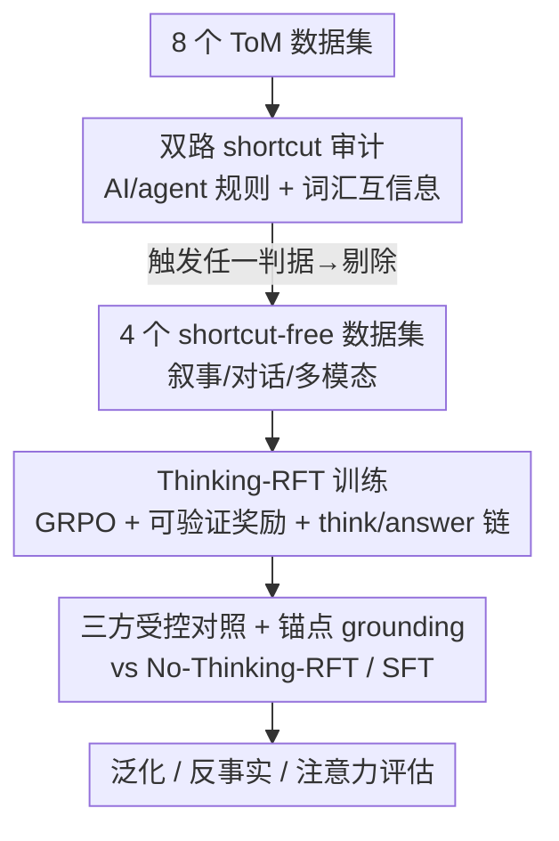

# From Shortcuts to Reasoning: Robust Post-Training of Theory of Mind with Reinforcement Learning

**会议**: ICML 2026  
**arXiv**: [2606.09092](https://arxiv.org/abs/2606.09092)  
**代码**: https://github.com/jkz-338/Robust-ToM-RL  
**领域**: LLM推理 / 心智理论(ToM) / 强化微调  
**关键词**: Theory of Mind、RLVR、Thinking-RFT、数据捷径(shortcut)、可验证奖励

## 一句话总结
作者先揭示主流 ToM 数据集被"捷径"污染（不靠真正心智推理、靠虚假相关就能刷到 99%），提出一个轻量审计框架把这些数据集筛掉，再在四个无捷径数据集上系统证明：带显式推理链的强化微调（Thinking-RFT）比 SFT 平均高 6%、在高阶/多模态场景高 10% 左右，且泛化和反事实鲁棒性都更好——因为 RL 教会模型把推理锚定在真正的因果线索上。

## 研究背景与动机
**领域现状**：让基础模型具备心智理论（Theory of Mind, ToM）——推断他人的信念、意图、欲望、知识——被视为安全、自然人机交互的关键能力。近期工作主要靠两条路提升 ToM：一是围绕强骨干（如 GPT-4o）做精心设计的多步提示 / agentic 框架 / 贝叶斯心智状态推断；二是用后训练（post-training）直接把能力灌进模型。

**现有痛点**：第一条路推理时复杂度高、部署困难；第二条路看似有效，但作者在标准 benchmark 上后训练时遇到诡异现象——在 Hi-ToM 上，**高阶问题反而比低阶更容易**（3/4 阶 >95%，1/2 阶仅 89.5%），而且模型产出的推理链逻辑混乱。手动一查发现一条近乎完美的捷径：答案就是"最外层 agent 离开现场时物体所在的位置"，根本不需要递归推理。LLM 零样本就能发现并利用这类捷径，于是不训练也能接近满分。

**核心矛盾**：很多 ToM 数据集可以被**虚假因果/词汇相关**（spurious correlation）"解决"，而非真正的心智推理。用它们做评测尚可接受，但一旦拿来训练，就会：①把训练方法的优劣排名颠倒（让人选错策略）；②掩盖模型规模收益；③损害泛化甚至诱发负迁移；④只教会捷径、教不会推理。这让"到底哪种后训练策略最好"这个问题无法被诚实回答。

**本文目标**：拆成两个子问题——先**系统审计** ToM 数据集、把有捷径的剔除；再在干净数据上**公平比较** SFT、Thinking-RFT、No-Thinking-RFT，弄清显式推理 + RL 何时、为何能提升 ToM。

**切入角度**：作者观察到"纯状态追踪（如 belief）类问题极易有捷径，而需要超越追踪的心智类问题（如 intention）天然更鲁棒"，于是把审计和训练都建立在区分这两类问题之上。

**核心 idea**：先用"AI 规则 + 词汇互信息"双判据把捷径数据集筛掉，再证明**只有"显式推理链 + 可验证奖励 RL"的联合作用**才能真正激发 ToM——RL 的本质是教模型把推理锚定到对应因果因子的关键 token 与状态变化上。

## 方法详解

### 整体框架
本文不是提出一个新模型，而是提出一套"先审计、再训练、后归因"的研究管线，落点是回答"如何稳健地后训练 ToM"。流程分三段：① 用轻量审计框架扫描 8 个流行 ToM 数据集，凡触发因果捷径或词汇捷径任一判据即标记为"有捷径"，最终保留 4 个无捷径数据集（OpenToM、ToMATO、MMToM、MuMA-ToM，覆盖叙事 / 对话 / 多模态三类语境）；② 在这些干净数据上，用统一配方做三种后训练对照——SFT、带推理链的 Thinking-RFT、去掉推理链的 No-Thinking-RFT；③ 通过泛化 / 反事实 / 注意力可视化分析，归因 RFT 为何有效。

### 关键设计

**1. 双路 shortcut 审计框架：用最便宜的两把尺子量出"假 ToM"**

针对"数据集被虚假相关污染、却没人系统检测"这个痛点，作者设计了两条计算极廉价、互补的判据，任一触发即判定数据集有捷径。第一条是 **AI/agent 引导的规则**：在一个分层种子集 $\mathcal{D}_{\text{seed}}$ 上让冻结的 LLM 枚举候选捷径规则（如"最后出现的位置""belief 问题的世界状态泄漏""首个提及的 agent""选项长度/位置"），每条规则实现为零更新启发式 $h_k$，在 held-out 切片 $\mathcal{D}_{\text{probe}}$ 上算命中率 $A(h_k)=\frac{1}{|\mathcal{D}_{\text{probe}}|}\sum_{(x,y)}\mathbf{1}\{h_k(x)=y\}$。令 $A_0=\max\{1/K,\ A_{\text{majority}}\}$ 为随机/多数基线，若 $A(h_k)-A_0\ge\delta_{\text{abs}}$（默认 $\delta_{\text{abs}}=0.2$）且 p-value < 0.05，就认定它是一条可信捷径。第二条是 **词汇互信息**：对上下文-选项重叠、选项长度等表面特征 $Z$，算它与正确标签 $Y$ 的互信息 $I(Z;Y)=\sum_{z,y}p(z,y)\log\frac{p(z,y)}{p(z)p(y)}$，用 $Y$ 的熵归一化到 $[0,1]$ 后跨特征平均得到 $S_{\text{lex}}$，$S_{\text{lex}}\ge 0.15$ 即标记。妙在"只要让强 LLM 去找捷径就能命中约 80% 的简单捷径"——审计成本远低于重做数据集，却能在训练前就拦下污染数据。

**2. Thinking-RFT：可验证奖励 + 显式推理链的强化微调**

针对"SFT 只会模仿答案、学不到递归推理"的痛点，作者采用 RLVR（可验证奖励强化学习）路线。优化算法沿用 DeepSeek-R1 的 **GRPO**（Group Relative Preference Optimization），但把 KL 系数 $\beta$ 设为 0——实验表明这个正则对 ToM 推理并无必要（换成 DAPO、GSPO 略好但不更差）。提示模板要求模型"先在 `<think>...</think>` 里写推理、再在 `<answer>...</answer>` 里给最终答案"。奖励是格式奖励 + 准确率奖励之和：$R_{\text{format}}=1$ 当输出同时含 think/answer 标签否则 0，$R_{\text{accuracy}}=1$ 当抽取的答案匹配真值否则 0，$R_{\text{overall}}=R_{\text{format}}+R_{\text{accuracy}}$。整个奖励是规则可验证的、无需训练奖励模型。这与 SFT 的本质区别是：SFT 直接监督"输出答案"，而 RFT 通过探索 + 可验证反馈，让模型自己摸索出能稳定答对的推理轨迹。

**3. 三方受控对照 + 锚点 grounding 归因：剥离"推理"与"RL"各自的贡献**

为了回答"到底是推理重要、还是 RL 重要、还是二者缺一不可"，作者设计了关键的三方对照：Thinking-RFT（推理链 + RL）、**No-Thinking-RFT**（RL 但不写推理链，即 RLVR 去掉显式 CoT）、SFT（监督但无 RL）。结果显示 Thinking-RFT 平均比 No-Thinking-RFT 高 7%、比 SFT 高 6%，说明 **ToM 收益来自"推理 + RL"的联合作用，单独任一项都不够**。机理上，作者通过注意力可视化发现：Thinking-RFT 教会模型把注意力锚定（ground）在对应因果因子的"锚点线索"上——关键词与状态变化——从而做出精确的递归推理；而捷径数据训练出的模型 90% 的时间产出逻辑不通的推理链。这一归因把"为什么有效"落到了可观测的注意力证据上，而非泛泛而谈。

## 实验关键数据

### 主实验
骨干为 Qwen2.5-7B-Instruct 及其 VL 变体，对比 SFT、zero-shot 及推理时算法 SimToM、AutoToM；所有结果取三个随机种子平均。

| 场景 / 数据集 | 指标 | Thinking-RFT | SFT | 相对提升 |
|--------------|------|-------------|-----|---------|
| OpenToM（叙事，7B 总均值） | Acc | 89.14 | 83.14 | +6.0 |
| OpenToM（attitude 心智类，7B） | Acc | — | — | +11 pts |
| ToMATO（对话） | Acc | — | — | +2.08 |
| MMToM + MuMA-ToM（多模态均值） | Acc | 82.20 | 74.75 | +7.45 |
| 多模态 vs 推理时 AutoToM | Acc | 82.20 | 58.00 | +24.2 |

在多模态上 Thinking-RFT（82.20）远超需要复杂推理时算法的 AutoToM（58.00）与 SimToM（50.10），说明后训练能把"过去只能靠复杂推理时管线达到"的 ToM 能力直接灌进模型。

### 捷径污染的受控验证 / 泛化 / 鲁棒消融
在 ExploreToM（有捷径）上训练、Hi-ToM 上 OOD 测试，揭示捷径数据的危害；并测一阶→二阶、跨数据集泛化与反事实鲁棒。

| 配置 | 关键指标 | 说明 |
|------|---------|------|
| 在 ExploreToM(有捷径)训练，7B | In-domain 94.3 / OOD 35.3 | 排名被颠倒：No-Thinking-RFT(96.1) > SFT(95.8) > Thinking-RFT，与干净数据相反 |
| 缩放 3B→7B（ExploreToM 有捷径） | 93–96% 持平 | 捷径掩盖了模型规模收益 |
| 一阶→二阶泛化（OpenToM，仅训一阶） | RFT 74.33 vs SFT 65.33 | RFT 二阶高 +9，despite 一阶相当(95 vs 93) |
| 跨数据集（OpenToM→ExploreToM） | RFT 71.0 vs SFT 63.5 vs ZS 62.0 | 仅 Thinking-RFT 在两个 OOD 上都正向，SFT 时好时坏 |
| 反事实改写（OpenToM） | RFT 跌 7.90 vs SFT 跌 17.14 | RFT 对反事实更稳 |
| 未见环境（MMToM 五个新场景） | RFT 平均跌 2.44 vs SFT 跌 7.31 | RFT 保留更好 |

### 关键发现
- **捷径是"假 ToM"的根因**：8 个数据集里有 4 个（ExploreToM、ToMi、Hi-ToM、FANToM）严重有捷径，Hi-ToM 最甚——捷径解整体 95%、3/4 阶达 99%。在有捷径数据上训练会颠倒方法排名、掩盖规模收益、损害泛化、教不会真推理，且这些坏处对 SFT/RFT 都成立，证明根因在数据而非训练法。
- **RFT 的优势几乎全来自二阶**：一阶几乎无增益（+0.0%），二阶高出 SFT +10.3%，说明它强在递归信念归因（"A 认为 B 相信什么"）。
- **心智类 > 追踪类**：RFT 在 intention（+3.6 pts）、desire（+3.3）、attitude（OpenToM +11/+8）这类需要真心智推理的类别增益更大，在 location、multi-hop 这类纯追踪类增益较小，印证"超越状态追踪才是 ToM 难点"。
- **纯状态追踪问题最易藏捷径**：LLM 生成的数据里，只需 belief 状态追踪的题目极易被捷径攻破，而 intention 类天然鲁棒——这给未来 ToM 调优集制作提供了直接建议。

## 亮点与洞察
- **"先审计数据再下结论"是这篇最有价值的方法论**：它指出 ToM 后训练领域一个被忽视的系统性陷阱——刷分上去不代表学到了心智推理，甚至会把方法排名带反。这个反思可迁移到任何用合成数据做后训练的方向（数学、agent、安全）。
- **审计框架"廉价到反直觉"**：仅靠"让强 LLM 自己找捷径"就能命中约 80% 的简单捷径，再加一个词汇互信息兜底，几乎零成本就能在训练前拦截污染数据，非常实用。
- **三方对照精确剥离了"推理"与"RL"的贡献**：No-Thinking-RFT 这个对照设计是点睛之笔，它直接证明二者缺一不可，而不是含糊地说"RL 有用"。
- **把"为什么有效"落到注意力锚点上**：用注意力可视化显示 RFT 教模型锚定关键词/状态变化，这种机制级归因比单纯报告涨点更有说服力，也提示了 ToM 推理的可解释抓手。

## 局限与展望
- **作者承认**：审计框架主要覆盖"简单"的因果/词汇捷径（命中约 80%），更隐蔽的捷径可能漏检；对有捷径数据集的判定也带阈值（$\delta_{\text{abs}}=0.2$、$S_{\text{lex}}\ge0.15$）经验性。
- **基座单一**：主实验集中在 Qwen2.5-7B/VL 系列（加 3B 验证缩放），未跨更多架构/更大规模验证结论的普适性。
- **可验证奖励的边界**：格式 + 准确率的规则奖励对答案明确的 ToM 题有效，但对开放式、答案难自动校验的心智推断场景如何设计奖励仍是开放问题（作者在附录探索了 ToM 专用奖励 $R_{\text{tom}}$）。
- **改进思路**：可把审计框架做成持续运行的"数据体检"工具，并探索更强的捷径生成-对抗式数据清洗；反事实鲁棒性仍有掉点（RFT 跌 7.9），值得专门正则。

## 相关工作与启发
- **vs 推理时 ToM 算法（SimToM / AutoToM）**：它们靠围绕强骨干的多步提示 / 贝叶斯心智推断在推理时拼出 ToM，复杂且难部署；本文用后训练把能力直接灌进模型，多模态上 82.2 vs AutoToM 58.0，部署更简单。
- **vs SFT 后训练**：SFT 直接监督答案，易学到捷径、二阶与跨域泛化差；Thinking-RFT 用可验证奖励 + 推理链探索，二阶 +10.3%、跨域更稳。
- **vs No-Thinking-RFT**：同样用 RL 但去掉显式推理链，平均低 7%，证明 ToM 必须"推理 + RL"联合，单靠 RL 不够。
- **启发**：任何"合成数据 + 后训练"的工作都应先做捷径审计；可验证奖励 + 显式推理链的配方在"答案可规则校验"的推理任务上（不止 ToM）都值得复用。

## 评分
- 新颖性: ⭐⭐⭐⭐⭐ 把"数据捷径"系统化为审计框架并重写了 ToM 后训练结论，视角新颖
- 实验充分度: ⭐⭐⭐⭐⭐ 8 数据集审计 + 4 干净数据 + 三方对照 + 泛化/反事实/注意力，三种子平均，扎实
- 写作质量: ⭐⭐⭐⭐ 逻辑链清晰（先质疑数据再下结论），个别表格符号略密
- 价值: ⭐⭐⭐⭐⭐ 对 ToM 乃至所有合成数据后训练都有方法论警示与可复用配方

<!-- RELATED:START -->

## 相关论文

- [\[CVPR 2026\] MindPower: Enabling Theory-of-Mind Reasoning in VLM-based Embodied Agents](../../CVPR2026/vlm_reasoning/mindpower_enabling_theoryofmind_reasoning_in_vlmba.md)
- [\[ICML 2026\] From Seeing to Thinking: Decoupling Perception and Reasoning Improves Post-Training of Vision-Language Models](from_seeing_to_thinking_decoupling_perception_and_reasoning_improves_post-traini.md)
- [\[ICML 2026\] iVGR: Internalizing Visually Grounded Reasoning for MLLMs with Reinforcement Learning](ivgr_internalizing_visually_grounded_reasoning_for_mllms_with_reinforcement_lear.md)
- [\[ICML 2025\] Overcoming Multi-step Complexity in Multimodal Theory-of-Mind Reasoning: A Scalable Bayesian Planner](../../ICML2025/vlm_reasoning/overcoming_multi-step_complexity_in_multimodal_theory-of-mind_reasoning_a_scalab.md)
- [\[CVPR 2026\] R-C2: Cycle-Consistent Reinforcement Learning Improves Multimodal Reasoning](../../CVPR2026/vlm_reasoning/r-c2_cycle-consistent_reinforcement_learning_improves_multimodal_reasoning.md)

<!-- RELATED:END -->
