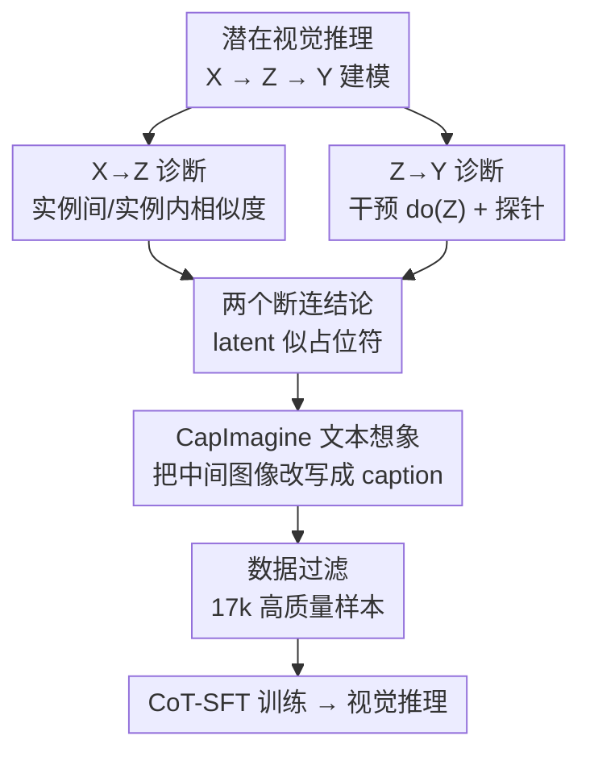

# Imagination Helps Visual Reasoning, But Not Yet in Latent Space

**会议**: ICML2026  
**arXiv**: [2602.22766](https://arxiv.org/abs/2602.22766)  
**代码**: 已开源（论文标注 open-sourced）  
**领域**: 多模态VLM推理 / 视觉推理  
**关键词**: 潜在视觉推理, 因果中介分析, 视觉想象, 文本空间推理, MLLM

## 一句话总结
本文用因果中介分析把「潜在视觉推理（用 MLLM 隐状态当 latent token 来做视觉想象）」拆成 $X\to Z\to Y$ 的因果链，实证发现 latent token 既不随输入变化（输入-潜在断连）也几乎不影响答案（潜在-答案断连），从而质疑其必要性，并提出把视觉想象显式写成文本的简单替代法 CapImagine，在视觉感知基准上反超复杂的潜在空间方法。

## 研究背景与动机
**领域现状**：MLLM 视觉推理近来火热，复杂任务要求模型「主动感知」图像。一类做法是带工具推理（zoom-in、画线等），但工具集僵硬、和人类原生想象差距大；另一类是潜在视觉推理（LVR / Mirage / Monet），不把隐状态解码成文本，而是直接拿最后一层 transformer 隐状态当「latent token」在高维潜空间里「想象」，并用视觉特征或教师隐表示来监督这些 latent token，经验上在多个视觉任务上表现不错。

**现有痛点**：尽管效果看着好，潜在视觉推理「为什么有效」始终是黑箱——没人验证过 MLLM 究竟有没有在 latent 空间里真的做了审慎推理，还是只是借助了别的捷径。

**核心矛盾**：如果 latent token 既不编码输入相关的视觉信息、也不真正驱动最终答案，那么它对推理的因果贡献就是虚的，整个范式的「必要性」就站不住脚。

**本文目标**：(i) 用因果工具系统检验 latent token 在 $X\to Z\to Y$ 链条中的真实作用；(ii) 如果 latent 不灵，找一个更忠实、更可解释、因果上更有效的替代。

**切入角度**：把潜在推理建模成因果中介过程——输入 $X$ 是 treatment，latent token $Z$ 是中介，答案 $Y$ 是 outcome，分别做 $P(Z\mid do(X))$ 和 $P(Y\mid do(Z))$ 的干预，看中介到底通不通。

**核心 idea**：先用因果中介分析证明「latent 想象目前是假的」，再用「把视觉想象显式写成文本」这一极简数据改造（CapImagine）证明「想象在文本空间反而是真的、更强的」。

## 方法详解

### 整体框架
全文是「先诊断、再开方」的两段式。诊断段把潜在推理抽象成因果链 $X\to Z\to Y$，对输入端和潜在端各做一类系统扰动，分别检验 $X\to Z$ 与 $Z\to Y$ 两条因果是否成立；结论是两条都断（加上一个探针分析证明 latent 本身编码的视觉语义也极少）。开方段顺势提出 CapImagine：不再依赖 latent 变量，而是把训练数据里那些「中间想象图像」带来的语义变化，全部改写成文本 caption，逼模型用一条显式的文本推理链「想象」视觉变换。输入是图像集 $\{I_i\}$ 加问题 $q$，潜在推理形式化为在每步自适应地在「输出普通文本 token」与「输出 latent token」之间切换：

$$y_i=\mathbb{I}(i\in\mathcal{I}_L)\cdot\phi(h_i)+\mathbb{I}(i\notin\mathcal{I}_L)\cdot E(\text{Decode}(h_i)),$$

其中 $h_i$ 是隐状态、$\mathcal{I}_L$ 是 latent token 下标集、$\phi$ 是可选投影层。CapImagine 则把整条链都留在文本空间。

### 关键设计

**1. 因果中介分析框架：把「latent 到底有没有用」变成可干预的因果问题**

针对「潜在推理是黑箱、有效性来源不明」的痛点，本文不停留在比指标，而是把过程显式建成因果链 $X\to Z\to Y$，再用 do-演算分别检验两条边。这一框架的价值在于：它能把「模型答对了」与「latent 真的参与了推理」区分开——后者要求中介 $Z$ 既随 treatment $X$ 变化、又对 outcome $Y$ 有因果效应，两者缺一就说明 latent 只是「搭便车」。分析对象覆盖三个代表性方法（通用蒸馏的 Monet、用图像特征监督的 LVR、任务特化的 Mirage），并和文本/图像 token、MLLM 内部表示作对照。

**2. 两个断连的实证诊断：输入-潜在断连 + 潜在-答案断连**

第一条 $X\to Z$ 用扰动输入看 latent 变不变。实例间分析发现：不同实例、不同任务在同一位置的 latent token 余弦相似度奇高，说明它们几乎不编码图像/问题信息，连任务级粗粒度区分都抓不住；实例内分析发现随着推理推进 latent token 逐步退化、收敛成高度相似的簇（LVR 第二步就塌、Monet 撑到第五步），而文本推理的隐状态相似度则一直很低、状态转移清晰。第二条 $Z\to Y$ 用干预 $do(Z)$ 看答案变不变：对 Monet 把所有位置/实例的 latent 强制设成同一张量，对 Mirage 还试了注入高斯噪声、整体替换成噪声、置零等。结果是在 V*、HR-Bench、MME-RealWorld-Lite 上这些剧烈改动只带来微小波动——V* 整体甚至涨 0.5%，HR-Bench-4K 和 MME-RealWorld-Lite 仅分别掉 1.0% 和 0.7%。再加一个探针分析：只拿 latent token 当唯一输入去回答围绕同一图像区域新构造的 30 道选择题，准确率连「纯文本瞎猜」都不如，而给原图时 Monet 和 Qwen3-VL-32B 都能到 76.67%。三条发现合起来：latent token 高度同质（发现1）、对答案贡献甚微（发现2）、编码语义极少（发现3），其行为更像 soft prompt 或占位符，而非视觉想象的主动载体。

**3. CapImagine 文本空间想象 + 数据过滤：用显式 caption 替代 latent，并保证数据干净**

既然 latent 不灵，CapImagine 把视觉想象搬回文本。它基于 Monet-SFT-125K 做两类图像改写：对 Visual-CoT / Zebra-CoT 这类「放大关键区域」的子集，把原问题连同高亮区域喂给 Qwen3-VL-4B，让它生成聚焦该区域语义的简洁 caption；对 Refocus / CogCoM 这类「标注/画线」的子集，则把原图和操作后图一起给模型，让它描述视觉差异、显式说出操作揭示的关键信息（如标注的数值、高亮的文字实体）。这样语言就完整承载了辅助图像的语义，彻底绕开 latent 表示。为避免改写文本生硬插入破坏逻辑连贯，再用 MLLM 全局润色整条推理链。关键的是数据过滤：占 Monet-SFT-125K 高达 94.88% 的 Visual-CoT 数据质量低，存在「最终答案与新生成的视觉观察冲突」「问题过于模糊或本质不可答」两类问题，本文用 MLLM 对每条样本的推理正确性与问题歧义度做质量评估、剔除明显有缺陷者，过滤后保留 17k 高质量样本；为排除数据量差异的影响，还专门做了消融对齐 Monet 的比较。

### 损失函数 / 训练策略
没有新损失：模型基于 Qwen2.5-VL-7B，用 Monet 代码库在重构数据上做标准 CoT-SFT，8×A800-80G、batch size 1、梯度累积 16，并按训练中表现挑最佳 checkpoint 以缓解训练不稳。核心「方法」是数据形态的改造（latent 监督 → 文本想象）而非新模块或新目标。

## 实验关键数据

### 主实验
在 V*、HR-Bench-4K/8K、MME-RealWorld-Lite、BLINK 等以高分辨率细粒度感知为主的基准上，与潜在想象法（LVR、Monet）、工具法（PixelReasoner、DeepEyes）及专有模型对比（节选 Overall 分数）：

| 方法 | 类别 | V* | HR-Bench-8K | MME-RW-Lite | BLINK-MV |
|------|------|------|------|------|------|
| Qwen2.5VL-7B | 基座 | 76.4 | 63.8 | 45.8 | 42.9 |
| LVR | 潜在想象 | 81.7 | 63.0 | 50.6 | 46.6 |
| Monet | 潜在想象 | 83.3 | 68.0 | 46.9 | 47.4 |
| DeepEyes | 工具 | 90.0 | 72.6 | 53.2 | - |
| **CapImagine** | 文本想象 | **85.9** | **70.7** | **54.8** | **49.6** |

CapImagine 在 V* 上比 Monet 高约 2.6%、HR-Bench-8K 高约 2.7%、MME-RealWorld-Lite 上从 46.9 提到 54.8（论文称约 4.9% 量级提升 ⚠️ 以原文为准），并在抽象推理（Jigsaw、多视图）上比 LVR/Monet 高 10 余分，TableVQA 上较 Monet 提升约 6.1%；仅略逊于靠 RL 做 zoom-in 的 DeepEyes。

### 消融实验
针对 CapImagine 的两步数据改造做消融（V*/HR-Bench-8K Overall）：

| 配置 | V* | HR-Bench-8K | 说明 |
|------|------|------|------|
| CapImagine（完整） | 85.9 | 70.7 | 改写 + 过滤 |
| w/o Rewriting | 82.7 | 69.8 | 去掉文本改写，掉到接近 Monet |
| w/o Filtering | 82.7 | 69.3 | 不做质量过滤，提升受低质数据拖累 |

两项各去其一都明显掉点，说明「把视觉变换显式写成文本」和「滤掉冲突/不可答样本」缺一不可。

### 关键发现
- 对 latent token 施加最强干预（统一成同一张量、换成高斯噪声、置零）大多只造成 ≤1% 波动，是「潜在-答案断连」最直接的证据；只有 Mirage stage-2 置零时因引发重复输出才大幅下降。
- 探针分析里 latent-only 输入解题还不如纯文本瞎猜，而有原图时同模型可达 76.67%，说明 latent 几乎没存住可用的视觉证据。
- CapImagine 用同源数据（Monet-SFT-125K，过滤到 17k）就反超 Monet，且在需要全局结构重建的 Jigsaw/多视图上优势最大，说明显式文本想象比 latent 想象更能保住可操作的视觉语义。

## 亮点与洞察
- 把因果中介分析引入「潜在推理有没有用」的检验，是方法论上的亮点：用 $do(X)$、$do(Z)$ 两类干预把「答对」与「中介真参与」干净分离，比单纯刷点更有说服力。
- 「latent token 像 soft prompt / 占位符」这一判断有三条互证的证据（同质性、干预不敏感、探针失败），结论扎实，对整个 LVR 方向是有价值的冷水。
- CapImagine 的可迁移点在于「把本应发生在隐空间的视觉变换显式 verbalize 成文本」——任何带中间图像/工具操作的多模态推理数据，都能用这种「图像差异→caption→润色→过滤」的流水线改造成纯文本 CoT。

## 局限与展望
- 诊断结论是「目前的」latent 方法不灵，而非「latent 想象原理上不可行」（标题已点明 not yet）；作者也强调全潜力尚未被挖掘，方法本身未给出「如何把 latent 做对」的路径。
- 因果分析样本规模有限（如 100 条实例、30 道探针题），且集中在 Monet/LVR/Mirage 三个代表方法上，结论对未来更强的 latent 监督是否成立仍待验证。
- CapImagine 仍略逊于靠 RL 做真实图像 zoom-in 的 DeepEyes，说明「直接重放图像」带来的互补收益尚未被文本想象完全替代；且依赖 Qwen3-VL-4B 做改写与 MLLM 做过滤，质量受改写器能力上限约束。

## 相关工作与启发
- **vs 工具增强视觉推理（DeepEyes / PixelReasoner）**: 它们用固定工具（zoom-in/画图）或 RL 主动感知真实像素，CapImagine 不调工具、把视觉操作写成文本想象，更轻量但在纯感知上仍略逊 DeepEyes。
- **vs 潜在视觉推理（Mirage / LVR / Monet）**: 同属「想象」路线，但本文用因果分析证明这些 latent token 是占位符式的，并用文本想象在同源数据上反超它们。
- **vs 既有文本空间推理（Vision-R1 / R1-Onevision 等）**: 普通文本 CoT 缺乏具体中间视觉证据，CapImagine 的文本想象「锚定」在真实中间图像的语义改写上，因此比无证据的长链推理更忠实。

## 评分
- 新颖性: ⭐⭐⭐⭐ 用因果中介分析系统证伪潜在视觉推理的有效性，角度新、结论有冲击力。
- 实验充分度: ⭐⭐⭐⭐ 诊断（实例间/内 + 干预 + 探针）与方法（多基准 + 消融）都较完整，惟分析样本规模偏小。
- 写作质量: ⭐⭐⭐⭐ 「先诊断后开方」结构清晰，因果链与发现一一对应。
- 价值: ⭐⭐⭐⭐ 给 LVR 方向泼了有依据的冷水，并给出可复现的文本想象替代，对社区有方向性意义。

<!-- RELATED:START -->

## 相关论文

- [\[CVPR 2026\] Monet: Reasoning in Latent Visual Space Beyond Image and Language](../../CVPR2026/vlm_reasoning/monet_reasoning_in_latent_visual_space_beyond_image_and_language.md)
- [\[CVPR 2026\] Latent Implicit Visual Reasoning](../../CVPR2026/vlm_reasoning/latent_implicit_visual_reasoning.md)
- [\[ACL 2026\] Forest Before Trees: Latent Superposition for Efficient Visual Reasoning](../../ACL2026/vlm_reasoning/forest_before_trees_latent_superposition_for_efficient_visual_reasoning.md)
- [\[CVPR 2026\] Machine Mental Imagery: Empower Multimodal Reasoning with Latent Visual Tokens](../../CVPR2026/vlm_reasoning/machine_mental_imagery_empower_multimodal_reasoning_with_latent_visual_tokens.md)
- [\[ICML 2026\] Vision-aligned Latent Reasoning for Multi-modal Large Language Model](vision-aligned_latent_reasoning_for_multi-modal_large_language_model.md)

<!-- RELATED:END -->
