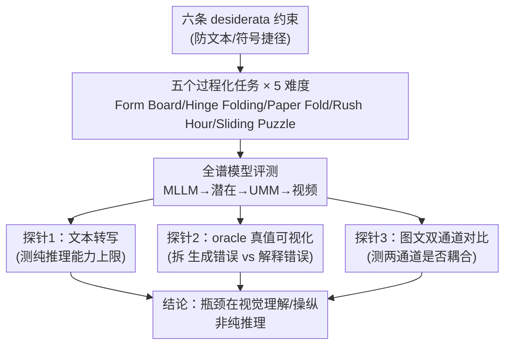

# MentisOculi: Revealing the Limits of Reasoning with Mental Imagery

**会议**: ICML2026  
**arXiv**: [2602.02465](https://arxiv.org/abs/2602.02465)  
**代码**: 有（论文称随文发布生成器代码，⚠️ 具体仓库以原文为准）  
**领域**: 多模态VLM / 视觉推理 / Benchmark  
**关键词**: 心理意象、视觉推理、统一多模态模型、过程化基准、生成-解释错误

## 一句话总结
作者造了一个程序化、分层难度的多步视觉推理基准 MentisOculi（五个"只能靠脑内成像解"的任务），系统检验前沿模型能否像人一样用"心理意象"辅助推理，结论是**目前所有显式视觉策略（潜在 token、生成图像、视频）都无法稳定超越纯文本基线**——更尖锐的是，统一多模态模型（UMM）即使被喂入正确的真值可视化也用不起来，暴露出"生成错误"叠加"解释错误"的双重瓶颈。

## 研究背景与动机

**领域现状**：前沿模型正从"只能吃视觉输入"的多模态大语言模型（MLLM）转向能原生交织生成文本/图像/视频的**统一多模态模型（UMM）**（如 Emu3.5、Gemini 2.5/3）。这激发了一个诱人设想：让模型在推理中途生成中间可视化作为辅助，类比人类的"心理意象（mental imagery）"——人设计一条裙子时会在脑中想象各拼片的组合并据此调整，这种能力被认为对问题求解和新知识生成至关重要。

**现有痛点**：机器心理意象的效用其实**很不明确**。现有"视觉推理"基准绝大多数测的是"关于视觉信息的推理（reasoning about images）"，而不是"用视觉表征来推理（reasoning with images）"；那些尝试用交织图像辅助推理的工作结果也含糊——潜在视觉 token、UMM 生成图像在多步设置下增益时有时无。

**核心矛盾**：关键问题没人能回答——当模型失败时，到底是**根本推理能力不足**、**图像生成有缺陷**、还是**无法解读自己生成的线索**？领域缺一个能把这三个因素拆开的严格框架。现有基准还普遍踩坑：Zebra-CoT/MIRA 违反"视觉本性"（靠先验知识）、STARE 类用网格布局"信息密度太低"（轻易能转成文本）、很多任务缺"序列操作"（只需单步规则应用）、不少不是严格过程化的或缺分层难度。

**本文目标**：造一个**只能靠形成、维持、反复操纵视觉表征来解**的基准，从而把"推理能力 / 生成保真 / 解释能力"三者解耦，并据此判断显式视觉思维到底是不是死路。

**核心 idea**：用六条 desiderata（视觉本性、高信息密度、序列操作、过程化、分层、生成可行）约束任务设计，配上**真值视觉思维链**作为 oracle，用"喂真值可视化还能不能涨"这把手术刀切开生成错误与解释错误。

## 方法详解

这是一篇 benchmark + 诊断性分析论文，"方法"即基准的设计原则、五个任务、以及解耦失败模式的实验探针。

### 整体框架

MentisOculi 由五个多步视觉推理任务组成，每个任务都过程化生成、跨五个难度等级（难度旋钮 = 求解所需最少步数 Levels 1–5，每级 30 个样本）。整套评测覆盖从隐式到显式的全谱推理范式：纯文本 MLLM → 潜在视觉推理模型 → 生成图像的 UMM → 纯像素的视频模型。核心诊断逻辑是：先看各范式在所有任务上的表现，再在 Rush Hour 这一代表任务上做家族对比，最后用三把探针（文本转写、oracle 真值可视化、图文双通道对比）定位失败到底卡在哪。

### 关键设计

**1. 六条 desiderata：把"必须靠脑内成像"逼成硬约束**

针对的痛点是现有基准让模型能用文本/符号捷径绕过视觉。作者列了六条任务设计准则堵死捷径：**视觉本性**（测空间关系、几何约束、物体变换，而非常识或纯符号逻辑）、**高信息密度**（避免网格世界和符号排布——那些能被轻易转写成 "Piece A at (0,1)" 的短文本，改用复杂形状、连续/离格变换、细粒度视觉细节）、**序列操作**（要求对脑内意象反复更新，后续动作依赖前面操作的结果，且解序列离散以便评估只能生成图像的模型）、**过程化**（易生成、自带真值可视化、可对抗数据污染）、**分层**（有清晰的复杂度旋钮以定位前沿模型的崩溃点）、**生成可行**（视觉状态能在 2D 投影表示、标准分辨率下可读，尊重当前模型约束）。这六条共同保证"短文本无法无损转写"，是整个基准有效性的地基。

**2. 五个任务：覆盖比较/旋转/反射/规划的几何能力谱**

满足约束后落成五个任务，逐步加码不同的几何能力：**Form Board**（从候选形状里选出无缝无叠覆盖目标轮廓的子集，测形状比较与平移下的几何维持）、**Hinge Folding**（预测一串铰接多边形每个铰链的 90° 离散旋转角以拼出目标轮廓，引入心理旋转和物体依赖）、**Paper Fold**（给定折叠 + 打孔序列，选出正确的展开图案，测反射对称下的空间保真）、**Rush Hour**（把红车从拥挤停车场开出，移开挡路车；为防符号网格捷径，车辆非轴对齐、坐标连续，但动作离散）、**Sliding Puzzle**（自然图被打乱的拼图，输出空格移动序列还原图像，测视觉连贯性下的多步规划）。难度统一由"达成解所需最少步数"控制，作者特意指出 Level 5 已足够挑战当前模型。

**3. 三把诊断探针：把失败解耦成推理 / 生成 / 解释**

这是论文最核心的方法贡献——不只报告"做不出来"，而是定位卡在哪。**探针一·文本转写**：把 Rush Hour 无损转写成纯文本（停车场尺寸、出口位置、每辆车的中心坐标/尺寸/朝向/可动轴），让模型用"数学求解几何碰撞"而非视觉规划来解——若此时能解，说明任务本身不超出模型推理能力，瓶颈在视觉理解与操纵。**探针二·oracle 真值可视化**：把 UMM 思维链里自己生成的图像替换成真值可视化——若涨了，说明之前是**生成错误（generation error）**；若喂了正确图还是涨不动，就是**解释错误（interpretation error）**，即模型无法把视觉状态当作可行动的决策证据。**探针三·图文双通道对比**：用视频自动评分器从图像-only 输出里抽取动作，与文本通道提议的动作逐题比对——若两通道真正耦合，文本提议的动作应与生成图像序列中实施的动作一致。

**4. 过程化生成 + 自动评分 + 人类参照：让结论可量化可延续**

为支撑严格分析，每个任务都过程化生成并自带真值视觉思维链；评分上 Form Board/Paper Fold 按精确匹配真值标签，Hinge Folding/Sliding Puzzle/Rush Hour 解析动作序列后在对应环境里仿真、以终态是否达标判对，含非法标识符或越界动作的输出判错；视频模型输出用逐帧自动评分器（靠颜色和空间一致性恢复物体轨迹再抽出隐含动作序列）。作者还做了 Rush Hour 的人类心理物理实验（n=5 博士生，要求尽快作答使响应时间成为感知难度的代理）拿到性能上界。过程化还顺带提供了对抗未来数据污染、靠发布更高复杂度实例延续基准寿命的机制。

### 一个例子：oracle 探针怎么切开 UMM 的双重病灶

以 UMM 在 Hinge Folding 上为例走一遍探针二：模型自己生成可视化时表现很差，作者把它思维链里自生成的折叠图换成真值折叠图（oracle）。结果是——在 Form Board 上 oracle 让 Gemini 3-I/2.5-I 冲到峰值精度，远超 chance 和底层 MLLM，说明那里主要是生成错误；但在 Hinge Folding 和 Paper Fold 上，oracle 可视化**只把性能拉回到底层 MLLM 的水平**，并未真正利用图像带来增量；而在另一些任务上，喂了 oracle 仍稳定不过 chance。于是结论清晰：UMM 同时患有"生成错误"（图画不对）和"解释错误"（图画对了也不会用），后者才是更隐蔽的天花板。

## 实验关键数据

### 主实验：各视觉策略 vs 纯文本基线

| 模型族 | 代表模型 | 核心观察 |
|--------|---------|---------|
| MLLM（隐式文本） | Gemini 3 / GPT-5.1 / Qwen3-VL | 相对排名稳定，Gemini 3 最强；除 Form Board 外难以可靠超 chance |
| 潜在视觉推理 | Qwen2.5-VL-32B + Mirage/LatentSketchpad | Level 2–3 略超 MLLM，但高难脆弱、Level 5 近 chance |
| UMM（生成图像） | Gemini 3-I / 2.5-I / Emu 3.5 | **普遍低于对应 MLLM**，交织可视化无一致收益 |
| 视频模型（纯像素） | Veo 3.1 / Wan 2.6 | 即便宽松评分也**从不超过 chance**，难度上升迅速崩溃 |

整体结论：**没有任何视觉干预能可靠超过纯文本基线**；所有模型在 Level 5 都跌到 chance 或以下，性能随难度单调退化（验证了分层设计有效）。

### 诊断探针结果

| 探针 | 发现 |
|------|------|
| 文本转写（Fig.4） | Gemini 3/GPT-5.1 在纯文本 Rush Hour 上**与人类持平**，证明任务不超出其推理能力 → 瓶颈在视觉 |
| oracle 真值可视化（Fig.5） | 喂真值后多数任务才涨（说明有生成错误），但常仍不达 MLLM/chance（说明有解释错误） |
| 图文双通道（Fig.7） | 两通道弱耦合：连最易级也有约一半题目只被其一解出；Level 2 起文本通道扛起多步规划，图像通道跟不上；更强的 Gemini 3-I 反而分歧更大 |

### 关键发现
- **语言推理的增强招数在视觉推理上集体失灵**（Fig.6）：In-context learning（含图示例与否无差别）、提示优化（OpenEvolve 跑 57 变体 × 50 迭代）、加推理预算（GPT-5.1 平均多花 $13\times$ token）、工具使用（模型只会裁剪/缩放图）——四种都无一致增益，尤其在高难度。这强烈暗示视觉推理瓶颈与语言推理是**不同性质**的。
- **模型不会"按难度调配努力"**：人类可靠地在更难的题上花更多时间（内部难度评估一致），Gemini 3 从 Level 3 到 5 的 token 用量却不增加，不像人那样动态调节推理过程。
- **人机差距巨大且成本悬殊**：人类在 Level 5 仍达 >60% 准确率，Gemini 3 只相当于"被限时 5–10 秒的人"；而生成一条 Veo 3.1 视频推理轨迹成本 $3.2/样本——比 Gemini 2.5-I 贵 $21\times$、比 Gemini 2.5 贵 $60000\times$，性能却大致相当。

## 亮点与洞察
- **"reasoning with images" vs "reasoning about images"的区分是全文的立论根基**：一句话点破了几乎整个视觉推理基准社区在测错东西，并用六条 desiderata 把这个区分操作化，可复用性极强。
- **oracle 真值可视化探针是最漂亮的设计**：用"喂正确答案的图还涨不涨"一刀把"画不对（generation error）"和"看不懂自己画的（interpretation error）"切开，这种"上界注入"思路可迁移到任何"中间产物是否真被下游利用"的诊断问题（如 CoT 是否真被用、检索结果是否真被读）。
- **图文双通道弱耦合的发现很反直觉**：UMM 的文本通道和图像通道竟然在解"largely different puzzles"，且能力越强分歧越大——这说明 UMM 的"统一"是表面的，两个模态各自为政，没有真正共享一个可操纵的内部视觉状态。
- **过程化 + 分层难度让基准自带"延寿"机制**：能持续放出更高复杂度实例对抗污染和模型进步，这一设计值得所有 benchmark 借鉴。

## 局限与展望
- **作者自承的视角**：这不是宣判显式视觉思维死刑——前沿模型已具备解题所需的底层能力（Fig.4），若能压制生成错误（Fig.5）、再修复解释错误，仍可能涨；但要让模型把决策"接地"到心理意象，很可能需要专门的训练数据和对多步视觉推理的专门投入。
- **任务偏几何/空间**：五个任务都是几何变换与空间规划，对"视觉辅助抽象/数学推理"这类作者明确排除（因难以验证）的场景没有结论，"心理意象无用"的结论范围应限定在这类强几何任务。
- **人类参照样本极小**（n=5 博士生，含两名作者），只作性能上界用，统计代表性弱；视频自动评分器靠颜色/空间启发式抽动作，对生成伪影敏感，可能低估视频模型。
- **改进思路**：作者自己点出的"关键问题不是心理意象总体有没有用，而是**哪种视觉辅助对哪类任务有用**"是最有价值的后续方向；可在 MentisOculi 上按任务-辅助类型做配对分析，给出"何时该生成图、何时该纯文本"的可操作准则。

## 相关工作与启发
- **vs Wiedemer et al. (2025)（纯像素视觉推理）**：他们展示图像编辑/视频模型能完全在像素空间解某些推理任务；本文沿用其 Rush Hour 视频自动评分思路，但结论更悲观——Veo 3.1/Wan 2.6 在 MentisOculi 上从不超 chance，只是低难度能匹配 Gemini 2.5-I，留下"原生视觉推理有潜力但远未兑现"的判断。
- **vs Mirage / LatentSketchpad（潜在视觉推理）**：这两个框架专为视觉推理设计，本文用它们微调 Qwen2.5-VL-32B，发现潜在视觉 token 只在 Level 2–3 有限超越 MLLM、高难即脆，且相比纯文本微调"潜在推理"本身效果有限——给"潜在视觉 token 是出路"的乐观叙事泼了冷水。
- **vs Zebra-CoT / MIRA / STARE（现有交织图像基准）**：作者逐一指出它们违反 desiderata（靠先验、信息密度低易转写、缺序列操作、非严格过程化或无分层），定位 MentisOculi 为**首个专门面向这一严格"心理意象"类别**的基准。

## 评分
- 新颖性: ⭐⭐⭐⭐⭐ "reasoning with images"的清晰定义 + oracle 探针解耦失败模式，切入角度新且锋利
- 实验充分度: ⭐⭐⭐⭐⭐ 覆盖四大模型族全谱、三把诊断探针、人类心理物理对照、四种增强招数消融，非常扎实
- 写作质量: ⭐⭐⭐⭐⭐ desiderata→任务→探针→结论的逻辑链干净，失败模式命名利落
- 价值: ⭐⭐⭐⭐⭐ 给"视觉思维链是否有用"提供了可证伪的受控测试床和明确诊断词汇，对多模态推理方向有校准意义

<!-- RELATED:START -->

## 相关论文

- [\[CVPR 2026\] Machine Mental Imagery: Empower Multimodal Reasoning with Latent Visual Tokens](../../CVPR2026/vlm_reasoning/machine_mental_imagery_empower_multimodal_reasoning_with_latent_visual_tokens.md)
- [\[ICCV 2025\] Perspective-Aware Reasoning in Vision-Language Models via Mental Imagery Simulation](../../ICCV2025/vlm_reasoning/perspective-aware_reasoning_in_vision-language_models_via_mental_imagery_simulat.md)
- [\[ICML 2026\] 3ViewSense: Spatial and Mental Perspective Reasoning from Orthographic Views in Vision-Language Models](3viewsense_spatial_and_mental_perspective_reasoning_from_orthographic_views_in_v.md)
- [\[CVPR 2026\] From Indoor to Open World: Revealing the Spatial Reasoning Gap in MLLMs](../../CVPR2026/vlm_reasoning/from_indoor_to_open_world_revealing_the_spatial_reasoning_gap_in_mllms.md)
- [\[ICML 2026\] Efficient Reasoning with Hidden Thinking](efficient_reasoning_with_hidden_thinking.md)

<!-- RELATED:END -->
