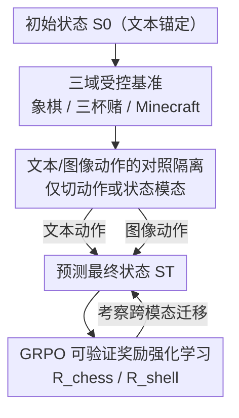

# MET-Bench: Multimodal Entity Tracking for Evaluating the Limitations of Vision-Language and Reasoning Models

**会议**: ICML2026  
**arXiv**: [2502.10886](https://arxiv.org/abs/2502.10886)  
**代码**: 待确认  
**领域**: LLM推理 / 多模态VLM  
**关键词**: 实体状态追踪, 视觉语言模型, 多模态推理, 强化学习, GRPO

## 一句话总结
提出多模态实体追踪基准 MET-Bench（国际象棋 / 三杯赌 / Minecraft 三个域），让视觉语言模型从文本或图像形式的动作序列里追踪实体状态变化，发现「图像动作」远难于「文本动作」、且差距来自视觉推理而非感知；用 GRPO 强化学习能在单模态内大涨，却几乎无法跨模态迁移。

## 研究背景与动机

**领域现状**：能追踪并预测世界潜在状态的「世界模型」是 AI 的重要目标，其中**实体状态追踪**（estimating how entities, attributes, relations evolve over time）是核心能力，机器人操作、视频问答、计算机操控 agent 都依赖它。早期实体追踪研究几乎都在**纯文本**任务上展开（指代消解、篇章处理、叙事理解）。

**现有痛点**：随着 AI 越来越多地处理「文本+图像/视频」的混合内容，实体追踪必须扩展到多模态——但现有基准基本只测文本，没人系统地量化「当状态更新以图像形式给出时，模型还能不能维持连贯的实体表征」。

**核心矛盾**：模型在纯文本上表现不错，可一旦把「动作/状态」换成视觉形式，是**看不清（感知）**还是**想不通（推理）**？这两者纠缠在一起，普通基准分不开，导致改进方向不明。

**本文目标**：构造一个能**把感知与推理解耦**的受控基准，量化文本 vs 图像下的实体追踪差距，并探究强化学习能否补上这道缺口。

**切入角度**：用规则明确、难度可控的「游戏式」环境——象棋、三杯赌、Minecraft——把初始/最终状态锚定为良定义的文本表示，只把「动作」或「状态」在文本与图像间切换，这样性能差就直接等于「视觉理解引入的损耗」，最大程度排除感知噪声的干扰。

**核心 idea**：用「状态用文本锚定、动作/状态模态可切换」的对照设计隔离出视觉推理缺口，再用可程序化验证的 GRPO 强化学习去补，验证其能否跨模态迁移。

## 方法详解

### 整体框架
MET-Bench 把多模态实体追踪形式化为**序列状态估计**：给定初始状态 $\mathbf{S}_0$ 与动作序列 $\mathbf{A}=(\mathbf{a}_1,\dots,\mathbf{a}_T)$，要求模型推出最终状态

$$\mathbf{S}_T = f(\mathbf{S}_0, \mathbf{a}_1, \mathbf{a}_2, \dots, \mathbf{a}_T)$$

其中每个动作 $\mathbf{a}_t$ 可以是文本 $\mathbf{a}_t^{\text{text}}$ 或图像 $\mathbf{a}_t^{\text{image}}$。基准覆盖三个难度递增的域（象棋 / 三杯赌 / Minecraft），通过「只切换动作或状态的模态、其余保持不变」的对照来隔离视觉推理的贡献；最后用 GRPO 强化学习训练开源模型，考察单模态增益能否跨模态迁移。

### 关键设计

**1. 三域受控基准：用难度可控的游戏隔离实体追踪**

作者选了三个互补的域，覆盖从「结构化/封闭」到「开放/动态」的谱系。**象棋**：状态 $S_t$ 是 8×8 棋盘的 FEN 表示，动作是真实对局里的合法着法，用 UCI 文本（如 `e2e4`）或渲染图像两种形式给出，模型输出着法序列后的最终 FEN——这是研究实体追踪的成熟测试床，但因主流模型见过大量 UCI/FEN 数据，存在记忆风险。**三杯赌**：一个球藏在三个杯子之一，杯子两两交换若干次，模型要追踪球的最终位置；动作是 `x swap y` 文本或「交换且看不见球」的图像，输出是 1/2/3 的位置编号——它实体空间更小，但据作者所知不在模型训练数据里，能避开记忆捷径。**Minecraft**：更接近真实世界的部分可观测、动态、视觉复杂环境，状态是第一人称局部世界（位置/朝向/邻近方块/可见场景），动作是「前进 8 格、攻击」之类低层指令；与前两者不同，它让模型从四个候选里**选出正确的下一状态**（多选），并通过改变状态模态来对比视觉 vs 文本推理。

**2. 文本/图像动作的对照隔离：让性能差直接等于视觉推理损耗**

这是基准的设计精髓。在象棋与三杯赌里，**初始与最终状态始终用文本表示**，只把中间的动作在 UCI 文本与渲染图像间切换。这样模型「从良定义文本开始、到良定义文本结束」，唯一变量是动作的呈现模态——文本与图像两种条件的准确率之差，就**干净地度量了视觉状态理解引入的缺口**，把感知失败这一已知顽疾的干扰降到最低。在 Minecraft 里则反过来固定动作为文本、切换**状态**的模态（文本遥测 vs 第一人称截图）：文本条件因状态结构化、信息充分，构成性能上界，图像条件下的掉点即视觉理解的损耗。这套设计的潜台词是——若模型视觉与文本推理能力相当，两种条件应给出相近准确率，差距越大说明视觉短板越严重。配套地，图像动作还经过专门的视觉提示工程（试过箭头、边界框、符号标记等），把动作分类精度做到很高，从而进一步把误差从「感知」赶向「推理」。

**3. GRPO 可验证奖励强化学习：用程序化奖励补开源模型的追踪能力**

为了检验「能不能训出更强的实体追踪」，作者对开源 VLM 施加 **GRPO（Group Relative Policy Optimization）**——一种适合「结果可验证」任务的策略梯度 RL，而实体追踪正好可程序化判对错。奖励函数直接利用基准的自动可验证性：象棋按棋盘逐格命中率给奖，

$$R_{\text{chess}}(y, y^*) = \frac{1}{64}\sum_{i=1}^{64} \mathbb{1}[y_i = y_i^*]$$

三杯赌则是二值奖励 $R_{\text{shell}}(y, y^*) = \mathbb{1}[y = y^*]$。训练对象是 Gemma 3 4B IT；在象棋图像、10 步动作等设定下，基座策略输出不了有效的思维链，于是先在合成示范上做 SFT 把输出格式初始化好再上 RL。作者还发现：只在「最终状态」上微调无法泛化，必须生成中间推理步骤——这与表 1/表 2 中「显式推理让序列状态追踪更易」的结论一致。

### 一个例子：象棋零样本提示
模型收到系统提示「你是追踪棋局并产出最终 FEN 的助手」，给定初始 FEN `rnbqkbnr/pppppppp/8/8/8/8/PPPPPPPP/RNBQKBNR w KQkq - 0 1`，再依次给出两步着法 `e2e4`、`e7e5`，要求输出 `FINAL ANSWER: [FEN]`。文本条件下直接给 UCI 字符串；图像条件下则把这两步换成渲染图像、并附一段「如何解读这些动作图像」的说明。模型答出 `rnbqkbnr/pppp1ppp/8/4p3/4P3/8/PPPP1PPP/RNBQKBNR w KQkq - 0 2`——同一道题，仅动作呈现模态不同，就能对比出视觉推理的损耗。

## 实验关键数据

### 主实验
零样本下文本动作显著优于图像动作，且差距在所有模型上一致存在。象棋因「预测初始局面」本身就是强基线（10 步后大半棋盘没动，Game Start 基线达 74.9%），故图像条件掉点尤其说明问题。

| 域 / 设定 | 模型 | Text(%) | Image(%) |
|------|------|------|------|
| 象棋 Zero-Shot | Claude 3.7 Sonnet | 96.1 | 70.2 |
| 象棋 Zero-Shot | Gemini-2.5-Flash | 91.0 | 66.9 |
| 象棋 Zero-Shot 基线 | Game Start | 74.9 | 74.9 |
| 三杯赌 Zero-Shot | Claude 3.7 Sonnet | 35.4 | 37.8 |
| 三杯赌 Zero-Shot 基线 | Random | 33.3 | 33.3 |

### 推理策略消融
三杯赌零样本下所有模型都接近随机（球被遮挡、必须靠推理），而思维链/推理把文本条件拉到近满分，却几乎带不动图像条件——视觉追踪缺口在「会推理」之后依然顽固。

| 配置 | 三杯赌 Text(%) | 三杯赌 Image(%) | 说明 |
|------|------|------|------|
| GPT-4o Zero-Shot | 33.0 | 32.2 | 接近随机猜测 |
| GPT-4o CoT | 98.2 | 36.6 | 文本飙升、图像仍近随机 |
| GPT-4.1-mini CoT | 100.0 | 72.0 | 文本满分、图像明显落后 |
| Claude 3.7 Sonnet CoT（象棋） | 99.5 | 96.2 | 极少数能缩小视觉缺口者 |

### 关键发现
- **图像 ≪ 文本，且差距源于推理而非感知**：图像动作经过提示工程后分类精度很高，仍大幅落后文本，说明瓶颈是高层视觉推理而非「看不清」。
- **显式推理有用但不够**：few-shot / CoT / 推理模型都能涨分，文本条件常逼近满分，但图像条件在长序列（如三杯赌 20 步）下多数模型仍退化到随机，长程多模态追踪仍是硬骨头。
- **RL 在模态内大涨、跨模态难迁移**：GRPO 训练带来显著的「同模态内」增益，却无法稳健迁移到另一种输入模态——凸显 VLM 多模态表征仍是割裂的。
- **只学最终状态不泛化**：必须在训练里生成中间推理步骤，序列状态追踪才学得会。

## 亮点与洞察
- **「状态锚文本、只切动作模态」的对照**是最漂亮的设计：把长期困扰多模态评测的「感知 vs 推理」纠缠一刀切开，让性能差成为视觉推理缺口的干净度量，这套方法论可迁移到任何能文本化状态的任务。
- **三杯赌作为「非记忆」对照**很有心机：象棋因 FEN/UCI 在预训练里随处可见而有记忆风险，三杯赌据作者所知不在训练数据中，二者并置能把「真会追踪」与「背过了」区分开。
- **可验证奖励 + GRPO** 把实体追踪变成天然的 RL 任务（逐格命中率给稠密奖励），但「单模态涨、跨模态不迁移」的负面结果本身就是重要发现——提醒大家别指望 RL 自动打通模态。
- 一个反直觉点：连最强推理模型在「图像三杯赌长序列」上都会退化到随机，说明当前 VLM 缺的不是看清画面，而是把视觉更新维护进一个连贯世界状态的能力。

## 局限与展望
- 三个域都是**受控游戏**，象棋/三杯赌尤其玩具化；作者也承认真实世界往往更模糊动态，Minecraft 是向真实靠拢的尝试但仍是脚本化轨迹。
- 象棋存在**记忆污染**风险（模型大量见过 UCI/FEN），文本条件的高分有多少来自真追踪、多少来自模式记忆难以完全剥离。
- RL 只在 Gemma 3 4B IT 上验证，且需先 SFT 初始化输出格式才能训，规模与通用性有限；「跨模态不迁移」的结论是否在更大模型/更多 RL 算法上依旧成立未知。
- 利益冲突披露：作者之一为 Google DeepMind 学生研究员，而评测包含 Gemini/Gemma 模型——结论解读宜留一份谨慎。

## 相关工作与启发
- **vs 纯文本实体追踪（toshniwal2022chess 等）**：本文把象棋等经典文本追踪任务扩展到多模态，新增「图像动作/状态」条件，首次量化跨模态的追踪缺口。
- **vs 一般 VLM 感知基准**：多数 VLM 基准混测感知+推理，MET-Bench 刻意把状态文本锚定，**只**留视觉推理为变量，定位更精准。
- **vs DeepSeekMath / GRPO 原始工作**：复用 GRPO 但落到「可验证的实体追踪」奖励上，并给出「模态内有效、跨模态失效」这一新场景下的边界。

## 评分
- 新颖性: ⭐⭐⭐⭐ 首个把实体状态追踪系统扩展到多模态、并能解耦感知与推理的基准。
- 实验充分度: ⭐⭐⭐⭐⭐ 三域 × 多设定（zero/few-shot/CoT/推理）× 大量前沿模型 + RL，覆盖面很广。
- 写作质量: ⭐⭐⭐⭐ 形式化清晰、对照设计讲得透，缓存版表格略显零碎。
- 价值: ⭐⭐⭐⭐ 给「VLM 为何视觉推理弱」提供了干净的诊断工具与一个值得警惕的 RL 迁移结论。

<!-- RELATED:START -->

## 相关论文

- [\[ICLR 2026\] GTR-Bench: Evaluating Geo-Temporal Reasoning in Vision-Language Models](../../ICLR2026/vlm_reasoning/gtr-bench_evaluating_geo-temporal_reasoning_in_vision-language_mod.md)
- [\[CVPR 2026\] VisRes Bench: On Evaluating the Visual Reasoning Capabilities of VLMs](../../CVPR2026/vlm_reasoning/visres_bench_on_evaluating_the_visual_reasoning_capabilities_of_vlms.md)
- [\[CVPR 2026\] SpatiaLQA: A Benchmark for Evaluating Spatial Logical Reasoning in Vision-Language Models](../../CVPR2026/vlm_reasoning/spatialqa_a_benchmark_for_evaluating_spatial_logical_reasoning_in_vision-languag.md)
- [\[ICML 2025\] Reasoning Limitations of Multimodal Large Language Models. A Case Study of Bongard Problems](../../ICML2025/vlm_reasoning/reasoning_limitations_of_multimodal_large_language_models_a_case_study_of_bongar.md)
- [\[CVPR 2026\] QUANTIPHY: A Quantitative Benchmark Evaluating Physical Reasoning Abilities of Vision-Language Models](../../CVPR2026/vlm_reasoning/quantiphy_a_quantitative_benchmark_evaluating_physical_reasoning_abilities_of_vi.md)

<!-- RELATED:END -->
