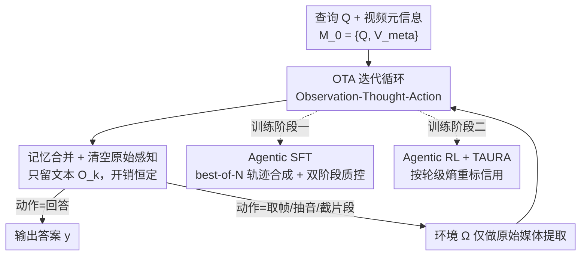

# Native Active Perception as Reasoning for Omni-Modal Understanding

**会议**: ICML 2026  
**arXiv**: [2606.19341](https://arxiv.org/abs/2606.19341)  
**代码**: https://github.com/harryhsing/OmniAgent  
**领域**: 多模态VLM / VLM推理 / 长视频理解 / 智能体强化学习  
**关键词**: 主动感知、POMDP、长视频理解、Agentic RL、test-time scaling

## 一句话总结
OmniAgent 把长视频理解从「把每一帧都看一遍」的被动范式改成「按查询需要、迭代地去看」的主动感知，用 Observation-Thought-Action 循环在一个原生全模态模型里把音视频线索蒸馏进持久文本记忆、即时丢弃原始媒体，从而让推理代价与视频时长解耦；配合 Agentic SFT 冷启 + 带 TAURA 的 Agentic RL，7B 模型在 LVBench 上 50.5% 反超 10 倍大的 Qwen2.5-VL-72B（47.3%），且推理轮数越多性能越好（正向 test-time scaling）。

## 研究背景与动机

**领域现状**：当前全模态/长视频理解主流是「watch-it-all」——不管查询难易，把帧均匀地、全量地喂进模型一次性处理。问题是时空数据维度极高，**算力随序列长度超线性增长**，对小时级长视频几乎不可行。

**现有痛点**：为缓解这个负担，已有两类 agentic 改造，但都没真正解耦。其一是用 LLM 当控制器去调用各模态专家工具（caption、ASR、检索），但中间模块切断了推理与感知之间的梯度流，形成信息瓶颈；其二是「thinking with images」式地把时序裁剪、空间放大等变换塞进 MLLM 的思维链，但这类方法**仍是半被动的**——通常要先对整段视频做一次全局预扫描、或维持一个稠密视觉缓冲来决定「看哪儿」，因此上下文代价仍随视频时长增长，扛不住小时级长视频。

**核心矛盾**：被动范式里，**模型内部状态的复杂度被原始视频时长绑死**，而人类感知其实是按需的、对交织信号的持续主动审问。真正需要的是把「内部状态复杂度」从「原始时长」解绑，让它只取决于推理本身需要多少证据。

**本文目标**：（1）让 MLLM 成为原生主动感知者，把多模态探索建模成可迭代决策过程；（2）让单一原生模型同时负责感知、推理与动作，不依赖外部模块；（3）让训练范式既能冷启这种主动行为、又能在多轮交互上正确分配信用。

**切入角度**：把音视频探索建模成**部分可观测马尔可夫决策过程（POMDP）**，强制做一次「信息蒸馏」——把高维瞬时感知压成持久文本记忆，看完即丢原始媒体。这样模型内部状态只依赖推理轨迹的复杂度，而非视频原始时长，并自然涌现出 System-2 式的 test-time scaling：难问题就多走几步。

**核心 idea**：用「Observation-Thought-Action 迭代循环 + 瞬时感知/持久记忆严格分离」把视频理解变成一个原生主动感知的推理过程，让推理复杂度与视频时长解耦。

## 方法详解

### 整体框架

OmniAgent 把它与视频环境的交互建成 POMDP：瞬时感知 $\mathcal{E}_k$ 是环境 $\Omega$ 返回的原始媒体，持久记忆 $\mathcal{M}_k$ 是 agent 合并后的内部状态。每一轮 $k$，策略 $\pi_\theta$ 自回归地生成一个 OTA 三元组 $(O_k,T_k,A_k)$，条件是上一轮的记忆和瞬时感知：$(O_k,T_k,A_k)\sim\pi_\theta(\cdot\mid\mathcal{M}_{k-1},\mathcal{E}_{k-1})$。初始记忆 $\mathcal{M}_0=\{Q,V_{\text{meta}}\}$ 只含查询和视频元信息（时长、FPS、是否有音频）。每轮做完后环境把上一轮原始感知 $\mathcal{E}_{k-1}$ 从上下文里**清空（purge）**，只把蒸馏出的文本 $O_k$ 留在记忆里——这保证了媒体开销恒定、与时长无关。关键是 $\Omega$ **只做原始媒体提取**（取帧、抽音频、截片段），所有语义感知与推理都由同一个原生模型 $\pi_\theta$ 完成，不外挂模块。模型先用 Agentic SFT 冷启动作执行能力，再用带 TAURA 的 Agentic RL 精炼推理驱动的感知。

### 关键设计

**1. POMDP 下的 OTA 循环：瞬时感知与持久记忆严格分离，让代价与时长解耦**

针对「被动范式把内部状态复杂度绑死在视频时长上」，OmniAgent 把感知做成查询驱动的迭代推理。每轮三件事：**Observation $O_k$** 把高维瞬时感知 $\mathcal{E}_{k-1}$ 蒸馏成结构化文本摘要，显式保留后续推理需要的关键视听细节后，原始媒体即被清掉；**Thought $T_k$** 分析已有记忆 $\mathcal{M}_{k-1}$ 与当前观测、找出当前感知与查询要求之间的信息缺口、推出下一步动作的理由；**Action $A_k$** 从算子集 $\mathcal{A}=\{a_{\text{frames}},a_{\text{audio}},a_{\text{clip}},a_{\text{answer}}\}$ 采样——$a_{\text{frames}}(s,e,n)$ 在区间 $[s,e]$ 均匀取 $n$ 帧（灵活时序分辨率）、$a_{\text{audio}}(s,e)$ 抽音频段、$a_{\text{clip}}(s,e)$ 截带同步音频的连续片段（保时序与跨模态对齐）、$a_{\text{answer}}(y)$ 给出答案并终止。**严格的上下文清空机制**是解耦的关键：$\mathcal{M}_k\leftarrow\mathcal{M}_{k-1}\cup\{(O_k,T_k,A_k)\}$ 只增文本，原始 $\mathcal{E}_{k-1}$ 被丢弃，于是媒体开销与时长/轮数无关。和外挂工具的 agent 不同，这里 $\Omega$ 只取原始媒体、不做任何语义理解，因此推理与感知的梯度流不被中间模块切断。

**2. Agentic SFT：best-of-N 轨迹合成 + 双阶段质控，冷启原生主动感知**

针对「直接上 RL 会因基座缺乏长程 agentic 先验而策略崩塌」，作者先做监督冷启：curate 一个 58K 轨迹的 Agentic SFT 语料，覆盖 MCQ、数值推理、时序定位三类任务，取自 5 个数据集训练集，且严格对齐 $(O_k,T_k,A_k)$ 循环格式。合成靠**探索而非静态标注**——提示一个教师模型在环境 $\Omega$ 里做成功驱动探索，对每个查询在动作空间上 best-of-N 生成一池候选轨迹；过程**故意允许自我纠错**（先执行越界时间戳等无效动作、再据环境反馈恢复），把这些纠错轨迹留下来可避免 teacher-forcing 偏置，训模型把诊断信号当可用线索而非致命失败。再用**双阶段质控**蒸馏：(1) 结果验证——离散任务要求精确匹配，连续任务用阈值（时序定位 IoU $\geq 0.5$、尺寸估计 MRA $\geq 0.5$）；(2) 合理性审计——用 GPT-4o 在 5 分 Likert 上评判当前 $T_k$ 是否被 $\mathcal{M}_{k-1}$ 与 $O_k$ 逻辑蕴含，过滤掉「答对但推理是幻觉/瞎蒙」的 lucky guess，要求一致性分 $\geq 3/5$，保证每个 SFT 动作都扎根在 agent 的显式上下文里。

**3. TAURA：用轮级熵重标信用，破解多轮 GRPO 的优势同质化**

针对「把 GRPO 套到多轮 agentic 推理时的 Advantage Homogenization」——vanilla GRPO 给每一轮广播同一个标量优势，把关键的「发现性」转折轮和琐碎的填充轮混为一谈（经验上 79.2% 的关键分叉轮的 token 熵显著高于轨迹均值，被均匀优势掩盖）。TAURA（Turn-aware Adaptive Uncertainty Rescaled Advantage）把轨迹级优势细化到轮级：先按组内奖励归一化得基线优势

$$A_i=\frac{R_i-\frac{1}{G}\sum_{j=1}^{G}R_j}{\text{std}(R_1,\dots,R_G)},$$

再以**每轮平均 token 熵 $H_{i,k}$ 作连续权重**（而非二值掩码）做轮级重标：

$$\hat{A}_{i,k}=A_i\cdot w_{i,k},\quad w_{i,k}=\frac{H_{i,k}}{\frac{1}{N_\mathcal{G}}\sum_{j=1}^{G}\sum_{m=1}^{K_j}H_{j,m}},$$

其中 $N_\mathcal{G}=\sum_j K_j$ 是组内总轮数，归一化保证 $\mathbb{E}[w_{i,k}]=1$，因而保持原梯度尺度、只是把更新导向高不确定性的发现性时刻。为什么用连续权重而非掩码：agentic 轨迹的原子单元是结构化的整轮 $(O_k,T_k,A_k)$，掩 token 会破坏输出结构、掩整轮又切断上下文依赖。最终把 $\hat{A}_{i,\text{turn}(t)}$ 代入 GRPO 的 clip 替代目标。**为什么有效**：TAURA 缩放的是带符号优势——对正确轨迹（$A_i>0$），高熵（$w_{i,k}>1$）放大优势、强化模型真正在啃不确定性的那些轮；对错误轨迹（$A_i<0$），高熵带来更大负惩罚（$\hat{A}_{i,k}<A_i<0$），严惩「困惑瞎蒙」。

### 一个完整示例
拿 LVBench 上一个含时间约束的查询走一遍：用户问「22:03 发生了什么」。$\mathcal{M}_0$ 只有查询和元信息。第 1 轮 Thought 识别出时间锚点「22:03」，Action 用 $a_{\text{frames}}$ 在该时刻附近取帧；Observation 把这几帧蒸馏成文本（如「角色 A 在门口」），随后原始帧被清空。若证据不足，第 2 轮可能用 $a_{\text{audio}}$ 抽该段音频当时序锚点、把音频事件转成下一步的视觉搜索查询，逐步从粗到细收窄搜索空间，直到第 $k$ 轮 Thought 判定证据足够，发出 $a_{\text{answer}}(y)$ 终止。整段过程上下文里只累积文本观测，原始媒体从不留存——这正是「代价与时长无关」在一次推理里的体现。

### 损失函数 / 训练策略
基座 Qwen2.5-Omni-7B；每图/每帧最多 1024/768 视觉 token，上下文窗 64K。动态最大轮数 $K$ 随时长伸缩（SFT $K\in[5,32]$，RL $K\in[5,10]$）。Agentic SFT：58K 轨迹、2 epoch、lr $1\times10^{-5}$、batch 64、AdamW、16×A100。Agentic RL：专挑 best-of-N 失败的难样本做 RL，视频限 300 秒内，遵循 DAPO 用 token 级策略损失 + clip-higher，150 步、组大小 8、constant lr $1\times10^{-6}$、上下 clip 0.30/0.20、global batch 256、64×A100，不加 KL 也不加熵正则。

## 实验关键数据

### 主实验

横跨 10 个基准（视频理解 / 音视频 / 时序定位三类），OmniAgent-7B 在开源模型里全面 SoTA，且对 Qwen2.5-Omni 基线全部提升。

| 基准 | 时长尺度 | Qwen2.5-Omni-7B | OmniAgent-7B | $\Delta$ |
|------|---------|-----------------|--------------|----------|
| VideoMME (Overall) | 1–60 min | 64.8 | 67.8 | +3.0 |
| VideoMME-Long | 30–60 min | 54.8 | 59.6 | +4.8 |
| VSI-Bench | 97 sec | 35.5 | 48.4 | +12.9 |
| MLVU | 3–120 min | 65.2 | 71.1 | +5.9 |
| LVBench | 长 | 43.0 | 50.5 | +7.5 |
| DailyOmni | 43 sec | 60.1 | 64.8 | +4.7 |
| OmniVideoBench | 384 sec | 29.3 | 37.1 | +7.8 |
| LongVALE (IoU) | 233 sec | 5.7 | 39.1 | +33.4 |
| VUE-TR (Vision+Audio) | 1066 sec | 3.5 | 36.5 | +33.0 |

亮点：LVBench 上 7B 的 50.5% **反超 10 倍大的 Qwen2.5-VL-72B（47.3%）**、且用帧数少 73%；时序定位上 LongVALE/VUE-TR 绝对涨 +33.4/+33.0，甚至超过 GPT-4o、Gemini-2.5-Pro 等闭源模型。对比稠密采样（1 FPS）的被动基线 LongVU，VideoMME +7.2%、MLVU +5.7%，说明查询条件主动感知比均匀处理更采样高效。

### 消融实验

| 配置 | LVBench | MLVU | DailyOmni | 说明 |
|------|---------|------|-----------|------|
| Qwen2.5-Omni（基线） | 43.0 | 65.2 | 60.1 | 被动起点 |
| + Standard SFT | 41.6 ↓ | 67.1 | 61.7 | 静态 QA 微调反而在超长上下文退化 |
| + Agentic SFT | 48.7 | 69.9 | 63.3 | OTA 格式冷启大幅提升长视频 |
| + Vanilla GRPO | 49.8 | 69.9 | 62.2 ↓ | 优势同质化：推理停滞、感知退化 |
| + TAURA | **50.5** | **71.1** | **64.8** | 轮级熵信用，感知与推理双升 |

### 关键发现
- **被动 SFT 会在长视频上反向退化**：Standard SFT 把 LVBench 从 43.0 拉到 41.6——缺选择机制的被动范式随时长增加遭遇信息过载、信噪比下降；换成 Agentic SFT 立刻回到 48.7，印证 OTA 主动选择的必要性。
- **TAURA 救活了 RL 阶段**：Vanilla GRPO 在 MLVU 停在 69.9、还把 DailyOmni 从 63.3 拖到 62.2（关键「看」动作和琐碎动作拿同样信用）；TAURA 用熵当决策关键性的代理、上权高熵分叉轮后，感知（DailyOmni 64.8）与推理（MLVU 71.1）一致改善。
- **正向 test-time scaling 且自适应**：VideoMME-Long 上准确率随最大轮限 $K$ 上升（+6.2%），但即便 $K=52$，实际平均执行轮数也只饱和在 11.7——模型按信息需求而非「凑满轮数」来调推理深度。
- **代价由任务复杂度而非时长驱动**：LVBench 时长分析显示视频越长采样密度大幅下降、准确率却保持稳定，直接坐实「推理复杂度与时长解耦」的核心主张。

## 亮点与洞察
- **「感知即推理」而非「感知是预处理」**：把看哪儿、听哪儿都纳入同一个 POMDP 决策、由同一个原生模型完成，避免了工具型 agent 的梯度断流与信息瓶颈——这是和「LLM 调工具」「thinking with images」最本质的区别。
- **严格上下文清空 = 恒定媒体开销**：看完即丢原始媒体、只留文本观测，这个工程上极简的机制是「代价与时长无关」能成立的根。
- **TAURA 把「高熵 token 是推理分叉」的洞见正确地搬到轮级**：用连续熵权代替二值掩码，既不破坏 agentic 轨迹的结构原子性、又能定向放大关键发现轮的信用，这个「轮级而非 token 级」的粒度选择值得迁移到其它多轮 agentic RL。
- **正向 test-time scaling 是主动感知有效性的直接证据**：多走几步就更准，且轮数自适应饱和，说明模型学到的是「按需探索」而非刷步数。

## 局限与展望
- 自己看：RL 阶段把视频限制在 300 秒内、SFT 才用到长时长，长视频上的 RL 收益主要靠泛化迁移，超长（>2h）场景下主动感知策略是否仍稳未充分验证；动态轮限 $K$ 和质控阈值（IoU/MRA $\geq0.5$、合理性 $\geq3/5$）较多人工设定，敏感性未给。
- 合理性审计依赖 GPT-4o 当裁判，存在裁判偏置与成本；环境 $\Omega$ 只做媒体提取，取帧/截片段的粒度（每帧 768 token、$K$ 上限）会直接影响上限。
- 改进方向：把主动感知扩到更长视频与流式场景、减少对外部裁判的依赖、探索动作空间的自动扩充（如更细的空间放大算子）以进一步提升时序/空间定位精度。

## 相关工作与启发
- **vs 工具编排型 agent（LLM 调 caption/ASR/检索/tracking）**：他们靠中间模块拿预抽取上下文，切断了推理与感知的梯度流、形成信息瓶颈；OmniAgent 是单一原生模型，环境只取原始媒体，感知推理同体。
- **vs「thinking with images」（时序裁剪 / 空间放大）**：这类方法多半要全局预扫描或维持稠密视觉缓冲、上下文随时长涨，仍是半被动；OmniAgent 靠严格清空把媒体开销压成恒定，真正解耦时长。
- **vs 开源 Thinking Models（Video-R1 等）**：它们在静态输入上拉长 CoT，OmniAgent 则主动去查环境补缺失证据——作者据此提出长视频的主要瓶颈常是「感知不完整」而非「推理深度不够」。
- **vs vanilla GRPO**：GRPO 广播轨迹级标量优势导致优势同质化，TAURA 用轮级熵把信用导向关键发现轮，是对多轮 agentic RL 信用分配的针对性修正。

## 评分
- 新颖性: ⭐⭐⭐⭐⭐ 首个把全模态视频理解做成原生主动感知 POMDP 的端到端框架，OTA 循环 + 严格清空 + TAURA 都很到位。
- 实验充分度: ⭐⭐⭐⭐⭐ 10 基准三类任务 + 完整消融 + test-time scaling + 时长分析，且 7B 反超 72B 很有说服力。
- 写作质量: ⭐⭐⭐⭐ 形式化清晰、动机链扎实；部分细节（best-of-N 的 N、质控阈值敏感性）压在附录。
- 价值: ⭐⭐⭐⭐⭐ 给长/超长视频理解指出一条「代价与时长解耦」的可扩展路线，且开源模型与代码，落地价值高。

<!-- RELATED:START -->

## 相关论文

- [\[ACL 2026\] OMHBench: Benchmarking Balanced and Grounded Omni-Modal Multi-Hop Reasoning](../../ACL2026/vlm_reasoning/omhbench_benchmarking_balanced_and_grounded_omni-modal_multi-hop_reasoning.md)
- [\[ICLR 2026\] ThinkOmni: Lifting Textual Reasoning to Omni-modal Scenarios via Guidance Decoding](../../ICLR2026/vlm_reasoning/thinkomni_lifting_textual_reasoning_to_omni-modal_scenarios_via_guidance_decodin.md)
- [\[CVPR 2026\] Act2See: Emergent Active Visual Perception for Video Reasoning](../../CVPR2026/vlm_reasoning/act2see_emergent_active_visual_perception_for_video_reasoning.md)
- [\[ACL 2026\] ChemVLR: Prioritizing Reasoning in Perception for Chemical Vision-Language Understanding](../../ACL2026/vlm_reasoning/chemvlr_prioritizing_reasoning_in_perception_for_chemical_vision-language_unders.md)
- [\[ACL 2026\] Decoding Scientific Experimental Images: The SPUR Benchmark for Perception, Understanding, and Reasoning](../../ACL2026/vlm_reasoning/decoding_scientific_experimental_images_the_spur_benchmark_for_perception_unders.md)

<!-- RELATED:END -->
