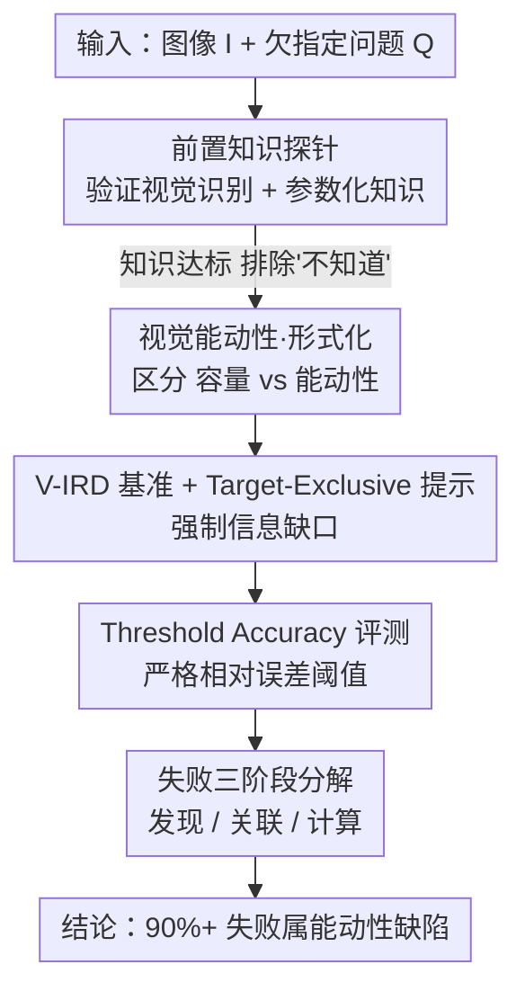

# Position: The Systemic Lack of Agency in Visual Reasoning

**会议**: ICML 2026  
**arXiv**: [2606.14795](https://arxiv.org/abs/2606.14795)  
**代码**: [项目主页](https://haoychen.github.io/Implicit-Reasoning/)  
**领域**: 多模态VLM / 视觉推理 / 立场文  
**关键词**: 视觉能动性, 隐式推理, 立场文, V-IRD 基准, 注意力隧道

## 一句话总结
这是一篇立场文（position paper），主张当前 VLM 存在一种系统性的"视觉能动性（visual agency）缺失"——它们能在被明确指向时看清细节，却不会主动去搜寻问题没点名、但解题必需的隐式视觉线索；作者用形式化框架、四象限分类法和专门构造的 V-IRD 基准证明：即便最强的闭源模型，其失败也主要卡在"没去找证据"而非"算不出来"。

## 研究背景与动机
**领域现状**：认知科学早就把"感知"理解为一种由目标驱动、主动获取信息的过程，而非被动接受刺激。当前 VLM（InternVL、Qwen-VL、GPT-5.2、Gemini-3 等）在语义识别和显式指令跟随上已非常强，几乎所有主流基准（PhysBench、MMMU、V\* 等）也都在这个"被明确告知看哪里"的设定下评测。

**现有痛点**：作者指出现有评测体系存在一个系统性盲区——它们只测"视觉容量（visual capacity，被引导时能看到什么）"，却几乎不测"视觉能动性（visual agency，是否会自主去找证据）"。具体表现在三处：① 显式 VQA 把视觉规划过程外包给了用户，用户充当"注意力管理者"明确指向目标；② 幻觉研究主要盯"捏造不存在物体"的 commission 错误，忽略了"该看的没看"的 omission 错误；③ 物理推理基准多是闭集格式，必要变量已经给好。

**核心矛盾**：真实世界的视觉推理绝大多数是**隐式**的——解题依赖的关键几何/物理线索（如估算非标准瓶子尺寸时需要的背景参照物：身份证、硬币）通常**不在**用户的 prompt 里。核心难点不在于"认得出这个物体"，而在于"自主检索出没被提及的、支撑性的视觉细节来构建有效的物理论证"。当 prompt 只聚焦目标物体而不指向背景信息时，模型不会主动去发现关键隐藏信息，而是当一个被动的观察者把视觉上下文当作无关背景丢掉。

**本文目标**：把这个 gap 形式化为"视觉容量"与"视觉能动性"的区分，并通过一系列诊断实验证明这个缺陷确实存在、且是当前 VLM 的系统性短板。

**核心 idea**：当语言不再充当"注意力的拐杖"，模型暴露出的不是知识不足，而是**主动发起视觉搜索的能动性缺失**——作者把它命名为 **Visual Implicit Reasoning Deficit（视觉隐式推理缺陷）**，并主张靠单纯堆规模或加提示词都治不好它，需要从训练目标/架构层面下手。

## 方法详解
> 注：这是立场文，不存在"提出新模型"的方法，这里的"方法"指作者**论证立场所用的概念框架 + 诊断管线 + 评测设计**。

### 整体框架
作者的论证分三层推进：先用数学把"显式推理 / 隐式推理 / 缺陷态"三种过程区分清楚；再用一个二维四象限分类法定位出被所有现有基准漏掉的"缺失象限 Q4"；最后构造 V-IRD 基准并跑一套"先验证知识、再考能动性"的过滤式诊断管线，把"失败到底是因为不知道还是因为不去找"彻底拆开。诊断管线本身是多阶段串行的，画成框架图如下：

### 关键设计

**1. 视觉能动性 vs 视觉容量的形式化：把"缺陷"精确定义到搜索阶段的断裂**

作者用 $M(I,Q)\to A$ 表示 VLM 把图像 $I$ 和问题 $Q$ 映射到答案 $A$。**显式推理**里，$Q$ 已经把必要证据 $E$ 的指针写进文本（如"红线连到电池上了吗？"直接把注意力引向红线和电池），任务退化为验证问题 $A\leftarrow M(I,Q_{\text{explicit}})$，模型是被动执行用户给好的搜索计划。**隐式推理**则是欠指定的（如"这枚徽章直径多少？"），必要证据 $E$ 没被提及，需要两阶段：先 Plan 阶段借世界知识 $K$ 把 $Q$ 转成搜索意图，再自主 Search：$E\leftarrow \textit{Search}(I,\textit{Plan}(Q,K))$，最后 $A\leftarrow M(E,Q)$。**缺陷（Deficit）**被精确定义为式 $E\leftarrow\textit{Search}(\cdot)$ 这一步的崩塌——当 $E$ 没被点名时，模型根本不去发起 $\textit{Plan}(Q,K)$，推理退化成只盯着被点名目标的受限审视 $A\leftarrow M(I|_{Q_{\text{target}}},Q)$。作者把这种"能精确处理被提及物体的像素、却把含关键证据的周围上下文当无关背景"的现象命名为**注意力隧道（attention tunneling）**。这个形式化的价值在于：它把"模型表现差"这个模糊观察，锚定到了一个可定位、可测量的具体环节。

**2. 二维四象限分类法：定位出所有基准都漏掉的"缺失象限"Q4**

作者沿两个轴切分视觉-语言任务空间：横轴 **Information Availability**（信息可得性：显式 vs 隐式输入），纵轴 **Cognitive Demand**（认知需求：识别 vs 推理）。由此得到四象限：Q1 显式识别（目标已点名、只需识别，现有模型容量很高）；Q2 显式推理（数学类基准，文本给好推理路径，模型表现好）；Q3 隐式感知（被动质检如物体幻觉，但不需主动找证据）；**Q4 自主信息检索（Autonomous Information Retrieval）——视觉证据决定答案、却完全没在 prompt 里出现**。作者主张 Q4 就是被所有现有基准系统性漏掉的"缺失象限"：成功要求模型自主推断出"哪些没被点名的特征需要被检索"，把高层目标翻译成底层视觉搜索操作。这个分类法解释了一个悖论——模型在被明确询问时能完美描述某个视觉缺陷，却在做整体安全判断时自信地忽略同一个缺陷，**仅仅因为它从没自主发起对证据的搜索**。

**3. V-IRD 基准 + Target-Exclusive Prompting + Threshold Accuracy：把"能动性"做成可测量的考题**

为了把 Q4 单独测出来，作者构造了 **V-IRD（Visual Implicit Reasoning Diagnosing Benchmark）**，覆盖四大领域、十个细粒度任务：Spatial Geometry（空间几何，占比最大 41%，含长度/距离/体积/面积的精密度量）、Contextual Inference（上下文推断 29%，含环境/标注推断）、Physical Properties（物理属性 21%，温度/重量）、Physical Logic（物理逻辑 9%，电学/运动学）。核心机制是 **Target-Exclusive Prompting（目标排他提示）**：prompt 只允许提到语义目标主体（如"这个瓶子多高？"），**严格禁止**任何对背景参照物（硬币、环境标记、相对位置）的文字提及，从而把评测变成纯粹的"自主视觉发现"考试。评测指标方面，离散任务用标准准确率 $\text{ACC}=\mathbb{I}(\hat c=c)$；连续估算任务用 **Threshold Accuracy** $\text{ACC}_\delta=\mathbb{I}\!\left(\tfrac{|y-\hat y|}{y}\le\delta\right)$，只有相对误差落在阈值 $\delta\in\{0.05,0.10,0.20,0.30\}$ 内才算对。这种严格的二值判分刻意惩罚"含糊猜测"，把高精度的视觉测量和粗略估计区分开。

**4. 失败三阶段分解：把"能动性缺陷"与"能力缺陷"在错误层面彻底拆开**

光证明"表现差"不够，作者还要证明"差在能动性、不是差在算力"。于是对一批高信息密度样本，让 top 模型生成显式 CoT 链，再按认知链断裂的位置把失败归为三个**顺序阶段**：**Stage I 主动发现失败（Discovery）**——详细描述了杂乱场景却压根没承认所需隐式信息的存在；**Stage II 估值与选择失败（Association）**——注意到了有效证据却没和目标建立逻辑联系，把关键线索当成无关噪声；**Stage III 逻辑计算失败（Logic）**——成功桥接了锚点和目标，却在物理建模或数值计算上栽了。其中 Stage I+II 归为 **Agency Deficit（能动性缺陷）**，Stage III 归为 **Capacity Deficit（能力缺陷）**。这套分解是整篇立场最锋利的证据：如果失败主要落在 Stage I/II，就说明瓶颈是"不去找"而非"算不对"。

## 实验关键数据

### 前置知识验证（排除"不知道"这个混淆变量）
作者先做一个"单元测试"，确认模型确实具备解题所需的原子知识——否则后续失败可能只是知识缺失。结果显示视觉识别已饱和（>99.5%），参数化知识随规模上升但整体充足：

| 模型规模 | 视觉识别 % | 参数化知识 % |
|---------|-----------|-------------|
| Lightweight (<7B) | 99.74 | 74.81 |
| Medium (7–30B) | 100.00 | 87.01 |
| Large (30–80B) | 99.55 | 90.91 |
| 闭源模型 | 100.00 | 96.00 |

**结论**：解 V-IRD 所需的原子知识已经编码在模型里，后续的隐式推理失败因此被锁定为能动性缺陷，而非根本性的能力缺失。

### V-IRD 主结果（Target-Exclusive 设定下的平均准确率，$\text{ACC}_{5\%}/\text{ACC}_{10\%}$）
空间几何上出现"灾难性崩塌"——多数模型即使在宽松阈值 $\delta=10\%$ 下也难有意义的准确率，而人类参照远高于所有模型：

| 模型 | 平均 ($5\%$, $10\%$) | 备注 |
|------|---------------------|------|
| InternVL3.5-1B | (22.93, 28.08) | 轻量开源 |
| Qwen3-VL-8B | (39.45, 44.01) | 中等开源 |
| Qwen3-VL-235B | (46.44, 51.50) | 超大开源 |
| GPT-5.2 | (47.45, 51.82) | 闭源 |
| Claude-Sonnet-4.5 | (49.96, 56.15) | 闭源 |
| Gemini-3-Pro | (58.36, 64.18) | 最强模型 |
| **Human** | **(66.21, 69.81)** | 人类参照 |

**关键发现**：闭源模型整体强于开源，但即便最强的 Gemini-3-Pro 也明显落后于人类；在没有文字指向参照物时，模型频繁"找不到"参照物，转而基于训练分布幻觉，而非做有依据的视觉测量。

### 失败阶段量化分解

| 模型 | 准确率 % | Stage I 发现 % | Stage II 关联 % | Stage III 逻辑 % |
|------|---------|---------------|----------------|-----------------|
| InternVL3-2B | 0.00 | 90.00 | 10.00 | 0.00 |
| InternVL3.5-38B | 0.00 | 70.00 | 20.00 | 10.00 |
| InternVL3-78B | 30.00 | 57.14 | 14.29 | 28.57 |
| Gemini-3-Pro | 50.00 | 60.00 | 20.00 | 20.00 |
| **平均** | **16.67** | **75.82** | **14.42** | **9.76** |

**核心结论**：平均 75.82% 的失败属 Stage I（压根没察觉隐式线索），加上 Stage II 的 14.42%，**能动性缺陷（Stage I+II）占全部失败的 90%+**，而逻辑计算失败仅 9.76%。小模型 Stage III 为 0% 不是因为算得准，而是它们极少能熬过发现阶段去尝试计算。即便最强的 Gemini-3-Pro，能动性缺陷仍占 80%。

### 显式信息注入诊断（Level 0→3）
作者再设计四级协议，逐步把视觉规划"外包"给 prompt：Level 0 原始欠指定 → Level 1 物体感知 → Level 2 属性感知 → Level 3 oracle 真值（退化为纯计算）。结果呈**规模依赖**：中等模型随注入提升明显（外部引导缓解了其能动性缺陷）；大模型停滞甚至下降（注入的显式物理信息与其强参数先验冲突）；小模型基本不变（基线能力受限，整合不了复杂视觉线索）。

## 亮点与洞察
- **把"模型表现差"锚定到一个可定位的具体环节**：通过 $E\leftarrow\textit{Search}(I,\textit{Plan}(Q,K))$ 的形式化，作者把模糊的"推理弱"精确到"搜索发起步骤的崩塌"，这是立场文里少见的"可证伪化"操作——它让一个观点变成了可被实验检验的假设。
- **过滤式诊断管线的设计极其干净**：先用前置知识探针把"不知道"这个混淆变量排除掉，再用 Target-Exclusive 强制信息缺口，最后用失败阶段分解定位断点。三步环环相扣，几乎堵死了"其实是知识不足/提示不当"的反驳路径，这套"先排除、再归因"的范式可迁移到任何"能力 vs 能动性"的诊断任务。
- **"缺失象限"是一个可复用的认知地图**：用信息可得性 × 认知需求两轴定位评测盲区的思路，可以直接搬到其他模态（如音频、具身）去找"被所有基准漏掉的那一格"。
- **最让人"啊哈"的反直觉点**：失败几乎全卡在"没去找证据"（90%+）而非"算不出来"（<10%），且这个比例在最强模型上依然成立——这把"靠 scaling 自然解决"的乐观预期直接证伪。

## 局限与展望
- **作者承认**：scaling 和 prompting 能改善"被引导时"的表现，但无法赋予自主视觉推理能力；解决"在隐式设定下不主动发起推理"的问题需要根植于模型架构的方案，而非简单堆规模或加引导——但论文只提出诊断，没给出具体的架构/训练方案。
- **基准规模偏小**：失败阶段分解只在 10 个精心挑选的高信息密度样本上做 CoT 分析，样本量小，结论的统计稳健性需谨慎看待。
- **作为立场文的固有局限**：核心是"提出问题 + 提供证据"，没有提出能缓解缺陷的训练目标，"如何注入视觉能动性"留作开放问题。
- **改进思路**：可探索把"主动搜索"显式化为强化学习奖励（论文也提到 DeepEyes/AdaptVision 这类主动放大机制，但作者认为它们缺的恰是"该往哪找"的内在意图），或在预训练中加入"必须自主检索未提及证据"的目标任务。

## 相关工作与启发
- **vs V\*（Wu and Xie, 2024）/ 引导式视觉搜索**：V\* 引入了视觉搜索，但仍在显式指令下运行——用户指向目标；本文的 Target-Exclusive 设定恰恰禁止这种指向，测的是"模型会不会自己决定去搜"。
- **vs DeepEyes / AdaptVision（主动视觉执行）**：这些方法用 RL 动态放大局部细节，提供了主动感知的"执行机制"；本文形式化了其**前置条件**——没有自主寻找未提及线索的能动性，模型根本不知道"往哪放大、为何放大"，从根上卡住了这类放大机制的潜力。
- **vs HallusionBench / NOPE（幻觉缓解）**：现有幻觉研究主要针对 commission 错误（捏造不存在物体）；本文指出 omission 错误（该用的视觉上下文没用）才是能动性缺失的体现——模型不是在传统意义上"幻觉"，而是缺乏"主动用视觉验证推理"的能动性。
- **vs PhysBench / PhysReason / MMMU（物理推理基准）**：它们多为闭集、必要变量已给好，测的是"应用物理规则的能力"；本文强调真实物理推理是**开集**推断，需要自主发现未提及的支撑证据，而这恰是现有基准没测的。

## 评分
- 新颖性: ⭐⭐⭐⭐⭐ 把"视觉能动性缺失"形式化并做成可测量的诊断框架，视角独到且填补了评测盲区
- 实验充分度: ⭐⭐⭐⭐ 覆盖从 1B 到 235B 及主流闭源模型 + 人类参照，诊断管线设计严谨，但失败分解样本量偏小
- 写作质量: ⭐⭐⭐⭐⭐ 论证层层递进、形式化与实验互相支撑，作为立场文逻辑非常清晰
- 价值: ⭐⭐⭐⭐⭐ 给 VLM 推理研究指出了一个被系统性忽略的方向，V-IRD 基准与"能力 vs 能动性"诊断范式有持久价值

<!-- RELATED:START -->

## 相关论文

- [\[ACL 2026\] Position: Multimodal Large Language Models Can Significantly Advance Scientific Reasoning](../../ACL2026/vlm_reasoning/position_multimodal_large_language_models_can_significantly_advance_scientific_r.md)
- [\[ICML 2026\] Learning GUI Grounding with Spatial Reasoning from Visual Feedback](learning_gui_grounding_with_spatial_reasoning_from_visual_feedback.md)
- [\[ICML 2026\] Imagination Helps Visual Reasoning, But Not Yet in Latent Space](imagination_helps_visual_reasoning_but_not_yet_in_latent_space.md)
- [\[ICML 2026\] Decomposed On-Policy Distillation for Vision-Language Reasoning: Steering Gradients for Visual Grounding](decomposed_on-policy_distillation_for_vision-language_reasoning_steering_gradien.md)
- [\[CVPR 2026\] Latent Implicit Visual Reasoning](../../CVPR2026/vlm_reasoning/latent_implicit_visual_reasoning.md)

<!-- RELATED:END -->
