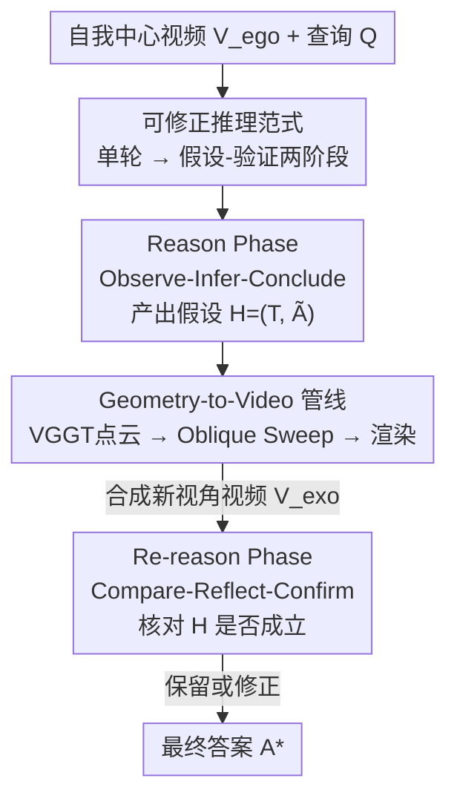

# Reason, Then Re-reason: Cross-view Revisiting Improves Spatial Reasoning

**会议**: ICML 2026  
**arXiv**: [2606.11683](https://arxiv.org/abs/2606.11683)  
**代码**: https://zhenjiemao.github.io/ReRe/ (项目页)  
**领域**: 多模态VLM / 空间推理 / 自我中心视频理解  
**关键词**: 空间推理, MLLM, 跨视角验证, 新视角合成, 免训练推理

## 一句话总结
针对自我中心视频"单轮推理被相机轨迹困住、只能靠语义先验猜几何"的问题，本文提出免训练的 ReRe 框架：先在原视频上形成空间假设（Reason），再用从 3D 几何渲染出的"斜向俯瞰"新视角视频去验证或修正假设（Re-reason），让开源 MLLM 在 VSI-Bench / STI-Bench 上逼近闭源 SOTA。

## 研究背景与动机

**领域现状**：从自我中心（egocentric）视频做空间推理是 MLLM 的核心能力——要在帧间和相机运动中识别物体、推断几何约束、关系和 3D 布局。改进路线有两类：训练式（如 Video-R1 用两阶段训练注入空间认知、或用 VGGT 几何特征对齐 MLLM 表示），以及免训练式（如 See&Trek 用现成工具抽空间线索、组织成文本再交给 MLLM 推理）。

**现有痛点**：自我中心视频提供的证据**天生受轨迹约束**——能看到什么完全由录制相机路径决定，帧的时间顺序很少对齐场景真实的空间拓扑，3D 布局和物体关系经常欠定。而通用 MLLM 缺显式 3D 世界建模、只隐式地强制跨帧对应。被逼在单轮里给答案时，模型只能用**语义先验**而非可验证的几何约束去消解不确定性，于是输出"看似合理但其实错"的答案（如把被桌子遮挡的椅子漏数）。

**核心矛盾**：现有所有方法（无论训练式还是免训练）都默认**空间推理是单轮的**——给定固定轨迹就必须一次性出最终答案，推理过程到此终止。即使是用几何增强的方法，也只是把几何当作**隐式的内部表示**（特征对齐/辅助监督），几何没有变成模型能"亲眼看到、据此回看自己推理"的可观测视觉证据，因此仍困在单轮范式里、对遮挡致幻无能为力。

**本文目标**：让空间推理变成**可修正（revisitable）的过程**——不要一锤定音，而是先提假设、再拿互补的跨视角证据去验证；并且要免训练、不改架构、能规模化拿到这种证据。

**切入角度**：单目几何预测（如 VGGT）已能从 2D 输入大规模恢复 3D 结构并合成新视角。那么只要把恢复出的几何**渲染成 MLLM 原生能吃的视频**，就能在推理时给模型一个"上帝视角"去复查。

**核心 idea**：把"单轮 $A^*=\arg\max_A P(A\mid V_{ego},Q)$"改写成"两阶段假设-验证"——先采样假设 $H\sim P(H\mid V_{ego},Q)$，再 $A^*=\arg\max_A P(A\mid H,V_{exo},Q)$，其中 $V_{exo}$ 是从原视频几何合成的互补新视角视频。

## 方法详解

### 整体框架

ReRe 是一个**推理时、MLLM 冻结、零训练**的框架，把空间推理拆成两个阶段。**Reason Phase**：MLLM 看原始自我中心视频 $V_{ego}$ 和查询 $Q$，按"观察-推断-结论"协议产出一个临时假设 $H=(T,\tilde A)$——$T$ 是显式思维轨迹、$\tilde A$ 是临时答案，因为视角受限，这个答案被当作"待定"。**Re-reason Phase**：先由 Geometry-to-Video 管线从 $V_{ego}$ 恢复 3D 点云、规划一条斜向扫掠相机轨迹、渲染成 allocentric（旁观者视角）新视角视频 $V_{exo}$；MLLM 拿到 $V_{exo}$ 和先前假设 $H$，按"比较-反思-确认"协议显式核对、保留或修正，给出最终答案 $A^*$。整条链路不需要微调，纯靠 MLLM 的上下文推理做自我纠错。

### 关键设计

**1. 可修正推理范式：把单轮硬答改写成两阶段假设-验证**

这是全文的范式级贡献，针对"单轮范式结构性脆弱"这个根因。标准做法把任务建模成单轮条件推理 $A^*=\arg\max_A P_{\mathcal M}(A\mid V_{ego},Q)$，默认 $V_{ego}$ 足以确定答案；但轨迹约束让场景几何欠定，模型只能退回先验。本文引入中间假设 $H$，把推理分解为

$$H\sim P_{\mathcal M}(H\mid V_{ego},Q),\qquad A^*=\arg\max_A P_{\mathcal M}(A\mid H,V_{exo},Q).$$

关键在于 $V_{exo}$ 这个**互补视觉证据**的引入——让模型在最终拍板前，能拿"新看到的东西"去检验自己第一轮的空间断言。这不是简单的 self-consistency 投票或 CoT 加长，而是真正注入了原轨迹之外的新观测。

**2. Reason Phase：Observe-Infer-Conclude 协议 + 结构化假设输出**

第一阶段的设计原则是**把感知和推理分开、让推理过程显式可追溯**，否则后面没东西可验证。$\text{prompt}_{\text{reason}}$ 把空间推理拆成三个顺序目标：(1) **Observe** 识别并描述关键视觉元素（物体、空间排布、几何线索）；(2) **Infer** 即使信息不全也要基于观察推断可能的空间关系；(3) **Conclude** 给出一个**显式标注为"临时"**的答案。产出用结构化标签捕获：思维轨迹 $T$ 包在 `<think>...</think>`、临时答案 $\tilde A$ 包在 `<answer>...</answer>`。这样做有两个用处——显式表达把那些源自语义先验的隐含假设暴露出来（正是最该验证的部分），思维轨迹也给第二阶段提供了"逐条检查哪个空间断言在新视角下还成立"的具体抓手。

**3. Re-reason Phase：Compare-Reflect-Confirm 协议驱动显式自我纠错**

第二阶段的原则是**逼模型在拍板前用新证据正面对质旧推理**。$\text{prompt}_{\text{re-reason}}$ 同样给三个目标：(1) **Compare** 检视新视角视频、找出与原自我中心观察的不一致；(2) **Reflect** 评估思维轨迹 $T$ 里的空间断言在新视角下是否仍成立；(3) **Confirm** 决定保留还是修正临时答案 $\tilde A$、给出 $A^*$。这一步把最终决策**锚定在跨视角证据上**，从而压制 Reason Phase 因遮挡/视角缺失产生的致幻——比如图 1 里斜向俯瞰视角露出被桌子挡住的椅子，模型据此把物体计数改对。

**4. Geometry-to-Video 管线：Oblique Sweep 轨迹 + 点云渲染让几何变成原生视频**

要让跨视角验证真正有效，合成视频 $V_{exo}$ 必须满足两条原则：**几何互补性**（新视角要战略性地暴露隐藏空间信息、减少物体间遮挡、最大化覆盖，随机视角只会换一批遮挡）和**原生兼容性**（要以 MLLM 熟悉的视频格式呈现，而非裸点云）。管线分两步：

*Trajectory Planning（保几何互补性）*：先用 VGGT 从 $V_{ego}$ 预测 3D 点云 $P_{3D}$，算出场景中心 $\mathbf c$ 和水平半径 $r$（点到 $\mathbf c$ 地平面距离的 95 分位）。相机沿对角线扫掠：

$$\mathbf p(t)=\mathbf c+r\cdot(1-2t)\cdot\mathbf d,\quad t\in[0,1],$$

其中 $\mathbf d=\text{normalize}([1,\sqrt2,1]^\top)$ 是带 $45^\circ$ 仰角的对角方向。相机从 $\mathbf c+r\mathbf d$ 扫到 $\mathbf c-r\mathbf d$、全程保持朝向 $\mathbf d$，得到一条"飞机斜穿城市俯瞰"式的场景跨度长基线扫掠——抬高视角消除眼平视的遮挡、对角路径覆盖全场，作者称之为 **Oblique Sweep** 轨迹。

*View Rendering（保原生兼容性）*：通过基于点的光栅化把预测几何渲染成时序连贯的视频帧 $V_{exo}$，从而让 3D 几何线索能被冻结的 MLLM 原生消费，无需任何架构改动或额外训练。

### 一个完整示例

以图 1(a) 物体计数为例：Reason Phase 中模型看眼平视的自我中心视频，桌子挡住了一把椅子，模型只数到可见的几把、在 `<answer>` 里给出偏小的临时计数，思维轨迹 $T$ 里写下"我看到 N 把椅子"。进入 Re-reason Phase，管线用 VGGT 重建点云、沿 Oblique Sweep 渲染出斜向俯瞰的 $V_{exo}$，被遮挡的椅子在俯视下露了出来；模型 Compare 发现新视角多了一把椅子、Reflect 判定"原断言不成立"、Confirm 把计数改对。同理在 Route Planning 例子里，扩展视角暴露了之前没观测到的目标，模型据此修正了致幻的路径指令。

## 实验关键数据

在 VSI-Bench 和 STI-Bench 两个空间推理基准上评测，覆盖 Qwen2.5-VL、Qwen3-VL、InternVL2.5/3 等多个开源架构（2B–8B），全部免训练、即插即用。

### 主实验（VSI-Bench，Avg.）

| 模型 | Baseline | +ReRe | 提升 |
|---|---|---|---|
| Qwen2.5-VL-3B | 26.4 | 28.2 | +1.8 |
| Qwen2.5-VL-7B | 24.8 | 29.5 | +4.7 |
| Qwen3-VL-2B | 22.5 | 31.0 | +8.5 |
| Qwen3-VL-4B | 30.7 | 36.5 | +5.8 |
| Qwen3-VL-8B | 30.5 | 35.8 | +5.3 |
| InternVL2.5-8B | 35.5 | 36.7 | +1.2 |
| InternVL3-2B | 26.5 | 29.9 | +3.4 |

作为参照，闭源 Gemini-1.5 Pro 在 VSI-Bench 上 Avg. 45.4、GPT-4o 仅 34.0；ReRe 加持下的开源模型已能逼近甚至在部分子任务上超过闭源 API。

### 分任务增益（Qwen3-VL-2B，部分子任务）

| 子任务 | Baseline | +ReRe | 提升 |
|---|---|---|---|
| Object Size | 29.8 | 50.5 | +20.7 |
| Room Size | 10.8 | 21.0 | +10.2 |
| Abs. Dist. | 14.7 | 23.4 | +8.7 |
| Rel. Dist. | 19.9 | 25.8 | +5.9 |
| Appr. Order | 19.4 | 26.2 | +6.8 |

### 关键发现
- **revisiting 协议是性能主驱动力**：消融证实，真正起作用的是"用新视角回看并修正"这一机制，而非单纯加长 CoT 或多采样。
- **自我中心语义 × allocentric 结构必须协同**：把自我中心的语义证据和俯瞰视角的结构证据合起来才有效——只给俯瞰视角丢掉原始语义、或反之，验证都失效。
- **对几何敏感的子任务收益最大**：Object Size、Room Size、Abs./Rel. Dist. 这类强依赖几何与遮挡解消的任务提升最显著（如 Object Size +20.7），而依赖时序/语义的子任务偶有小幅回退，符合"新视角主要补几何"的直觉。
- **小模型受益更多**：Qwen3-VL-2B 提升达 +8.5，说明 ReRe 把"模型本就缺的几何证据"外部补齐，对几何先验弱的小模型杠杆更大。

## 亮点与洞察
- **把"空间推理可修正"这一认识论主张落成了可执行协议**：不是抽象口号，而是两阶段 prompt + 几何渲染管线，免训练即可插到任意视频 MLLM 上，工程上极轻。
- **Oblique Sweep 轨迹设计很巧**：用"斜飞俯瞰"一条简单对角路径同时满足"减遮挡（抬高视角）"和"最大覆盖（对角跨场）"，把多帧分散证据压成一张"MLLM 可读的俯瞰地图"，避免随机视角换一批遮挡的陷阱。
- **几何当"可观测证据"而非"隐式特征"**：相比把 VGGT 特征对齐进 MLLM 表示，本文把几何渲染回视频让模型"亲眼看"，绕开了架构改动和重训练——这个"让模型看图而不是喂特征"的思路可迁移到任何需要 3D 验证的多模态任务。
- **结构化 `<think>/<answer>` 是验证的前提**：把临时答案和可检验的空间断言显式拆开，第二阶段才能逐条核对，这种"让假设可证伪"的输出格式值得借鉴。

## 局限与展望
- **强依赖 VGGT 几何质量**：点云重建若失真（弱纹理、大面积动态物体、极端尺度），Oblique Sweep 渲染出的 $V_{exo}$ 会带噪甚至误导，论文未充分讨论几何失败时的鲁棒性。
- **固定单一轨迹**：Oblique Sweep 是一条写死的对角扫掠，对所有查询用同一视角；理论上不同查询（计数 vs 路径规划）可能需要不同最优视角，自适应轨迹规划是潜在改进。
- **两次推理的开销翻倍**：每个样本要跑两遍 MLLM 加一次 VGGT 重建+渲染，推理成本明显高于单轮，论文以精度换延迟。
- **部分子任务回退**：Room Size、Route Plan、Appr. Order 等任务上偶现负增益，说明新视角并非对所有空间问题都互补，何时不该 re-reason 缺乏判据。

## 相关工作与启发
- **vs Video-R1（训练式）**：Video-R1 用两阶段训练 + 任务数据注入空间认知，需重训练；ReRe 免训练、推理时用新视角证据自我纠错，零微调即可迁移。
- **vs See&Trek（免训练）**：See&Trek 用现成工具抽空间线索、组织成结构化文本喂 MLLM，仍是单轮；ReRe 引入显式 Re-reason 阶段，把几何变成可观测视频证据让模型回看。
- **vs 几何特征对齐方法（VGGT 编码器对齐 MLLM 表示）**：它们把几何当隐式 latent context、需架构改动且仍困单轮；ReRe 把几何渲染成原生视频当显式证据，免改架构且支持显式假设验证。
- **vs 静态图像空间理解**：早期工作局限于单帧固定视角；ReRe 主动合成原轨迹之外的新视角，突破"固定部分遮挡视角"的根本限制。

## 评分
- 新颖性: ⭐⭐⭐⭐⭐ "空间推理应可修正" + 把几何渲染成可观测视频证据，是范式级的新角度。
- 实验充分度: ⭐⭐⭐⭐ 跨 4 个架构家族、2 个基准、含消融，但缺更大模型与跨数据集泛化、几何失败鲁棒性分析。
- 写作质量: ⭐⭐⭐⭐⭐ 动机推导（单轮脆弱性）清晰，两阶段协议和 Oblique Sweep 讲得很到位。
- 价值: ⭐⭐⭐⭐⭐ 免训练即插即用、把开源 MLLM 抬到逼近闭源，落地性强。

<!-- RELATED:START -->

## 相关论文

- [\[ICML 2026\] Find, Fix, Reason: Context Repair for Video Reasoning](find_fix_reason_context_repair_for_video_reasoning.md)
- [\[CVPR 2026\] Learning to Reason in 4D: Dynamic Spatial Understanding for Vision Language Models](../../CVPR2026/vlm_reasoning/learning_to_reason_in_4d_dynamic_spatial_understanding_for_vision_language_model.md)
- [\[CVPR 2026\] Can a Second-View Image Be a Language? Geometric and Semantic Cross-Modal Reasoning for X-ray Prohibited Item Detection](../../CVPR2026/vlm_reasoning/can_a_second-view_image_be_a_language_geometric_and_semantic_cross-modal_reasoni.md)
- [\[CVPR 2026\] Reinforce to Learn, Elect to Reason: A Dual Paradigm for Video Reasoning](../../CVPR2026/vlm_reasoning/reinforce_to_learn_elect_to_reason_a_dual_paradigm_for_video_reasoning.md)
- [\[CVPR 2026\] ViRC: Enhancing Visual Interleaved Mathematical CoT with Reason Chunking](../../CVPR2026/vlm_reasoning/virc_enhancing_visual_interleaved_mathematical_cot_with_reason_chunking.md)

<!-- RELATED:END -->
