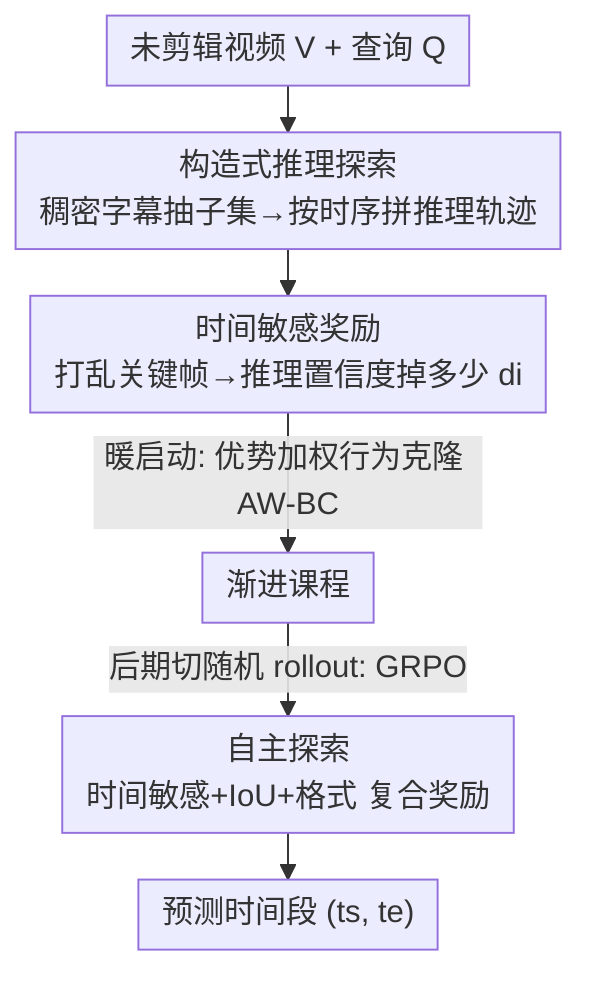

# Temporal-Aware Reasoning Optimization for Video Temporal Grounding

**会议**: ICML 2026  
**arXiv**: [2606.09248](https://arxiv.org/abs/2606.09248)  
**代码**: https://github.com/oceanflowlab/TaRO  
**领域**: 多模态VLM / 视频推理  
**关键词**: 视频时序定位, 多模态大模型, 强化学习, 推理质量奖励, 课程学习

## 一句话总结
本文提出 TaRO，针对"视频时序定位（VTG）里 RL 训出的推理华而不实"这个问题，用稠密字幕构造高质量推理轨迹做暖启动，再用"打乱关键帧后推理置信度掉多少"当奖励来衡量推理质量，逼模型真正"用时间思考"。

## 研究背景与动机

**领域现状**：视频时序定位（VTG）要在未剪辑视频里定位出与查询对应的精确时间段。近期基于多模态大模型（MLLM）的 RL 方法（如 Time-R1）让模型先生成一段推理（CoT）再预测时间戳，成为 SOTA 路线。

**现有痛点**：作者发现这些 RL 方法的推理**华而不实**。在 Time-R1 上做对照实验：训练和推理都带推理链 vs 都直接输出答案，两者性能几乎相同（Fig. 1a）——说明生成的推理对最终定位**几乎没贡献**。更扎心的统计：在 Charades-STA 测试集上，Time-R1 生成的推理里**只有 8.3% 含显式时间戳**，大部分是泛泛而谈的描述。

**核心矛盾**：问题出在 RL 范式的两个根子上。(1) **随机 rollout 盲目探索**：视频的推理空间巨大，随机采样大概率落在低质量轨迹上，学到肤浅推理；(2) **奖励只看答案、不看推理**：现有奖励（如 IoU）只评最终时间戳对不对，根本不评推理过程的质量，于是"不依赖视觉-时间证据却碰巧答对"的推理也会被强化，导致模型学到伪相关、零样本泛化差。

**本文目标**：让模型真正"用时间思考"（think with time）——作者把 VTG 里的有效推理定义为：**选择性关注关键视觉线索 + 时间敏感，把这些线索锚定到具体时间戳**。要同时解决"怎么高效探索到好推理"和"怎么评判推理质量"两件事。

**切入角度**：与其让模型从零随机探索，不如用现成稠密字幕（带精确时间戳）"喂"给它高质量推理的雏形；同时设计一个能直接测量"推理是否依赖关键时刻"的奖励信号。

**核心 idea**：构造式探索（用稠密字幕拼推理轨迹）+ 时间敏感奖励（打乱关键帧看置信度掉多少）+ 渐进课程（从模仿构造轨迹过渡到自主探索）。

## 方法详解

### 整体框架

TaRO 在 GRPO 强化学习框架上做三件事。问题设定：给定未剪辑视频 $V$ 与查询 $Q$，预测目标事件的时间段 $y=(t^s,t^e)$。第一步**构造式推理探索**：用现成稠密字幕器（Gemini-3-Pro）生成带时间戳的原子事件集，随机抽子集按时间顺序拼成推理轨迹，喂给 MLLM 续写并预测答案，得到一批 rollout——这绕开了随机探索的低效。第二步**时间敏感奖励**：对每条 rollout，打乱真值事件边界附近的帧，比较推理 token 在原视频 vs 扰动视频下的对数概率，置信度掉得越多说明推理越锚定关键时刻。第三步**渐进课程**：暖启动阶段用构造轨迹做行为克隆，让模型先学会"该看哪些线索、怎么挂时间戳"；之后切回标准随机 rollout，让模型在时间敏感奖励引导下自主探索精炼。

### 关键设计

**1. 构造式推理探索：用稠密字幕替代随机 rollout**

随机 rollout 在视频庞大的推理空间里盲目乱撞，几乎探不到带时间戳的好推理。作者改用"构造"：先用现成字幕器生成一组稠密字幕 $\mathcal{C}=\{(t_k^s,t_k^e,c_k)\}_{k=1}^N$，每条描述一个带起止时间戳的原子事件。但全用上会引入噪声、冗余反而掉点，所以**只随机抽子集** $\hat{\mathcal{C}}_i\subset\mathcal{C}$ 并按时间顺序排好，拼成 `<think>从 $t^s$ 到 $t^e$，$c$ …</think>` 格式的推理轨迹，再让 MLLM 续写完成剩余推理与最终答案，构成完整 rollout $o_i$。不同的抽样组合带来质量参差的推理，模型于是通过奖励学会**哪些字幕是关键、哪些是干扰**。

由于推理部分是外部构造而非当前策略 $\pi_\theta$ 生成的（off-policy 数据），标准 on-policy 的 GRPO 不能直接用。作者改用**优势加权行为克隆损失（AW-BC）**，把这个阶段当成模仿学习：先按组内归一化算每条 rollout 的优势 $A_i=\frac{r(o_i)-\mu_r}{\sigma_r}$，只对正优势（$A_i>0$，即抽中的字幕组合确实有助定位）的样本做加权克隆：

$$\mathcal{L}_{AW\text{-}BC}=-\frac{1}{G}\sum_{i=1}^{G}\mathbb{I}(A_i>0)\cdot A_i\cdot\log\pi_\theta(o_i|V,Q)$$

相比直接拿静态 CoT 数据做 SFT 冷启动，这有两个好处：SFT 对连续时间输出不友好（3.0s vs 2.9s 语义几乎一样却被重罚 token 失配），而 RL 奖励（IoU）容忍小数值偏差；且 SFT 是静态模仿固定路径，构造式探索则通过随机抽样组合 + 模型续写产生**动态多样**的推理变体，让模型在奖励下学会区分关键线索与干扰。

**2. 时间敏感奖励：打乱关键帧看推理置信度掉多少**

要评推理质量，核心直觉是：**好推理应该依赖关键事件和时间戳**，一旦把这些关键帧打乱，推理就该"站不住"。具体地，对含推理 $r_i$ 的 rollout，先算推理 token 在原视频条件下的平均对数概率 $p_i=\frac{1}{|r_i|}\sum_k\log\pi(r_{i,k}|V,Q,r_{i,<k})$；再构造扰动视频 $V'$——只在真值起止时间戳 $t^s,t^e$ 附近的小窗口 $\Delta t$ 内随机打乱帧、其余不动——算同一推理的对数概率 $q_i$。时间敏感分定义为两者之差：

$$d_i = p_i - q_i$$

$d_i$ 越大，说明关键帧被打乱后模型越觉得这段推理"不合理"，即推理强锚定在正确的视觉-时间证据上。奖励用组内平均 $\bar d=\frac{1}{G}\sum_j d_j$ 作基线，高于平均才给奖励：

$$r^{\text{temp}}_i=\begin{cases}\alpha,&d_i>\bar d\\0,&\text{otherwise}\end{cases}$$

为防止模型在答案完全错时还去刷时间奖励，作者加了**门控**：只有当 IoU 超过阈值 $\tau$ 才发放时间奖励。最终复合奖励为：

$$r(o_i)=r_{\text{form}}(o_i)+r_{\text{tIoU}}(o_i)+r^{\text{temp}}_i\,\mathbb{I}(\text{IoU}_i>\tau)$$

这把"奖励只看答案"的缺口补上，变成实例级、直接衡量每条推理时间敏感度的信号。

**3. 渐进课程：从模仿构造轨迹到自主探索**

构造式探索能给好初始化，但若一直依赖外部构造，模型学不会自主推理。所以分两阶段：**暖启动**阶段用构造 rollout + AW-BC（Eq. 2），快速教会模型选择性关注关键子事件、用显式时间戳推理；**自探索**阶段切回标准随机 rollout，模型自己生成推理与答案 $o_i\sim\pi_\theta(o|V,Q)$，用 GRPO 优化，但把原始奖励（Eq. 1）换成时间敏感复合奖励（Eq. 7）。这条从"监督模仿"到"自主创造新推理策略"的平滑过渡，训练后让 Charades-STA 上**100% 的推理都含显式时间戳**（Time-R1 仅 8.3%），证明模型真的学会了"用时间思考"。

## 实验关键数据

### 主实验

零样本评测四个 VTG 基准（Charades-STA / ActivityNet / QVHighlights / TVGBench），指标 R1@m（预测段 IoU > m 的样本占比，$m\in\{0.3,0.5,0.7\}$），基座 Qwen2.5-VL-7B。下表摘部分 R1@0.5：

| 方法 | 规模 | Charades R1@0.5 | ActivityNet R1@0.5 | QVHighlights R1@0.5 | TVGBench R1@0.5 |
|------|------|------|------|------|------|
| Qwen2.5-VL-7B-Instruct | 7B | 53.6 | 13.6 | 7.10 | 20.0 |
| UniTime | 7B | 59.1 | 22.8 | 41.0 | — |
| Time-R1（前SOTA） | 7B | 60.8 | 39.0 | 66.2 | 29.4 |
| **TaRO（本文）** | 7B | **64.8** | **39.8** | **69.4** | **37.8** |

TaRO 在四个基准上全面取得 SOTA，尤其 TVGBench R1@0.5 从 29.4 → 37.8、R1@0.3 从 41.8 → 54.6，泛化提升明显。

### 小模型与长视频

| 配置 | Charades R1@0.5 | QVHighlights R1@0.5 |
|------|------|------|
| Qwen2.5-VL-3B 基座 | 42.0 | 9.9 |
| Time-R1 (3B) | 53.1 | 19.7 |
| **TaRO (3B)** | **55.2** | **43.1** |

3B 规模上 TaRO 同样稳超 Time-R1，QVHighlights R1@0.5 翻倍多（19.7 → 43.1），说明方法不靠大模型撑场面。

### 关键发现
- **推理终于"有用"了**：训练后推理含显式时间戳比例从 8.3% 飙到 100%，呼应了"推理对定位有实质贡献"的目标——这正是 Time-R1 缺的。
- **TVGBench 提升最大**：在最严格的综合基准上涨幅最显著，说明时间敏感奖励抑制了伪相关、改善了零样本泛化。
- **门控很关键**：IoU 门控（$\mathbb{I}(\text{IoU}>\tau)$）防止模型在答案全错时刷时间奖励，保证时间奖励服务于主任务而非喧宾夺主。
- **构造式探索 > SFT 冷启动**：动态构造的多样推理 + 奖励区分关键/干扰，优于静态 CoT 的 SFT，且不受连续时间输出 token 失配的伤害。

## 亮点与洞察
- **"打乱关键帧测置信度"是巧妙的反事实奖励**：用扰动真值边界帧后推理置信度的掉落量当奖励，第一次在 VTG 里给出**实例级、直接评推理质量**的信号，而非 Video-R1 那种组级、只看答案的奖励——这个反事实思路可迁移到其他需要"验证推理是否真依赖证据"的任务。
- **用现成稠密字幕构造推理轨迹**：把"随机探索"换成"带时间戳字幕拼装 + 模型续写"，既高效又自带时间锚点，是低成本注入领域先验的好范式。
- **AW-BC 处理 off-policy 暖启动**：构造数据非当前策略生成，用优势加权行为克隆而非硬套 GRPO，干净地解决了 off-policy 与连续时间监督的冲突。

## 局限与展望
- **依赖外部字幕器质量**：构造轨迹靠 Gemini-3-Pro 生成稠密字幕，字幕的时间戳精度与覆盖度直接影响暖启动质量，弱字幕器场景下效果存疑。
- **时间敏感奖励需两次前向**：每条 rollout 要在原视频和扰动视频上各算一遍推理对数概率，训练开销翻倍；扰动窗口 $\Delta t$、奖励幅度 $\alpha$、IoU 门控阈值 $\tau$ 都是需调的超参。
- **扰动假设**：打乱关键帧使推理失效的前提，是推理确实描述了那些帧的事件；对于不依赖局部帧序的查询，该奖励信号可能不敏感。
- **仅在 7B/3B Qwen2.5-VL 上验证**：是否在更大/不同架构 MLLM 上同样有效有待观察。

## 相关工作与启发
- **vs Time-R1**：同为 RL-based VTG，Time-R1 用随机 rollout + 只看答案的 IoU/格式奖励，推理华而不实（仅 8.3% 带时间戳）；TaRO 用构造式探索 + 时间敏感奖励，推理 100% 带时间戳且全面超越。
- **vs Video-R1（T-GRPO）**：Video-R1 靠"整段视频有序 vs 打乱"对比来鼓励时间感知，但那是**组级、答案导向**的奖励，给一组响应统一打分、不评单条推理；且打乱整段视频会让时序真值失效、IoU 没法算，不适用于 VTG。TaRO 是**实例级**奖励，只打乱关键边界帧、直接测每条推理的时间敏感度。
- **vs SFT 冷启动**：SFT 重罚连续时间的 token 失配（3.0s vs 2.9s）、且只能模仿静态固定路径；TaRO 的 RL+构造式探索容忍数值偏差、产生动态多样推理。

## 评分
- 新颖性: ⭐⭐⭐⭐⭐ "打乱关键帧测推理置信度掉落"作为实例级推理质量奖励，在 VTG 里是首创
- 实验充分度: ⭐⭐⭐⭐⭐ 四个标准 + 两个长视频基准、7B/3B 双规模，并有推理含时间戳比例等机制性证据
- 写作质量: ⭐⭐⭐⭐ 动机扎实（对照实验揭示推理无用）、方法三件套清晰，公式完整
- 价值: ⭐⭐⭐⭐⭐ 直击"RL 推理华而不实"痛点，方法可迁移到其他视频推理任务

<!-- RELATED:START -->

## 相关论文

- [\[ACL 2026\] TemporalVLM: Video LLMs for Temporal Reasoning in Long Videos](../../ACL2026/vlm_reasoning/temporalvlm_video_llms_for_temporal_reasoning_in_long_videos.md)
- [\[CVPR 2026\] Learning Transferable Temporal Primitives for Video Reasoning via Synthetic Videos](../../CVPR2026/vlm_reasoning/learning_transferable_temporal_primitives_for_video_reasoning_via_synthetic_vide.md)
- [\[CVPR 2026\] Streaming Video Crime Anticipation with Spatio-Temporal Causal Reasoning](../../CVPR2026/vlm_reasoning/streaming_video_crime_anticipation_with_spatio-temporal_causal_reasoning.md)
- [\[CVPR 2026\] Thinking with Drafts: Speculative Temporal Reasoning for Efficient Long Video Understanding](../../CVPR2026/vlm_reasoning/thinking_with_drafts_speculative_temporal_reasoning_for_efficient_long_video_und.md)
- [\[CVPR 2026\] CaST-Bench: Benchmarking Causal Chain-Grounded Spatio-Temporal Reasoning for Video Question Answering](../../CVPR2026/vlm_reasoning/cast-bench_benchmarking_causal_chain-grounded_spatio-temporal_reasoning_for_vide.md)

<!-- RELATED:END -->
