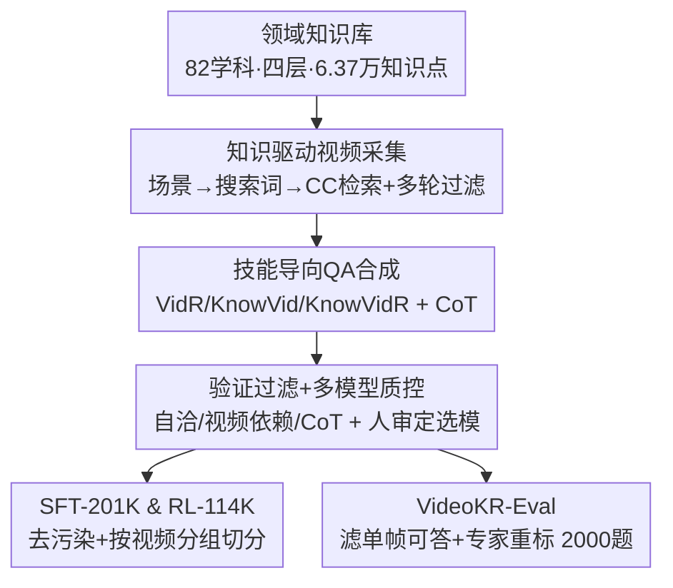

# VideoKR: Towards Knowledge- and Reasoning-Intensive Video Understanding

**会议**: ICML 2026  
**arXiv**: [2606.05259](https://arxiv.org/abs/2606.05259)  
**代码**: 待确认（论文声明开源语料与基准）  
**领域**: 多模态VLM / 视频推理  
**关键词**: 视频理解, 知识密集推理, 后训练语料, 技能导向QA合成, CoT监督

## 一句话总结
VideoKR 是首个面向「知识与推理密集型视频理解」的大规模后训练语料——它新采集 14.5 万条 CC 许可的专业领域长视频、合成 31.5 万条带 CoT 推理链的 QA，靠「人在回路 + 技能导向」的合成管线保证难度/多样性/可靠性，并配套构建去掉「单帧可答」捷径的 VideoKR-Eval 基准；在标准 SFT→GRPO 流程下，仅靠数据设计就让 7/8B 模型在知识密集视频推理上超过此前后训练方法。

## 研究背景与动机
**领域现状**：视频多模态大模型靠架构改进、大规模预训练和复杂后训练（各种 RLVR 变体、奖励工程）快速进步，但从「表层视频感知」走向「需要领域知识 + 多步推理的视频推理」时仍明显吃力。

**现有痛点**：作者指出瓶颈不在算法，而在训练语料。现有大规模视频数据集几乎都为感知目标（动作识别、事件定位、短程时序）构建，内容严重偏向日常活动、缺专业领域覆盖；而且很多是复用多年前发布的短视频、靠单一模型（如全程 GPT-4o）合成，会引入系统性偏置，许多样本甚至不看视频就能答对。

**核心矛盾**：要训出真能做知识密集视频推理的模型，需要的是「专业领域 + 真需要看视频 + 带可靠推理链」的数据，但这类数据既无现成来源，又无法纯靠人工大规模构造，纯靠模型合成又会带偏置。

**本文目标**：构造一个大规模、高质量、可商用（CC 许可）、真正逼出深层视频推理能力的后训练语料，并配一个不被「文本捷径/单帧捷径」攻破的评测基准。

**切入角度**：把「知识与推理密集型视频理解」拆解为三种互补技能（感知、知识、推理），围绕技能定向合成 QA；并在每一个会用到模型输出的环节都插入领域专家审核，把「可扩展的模型合成」与「可靠的人工质控」结合起来。

**核心 idea**：用「领域知识库驱动采集 + 技能导向 QA 合成 + 人在回路多模型质控」造数据，让数据设计本身成为视频推理进步的主驱动力——并用标准 SFT→GRPO 当受控脚手架，把性能增益干净地归因到数据。

## 方法详解

### 整体框架
VideoKR 的核心产物是数据，整条管线是一个「质控半自动」流程：先由专家审定 82 个专业学科、按「学科→课程→讲次→知识点」四层组织出含 6.37 万知识点的领域知识库；再用知识点生成真实场景、转成搜索词，经 YouTube CC 许可检索 + 多轮（元数据→视觉→安全）过滤采集到 14.6 万视频；对每条视频按三种核心技能各生成多条 QA、配 CoT 推理链，并经自洽性/视频依赖/CoT 三重过滤；全程在每个含模型输出的步骤用「人审定的多模型选择协议」从 7 个前沿模型池里挑合格模型，最后去污染后按视频分组切成 SFT-201K 与 RL-114K，并另建 VideoKR-Eval 评测基准。

### 关键设计

**1. 知识库驱动的视频采集：让视频「隐含」知识而非「讲解」知识**

针对「现有语料偏日常、缺专业领域」的痛点，作者先手工梳理顶尖高校本科课程、定出自然科学/医疗/人文社科/工程四大类下的 82 个学科，按「学科→课程→讲次→知识点」四层让专家+LLM 逐层细化出 6.37 万知识点（term + 段落级定义）。采集时关键的一招是「场景化检索」：直接拿「牛顿第二定律」当搜索词只会搜到讲座录像，于是先让 LLM 为每个知识点生成 1–3 个真实场景（如「火箭升空」），再转成语义相关搜索词，从而检索到「体现」知识而非「解释」知识的视频。检索限定 CC 许可（解决此前语料版权模糊的问题）、排除 >30 分钟的视频，并经元数据相关性→下载后视觉二次相关性→Azure 图像审核三轮过滤，最终采到 14.6 万视频（平均时长 344 秒，远长于此前语料的几十秒）。

**2. 技能导向的 QA 合成：把「知识密集视频推理」拆成三种可定向生成的能力**

把目标能力拆成三种互补核心技能：① 基础视频推理 VidR（不依赖外部知识、直接理解可见事件，如追踪动作/空间关系/时序）；② 知识增强视频感知 KnowVid（用领域知识丰富视觉感知，如识别「滴定管/冷凝器」并理解其在化学流程中的作用）；③ 知识密集视频推理 KnowVidR（融合视觉理解与领域知识做多跳推理，如由观察到的反应物量估算产物量、由临床视频里的症状与操作推断诊断）。专家先为每个学科每种技能各标 150 条种子样本（共 1800 条，二审又改了 74 条），合成时让前沿 MLLM 在 0.2 fps 带时间戳的帧 + 3 条同学科同技能种子样本 + 知识点的条件下，每条视频每技能生成 2 条、共 6 条 QA 并各配 CoT。这种「技能拆解 + 种子模仿」让合成既可扩展又能定向覆盖从感知到多跳推理的难度谱。

**3. 三重验证 + 人审定多模型质控：同时压住「合成错误」「文本捷径」「单一模型偏置」**

模型合成必然带噪，作者用三个互补过滤把质量顶上去：① 自洽性验证——把生成问题连同帧重新喂回模型让它逐步作答，只有重导出答案与原答案一致才保留，并用该验证步骤的推理当最终推理链；② 视频依赖过滤——让 InternVL3.5-38B 与 Qwen3-VL-32B 只看「文本+4 帧」作答，若两者都答对则删除该样本（比多数评测基准的纯文本/单帧过滤更严）；③ CoT 推理链验证——用独立强 MLLM 核查每一关键步是否有可观测证据或标准领域知识支撑，丢掉含关键无支撑步的样本。更关键的是「人审定多模型选择」：不像此前工作全程用单一模型，作者维护 7 个前沿模型池（GPT-5.2、Claude-4.5-Sonnet、Gemini-3-Flash 等），按管线难度分层——对每个模型每个步骤抽 100 个真实输入让专家标错误率，只有错误率低于阈值才让该模型负责该步，大规模合成时再从合格池随机抽模型，既提多样性又压系统偏置。配合 YouTube-ID 与近重复去污染，最终切成 SFT-201K（保留 CoT 当监督目标）与 RL-114K（只留问题+可验证答案）。

**4. VideoKR-Eval：把「不看视频也能答」的捷径题筛掉**

作者手工审计发现 VideoMMMU/MMVU/SciVideoBench 等现有知识密集基准里大量样本能靠单帧/文本捷径答对（前沿模型在 MMVU、VideoMMMU 上单帧可答率 >35%）。于是用「多模型单帧探测」构建 VideoKR-Eval：对每题用 Qwen3-VL-235B、Claude-4.5-Sonnet、GPT-5.2 各只给「问题+选项+1 随机帧」、各跑 3 次独立试验，三次全对才判为单帧可答；只保留三模型都判为「需连续视频理解」的 1,254 题，再对被滤掉的视频请专家重标 746 题（要求问题基于清晰可观测的视频证据、需领域知识、答案唯一），合成 2,000 题基准。VideoKR-Eval 上前沿模型单帧可答率被压到 ~10%，远低于现有基准。

### 损失函数 / 训练策略
用标准 SFT→GRPO 当受控脚手架（刻意不引入复杂 RL 设计，避免算法成为混淆变量、把增益干净归因到数据）：以 Qwen2.5-VL-7B-Instruct 与 Qwen3-VL-8B-Instruct 为基座，先在 SFT-201K 上微调 1 epoch（CoT 当监督目标），再从该 checkpoint 在 RL-114K 上跑 GRPO 1 epoch；Qwen3-VL-8B 还做了直接 GRPO 的 Zero-RL 对照。GRPO 准确率奖励对开放题用 ROUGE、选择题用精确匹配；最大视频 token 4,096、最多 128 帧、batch size 32。评测统一在 LMMs-Eval 下、用各模型官方 prompt、跑三次取均值，以解决此前论文因 prompt 错配导致的结果不可复现问题。

## 实验关键数据

### 主实验
在 7 个基准（3 个通用 + 4 个知识密集）上，VideoKR 后训练在知识密集任务上增益最显著，且通用任务不掉队。下表为知识密集平均与 VideoKR-Eval 的代表性结果。

| 模型 | 通用平均 | VideoKR-Eval | 知识密集平均 |
|------|---------|-------------|------------|
| Qwen2.5-VL-7B-Instruct（基座, 128帧） | 64.1 | 32.7 | 41.9 |
| VideoAuto-R1（128帧） | 65.6 | 36.5 | 44.3 |
| **VideoKR SFT+RL（128帧）** | 65.5 | **41.2** | **46.6 (+4.7)** |
| Qwen3-VL-8B-Instruct（基座, 128帧） | 65.9 | 39.0 | 48.5 |
| Qwen3-VL-8B-Thinking | 65.2 | 41.5 | 50.0 |
| **VideoKR SFT+RL（Qwen3, 128帧）** | 65.4 | **45.3** | **51.5 (+3.0)** |

知识密集平均 Qwen2.5-VL-7B 从 41.9→46.6（+4.7）、Qwen3-VL-8B 从 48.5→51.5（+3.0），后者拿下同规模（7/8B）模型最佳知识密集平均；单数据集上 MMVU、VideoKR-Eval 提升最大（Qwen2.5-VL-7B 上约 +4.8 与 +8.5 点）。

### 消融实验
统一以 Qwen2.5-VL-7B、128 帧、SFT 80K/1 epoch 设定（RL 对比为 50K/1 epoch GRPO）。

| 配置 | 通用平均 | VideoKR-Eval | 知识密集平均 | 说明 |
|------|---------|-------------|------------|------|
| 基座 Qwen2.5-VL-7B | 64.1 | 32.7 | 41.9 | 参考 |
| VidR only | 58.0 | 35.3 | 41.4 | 仅基础感知推理 |
| VidR+KnowVid | 58.4 | 35.9 | 41.3 | 加知识增强感知 |
| VidR+KnowVid+KnowVidR | 58.3 | 36.8 | 42.4 | 三技能全开最优 |
| Direct Output（无CoT） | 61.4 | 35.9 | 39.4 | 去 CoT 监督 |
| Chain-of-Thought | 58.3 | 36.8 | 42.4 | CoT 监督 (+3.0) |
| Video-R1-CoT-165k（SFT对比） | 57.3 | 27.5 | 36.2 | 旧语料反降 |
| **VideoKR-SFT-201K（Ours）** | 58.3 | 36.8 | 42.4 | 唯一超基座的语料 |

### 关键发现
- **三技能缺一不可**：知识密集平均随 VidR→+KnowVid→+KnowVidR 单调改善（41.4→41.3→42.4，VideoKR-Eval 35.3→35.9→36.8），说明把领域知识与多跳推理监督叠进来才是关键。
- **CoT 监督至关重要**：去掉 CoT 直接输出，知识密集平均从 42.4 掉到 39.4（−3.0），高质量推理链是逼出深层推理的核心。
- **数据质量 > 数据多寡**：SFT 设定下唯有 VideoKR-SFT（42.4）超过基座 41.9，Video-R1/VideoRFT 反而把它压到 36.2/38.4；Zero-RL 下 VideoKR-RL（43.0, +1.1）也强于次优 VideoAuto-R1（42.7）——印证「数据设计是瓶颈」的核心论点。
- **SFT+RL 互补**：RL 在 SFT checkpoint 上持续高于 SFT-only，且 RL-only 一般也优于 SFT-only，说明两者结合才能充分释放 VideoKR 的价值。

## 亮点与洞察
- **场景化检索**：用「火箭升空」代替「牛顿第二定律」当搜索词，从根上把数据从「讲解知识的讲座」转向「隐含知识的真实视频」，这个小技巧对采到真正需要推理的视频极其关键，可迁移到任何知识密集多模态数据采集。
- **视频依赖过滤当数据「防捷径」闸门**：用两个强 VLM 只看文本+4 帧作答、都答对就删，把「不看视频也能答」的样本在训练侧就清掉，比只在评测侧防捷径更治本；同样的探测思路又复用到 VideoKR-Eval 构建上，训练与评测一致地强调「真的要看视频」。
- **人审定多模型选择协议**：把「单一模型全程合成」换成「按步骤难度分层、人审错误率达标才上岗、合成时随机抽合格模型」，同时压住单模型偏置并提升多样性——这是一套可复用的「人在回路质控」工程范式。
- **用最朴素的 SFT→GRPO 当受控脚手架**：故意不上花哨 RL，把增益干净归因到数据本身，方法论上很有说服力，也回应了视频推理领域「过度堆算法」的倾向。

## 局限与展望
- 排除 >30 分钟视频，长上下文/超长视频推理被显式排除在范围外；采集时长虽达平均 344 秒，但极长视频推理仍是空白。
- 合成与质控重度依赖 7 个前沿闭源/大模型 + 34 位领域专家，复现成本与可及性高；人审抽样（如 800 样本评估）虽显示残余噪声可接受，但仍存在 17/800 改变答案的错误。
- 评测以多选+开放题为主，GRPO 奖励用 ROUGE/精确匹配，对开放式长推理的评分粒度有限；通用基准上后训练偶有小幅下降（数据偏专业领域的代价）。
- 主要验证 7/8B 规模与 Qwen 系基座，是否在更大规模或异构架构上同样有效需进一步实验。

## 相关工作与启发
- **vs Video-R1 / VideoRFT（后训练语料）**: 它们复用现有短视频数据集、靠单一模型合成、版权多为非 CC；本文全部新采、CC 许可、专业领域、平均时长长一个量级，且 SFT 对比中唯有本文语料能超过基座（42.4 vs 36.2/38.4）。
- **vs OneThinker / VideoAuto-R1**: 同为后训练语料/方法，本文在知识密集平均与 VideoKR-Eval 上更强，且强调「数据设计」而非「RL 算法」是主驱动。
- **vs VideoMMMU / MMVU / SciVideoBench（评测基准）**: 这些基准被发现含大量单帧可答捷径题（单帧可答率 >35%），本文用多模型单帧探测+专家重标构建 VideoKR-Eval 把捷径率压到 ~10%，提供更可信的知识密集视频推理评测。

## 评分
- 新颖性: ⭐⭐⭐⭐ 首个知识/推理密集视频后训练语料 + 技能导向合成 + 防捷径基准，数据侧创新扎实（非算法新）。
- 实验充分度: ⭐⭐⭐⭐⭐ 双基座、7 基准主实验 + 技能/CoT/跨语料多维消融 + 帧数缩放分析，归因清晰。
- 写作质量: ⭐⭐⭐⭐⭐ 管线、质控、基准构建动机与细节交代到位，Table 1/3/4 信息密度高。
- 价值: ⭐⭐⭐⭐⭐ 开源 CC 语料 + 防捷径基准，对推动可复现的知识密集视频推理研究有直接基础设施价值。

<!-- RELATED:START -->

## 相关论文

- [\[CVPR 2026\] Towards Sparse Video Understanding and Reasoning](../../CVPR2026/vlm_reasoning/towards_sparse_video_understanding_and_reasoning.md)
- [\[ICML 2026\] 3D-RFT: Reinforcement Fine-Tuning for Video-based 3D Scene Understanding](3d-rft_reinforcement_fine-tuning_for_video-based_3d_scene_understanding.md)
- [\[CVPR 2026\] Reinforcing Structured Chain-of-Thought for Video Understanding](../../CVPR2026/vlm_reasoning/reinforcing_structured_chain-of-thought_for_video_understanding.md)
- [\[CVPR 2026\] Agentic Video Summarization via Self-Reflecting Multimodal Understanding](../../CVPR2026/vlm_reasoning/agentic_video_summarization_via_self-reflecting_multimodal_understanding.md)
- [\[CVPR 2026\] Graph-to-Frame RAG: Visual-Space Knowledge Fusion for Training-Free and Auditable Video Reasoning](../../CVPR2026/vlm_reasoning/graph-to-frame_rag_visual-space_knowledge_fusion_for_training-free_and_auditable.md)

<!-- RELATED:END -->
